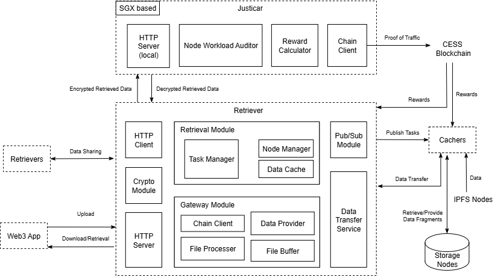
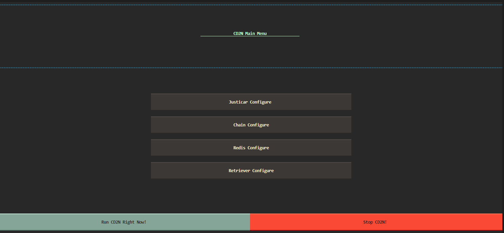
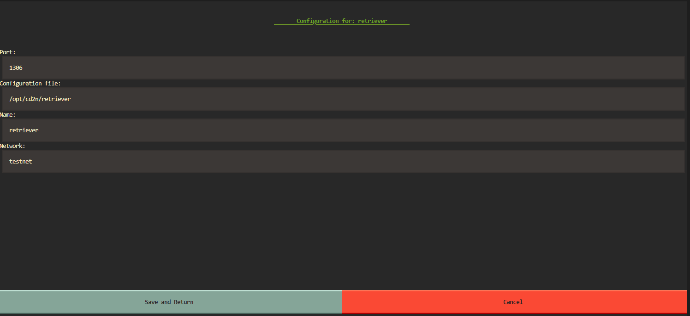

# Running the Retriever

Retriever nodes serve as the data retrieval backbone of CD2N, requiring high-performance CPUs with SGX support, substantial memory, and large-capacity storage. When handling data requests via FID/CID identifiers, Retrievers first check local storage before querying Cacher nodes if necessary. Retrieved data may be cached locally based on retention policies before returning to requesters. Key operational features include:
- **Fee-for-Service Model**: Requesters prepay retrieval fees before service initiation
- **SGX-Based Verification**: Data validation occurs within SGX enclaves for audit integrity
- **Incentive Distribution**: Rewards are proportionally allocated to participating nodes post-validation
- **Cache Priority Rewards**: Retrievers claiming 100% rewards for locally cached data
- **Global Data Accessibility**: Multi-hop caching mechanism enables worldwide data reachability

## Justicar: Trusted Execution Environment (TEE) Auditor
The containerized Justicar module operates independently with HTTP communication to Retrievers (potential future expansion to standalone audit service). Its workflow includes:
1. **Escrow Handling**: Receiving prepaid fees into encrypted accounts during cache order creation
2. **Secure Data Processing**: Temporary key negotiation for encrypted data transfer from Retrievers/Cachers
3. **Cryptographic Verification**: 
   - Data decryption using private keys
   - FID/CID consistency checks
4. **Reward Management**: 
   - Generating verifiable traffic proofs
   - Distributing fees per cache protocol smart contract rules

Rewards accumulate per operational cycle with cooling periods before distribution. Nodes must claim rewards before cycle completion.



## Gateway Integration
Retrievers feature an optional built-in gateway module with DeOSS-equivalent capabilities:
- **Upload Processing**:
  - Automatic data sharding via Cachers
  - LBSS protocol-compliant distribution to storage nodes
  - Custom storage policy support
- **Download Handling**:
  - Request decomposition into shard retrievals
  - Data reconstruction from sufficient shards
- **Enterprise Features**:
  - Sharded uploads with resume capabilities
  - Range requests
  - Proxy re-encryption
  - Custom billing implementations

Gateway operations use prepaid retrieval fees, enabling developers to implement bespoke billing solutions through secondary development.

## Hardware Requirements
- Processor: 2.5 GHz+ (SGX support required)
- Memory: 32 GB+
- Storage: 2 TB+
- Bandwidth: 1000 Mbps+
- OS: Ubuntu/CentOS
- Network: TCP/IP support

## Account Preparation
Two Ethereum wallet accounts required:
1. **Node Operational Account**:
   - Node registration & reward collection
   - Funded with $CESS for gas fees
2. **Token Account**:
   - Holds NFT access certificate
   - Token acquisition: 
     - Early testnet: Not required
     - Mid testnet: Community distribution
     - Late testnet: Contract purchases

**Additional Requirement for Gateway**:
- CESS wallet account for OSS operations
- Prefunded with tokens for storage order creation

**Authorization Process**:
1. Generate node-token binding signature using CD2N signing tools
2. Use token account's private key to sign:
   - Operational account
   - Token metadata
   - Node configuration details

## Configuration & Operation

### Nodeadm GUI Management
The Python-based [Nodeadm](https://github.com/CD2N/nodeadm.git) tool provides graphical configuration for:
1. Justicar settings
2. Retrieval module parameters
3. Redis pub/sub configuration
4. RPC node setup

``` sh
 cd nodeadm
 sudo python app.py
```




Through the nodeadm program, you can perform simple configurations on each module, such as configuring the working directory, port, working account, etc. After completing the configuration of each sub-module, click the `Save and Return` button to save the configuration, or click the `Cancel` button to cancel the save. After the configuration is completed, return to the homepage and click the `Run CD2N Right Now!` button to start all modules in a containerized manner with one click, and click `Stop CD2N!` to stop all services with one click.

In addition, you can also enter the nodeam/config directory to configure Retriever and Redis in more detail:

Open the `nodeadm/config/retriever_config.yaml` file and configure it as follows:

```yaml
DiskConfig:
  # The unit of disk size configuration is GiB
  # File buffer is used to temporarily store intermediate data
  FileBuffervize: 128
  # Gateway cache is used to cache complete files uploaded by users to improve access efficiency
  GatewayCachevize: 128
  # all the data of the node will be stored in workspace.
  Workvpace: "./cd2n_retriever"

ChainConfig:
  # The test network ID is 11330, and the main network ID is 11331
  ChainId: 11330
  # You can fill in multiple RPC addresses. It is recommended to fill in one official and one local address.
  Rpcs:
    - "ws://cess-chain:9944" 
    - "wss://testnet-rpc.cess.network"
  # Cache protocol smart contract address
  ProtoContract: "0xD185AF24121d0D6a9A3e128fB27C3704569b5E91"
  # When the cache capacity is insufficient, the cache capacity of the configuration is automatically recharged
  Rechargevize: 8589934592 # default: 8 GiB
 
NodeConfig:
  # Node working account private key (since the EVM contract is used, please use the Ethereum account)
  SecretKey: "060cde84e263a9cacc609899a4f577cc008625e6cea58304233923c5ca9f267d" 
  # NFT tokens required to run node
  Token: ""
  # Ethereum wallet account address of NFT token holder
  TokenAcc: ""
  # The signature of the NFT holder, please use the signature tool included in the script to generate
  TokenAccvign: ""
  # Polkadot wallet account mnemonics, used to register the Ovv gateway on the CEvv chain
  Mnemonic: "spatial paper alcohol less zoo defy please glare stumble pony your title"

ServerConfig:
  # Mining pool name, default is "CEvv CD2N OFFICAL POOL"
  PoolName: ""
  # Whether to run the gateway. If true, the node comes with the gateway function.
  LaunchGateway: true
  # Debug mode, do not enable it in production environments!!!
  Debug: true
  # Required configuration, default is local node
  RedisAddress: "domain name or external ip:6379"
  # TEE(justicar) service address, currently it must be a local node
  TeeAddress: "http://justicar_host:1309"
  # Retriever node external service address
  Endpoint: "http://154.194.34.195:1306"
  # The secret of the redis local account, please reset it and keep it consistent with the redis.conf (requirepass Cd2n@cess.net, line 903).
  # Please configure uniformly in the redis module of nodeadm, and it will be automatically refreshed to the file.
  RedisPwd: "cess_network@6379"
  # Node service port, please keep it consistent with the configuration in the visual script
  SvcPort: 1306
  RedisLoacl: "redis_host:6379"
```

If necessary, you can also open the `nodeadm/config/redis.cof` file to configure Redis, but we recommend using the default configuration. The Redis account configuration can be configured in the Redis module of the nodeam program, and there is no need to configure it in the configuration file.

You need to configure the configuration file first, and then open the nodeadm program to configure and run it. Clicking the nodeadm configuration save button will not only save the configuration file, but also copy the configuration file to the working directory. Therefore, please give it sufficient permissions before running Nodeadm, and reopen the nodeadm program to save it every time you complete the configuration file modification.
