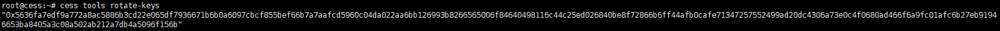
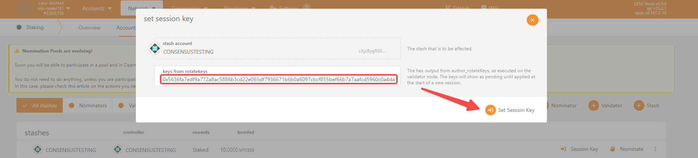
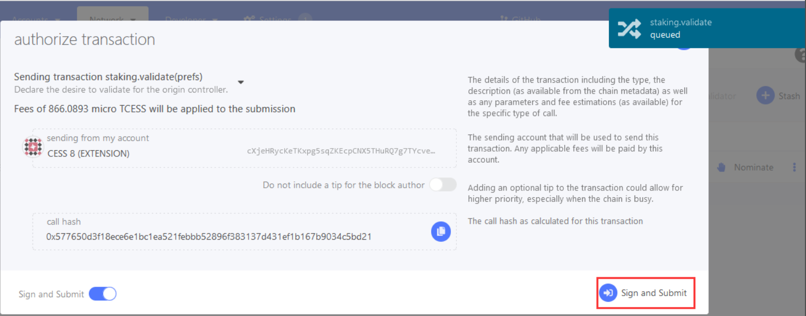
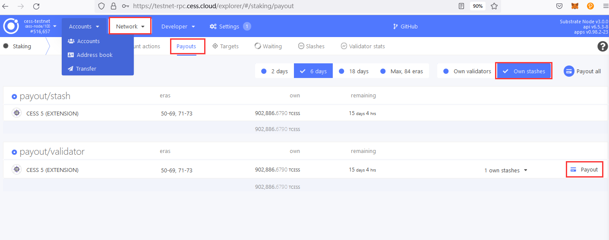
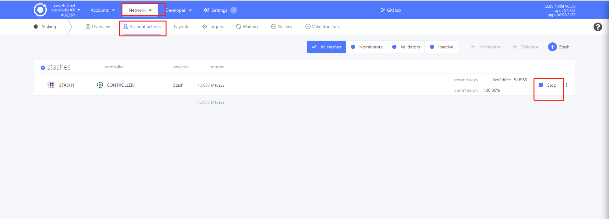
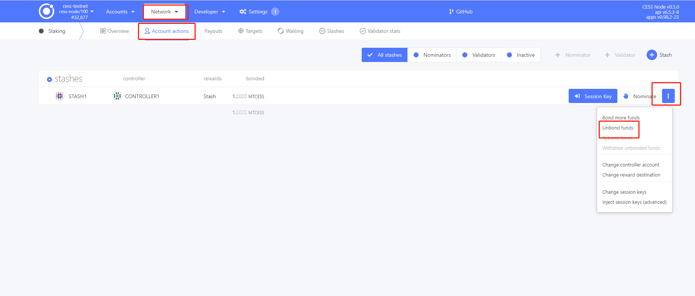

# System Requirement

If you're planning to run a consensus miner, it's important to make sure your system meets the recommended requirements to ensure that your miner performs at its best.

| Resource             | Specification               |
|----------------------|-----------------------------|
| Recommended OS       | Ubuntu\_x64 20.04 or higher |
| CPU Processor Num    | ≥ 4                         |
| Memory               | ≥ 16 GB                     |
| Bandwidth            | ≥ 5 Mbps                    |
| Public Network IP    | required                    |
| Linux Kernel Version | 5.11 or higher              |

# Prepare Stash Account

- **Stash Account**: This is the account where you keep all the funds you want to stake. This account requires at least 3,000,000 TCESS for staking it can be either from the node owner itself or delegated by other users.

You can also refer to the page [Creating CESS Accounts](../../user/cess-account.md) for creating a CESS account.

You can either use [CESS testnet faucet](https://cess.network/faucet.html) to get TCESS, or [contact us](../../introduction/contact.md) to receive TCESS tokens for staking.

# Binding Funds to Stash Account

Open [CESS Explorer](https://polkadot.js.org/apps/?rpc=wss%3A%2F%2Ftestnet-rpc.cess.network%2Fws%2F#/) and Select **Network** > **Staking** > **Accounts** > **Stash**


Select the appropriate `stash account` from the drop-down menu and enter at least **3,000,000** TCESS in `value bounded` field. In `payment destination`, select  **Stash Account as the reward receiving account (do not increase the amount at stake)**, which means that mining income will not be automatically added to the stake.


Click **Bond** -> **Sign and Submit** to link the Stash Account.


Fund is bonded successfully!


# Run a chain node

## Run with nodeadm

### Install nodeadm


Please purge all of previous data before running a CESS consensus node on machine if an old version consensus node was installed.

```bash
    cess purge
    cess uninstall
```

The `cess-nodeadm` is a CESS node deployment and management tool. It helps to deploy and manage storage nodes, consensus nodes, and rpc node, simplifying the devOps for all CESS miners.

```bash
wget https://github.com/CESSProject/cess-nodeadm/archive/refs/tags/v0.6.1.tar.gz
tar -xvf v0.6.1.tar.gz
cd cess-nodeadm-0.6.1
sudo ./install.sh
```


You can verify that you are running the latest version of [cess-nodeadm here](https://github.com/CESSProject/cess-nodeadm/releases).


On successful installation of cess-nodeadm you will see `Install cess nodeadm success` message.

If the installation fails, please check the [troubleshooting procedures](../storage-miner/troubleshooting.md).

### Configure nodeadm

Please run the following command to configure nodeadm.
 - set mode with `validator` 
 - set a custom node name `cess` or any other name of your choice.

```bash
$ cess config set

Enter cess node mode from 'tee/storage/validator/rpcnode' (current: validator, press enter to skip): validator
Enter cess node name (current: cess, press enter to skip): cess
Set configurations successfully
Start generate configurations and docker compose file
debug: Loading config file: config.yaml
info: Generating configurations done
info: Generating docker compose file done
e9e3df60a011799587e59f73e22db60d95c2ec7eebfe3058c358ed2d7c6d04a0
Configurations generated at: /opt/cess/nodeadm/build

$ cess start
[+] Running 3/3
 ✔ Container chain       Started
 ✔ Container miner       Started
 ✔ Container watchtower  Started
```

## Run with container

1. Environment Setup Requirements
     ```shell
     curl -fsSL https://get.docker.com | bash
     docker --version
     docker pull cesslab/cess-chain:testnet
     ```

2. Running Command

   **Make sure that port 30336 and 9944 are not occupied by other processes.**

   ```bash
   mkdir -p /opt/cess/validator
   
   docker run --rm -v /opt/cess/validator:/opt/cess/data cesslab/cess-chain:testnet key generate-node-key --base-path /opt/cess/data --chain cess-testnet >/dev/null 2>&1

   docker run -d \
   --name testnet-rpc \
   -v /opt/cess/validator:/opt/cess/data \
   -p 30336:30336 \
   -p 9944:9944 \
   cesslab/cess-chain:testnet \
   --base-path /opt/cess/data \
   --chain cess-testnet \
   --port 30336 \
   --rpc-port 9944 \
   --rpc-external \
   --execution WASM \
   --wasm-execution compiled \
   --in-peers 75 \
   --out-peers 75 \
   --state-pruning archive \
   --validator \
   --max-runtime-instances 32 \
   --rpc-cors all \
   --prometheus-external \
   --wasm-runtime-overrides /opt/cess/wasms \
   --rpc-methods unsafe
   ```

## Run with systemd

### Download source files

**Get the latest `release` and `wasms` from [Github](https://github.com/CESSProject/cess/releases)**

```bash
mkidr -p /opt/cess/validator
cd /opt/cess/validator
wget https://github.com/CESSProject/cess/releases/download/cess-v0.7.9-venus/cess-node-v0.9.0-Ubuntu -O cess-node
wget https://github.com/CESSProject/cess/releases/download/cess-v0.7.9-venus/wasm_overrides.tar -O wasm_overrides.tar
tar -xvf wasm_overrides.tar
mv .wasm_overrides/testnet/ ./wasms
mv ./wasms /opt/cess/
```

**Get the source files from a local container**

```bash
rm -rf /opt/cess/chain-tmp && mkdir -p /opt/cess/chain-tmp
docker pull cesslab/cess-chain:testnet
docker run -d --name chain-tmp -p 30337:30336 -p 9945:9944 -v /opt/cess/chain-tmp:/opt/cess/data cesslab/cess-chain:testnet --base-path /opt/cess/data --chain cess-testnet --port 30336 --name cess --rpc-port 9944 --rpc-external --execution WASM --wasm-execution compiled --in-peers 75 --out-peers 75 --state-pruning archive --rpc-cors all --prometheus-external --wasm-runtime-overrides /opt/cess/wasms

docker cp chain-tmp:/opt/cess/cess-node /opt/cess/validator/cess-node
docker cp chain-tmp:/opt/cess/.wasm_overrides/testnet /opt/cess/wasms
docker stop chain-tmp && docker rm chain-tmp
```

### Run as systemd service

```bash
mkdir -p /opt/cess/validator

/opt/cess/validator/cess-node key generate-node-key --base-path /opt/cess/validator --chain cess-testnet >/dev/null 2>&1

cat > /lib/systemd/system/validator.service << EOF
[Unit]
Description=CESS-TESTNET-Validator
After=network.target
[Service]
Type=simple
User=root
ExecStart=/opt/cess/validator/cess-node --base-path /opt/cess/validator --chain cess-testnet --port 30336 --rpc-port 9944 --prometheus-external --name cess-testnet --validator --max-runtime-instances 32 --state-pruning archive --wasm-runtime-overrides /opt/cess/wasms --rpc-methods unsafe 
WorkingDirectory=/opt/cess/validator
StandardOutput=append:/opt/cess/validator/validator.log
StandardError=append:/opt/cess/validator/validator.log
Restart=on-failure
[Install]
WantedBy=multi-user.target
EOF

systemctl enable logrotate.timer
systemctl restart logrotate.timer

cat > /etc/logrotate.d/validator << EOF
/opt/cess/validator/validator.log {
    daily
    rotate 7
    missingok
    notifempty
    compress
    delaycompress
    copytruncate
    create 0644 root root
}
EOF

sudo logrotate -d /opt/cess/validator/validator.log

systemctl enable validator
systemctl restart validator
systemctl status validator
tail -f /opt/cess/validator/validator.log
```

---


consensus node(validator) is one of the most important part in cess network, it is recommended to set alert for consensus node to ensure that the service is always online. 


# Become a Validator

1. Start the chain node

Make sure that the chain node is running normally before proceeding.
```bash
$ ps -efww | grep cess-node
```

2. Generate a session key

    ```bash
    # generate by nodeadm
    cess tools rotate-keys
    
    # generate by docker
    docker exec chain curl -H 'Content-Type: application/json' -d '{"id":1, "jsonrpc":"2.0", "method": "author_rotateKeys", "params":[]}' http://localhost:9944 2>/dev/null
    
    # generate by http request
    curl -H 'Content-Type: application/json' -d '{"id":1, "jsonrpc":"2.0", "method": "author_rotateKeys", "params":[]}' http://localhost:9944 2>/dev/null
    ```

    

3. Set up a session key

    Navigate to [CESS Explorer](https://polkadot.js.org/apps/?rpc=wss%3A%2F%2Ftestnet-rpc.cess.network%2Fws%2F#/), choose **Network** > **Staking** > **Accounts** > **Session Key**

    

    Fill in the **Session Key** in the red box

    

    Click **Sign and Submit**

    

4. Becoming a validator

    Navigate to [CESS Explorer](https://polkadot.js.org/apps/?rpc=wss%3A%2F%2Ftestnet-rpc.cess.network%2Fws%2F#/), click **Network** > **Staking** > **Accounts** > **Validate**

    

    

    Enter **100** in _reward commission percentage_, indicating that the reward will not be distributed to others.

    Select **No, block all nominations** in _allows new nominations_ dropdown, indicating that no nominations will be accepted.

    Again, click **Sign and Submit**.

    

    After completing the steps above, open the [CESS Explorer](https://polkadot.js.org/apps/?rpc=wss%3A%2F%2Ftestnet-rpc.cess.network%2Fws%2F#/) and click **Network** > **Staking** > **Waiting**.

    

    You should see that the node has already appeared on the candidate node list.

## Redeeming Rewards

Navigate to CESS Explorer: **Network** > **Staking** > **Payouts** > **Payout**.



In Payouts, click **Payout** to initiate a payment. Any account can initiate a payment.



Please claim the reward within 84 era (each era of the test network is 6 hours), which is 21 days. Those who hasn't claimed the reward in this period will not be able to claim it.


## Exiting Consensus from Validation

1. Stop the Consensus

    In [CESS Explorer](https://polkadot.js.org/apps/?rpc=wss%3A%2F%2Ftestnet-rpc.cess.network%2Fws%2F#/), navigate to: **Network > Staking > Account Actions > Stop**.

    

2. Clear Session Keys

    In [CESS Explorer](https://polkadot.js.org/apps/?rpc=wss%3A%2F%2Ftestnet-rpc.cess.network%2Fws%2F#/), navigate to: **Developer -> Submission**

    

    Enter controller account in _using the selected account controller_. Then in _submit the following extrinsic_, enter **session** and choose **purgeKeys()** in the box next to it.

    

    Click **Submit Transaction** button to clear session keys

    

## Redeeming Stake

1. Unbond fund

    After 28 eras (each era of the test network is 6 hours), goto [CESS Explorer](https://polkadot.js.org/apps/?rpc=wss%3A%2F%2Ftestnet-rpc.cess.network%2Fws%2F#/), navigate to: **Network > Staking > Account Actions > Unbond Funds**.

    

2. Stop the CESS client

    ```bash
    cess stop
    ```

# Upgrade CESS Nodeadm Client

## Stop and Remove All Services

```bash
cess stop
cess down
```

## Remove All Chain Data


Do not perform this operation unless the CESS network has been redeployed, and it is confirmed that the data can be cleared.


```bash
cess purge
```

## Update `cess-nodeadm`

```bash
wget https://github.com/CESSProject/cess-nodeadm/archive/refs/tags/<new-version>.tar.gz
tar -xvf <new-version>.tar.gz
cd cess-nodeadm-<new-version>
./install.sh --skip-dep --retain-config  --no-rmi
```

## Pull Images

```bash
cess pullimg
```
