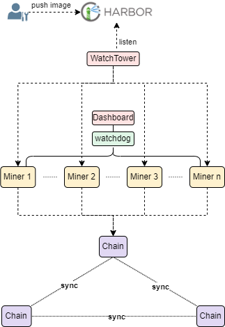
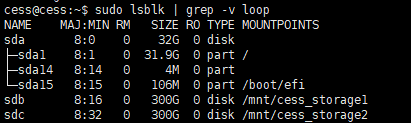
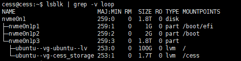

# Architecture

Install multi-miners container can be illustrated as below:

- watchTower: When there is a difference between the local miner image and the official miner image, watchtower will automatically pull the new official image, create a new miner, and then delete the old one.
- miner: A storage node. Miners communicate with each other via P2P. The ports configured in the example config.yaml are: 15001, 15002.
- chain: A chain node. miner query blockchain data through the chain node's 9944 port by default; chain nodes synchronize data among themselves through the default port: 30336.
- watchdog: Miner monitor. can scrape miner's data from different hosts and alert user when some exception occurs.
- dashboard: The dashboard of Miner monitor. can display the miner data in a web page.



# System requirements

Minimum Configuration Requirements:

| Resource             | Specification            |
|----------------------|--------------------------|
| Recommended OS       | Linux 64-bit Intel / AMD |
| # of CPU Cores       | ≥ 4                      |
| Memory               | ≥ 8 GB                   |
| Bandwidth            | ≥ 5 Mbps                 |
| Public Network IP    | required                 |
| Linux Kernel Version | 5.11 or higher           |

Each miner requires at least 4GB of RAM and 1 processor, and the chain node requires at least 2GB of RAM and 1 processor.

At least 10GB of RAM and 3 processors if running 2 miners and 1 chain node at the same time

# Method 1: Run multi-miners containers with admin client

## Storage environment requirements

Installation operation has certain requirements on the storage environment in the current host, and different configurations are required based on the disk configuration.

### Multiple Disks

As shown in the figure below, where `/dev/sda` is the system disk, `/dev/sdb` and `/dev/sdc` is the data disk, users can directly partition and create file systems on the data disks, and finally mount the file systems to the working directory of the miner.



```bash
fdisk /dev/sdb

# 2048: The starting sector of a new disk is usually set to 2048. This ensures that the partition boundaries are aligned with the physical sectors of the hard disk.
# the value after default: The default is the maximum sector value, which partitions the entire disk.

Enter and press Enter:
n
p
1
2048
the value after default
w

# create filesystem in /dev/vdb
sudo mkfs.ext4 /dev/sdb

Proceed anyway? (y,N) y

# create a diskPath of a miner
sudo mkdir /mnt/cess_storage1

# mount filesystem
sudo mount /dev/sdb /mnt/cess_storage1

# auto mount when your reboot your server
sudo cp /etc/fstab /etc/fstab.bak

# modify <disk: /dev/sdb> <mount path: /mnt/cess_storage1>
sudo sh -c "echo `blkid /dev/sdb | awk '{print $2}' | sed 's/\"//g'` /mnt/cess_storage1 ext4 defaults 0 0 >> /etc/fstab"
```

Repeat the above steps to partition `/dev/sdc` and create a filesystem, then mount it to the file directory: `/mnt/cess_storage2`


In the case where a disk is divided into many partitions, when the disk is damaged, all miners that use its partitions for work will be affected.


### Single Disk

This procedure is suitable for environments with only one system disk.

#### Scene 1

As shown in the following example, if there is only one 50GB system disk, the `Last sector value` of partition `/dev/sda3` of disk `/dev/sda` is already at its maximum value (50GB disk can not be partitioned anymore).

```bash
[cess@cess ~]# lsblk 
NAME   MAJ:MIN RM  SIZE RO TYPE MOUNTPOINT
sda    253:0    0   50G  0 disk 
├─sda1 253:1    0    2M  0 part 
├─sda2 253:2    0  200M  0 part /boot/efi
└─sda3 253:3    0 49.8G  0 part /
```

As shown above, the current system kernel is using this partition, so it can not modify the partition to build the running environment required for multi-miner.

If the partition does not take up the entire disk and there is still storage space available for partitioning, you can configure the partition by referring to the configuration method of **Multiple Disks**.(In this situation, the running of multi-miner will depend on this single disk)

#### Scene 2

As shown in the figure below, the current environment has only one `/dev/nvme0n1` system disk with about 1.8T of storage space, which is partitioned three times, including `/dev/nvme0n1p1`, `/dev/nvme0n1p2` and `/dev/nvme0n1p3`.

The current system relies on the virtual logical disk `/dev/ubuntu-vg/ubuntu-lv` created in the third partition `/dev/nvme0n1p3`. Since this virtual logical disk occupies only 100GB of storage space, you can configure a multi-miner environment by using `lvm` to create multiple virtual logical volumes on the remaining space.



```bash
# use command: vgs to show current volume group, and find that the current volume group name is: ubuntu-vg, VFree displays the remaining storage space of the current volume group.
$ vgs
cess@cess:/home/cess# vgs
  VG        #PV #LV #SN Attr   VSize   VFree
  ubuntu-vg   1   1   0 wz--n- <1.82t  1.7T

# use command: lvcreate to create a 100GB logic volume named cess_storage from volume group: ubuntu-vg
$ sudo lvcreate -L 100g -n cess_storage ubuntu-vg -y
# use command: lvcreate to create logic volume named cess_storage from all remaining space of volume group: ubuntu-vg
# sudo lvcreate -l 100%FREE -n cess_storage ubuntu-vg -y

# use command: lvdisplay to display logic volume your have created, name: cess_storage, path: /dev/ubuntu-vg/cess_storage
$ sudo lvdisplay
cess@cess:/home/cess# lvdisplay
  --- Logical volume ---
  LV Path                /dev/ubuntu-vg/ubuntu-lv
  LV Name                ubuntu-lv
  VG Name                ubuntu-vg
  LV UUID                zxJiPj-Anon-CG3r-XEIJ-Nydi-xxxx-U6oWqW
  LV Size                100.00 GiB
   
  --- Logical volume ---
  LV Path                /dev/ubuntu-vg/cess_storage
  LV Name                cess_storage
  VG Name                ubuntu-vg
  LV UUID                33Z2eL-AVma-oV4V-1vnE-G3YC-xxxx-wtzxHs
  LV Size                <1.72 TiB

# create filesystem in /dev/ubuntu-vg/cess_storage
$ sudo mkfs.ext4 /dev/ubuntu-vg/cess_storage

# create a diskPath of a miner
sudo mkdir /cess

# mount filesystem
sudo mount /dev/ubuntu-vg/cess_storage /cess

# auto mount when your reboot your server
sudo cp /etc/fstab /etc/fstab.bak
# modify <lv path>, <diskPath>, <filesystem type>
sudo sh -c "echo `blkid /dev/ubuntu-vg/cess_storage | awk '{print $2}' | sed 's/\"//g'` /cess ext4 defaults 0 0 >> /etc/fstab"
```


Warning: If create multiple logic volumes on a single disk by lvm, then mount multiple logic volumes on different `diskPath`, when the disk is damaged, all miners relying on lvm will be affected!


## 1. Download and install cess-multi-miner client

```bash
sudo wget https://github.com/CESSProject/cess-multiminer-admin/archive/latest.tar.gz
sudo tar -xvf latest.tar.gz
cd cess-multiminer-admin-latest
sudo bash ./install.sh
```

## 2. Customize your own configuration


After executing the above installation command, customize your own config file at: `/opt/cess/mineradm/config.yaml`.


- **UseSpace:** Storage capacity of the miner(storage node), measured in GB.
- **UseCpu:** Number of logical cores used by the miner(storage node).
- **port:** miner use that port to communicat with each other, the port of each miner must be different and not occupied by other process
- **diskPath:** Absolute system path where the miner run, requiring a file system to be mounted at this path.
- **earningsAcc:** Used to receive mining rewards. [Get earningsAcc and mnemonic](../../user/cess-account.md)
- **mnemonic:** Account mnemonic, consisting of 12 words, with each miner requiring a different mnemonic, set mnemonic as miner's signatureAcc in /opt/cess/mineradm/config.yaml.
- **stakingAcc:** Used to pay for staking TCESS. 4000 TCESS at least is required for stakingAcc([Get TCESS](https://cess.network/faucet.html)). SignatureAcc also can be a stakingAcc when delete property: stakingAcc or make it empty in /opt/cess/mineradm/config.yaml.
- **Storage Deposit:** To keep the storage node miner in honoring its service commitment, the miner account will have its native tokens locked for the storage amount pledged to offer. Current in testnet, it is 4,000 TCESS per TB. The pledged space is **round up** to the closest TB unit and locked for that amount multiply with 4,000 TCESS. The minimum locked token is also 4,000 TCESS.
- **chainWsUrl:** As an RPC node for blockchain synchronization. The priority of `miners[].chainWsUrl` is higher than `node.chainWsUrl` in /opt/cess/mineradm/config.yaml.
- **backupChainWsUrls:** Backup RPC nodes that can be official RPC nodes or other RPC nodes you know. The priority of `miners[].backupChainWsUrls` is higher than `node.backupChainWsUrls` in
  /opt/cess/mineradm/config.yaml.
- **watchdog.enable:** enable watchdog to monitor the health of the miner(storage node).
- **watchdog.apiUrl:** a public url that can access to the watchdog service, user can set a `dns resolution` and `proxy service` to these watchdog server. default value: `http://<host public ip>:$port`
- **watchdog.port:** watchdog server port
- **watchdog.hosts:** watchdog server can scrape miners data from these hosts, `ip` is the host ip, `port` is the port which docker daemon listen. TLS configuration must be set if scrape data from a host in a public network. [how to set docker daemon tls](../../cess-miners/storage-miner/troubleshooting.md)
- **watchdog.alert:** enable alert or not. Watchdog will send alert to the email address you set in `watchdog.alert.email.receiver` and send webhook to the webhook url you set in `watchdog.alert.webhook` if alert enable.


**/opt/cess/mineradm/config.yaml Template as below:**

   ```yaml
   ## node configurations template
   node:
     ## the mode of node: multiminer
     mode: "multiminer"
     ## the profile of node: devnet/testnet/mainnet
     profile: "testnet"
     # default chain url for miner, can be overwritten in miners[] as below
     chainWsUrl: "ws://127.0.0.1:9944/"
     # default backup chain urls for miner, can be overwritten in miners[] as below
     backupChainWsUrls: [ "wss://testnet-rpc.cess.network/ws/" ]

   ## chain configurations
   ## set option: '--skip-chain' or '-s' to skip installing chain (mineradm install --skip-chain)
   ## if set option: --skip-chain, please set official chain in miners[].chainWsUrl or others chains you know
   chain:
     ## the name of chain node
     name: "cess"
     ## the port of chain node
     port: 30336
     ## listen rpc service at port 9944
     rpcPort: 9944

   ## miner configurations  (multi storage miner mode)
   miners:
     - name: "miner1"
       # P2P communication port
       port: 15001
       # Maximum space used in each miner, the unit is GiB
       # The declaration space on chain is the UseSpace after round up to the closest TB
       # If set UseSpace to 2100, that means declare 3 TiB space on the chain
       # If set UseSpace to 300, that means declare 1 TiB space on the chain
       UseSpace: 1000
       # Number of cpu's used, 0 means use all
       UseCpu: 2
       # earnings account
       earningsAcc: "cXxxxxxxxxxxxxxxxxxxxxxxxxxxxxxxxxxxxxxxxxxxxxxxx"
       # Staking account
       # If you fill in the staking account, the staking will be paid by the staking account,
       # otherwise the staking will be paid by the signatureAcc(mnemonic as signatureAcc).
       stakingAcc: "cXxxxxxxxxxxxxxxxxxxxxxxxxxxxxxxxxxxxxxxxxxxxxxxx"
       # Signature account mnemonic
       # each miner's mnemonic should be different
       mnemonic: "aaaaa bbbbb ccccc ddddd eeeee fffff ggggg hhhhh iiiii jjjjj kkkkk lllll"
       # miner work at this path
       diskPath: "/mnt/cess_storage1"
       # The rpc endpoint of the chain
       # `official chain: wss://testnet-rpc.cess.network/ws/"
       chainWsUrl: "ws://127.0.0.1:9944/"
       backupChainWsUrls: [ ]
       # Bootstrap Nodes
       Boot: "_dnsaddr.boot-miner-testnet.cess.network"

     - name: "miner2"
       # P2P communication port
       port: 15002
       # Maximum space used in each miner, the unit is GiB
       # The declaration space on chain is the UseSpace after round up to the closest TB
       # If set UseSpace to 2100, that means declare 3 TiB space on the chain
       # If set UseSpace to 300, that means declare 1 TiB space on the chain
       UseSpace: 1000
       # Number of cpu's used
       UseCpu: 2
       # earnings account
       earningsAcc: "cXxxxxxxxxxxxxxxxxxxxxxxxxxxxxxxxxxxxxxxxxxxxxxxx"
       # Staking account
       # If you fill in the staking account, the staking will be paid by the staking account,
       # otherwise the staking will be paid by the signatureAcc(mnemonic as a signatureAcc).
       stakingAcc: "cXxxxxxxxxxxxxxxxxxxxxxxxxxxxxxxxxxxxxxxxxxxxxxxx"
       # Signature account mnemonic
       # each miner's mnemonic should be different
       mnemonic: "lllll kkkkk jjjjj iiiii hhhhh ggggg fffff eeeee ddddd ccccc bbbbb aaaaa"
       # miner work at this path
       diskPath: "/mnt/cess_storage2"
       # The rpc endpoint of the chain
       # `official chain: wss://testnet-rpc.cess.network/ws/"
       chainWsUrl: "ws://127.0.0.1:9944/"
       backupChainWsUrls: [ ]
       # Bootstrap Nodes
       Boot: "_dnsaddr.boot-miner-testnet.cess.network"
       
       
   # miners monitor service, send alert with email/webhook when miners is down or get punishment
   watchdog:
     # enable miners monitor or not
     enable: false
     # external: run with 0.0.0.0 or 127.0.0.1
     external: false
     # apiUrl: watchdog-web request this apiUrl to fetch data from watchdog: <public_ip:13081 or a domain>
     apiUrl: ""
     # watchdog server listen http port at: 13081 (watchdog-web listen at 13080)
     port: 13081
     # the interval of scrape data from chain for each miner, 30 <= scrapeInterval <= 300
     scrapeInterval: 60
     # watchdog can scrape miners data from this hosts
     hosts:
       - ip: 127.0.0.1 # 127.x, 10.0.0.0/8, 172.16.0.0/12, 192.168.0.0/16 is a private IP
         # make sure docker daemon listen at 2375: https://docs.docker.com/config/daemon/remote-access/
         port: 2375
       # Configure remote access for Docker daemon in public network must use tls to make sure mnemonic safe
       # set ca/crt/key path if the ip no belongs to [ 127.x, 10.0.0.0/8, 172.16.0.0/12, 192.168.0.0/16 ]
       - ip: 1.1.1.1 # 1.1.1.1 is a public IP
         # make sure docker daemon tls listen at 2376: https://docs.docker.com/engine/security/protect-access/
         port: 2376
         # please make sure each file name is unique, can get help from: https://docs.cess.network/core/cess-miners/storage-miner/troubleshooting
         # will mount this files from host to container automatically
         ca_path: /etc/docker/tls/1.1.1.1_ca.pem
         cert_path: /etc/docker/tls/1.1.1.1_cert.pem
         key_path: /etc/docker/tls/1.1.1.1_key.pem
     alert:
       # enable alert or not
       enable: false
       # send webhook to alert someone
       webhook:
         - https://hooks.slack.com/services/XXXXXXXXX/XXXXXXXXX/XXXXXXXXXXXXXXXXXXXXXXXX
         - https://discordapp.com/api/webhooks/XXXXXXXXXXXXXXXXXXXXXXXXXXXXXXXXXXXXXXXXX
       # send email to alert someone
       email:
         smtp_endpoint: smtp.example.com
         smtp_port: 80
         smtp_account: myservice@example.com
         smtp_password: my_pwd
         receive_addr:
           - example1@gmail.com
           - example2@outlook.com
   ```

## 3. Generate configuration

The following command will generate `config.yaml` for each miner and generate `docker-compose.yaml` based on the file located at: `/opt/cess/mineradm/config.yaml`.

   ```bash
   sudo mineradm config generate
   ```

- Generate each miner configuration at `$diskPath/miner/config.yaml`. For example, miner1's configuration generate at: `/mnt/cess_storage1/miner/config.yaml`
- Generate docker-compose.yaml at `/opt/cess/mineradm/build/docker-compose.yaml`
- If set enable watchdog service, its config will be generated at `/opt/cess/mineradm/build/watchdog/config.yaml`



Leave `watchdog.apiUrl` empty in `/opt/cess/mineradm/config.yaml` can set this value as `http://<your public ip>:13081` automatically.

If you want access to the watchdog dashboard via a `domain`, please set your domain in `/opt/cess/mineradm/config.yaml`: **watchdog.apiUrl** and then re-run command: `mineradm config generate`.
Set your domain as apiUrl in `/opt/cess/mineradm/build/docker-compose.yaml`: **watchdog-web.environment.NEXT_PUBLIC_API_URL** also has the same effect.

A nginx proxy example as below:

```txt
server {
  listen 80;
  server_name mydomain.com;
  location / {
	proxy_pass http://127.1:13081;
    proxy_set_header Host $host;
    proxy_set_header X-Real-IP $remote_addr;
	proxy_set_header X-Forwarded-For $proxy_add_x_forwarded_for;
  }
}
```




## 4. Installation

### Install all services

Install watchTower, rpc node, watchdog, watchdog-web and miners services

  ```bash
  sudo mineradm install
  ```

### Skip install rpcnode

If an official RPC node or other known RPC node is configured in the configuration file, you can skip starting a local RPC node with `--skip-chain`.

  ```bash
  sudo mineradm install --skip-chain
  ```

## 5. Common Operations

**Stop all services**

```bash
  sudo mineradm stop
```

**Stop one or more specific service**

Such as execute `sudo mineradm stop miner1 miner2` to stop `miner1` and `miner2`

```bash
  sudo mineradm stop [miner name]
```

**Stop and remove all services**

```bash
  sudo mineradm down
```

**Stop and remove one or more specific service**

Such as execute `sudo mineradm down miner1` to remove `miner1`

```bash
  sudo mineradm down [miner name]
```

**Restart all services**

```bash
  sudo mineradm restart
```

**Restart one or more specific service**

Such as execute `sudo mineradm restart miner1` to restart `miner1`

```bash
  sudo mineradm restart [miner name]
```

**Get version information**

```bash
  sudo mineradm version
```

**Check services status**

```bash
  sudo mineradm status
```

**Pull and update images**

```bash
  sudo mineradm pullimg
```

**Check local disk usage**

```bash
  sudo mineradm tools space-info
```

**View all miners status**

If you get the result of `you are not registered as a storage miner yet...`, please allow several hours for the rpc node block synchronization when you first run.

```bash
  sudo mineradm miners stat
```

**Increase all miners stake**

Only all miners signatureAcc(mnemonic) is the same as its stakingAcc can use this command, otherwise can only transfer stake to stakingAcc in browser [manually](https://docs.cess.network/core/storage-miner/troubleshooting).

Such as execute `sudo mineradm miners increase staking 4000` to increase all miners stake

```bash
  sudo mineradm miners increase staking $deposit_amount
```

**Increase a specific miner's stake**

Make sure that the miner's signatureAcc(mnemonic) is the same as its stakingAcc can use this command, otherwise can only transfer stake to stakingAcc in browser [manually](https://docs.cess.network/core/storage-miner/troubleshooting).

Such as `sudo mineradm miners increase staking miner1 4000`

```bash
  sudo mineradm miners increase staking $miner_name $deposit_amount
```

**Increase all miners declaration space**

space_amount unit: TiB, The `declaration space` on chain is auto set by the value of `UseSpace after round up to the closest TB` when the miner first run

Before increase `declaration space`, please make sure that the miner have sufficient TCESS in `stakingAcc`. For example, increase stake from `4000` to `8000` before increase `declaration space` from `1 Tib` to `2 TiB`

Execute: `sudo mineradm miners stat` to check current `declaration space` at first

After increase stake in stakingAcc, then execute `sudo mineradm miners increase space 2` to increase all miners stake declaration space to 2 TiB

```bash
  sudo mineradm miners increase space $space_amount
```

**Increase a specific miner's declaration space**

space_amount unit: TiB, command usage as same as above

```bash
  sudo mineradm miners increase space $miner_name $space_amount
```

**Change all miners UseSpace**

UseSpace unit: GiB

The `UseSpace` in each miner is less or equal to `declaration space`, the miner can only use storage space less or equal to `UseSpace`

If set UseSpace to 2100 when miner first run, that means the miner declare 3 TiB space on the chain, if set UseSpace to 300 when miner first run, that means declare 1 TiB space on the chain(at least 1 TB)

Example 1: The miner1's disk size is 1.5 TiB in current, but only set 800 GiB UseSpace for running, then you can run `sudo mineradm tools set use-space miner1 1200` to increase UseSpace to 1200 GiB

Example 2: The miner1's disk size is 1.5 TiB in current, and set 1400 GiB UseSpace for running, so you can run `sudo mineradm tools set use-space mienr1 1000` to decrease miner1's UseSpace to 1000 GiB if the result of `used space` with `mineradm miners stat` is less than 1000 GiB


If only declare 1 TiB on the chain, but set UseSpace greater than 1024 GiB, the additional UseSpace in miner can not be used


```bash
  sudo mineradm tools set use-space $UseSpace
```

**Change a specific miner's UseSpace**

UseSpace unit: GiB, command usage as same as above

```bash
  sudo mineradm tools set use-space $miner_name $UseSpace
```

**Query all miners reward**

```bash
  sudo mineradm miners reward
```

**Claim all miners reward**

```bash
  sudo mineradm miners claim
```

**Claim a specific miner's reward**

Such as `sudo mineradm miners claim miner1`

```bash
  sudo mineradm miners claim $miner_name
```

**Update a miner's earnings account**

Such as change miner1's earningsAcc to $earnings_account: `sudo mineradm miners update account miner1 $earnings_account`

```bash
  sudo mineradm miners update account $miner_name $earnings_account
```

**Update all miners earnings account**

```bash
  sudo mineradm miners update account $earnings_account
```


The process of exiting the CESS network will last for hours, and forcing an exit in the middle of the process might make the miner being punished.


**Make all miners exit the network of cess**

```bash
  sudo mineradm miners exit
```

**Make a specific miner exit the network of cess**

Such as `sudo mineradm miners exit miner1`

```bash
  sudo mineradm miners exit $miner_name
```

**Withdraw all miners stake**

After all miners **has exited CESS Network** (see above), run

```bash
  sudo mineradm miners withdraw
```

**Withdraw a specific miner's stake**

After this node **has exited CESS Network** (see above), run

```bash
  sudo mineradm miners withdraw $miner_name
```

**Remove the local chain data**

```bash
  sudo mineradm purge
```

## 6. upgrade mineradm client

Upgrade the mineradm client by execute command as below:

```bash
cd /tmp
sudo wget https://github.com/CESSProject/cess-multiminer-admin/archive/latest.tar.gz -O /tmp/latest.tar.gz
sudo tar -xvf latest.tar.gz
cd cess-multiminer-admin-latest
sudo bash ./install.sh --no-rmi --retain-config --skip-dep --keep-running
```

After the program update is completed, please regenerate your configuration as below:

```bash
sudo cat /opt/cess/mineradm/.old_config.yaml > /opt/cess/mineradm/config.yaml
sudo mineradm config generate
```

Options help:

```text
    -n | --no-rmi              do not remove the corresponding image when uninstalling/upgrade the old services
    -r | --retain-config       retain old config at: /opt/cess/mineradm/.old_config.yaml when upgrade mineradm
    -s | --skip-dep            skip install the dependencies
    -k | --keep-running        do not stop the services if cess services is running
```