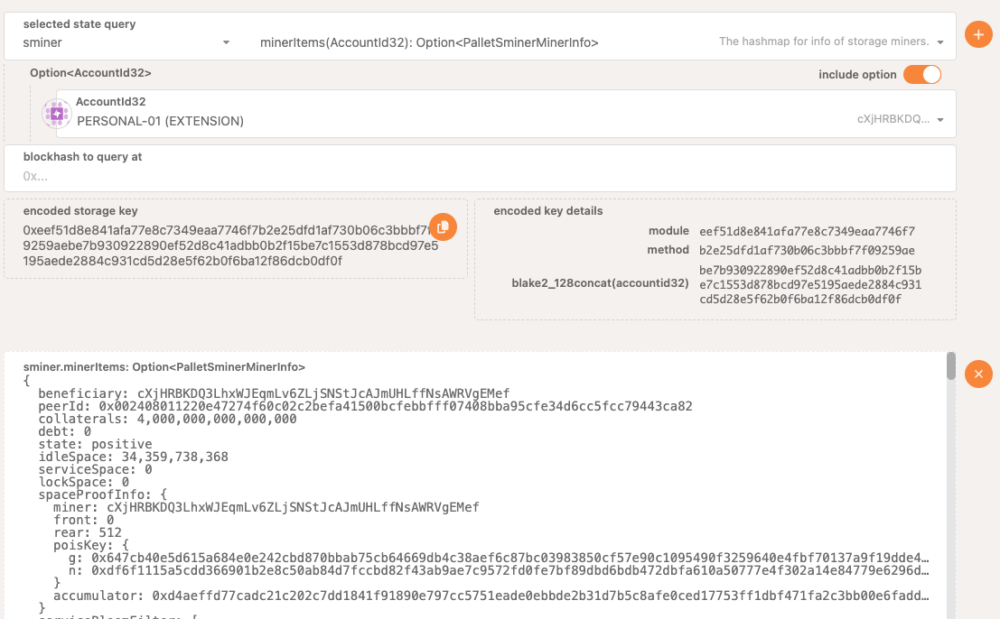
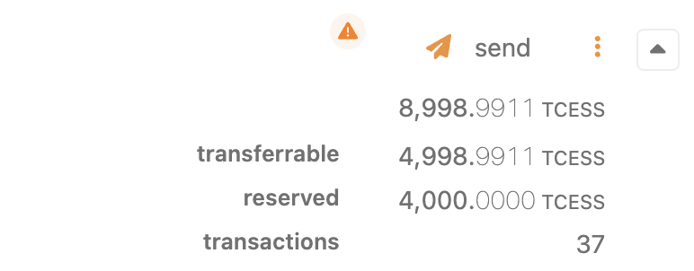
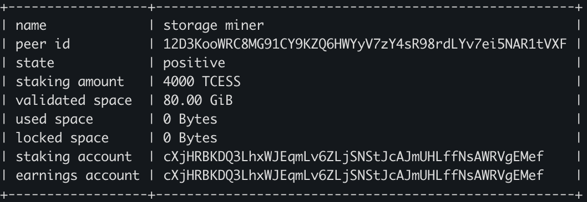

# Server Requirement

The recommended requirement of a storage server:

| Resource  | Specification |
| ------------- | ------------- |
| Recommended OS | Linux 64-bit Intel / AMD |
| # of CPU Cores | ≥ 4 |
| Memory | ≥ 8 GB |
| Bandwidth | ≥ 20 Mbps |
| Public Network IP | required |
| Linux Kernel Version | 5.11 or higher |

# Server Preparation

## Install Docker

Please refer to the [official documentation](https://docs.docker.com/engine/install/) for Docker installation.

## Firewall Configuration


The following commands are executed with root privileges. If error messages of `permission denied` appear, switch to root privilege or add `sudo` at the beginning of these commands.


By default, the node client program, **cess-miner**, uses port 4001 to listen for incoming connections, if your OS firewalled the port by default, you may need to enable the access to the port.

```bash
ufw allow 4001
```

## Optional: Mount Additional Drive


This step is required only if you are mounting another disk / storage device to your server.


Check the hard disk status using the `df -h` command:

```bash
df -h
```

If the disk is not mounted, the hard drive for storage mining cannot be used. Use the commands below to view unmounted hard disks:

```bash
fdisk -l

# Output result
Disk /dev/vdb: 200 GiB, 214748364800 bytes, 419430400 sectors
Units: sectors of 1 * 512 = 512 bytes
Sector size (logical/physical): 512 bytes / 512 bytes
I/O size (minimum/optimal): 512 bytes / 512 bytes
Disklabel type: dos
Disk identifier: 0x331195d1
```

From the above, we can see that the unmounted disk is `/dev/vdb`. We will be using `/dev/vdb` to demonstrate the mounting operation.

Allocate the `/dev/vdb` disk:

```bash
fdisk /dev/vdb

Enter and press Enter:
n
p
1
2048
the value after default
w
```

Format the newly divided disk into ext4 format:

```bash
mkfs.ext4 /dev/vdb
```

Enter "y" to continue if the system asks to proceed:

```bash
Proceed anyway? (y,N) y
```

Create `/cess` directory to mount the disk. Using `/cess` as an example:

```bash
sudo mkdir /cess
sudo echo "/dev/vdb /cess ext4 defaults 0 0" >> /etc/fstab
```

Replace `/dev/vdb` with your own disk name. /cess has to remain the same as created in the previous step. If you are not under root privileges, try:

```bash
echo "/dev/vdb /cess ext4 defaults 0 0" | sudo tee -a /etc/fstab
```

Mount `/cess`:

```bash
mount -a
```

Check the disk mounting status:

```bash
df -h
```

If `/cess` appears, the disk has been successfully mounted.

# Prepare CESS Accounts

Storage node need to create at least two wallet accounts.

- **Earning Account**: Used to receive mining rewards.
- **Staking Account**: Used to pay for staking TCESS.
- **Signature Account**: Used to sign blockchain transactions. If no staking account is specified, this account will also be used to pay staking TCESS.
- **Storage Deposit**: To keep the storage node in honoring its service commitment, the storage node account will have its native tokens locked for the storage amount pledged to offer. Currently in testnet, it is 4,000 TCESS per TB. The pledged space is **round up** to the closest TB unit and locked for that amount multiply with 4,000 TCESS. The minimum locked token is also 4,000 TCESS.

**Note：Each signature account can only be used by one storage node, otherwise an exception will occur.**

Please refer to [Creating CESS Accounts](../../user/cess-account.md) for creating a CESS account, goto [CESS faucet](https://cess.network/faucet.html) to get our testnet tokens, TCESS, or [contact us](../../introduction/contact.md) to get assistance.

# Install CESS Client

1. Check for the latest version at: <https://github.com/CESSProject/cess-nodeadm/tags>

2. Download and install

   ```bash
   wget https://github.com/CESSProject/cess-nodeadm/archive/v0.6.0.tar.gz
   tar -xvzf v0.6.0.tar.gz
   cd cess-nodeadm-0.6.0/
   ./install.sh
   ```

   If a message `Install cess nodeadm success` shows up at the end, it means the installation is completed.

   If the installation fails, please check the [troubleshoot procedures](./troubleshooting.md).

3. Stop and removing existing services

   Stop existing services:

   ```bash
   sudo cess stop
   # or
   sudo cess down
   ```

   Remove existing services：

   ```bash
   sudo cess purge
   ```

# Configure CESS Client

## Setup a Running Network

```bash
# Running the storage node on development network:
sudo cess profile devtnet

# or running the storage node on test network:
sudo cess profile testnet
```

## Setup Configuration

```bash
sudo cess config set

Enter cess node mode from 'authority/storage/watcher': storage
Enter cess storage listener port (current: 15001, press enter to skip): 
Enter cess rpc ws-url (current: local-chain, to use an external chain, type WS-URL directly, or press enter to skip): # for example, enter wss://testnet-rpc.cess.cloud/ws/
Enter cess storage earnings account: # enter the account to earn reward, should start from "c..."
Enter cess storage signature account phrase: # enter your signature account mnemonic, it can only be used by one storage miner!
Enter cess storage disk path: # the disk path
Enter cess storage space, by GB unit (current: 300, press enter to skip): 
Enter the number of CPU cores used for mining; Your CPU cores are 4
  (current: 3, 0 means all cores are used; press enter to skip): 
Enter the staker\'s payment account if you have another (if it is the same as the signature account, press enter to skip): # your another staking account.
Enter the reserved TEE worker endpoints (separate multiple values with commas, press enter to skip):
Set configurations successfully
```

- If a staker payment account is provided, for testnet, the pledged space (answer to the **Enter cess storage space**) is **round up** to the closest TB unit and that amount multiply with 4,000 amount of TCESS will be locked as a miner deposit.
- If a staker payment account is not provided, then the signature account will be used as the staking account. If the staking account different from signature account is provided, can only [increase stake in block browser manually](https://docs.cess.network/core/storage-miner/troubleshooting).
- Default TEE Node endpoints for the chain will be used if you don't provide any TEE Node endpoints. This doesn't affect your reward as a storage miner.

Start CESS storage node

```bash
sudo cess start

[+] Running 3/0
 ✔ Container chain       Running                                                0.0s
 ✔ Container miner       Running                                                0.0s
 ✔ Container watchtower  Running                                                0.0s
```

If you want to speed up your earnings, you can choose to deploy a Marker-type TEE Node to help storage nodes certify space and mark user service files. Please refer to the [TEE Node User Guide](../tee-node/running.md).

# Common Operations

## Check CESS Chain Sync Status

```bash
docker logs chain
```

As shown below, if we see that the height of the block corresponding to "best" is about the latest height in [CESS Explorer](https://testnet.cess.network/), it means the local chain node synchronization is completed.


Only when the chain synchronization is completed can you operate other functions such as increase the staking, view the status of the node, etc.

## Check Your Storage Node Status On-chain

You can check your storage node status on-chain.

1. Goto [**Polkadot-js Apps**: Developer > Chain state](https://polkadot.js.org/apps/#/chainstate)
2. On *selected state query*: select **sminer** pallet and **allMiner()** storage item
3. Click the button on the right to query the state
4. At the bottom of the returned list, you should find the storage node address that your mnemonic (with root path) generated from your answer to `sudo cess config set`. See below for an example.

   

5. You can also check your detail miner info with selecting **sminer** pallet and **minerItems(AccountId32)** storage item. In the *Option\<AccountId32\>*, choose/input the storage node address. It will return your detail information on-chain. See below for an example.

   

6. Go to [the **Accounts** page](https://polkadot.js.org/apps/#/accounts) and check your account details, you would see a certain amount of TCESS has been reserved as the storage deposit.

   

## View the Storage Node Log

```bash
docker logs miner
```

As shown below, seeing `/kldr-testnet` indicates that the network environment is a test network, and seeing `Connected to the bootstrap node...` indicates that there is a connection to the bootstrap node.


## View Storage Node Status

```bash
sudo cess miner stat
```

An example of the returned result is shown below：


Refer to the [Glossary](../../glossary.md#storage-miner) on the names above.

At the beginning of the storage node synchronization, all your **validated space**, **used space**, and **locked space** are 0. It is only when the validated space been incremented above 0 that the storage miner start earning rewards. For testnet, it take about an hour **after** the storage node chain synchronization completed, as shown below.



If you get the result of `You are not a storage node` , please wait for the chain synchronization to complete.

## Increase Storage Node Staking

Make sure that the signatureAcc is the same as stakingAcc can use this command

```bash
sudo cess miner increase staking <deposit amount>
```

## Withdraw Storage Node Staking

After your node **has exited CESS Network** (see below), run

```bash
sudo cess miner withdraw
```

## Query Reward Information

```bash
sudo cess miner reward
```

## Claim Reward

```bash
sudo cess miner claim
```

## Update All Service Images

```bash
sudo cess pullimg
```

## Stop and Remove All Services

```bash
sudo cess down
```

## Update Earnings Account

```bash
sudo cess miner update earnings [earnings account]
```

## Exit CESS Network

```bash
sudo cess miner exit
```

# Upgrade CESS Client

## Stop and Remove All Services

```bash
sudo cess stop
sudo cess down
```

## Remove All Chain Data


Do not perform this operation unless the CESS network has been redeployed and it is confirmed that the data can be cleared.


```bash
sudo cess purge
```

## Update `cess-nodeadm`

```bash
wget https://github.com/CESSProject/cess-nodeadm/archive/vx.x.x.tar.gz
tar -xvf vx.x.x.tar.gz
cd cess-nodeadm-x.x.x
sudo ./install.sh --skip-dep
```

## Update All Service Images

```bash
sudo cess pullimg
```
