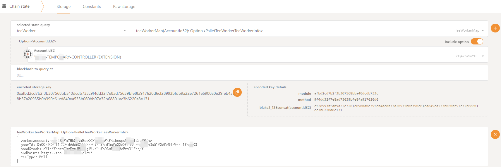

# System Requirement

If you're planning to run the Tee node, it's important to make sure your system meets the recommended requirements to ensure that your miner performs at its best.

| Resource                      | Specification               |
|-------------------------------|-----------------------------|
| Recommended OS                | Ubuntu\_x64 20.04 or higher |
| CPU Processor Num             | ≥ 4                         |
| Intel SGX Enabled             | required                    |
| Memory (SGX encrypted memory) | ≥ 16 GB                     |
| Bandwidth                     | ≥ 5 Mbps                    |
| Public Network IP             | required                    |
| Linux Kernel Version          | 5.11 or higher              |



## Enabled Intel SGX

For a system to support **Intel Software Guard Extensions** ([Intel SGX](https://www.intel.com/content/www/us/en/architecture-and-technology/software-guard-extensions.html)) and **Flexible Launch Control** (FLC), it needs a CPU that supports these features. The CPU should be either Intel ME, Intel SPS, or both Intel SPS and Intel ME. Additionally, the BIOS must support Intel SGX and the SGX option must be enabled. To enable SGX functionality, please refer to the server manufacturer's BIOS guide. You can also check out the [list of CPU models that support SGX](https://ark.intel.com/content/www/us/en/ark/search/featurefilter.html?productType=873&2_SoftwareGuardExtensions=Yes%20with%20both%20Intel%C2%AE%20SPS%20and%20Intel%C2%AE%20ME) to ensure your system supports Intel SGX.

- CPU Recommended Models: Intel E, E3, Celeron (some models), Core series CPUs, with Intel Core i5-10500 being the optimal choice.
- Recommended Motherboard BIOS: Preferred options include mainstream manufacturers such as Supermicro.

## Static Public IP

The server requires a static public IPv4 IP. Please ensure that the IP address is accessible and not behind a NAT. Run the following command to confirm your public IP.

```bash
curl -4 ifconfig.co
```



# Select Tee Node Type

Running a TEE node can increase the reputation points of a running Consensus Node. TEE nodes are divided into several roles. Some TEE nodes need to be bound to a Consensus Node to run. You can choose to bind your own Consensus Node or a Consensus Node account you are familiar with.

- **Full**: Full node is a type of node that has all the necessary functions to operate as a fully-capable Tee Node. This includes generating random challenges, verifying data, computing tags, and generating and replacing space holder data, etc.

- **Verifier**: Verifier nodes handles random challenges for idle and service data.

- **Marker**: These nodes are called Markers, and their role is to compute tags for the user's data, also known as service data. They are also responsible for creating, verifying, and replacing idle data segments. These nodes can be registered independently and serve a designated Storage Node cluster. **It's important to note that operating the TEE Node in this capacity does not increase reputation points**.

# Prepare CESS Wallet Accounts

To run the TEE node in both `Full` and `Verifier` operational capacities, you need two separate accounts.

- **Stash Account**: This is the account where you keep all the tokens you want to stake. This account requires at least 3,000,000 TCESS for staking it can be either from the node owner itself or delegated by other users.

- **Controller Account**: This account is a wallet used to pay the transaction gas fees required to run the TEE node and that these tokens are not safe, please do not put too much token in this account.

If you only run a TEE node with the `Marker` role, then you only need prepare the `Controller Account`


You can also refer to the artcle [Creating CESS Accounts](../../user/cess-account.md) for creating a CESS account.

You can either use [CESS testnet faucet](https://cess.network/faucet.html) to get TCESS, or [contact us](../../introduction/contact.md) to receive TCESS tokens for staking.


# Install CESS Client


Before running, if you have previously deployed a previous version of CESS Tee Node on your instance, please be sure to uninstall it before running. The uninstallation method is as follows (if it is a new machine, please ignore it)

```bash
    #Delete all information of the previous version
    cess purge
    #Delete old scripts
    /opt/cess/nodeadm/scripts/uninstall.sh
```

The `cess-nodeadm` is a CESS node deployment and management tool. It helps deploying and managing Storage nodes, Tee nodes, and Consensus nodes, simplifying the devOps for all CESS miners.

```bash
wget https://github.com/CESSProject/cess-nodeadm/archive/refs/tags/v0.5.8.tar.gz
tar -xvf v0.5.8.tar.gz
cd cess-nodeadm-0.5.8
sudo ./install.sh

```


You can verify that you are running the latest version of [cess-nodeadm here](https://github.com/CESSProject/cess-nodeadm/releases).


On successful installation of cess-nodeadm you will see `Install cess nodeadm success` message.

If the installation fails, please check the [troubleshooting procedures](../storage-miner/troubleshooting.md).

# Configure CESS Client

Execute:

```bash
sudo cess config set
```

The following is an operational example of running the miner in the `Full` capacity mode:

_Tips: You can press Enter to skip when the default value of 'current' is suitable_

```bash
Enter cess node mode from 'authority/storage/rpcnode' (current: authority, press enter to skip): authority
```

If you select the "authority" option, the Intel SGX driver on your device will be initiated in software mode. You might encounter a notification that reads "Software enable has been set. Please reboot your system to finish enabling Intel SGX." Therefore, it is recommended that you restart your device after completing the configuration and before moving on to the next steps.

You will see the follwing message printed on the screen.

``` bash
Begin install sgx_enable ...
Reading package lists... Done
Building dependency tree... Done
Reading state information... Done
0 upgraded, 0 newly installed, 0 to remove and 23 not upgraded.
sgx_enable install successful
Intel SGX is already enabled on this system
```

Give your node a `name` then you can either enter `CESS chain ws url` or leave it as default.

```bash
Enter cess node name (current: cess, press enter to skip): cess
Enter cess chain ws url (default: ws://cess-chain:9944):
```

The next prompt you will asked to set the TEE Node port. You can either set a custom port or leave it as default. Once the port is set the public IP of the system is automaticallt detected. In case you find that the public ip is incorrect you can enter it manually. Instead or IP you can also use your domain name here.

```bash
Enter the public port for TEE worker (current: 19999, press enter to skip):
Start configuring the endpoint to access TEE worker from the Internet
  Try to get your external IP ...
Enter the TEE worker endpoint (current: http://xx.xxx.xx.xx:19999, press enter to skip)
```

The current version of TEE Node supports two running remote attestation types. You can choose according to your machine. For details on how to know which remote attestation type your machine supports, please see the `Questions & Answers` at the end of the article.
```bash
Enter the type of remote attestation method 'ias/dcap' (current: , press enter to skip):dcap
```

 You can choose role now. **`Full`** mode has all the capabilities of TEE Node, **`Verifier`** only has the capabilities of TEE Node to verify the proof from miners, and **`Marker`** only has the capabilities of TEE Node to tag file from miners. When you choose the **`Marker`** role, you do not need to fill in the CESS validator stash account in the next step.
 ```bash
 Enter what kind of tee worker would you want to be [Full/Verifier/Marker]: Full 
 ```

 Then enter your CESS Controller account mnemonic phrase.
 ```bash
 Enter cess validator stash account (current: null, press enter to skip): cXic3WhctsJ9cExmjE9vog49xaLuVbDLcFi2odeEnvV5Sbq4f
 Enter cess validator controller phrase: xxxxxxxxxxxxxx
 ```

Lastly, you will see the following messages printed on the screen which downloads all the required docker images.

```bash
Set configurations successfully
Start generate configurations and docker compose file
Unable to find image 'cesslab/config-gen:testnet' locally
testnet: Pulling from cesslab/config-gen
7264a8db6415: Pull complete 
eee371b9ce3f: Pull complete 
93b3025fe103: Pull complete 
d9059661ce70: Pull complete 
45f3da3bc313: Pull complete 
d4758bd5aaf9: Pull complete 
e205f8927d12: Pull complete 
0bc1d94251ef: Pull complete 
5a1ea37daadf: Pull complete 
a8485f413033: Pull complete 
Digest: sha256:07808904b7fb5bf097b21f06739f7623d9e6be2d94c179aff05fcde9df87a012
Status: Downloaded newer image for cesslab/config-gen:testnet
debug: Loading config file: config.yaml
info: Generating configurations done
info: Generating docker compose file done
dbb2a522283b052e20cb8b59109a00f43f678158a9a43f2f663994d8230a26be
Configurations generated at: /opt/cess/nodeadm/build
```

# Common Operations

## Start Consensus Node

```bash
cess start
```

## Query Miner Status

```bash
$ cess status

-----------------------------------------
 NAMES           STATUS
cifrost         Up 2 minutes
ceseal          Up 2 minutes
chain           Up 2 minutes
watchtower      Up 2 minutes
-----------------------------------------
```

## Examine Config Information

```bash
cess config show
```

# Upgrade CESS Client

## Stop and Remove All Services

```bash
cess stop
cess down
```

## Remove All Chain Data


If your has some serious problems and you want to completely reinstall your Tee Node, you can use the following command to clear all runtime data from you instance.


```bash
cess purge
```

## Update `cess-nodeadm`

```bash
wget https://github.com/CESSProject/cess-nodeadm/archive/refs/tags/<new-version>.tar.gz
tar -xvf <new-version>.tar.gz
cd cess-nodeadm-<new-version>
./install.sh --skip-dep
```

Currently [the most updated version](https://github.com/CESSProject/cess-nodeadm/tags) is **v0.5.5**.

## Pull Images

```bash
cess pullimg
```

# Questions & Answers

1. I don't want to expose my IP address on the chain. What should I do?

   During the cess config set process, you can set your endpoint with a domain name. For example, if your registered domain is tee-xxx.cess.network, you can enter <http://tee-xxx.cess.network> when setting the endpoint. The script will then ask you if you want to enable one-click domain proxy. You can enter y to enable it, as shown below:

   ```bash
   .....
   Enter the kaleido endpoint (current: http://tee-xxx.cess.network, press enter to skip): http://tee-xxx.cess.network
   Do you need to configure a domain name proxy with one click? (y/n): y
   .....
   ```

   Alternatively, you can manually configure an nginx proxy. Please avoid using the intermediate proxy provided by the domain service provider.

2. How do I know if the program is working properly?

   You can select Chain State in the block explorer. Through this method, you can check whether the registration was successful.

   

3. I don't want the program to update automatically. What should I do?

   After the program has started successfully, a watchtower service will manage local services on behalf of the user. When the CESS official updates a component, the watchtower will pull the latest program for automatic upgrading. If you don't want to use the automatic upgrade feature, you can disable it with the following command before the cess config set.

   ```bash
   ## Disable the update of the ceseal service.
   cess tools no_watchs ceseal

   ## Disable the update of the cifrost service.
   cess tools no_watchs cifrost
   ```

   Every automatic upgrade from you means a bug fix for the consensus miner program by the official, and we **strongly discourage** you from turning off the automatic upgrade feature, as this may render your service **unusable**.

4. How do I know which remote attestation method my machine supports?
    If the processor supports Intel® SGX and FLC, then DCAP is supported.
    There are two options to determine if your system's processor supports FLC:
    
    * First Option:
    On Linux* systems, execute cpuid in a terminal:
        1. Open a terminal and run: $ cpuid | grep -i sgx
        2. Look for the output: SGX_LC: SGX launch config supported = true

    * Second Option:
    Using test-sgx.c:
        1. Go to the [SGX hardware Github](https://github.com/ayeks/SGX-hardware) and download the file test-sgx.c or clone the repository
        2. Compile and run test-sgx.c according to the following instructions:
            ```bash
            gcc test-sgx.c -o test-sgx
            ./test-sgx
            ```
        3. Find Output: sgx launch control: 1

