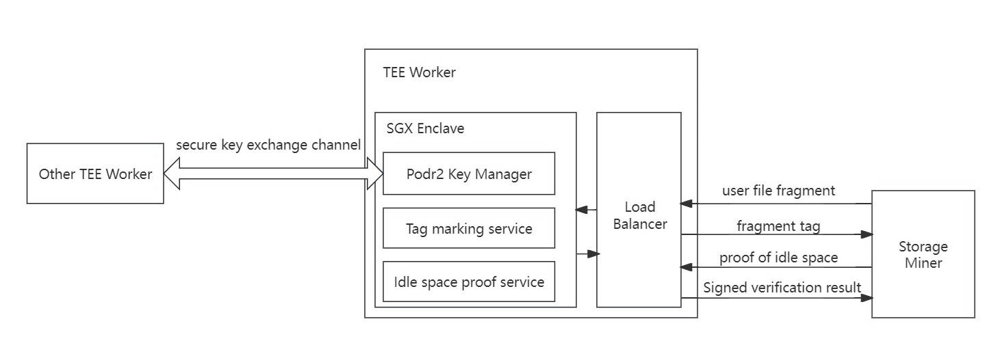

# TEE Nodes

## Introduction

TEE Node is a node running in the Intel SGX trusted execution environment. It mainly authenticates the legality of idle space of storage nodes and initializes stored user data based on the PoDR2 algorithm through the trusted execution environment. It also acts as a proxy for consensus nodes to achieve efficient verification of random challenge proofs of idle space and inservice data. Running TEE Node does not directly gain any benefits, but it can improve the efficiency of storage nodes and accumulate workload for their proxy consensus nodes to help them increase the probability of successfully becoming validators. Users can use node running script tools to quickly set up TEE Nodes on devices that meet the requirements, serving their own storage nodes or consensus nodes.

TEE Node is developed based on [Gramine library](https://gramineproject.io/) and currently only supports [Intel series chips](https://www.intel.com/content/www/us/en/developer/articles/tool/intel-trusted-execution-technology.html). TEE Nodes can be divided into three types:

1. **Marker Mode**: The marker mode of TEE Node refers to a running mode of TEE Node that only supports functions other than random challenge verification. It usually only includes initialization of inservice data, authentication of idle space, and replacement functions. TEE Node running in this mode does not need to be bound to a specific consensus node.
2. **Verifier Mode**: The verifier mode of TEE Node refers to a running mode of TEE Node that only supports random challenge verification function. Running this mode or a full mode that includes this mode function requires binding a consensus node to the TEE Node.
3. **Full Mode**: The full mode of TEE Node refers to a running mode that supports all functions of TEE Node, which usually includes functions such as initialization of inservice data, authentication and replacement of idle space, and verification of random challenges of idle space and inservice data.

## Income Introduction

Running TEE Node itself does not directly obtain any benefits, but obtains more rewards for its related nodes by performing effective security services of the storage network. TEE Node has two deployment methods, each of which can obtain different benefits:

- It is bound to run with the consensus node and can only work after being bound and registered with the consensus node stash account. It requires relatively high hardware requirements, but its tied consensus miners will also receive higher rewards.

- Independent registration can run a specific type of TEE Node without being bound to a consensus node, specifically marking data and verification space for specific storage miners to help storage miners obtain higher rewards from each random challenge.

## Why deploying independently registered TEE Nodes bring more rewards to storage miners?

During random challenges, rewards will be divided based on the proportion of the user data (service data) effectively stored by storage miners and certified idle space in the entire network. User data needs to be marked by TEE Node before it can pass the random challenge. Similarly, the idle space generated in batches by storage miners also needs to be verified by TEE Node. However, the TEE Node resources disclosed in the entire network are limited, and they need to queue up to receive the service. For storage miners with higher performance, this is often one of the main bottlenecks restricting their production efficiency. And due to limitations of regional network differences, storage nodes scattered around the world do not receive TEE Node services equally efficiently. Therefore, in order to minimize the effect of this bottleneck and accelerate the verification of data across the entire network, CESS encourages users with a large number of storage miners to independently register and run several TEE Nodes to verify their own nodes.

## Working Principle

The working principle of Marker type TEE Node is shown in the figure below:

TEE Node protects the PoDR² key through the SGX Trusted Execution Environment, which is used to mark user service file fragments, and to verify and sign the results of idle space certification or replacement certification. The PoDR² key is generated in a trusted environment and transferred to the trusted environment of other TEE Nodes through a secure key exchange channel without being leaked to the outside, thus ensuring the security of the algorithm; the trusted environment also encapsulates the internal code, and needs to pass Intel remote authentication. The remote authentication report also needs to be verified when TEE Node is registered to ensure that the code running in SGX is officially disclosed by CESS and has not been maliciously tampered with, thereby ensuring the correctness of the service.

In addition, any user request parameters that enter SGX need to be verified to ensure that the data will not be tampered with during the process.
