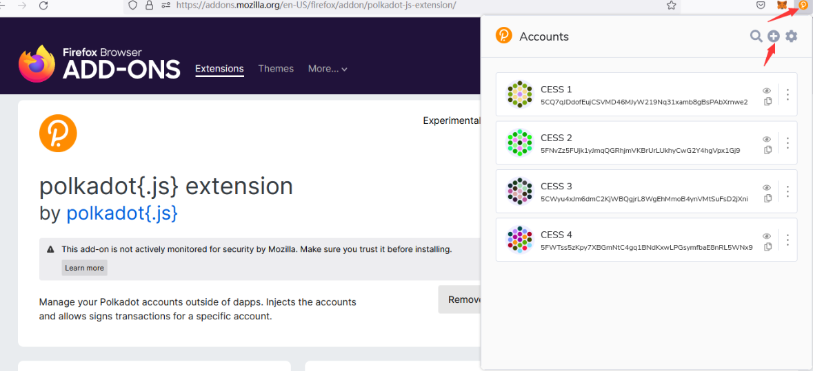
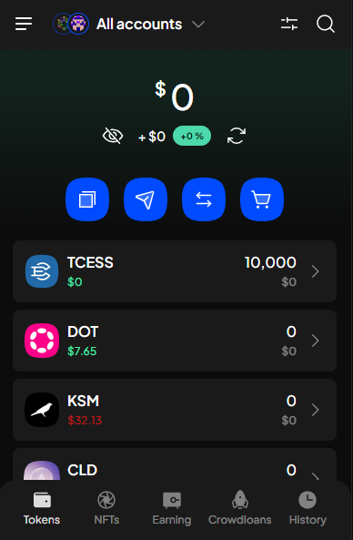
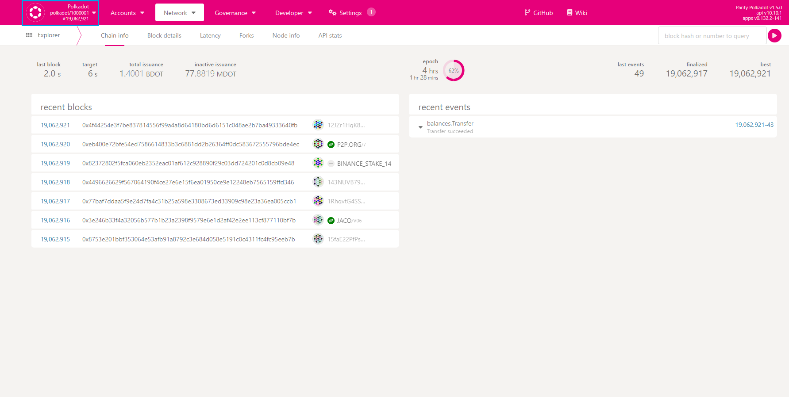

CESS account holds the user’s assets in CESS Network. Please keep the account mnemonic seeds and backup files **private** and **secure**. Users may lose the assets in the account forever if this information is compromised.

The following illustrate two ways to create a CESS account.

# Method 1: Create an Account Using Polkadot.js Apps

- Navigate to [Polkadot.js Apps](https://polkadot.js.org/apps/?rpc=wss%3A%2F%2Ftestnet-rpc0.cess.cloud%2Fws%2F#/explorer).

- Click **Settings**, under *in-browser account creation*, choose **Allow local in-browser account storage**, and click the save button at the bottom right. 

    

- Click **Accounts** under the drop-down menu and then click **Add account** to create a new account. 

    

- Keep the twelve words mnemonic phrase secure and safe. Then proceed to the next step. 

    

- Create an account nickname and password, click **Next**, and then click **Save** to save the account raw seed. 

    

- Congratulations! You have successfully created a CESS account. 

    

# Method 2: Create an Account Using Polkadot.js Wallet

- Download [Polkadot.js extension](https://polkadot.js.org/extension/) to your browser. Currently the extension supports both Chrome or Firefox. 

    

- Click the Extension icon on the browser. The *Accounts* window pops up. Click the **+** icon in the upper right corner and click **Create New Account** to create a new wallet account. 

    

- Give a descriptive name and input the password. Then click **Add the account with the generated seed** button. Congratulations! Your CESS account has been created successfully. 

    

- You can view the account in [Polkadot.js Apps](https://polkadot.js.org/apps/?rpc=wss%3A%2F%2Ftestnet-rpc0.cess.cloud%2Fws%2F#/explorer). 

    

# Method 3: Create an Account Using SubWallet

[SubWallet](https://www.subwallet.app/) support many types of [wallet-client](https://www.subwallet.app/download.html) like extension, mobile app and web dashboard.

We only demonstrate how to create an account using [SubWallet-Chrome-Extension](https://chromewebstore.google.com/detail/subwallet-polkadot-wallet/onhogfjeacnfoofkfgppdlbmlmnplgbn) at this document.

- Download [SubWallet Chrome Extension](https://chromewebstore.google.com/detail/subwallet-polkadot-wallet/onhogfjeacnfoofkfgppdlbmlmnplgbn) to your Chrome. 

  

- Create a SubWallet account

  

- Get your TCESS account

After create a SubeWallet account, click `Get address`, and then click `Account 1` can search token: `cess`

  
  
  
  

- Get Token by faucet and check in wallet

you can get TCESS in [Faucet](https://cess.cloud/faucet.html)

After get TCESS successfully, check balance in SubWallet

# How to Configure Polkadot.js Apps?

You can navigate directly to [Polkadot.js Apps](https://polkadot.js.org/apps/?rpc=wss%3A%2F%2Ftestnet-rpc0.cess.cloud%2Fws%2F#/explorer).

If the link fails or you want to connect to the CESS network through another RPC address, you can configure it as follows:

- Navigate to [Polkadot.js Apps](https://polkadot.js.org/apps).
  
- Click the blue square area in the picture below to open the configuration panel：

    

- Scroll down the page and find the DEVELOPMENT option, click on it：

    

- Fill in the RPC address you want to use in the input box and click the Switch button above to save.

- The following are the available RPC addresses in CESS testnet:

    
    wss://testnet-rpc0.cess.cloud/ws/

    wss://testnet-rpc1.cess.cloud/ws/

    wss://testnet-rpc2.cess.cloud/ws/
    
