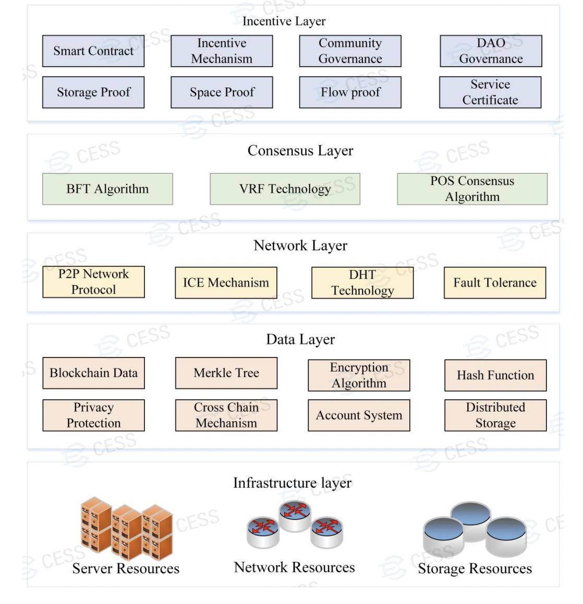

The blockchain layer is further divided into five layers:

**Infrastructure layer** - consists of hardware equipment including servers, network hardware and storage hardware for CESS blockchain.

**Data layer** - supports scalable data storage, provides various data processing algorithms.

**Network layer** - responsible for node connection and data
transfer, providing load balancing and P2P network protocols and algorithms.

**Consensus layer** - provides consensus mechanisms on transactions.

**Incentive layer** - achieve fair income distribution through smart contracts and other incentive
schemes.

# Infrastructure Layer

CESS invites three types of resources to join the network: server resources, network resources, and storage resources. Server resources focus on computing performance and will carry the computing and scheduling tasks. Network resources will provide network bandwidth support. Storage resources are the kernel part of CESS system. We need to attract nodes with storage capacity to join the network to provide a stable
and reliable data storage infrastructure and lay a solid foundation for unified scheduling and management of CESS platform resources.

# Data Layer

The data layer stores CESS blockchain data, as well as data files from CESS storage clients. To ensure the security and integrity of user data files, encryption algorithms are used for data transmission, storage and verification, such as digital signatures, hash algorithms, Merkle trees, etc.

# Network Layer

To ensure efficient access to data in the network, a distributed hash table (DHT) based P2P storage network will be built.

**P2P Network**

A distributed application architecture that distributes tasks and workloads among peers. Thus, the whole network does not depend on a dedicated centralized server, and each computer in the network acts as both a requestor and responder to requests from other computers to provide resources and services.

**DHT**

This is a distributed storage method. Each client is responsible for a small range of routing and for storing a small portion of the data, thus enabling the addressing and storage of the entire DHT network. As long as clients are connected to any node already in the DHT network, the client can find more nodes to connect to the network. DHT technology is to enable any machine in the network to perform part of the server's functions.

# Consensus Layer

In order to ensure that the transactions and activities on the blockchain network can reach a consensus quickly, CESS proposes a novel Random Rotational Selection(R²S) consensus mechanism based on Byzantine fault tolerance to improve the performance and scalability of the system.

There are two types of consensus nodes in CESS network: active consensus node and consensus candidate node. Theoretically, any node can become a consensus node via staking. There is no limitation to the of number of candidate consensus nodes. In order to improve reliability, CESS use credit rating method to verify the nodes and select qualified nodes to be consensus candidate nodes. Within each time window, CESS randomly selects next **11 consensus nodes** as new active consensus nodes. Active consensus nodes will be responsible for on-chain transaction validation, data packing, and data block generation. The goal of CESS consensus mechanism is to achieve network security, system transparency, randomness, and fairness to miners.

# Incentive Layer

As any distributed file systems, CESS main system resources are storage and network resources. Miners can provide these two types of resources to join the CESS network, and the CESS system will reward the miners with CESS tokens according to their contributions to the network. CESS has an algorithm to calculate each miner’s contribution to the network. The algorithm is a comprehensive consensus algorithm that considers the factors of miners' storage capacity, network bandwidth, and node configuration, to calculate an overall node score, and thus the rewards in form of CESS tokens.

CESS tokens are distributed in the following ways to the corresponding parties:

**Storage Mining**: Miners with storage capacity join the storage network to earn tokens proportional to their bandwidth and storage capacity.

**Consensus Mining**: Miners with qualified computational resources can deposit collaterals in form of CESS tokens to become candidate consensus nodes. If selected by CESS random consensus mechanism as one of the active validators, these nodes can earn rewards.

**Community Governance and Contribution**: To promote the CESS network, developers, community members, and partners can submit their proposals and receive community votes. When a quorum is established, corresponding rewards will be issued from the blockchain system. Proposals are accepted based on the governance of an Decentralized Autonomous Organization (DAO). CESS community transparently operates the Community Development Fund (CDF) through the votes.

**Token Distribution**: All incentive related activities are implemented based on smart contracts. This ensures the fairness and transparency of the CESS incentive mechanism.
