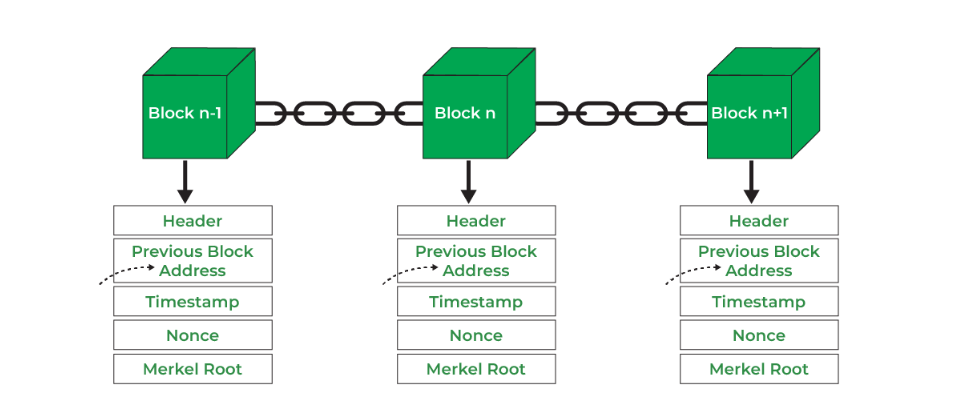

The blockchain network witnesses a large amount of transaction activities. Keeping these transaction records helps the system track the amount used or unused and the parties involved. Transactions conducted within a given time period are recorded in a file called block, which is the basis of the blockchain network.

The most basic unit in the blockchain is a block. Literally, the blockchain is a chain of connected blocks. So what are the blocks that make up this chain? This should be explained from the definition of blockchain. Blockchain is a decentralized ledger, which records the information of operation or data generated in the network in every certain period of time by packaging them into blocks. We can view a block is a collection of data, which records all the information generated in this time period and will be synchronized to other nodes after verification. From this time point on, it will not be able to be deleted or tampered with, so as to ensure the reliability of the blockchain data.

Each block will have a block height as a label, and the block height will continue to increase with continuous blocks production. Under normal circumstances, the block producing time is fixed. Thus, the block height is also regarded as the "time unit" in the web3 world.

Because the the blockchain resources are limited, the resources management in the chain is very important. One way to manage the resources in the chain is to limit the size of the block. Currently, in CESS network, the producing time of a block is fixed at 6s, and the maximum capacity is 5MB.

Although a lot of information is recorded in a block, it does not occupy a lot of space. This is related to its composition, which consists of the following two parts:

**Header**, including:

- Block height
- Parent hash
- Transaction root
- State root
- Digest

**Transactions**

To learn more about the definition of block structure, [click here](https://paritytech.github.io/substrate/master/sp_runtime/traits/trait.Block.html).
