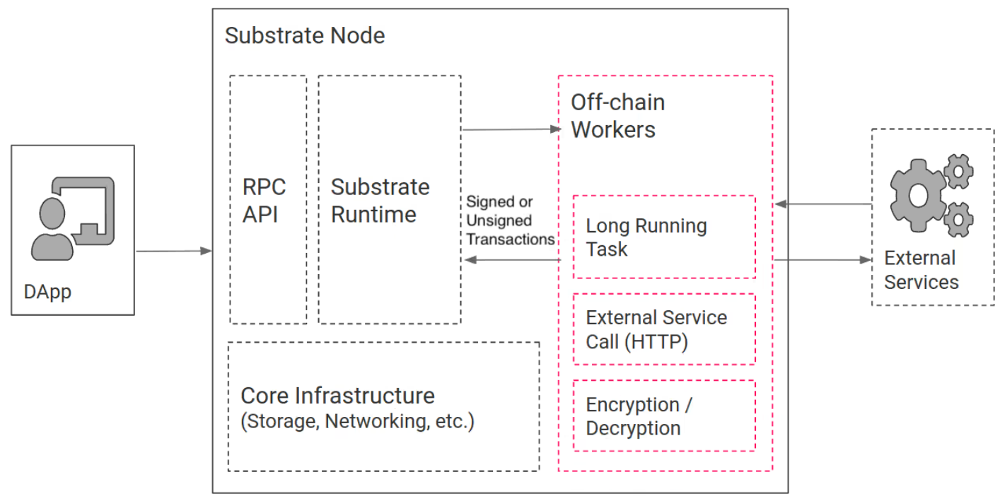

# Off-chain Operations

There is often a need to query and/or process off-chain data before it can be included in the on-chain state. The conventional way of doing this is through oracles. Oracles are external services that typically listen to blockchain events and trigger tasks accordingly. When these tasks are completed their results will be submitted back to the blockchain using transactions. Even though this approach works out, it still has several flaws with respect to security, scalability, and infrastructure efficiency.

To make the off-chain data integration more secure and more efficient, Substrate provides the following off-chain features:

- Off-chain worker subsystem allows executions of long-time running and possibly non-deterministic tasks, such as web requests, encryption/decryption and signing of data, random number generation, CPU-intensive computations, enumeration/aggregation of on-chain data, etc.

- Off-chain worker allows to execute tasks that requires longer time than the block execution time. If the processing time of business logic may reach the upper limit, an off-chain worker would be a suitable candidate solution.

**Off-chain Workers** have both read and write access to off-chain storage. The on-chain logic has write access via off-chain indexing but not read access. Off-chain storage allows different worker threads to communicate with each other, and stores user-/node- specific data that does not require consensus across the entire network. This is great for different worker threads to communicate to each others and for storing user-/ node-specific data that does not require consensus over the whole network.

**Off-chain Indexing** allows the runtime, if opted-in, to write directly to the off-chain storage independently from Off-chain Workers. This serves as a local/temporary storage for on-chain logic and complement to its on-chain state. This means that if Off-chain Workers want to change the on-chain status, they need to call the transaction to make the change. If they want to cancel the gas fee for this transaction, using an unsigned transaction will become the preferred option.

However, it should be noted that the execution of Off-chain Workers requires additional computer resources. If multiple Off-chain Workers are running unreasonably, it may cause the computer to stop operation.

# Off-chain Workers

Off-chain features run in their own Wasm execution environment outside of the Substrate runtime. This separation of concerns ensures that block production is not impacted by long-running off-chain tasks. However, as the off-chain features are declared in the same code as the runtime, they can easily access on-chain state for their computations.



Off-chain Workers have access to extended APIs for communicating with the external world:

- Ability to submit transactions—either signed or unsigned—to the chain to publish computation results.
- A fully-featured HTTP client allowing the worker to access and fetch data from external services.
- Access to the local keystore to sign and verify statements or transactions.
- An additional, local key-value database shared between all off-chain workers.
- A secure, local entropy source for random number generation.
- Access to the node's precise local time.
- The ability to sleep and resume work.

Note that the results from off-chain workers are not subject to regular transaction verification. Therefore, you should ensure the off-chain operation includes a verification method to determine what information gets into the chain. For example, you might verify off-chain transactions by implementing a mechanism for voting, averaging, or checking sender signatures.

Please also note that off-chain workers do not have any specific privileges or permissions by default and, therefore, represent a potential attack vector that a malicious user could exploit. In most cases, checking whether a transaction was submitted by an off-chain worker before writing to storage is not sufficient to protect the network. Instead of assuming that the Off-chain Worker can be trusted without safeguards, you should intentionally set restrictive permissions that limit access to the process and what it can do.
Off-chain workers are spawned during each block import. However, they are not executed during initial blockchain synchronization.

# Off-chain Storage

Off-chain Storage is always local to a Substrate node and is not shared on-chain with any other blockchain nodes or subject to consensus. You can access the data stored in the Off-chain Storage using Off-chain Worker threads that have read and write access or through the on-chain logic using Off-chain indexing.

# Usage

In the CESS network, the process of generating random challenges is entrusted by the Off-chain Worker for execution. At each time, one of the current validators will be selected as the off-chain Worker. Meanwhile, to prevent duplicate operations during the off-chain working period, the Off-chain Storage provided by Substrate framework is used to lock itself during the working period. The locking example is as follows:

```rust
fn check_working(now: &BlockNumberOf<T>, authority_id: &T::AuthorityId) -> bool {
  let key = &authority_id.encode();
  let storage = StorageValueRef::persistent(key);

  let res = storage.mutate(|status: Result<Option<BlockNumberOf<T>>, StorageRetrievalError>| {
    match status {
      // we are still waiting for inclusion.
      Ok(Some(last_block)) => {
        let lock_time = T::LockTime::get();
        if last_block + lock_time > *now {
          log::info!("last_block: {:?}, lock_time: {:?}, now: {:?}", last_block, lock_time, now);
          Err(OffchainErr::Working)
        } else {
          Ok(*now)
        }
      },
      // attempt to set new status
      _ => Ok(*now),
    }
  });

  if res.is_err() {
    log::error!("offchain work: {:?}", OffchainErr::Working);
    return false
  }

  true
}
```

During the execution, the off-chain worker calculates the scope of this round of challenges, generates random numbers, and takes record snapshots. After packaging, it submits transaction to sequentially store the information on-chain.
