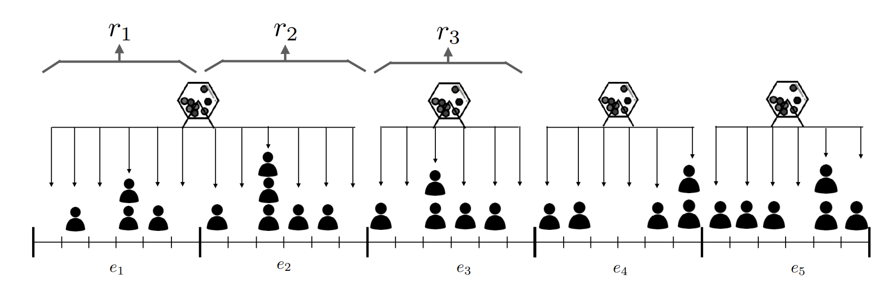

In the PoS (Proof of Stake) blockchain, randomness is crucial for fair and unpredictable allocation of validators' responsibilities. Computers cannot generate true random numbers as they are deterministic devices (the same input always produces the same output number). What people usually call random numbers on computers (for example, in game applications) are actually pseudo-random numbers, that is, they rely on enough random seeds provided by users or other types of oracle machine (such as Atmospheric noise, heart rate and even lava lights in weather stations), so as to generate a series of seemingly random numbers. However, given the same seed, the same sequence will always be generated.

Although these inputs may vary over time and space, it is impossible to achieve the same results across all nodes of a specific blockchain around the world. If nodes receives different inputs to construct a block, bifurcation will occur. The entropy of the real world is not suitable as a seed for blockchain randomness.

Currently, there are two main methods for blockchain randomness generation: [**RANDAO**](https://github.com/randao/randao#solutions) and [**Verifiable Random Function**](https://en.wikipedia.org/wiki/Verifiable_random_function) (VRF).

CESS uses VRF.

# Verifiable Random Function

VRF is a mathematical function that takes some input and generates a random number, along with a proof of authenticity that can be verified by anyone. Any challenger can verify this proof to ensure effective random number generation.

The VRF used by CESS is similar to the one used in [*Ouroboros Praos*](https://eprint.iacr.org/2017/573.pdf). Ouroboros randomness is safe for block production and works well for BABE. The difference is that the VRF of CESS does not rely on the central clock (where the problem become: whose central clock it is?), but rather relies on its past results to determine current and future results, and uses time slot numbers as clock simulators to estimate time.

# Working mechanism

Slot is a discrete time unit of 6 seconds length. Each slot can contain a block, but it may not. Slots make up an epoch - on CESS, 600 slots make up an epoch, which results in an epoch of 1 hours length.

In each slot, each validator 'throws the dice'. They execute the VRF function that takes the following as input:

- A "secret key" specifically used for rolling a dice.
- An epoch random number, which is the hash value of the block VRF value in the past 2 epoch (N-2), thus the past randomness affects the current pending randomness (N).
- The slot number

There are two output values: **RESULT** (the random value) and **PROOF** (proof of random values generation authenticity).

Then compare RESULT with the threshold defined in the protocol implementation (specifically, in the CESS Host). If the value is less than the threshold, the validator who throws the dice is a block production candidate for that time slot. The validator then attempts to produce a block and submit it to the network along with the previously obtained PROOF and RESULT. In VRF, each validator throws a dice and get a number for itself, compares it with a threshold, and produce a block when the random number falls below that threshold.

With such working style, some slots may have no validators as candidates for block production, as all validator candidates have thrown the dice with too high numbers and missed the threshold. We clarified in the [consensus section](consensus.md) how to solve this problem and ensure that the block time remains approximately constant.
