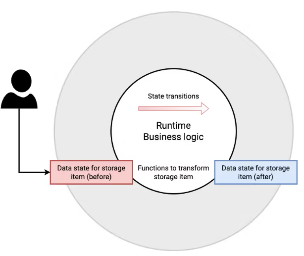

As the core part of Substrate, the runtime of a Substrate node contains all of the business logic for executing transactions, saving state transitions, and interacting with the outer node. Substrate provides all of the tools required to build common blockchain components so developers can focus on developing the runtime logic that defines the blockchain behavior.

# State Transitions and the Runtime

At the most basic level, every blockchain is essentially a ledger or record of each change that takes place on-chain. In Substrate-based chains, these changes to state are recorded in the runtime. Because the runtime handles this operation, the runtime is sometimes described as providing the state transition function.



Substrate runtime determines which transactions are valid and invalid and how the chain state is changed in response to transactions.

# Runtime Interfaces


As we know, the outer node is responsible for handling peer discovery, transaction pooling, block and transaction gossiping, consensus, and answering RPC calls from the outside world. These tasks frequently require the outer node to query the runtime for information or to provide information to the runtime. The runtime API facilitates this kind of communication between the outer node and the runtime.

In Substrate, `sp_api` crate provides an interface to implement a runtime API. It is designed to give you flexibility in defining your own custom interfaces using [`impl_runtime_apis`](https://paritytech.github.io/substrate/master/sp_api/macro.impl_runtime_apis.html) macro. However, every runtime must implement the [`Core`](https://paritytech.github.io/substrate/master/sp_api/trait.Core.html) and [`Metadata`](https://paritytech.github.io/substrate/master/sp_api/trait.Metadata.html) interfaces. In addition to these required interfaces, most Substrate nodes - like the node template - implement the following runtime interfaces:

- [`BlockBuilder`](https://paritytech.github.io/substrate/master/sp_block_builder/trait.BlockBuilder.html) for the functionality required to build a block.
- [`TaggedTransactionQueue`](https://paritytech.github.io/substrate/master/sp_transaction_pool/runtime_api/trait.TaggedTransactionQueue.html) for validating transactions.
- [`OffchainWorkerApi`](https://paritytech.github.io/substrate/master/sp_offchain/trait.OffchainWorkerApi.html) for enabling off-chain operations.
- [`AuraApi`](https://paritytech.github.io/substrate/master/sp_consensus_aura/trait.AuraApi.html) for block authoring and validation using a round-robin method of consensus.
- [`SessionKeys`](https://paritytech.github.io/substrate/master/sp_session/trait.SessionKeys.html) for generating and decoding session keys.
- [`GrandpaApi`](https://paritytech.github.io/substrate/master/sp_consensus_grandpa/trait.GrandpaApi.html) for block finalization into the runtime.
- [`AccountNonceApi`](https://paritytech.github.io/substrate/master/frame_system_rpc_runtime_api/trait.AccountNonceApi.html) for querying transaction indices.
- [`TransactionPaymentApi`](https://paritytech.github.io/substrate/master/pallet_transaction_payment_rpc_runtime_api/trait.TransactionPaymentApi.html) for querying information about transactions.
- [`Benchmark`](https://paritytech.github.io/substrate/master/frame_benchmarking/trait.Benchmark.html) for estimating and measuring execution time required to complete transactions.

# Core Primitives

Substrate also defines the core primitives that the runtime must implement. The Substrate framework makes minimal assumptions about what your runtime must provide to the other layers of Substrate. However, there are a few data types that must be defined and must fulfill a particular interface to work within the Substrate framework.

These core primitives are:

- `Hash`: A type which encodes a cryptographic digest of some data. Typically just a 256-bit quantity.
- `DigestItem`: A type which must be able to encode one of a number of "hard-wired" alternatives relevant to consensus and change-tracking as well as any number of "soft-coded" variants, relevant to specific modules within the runtime.
- `Digest`: A series of DigestItems. This encodes all information that is relevant for a light-client to have on hand within the block.
- `Extrinsic`: A type to represent a single piece of data external to the blockchain that is recognized by the blockchain. This typically involves one or more signatures, and some sort of encoded instructions (e.g. for transferring ownership of funds or calling into a smart contract).
- `Header`: A type which is representative (cryptographically or otherwise) of all information relevant to a block. It includes the parent hash, the storage root and the extrinsics trie root, the digest and a block number.
- `Block`: Essentially just a combination of Header and a series of Extrinsics, together with a specification of the hashing algorithm to be used.
- `BlockNumber`: A type which encodes the total number of ancestors any valid block has. Typically a 32-bit quantity.

# Adding Pallets to the Runtime

Developers can customize and build pallets to achieve the desired functionality. Substrate framework provides many predefined pallets, such as [**System Pallet**](https://paritytech.github.io/substrate/master/frame_system), [**Support Pallet**](https://paritytech.github.io/substrate/master/frame_support) and other foundational pallets, as well as some functionality-extending pallets, such as [**Contracts Pallet**](https://paritytech.github.io/substrate/master/pallet_contracts) that enable smart contract functionality, [**Balances Pallet**](https://paritytech.github.io/substrate/master/pallet_balances) that manage user balances, etc.

Add custom pallet or predefined pallets to the runtime within the [`construct_runtime!`](https://paritytech.github.io/substrate/master/frame_support/macro.construct_runtime.html) macro, as shown below:

```rust
construct_runtime!(
  pub enum Runtime where
    Block = Block,
    NodeBlock = opaque::Block,
    UncheckedExtrinsic = UncheckedExtrinsic
  {
    // Basic stuff
    System: frame_system = 0,
    RandomnessCollectiveFlip: pallet_randomness_collective_flip = 1,
    Timestamp: pallet_timestamp = 2,
    // -- snapped --

    // CESS pallets
    FileBank: pallet_file_bank = 60,
    TeeWorker: pallet_tee_worker = 61,
    Audit: pallet_audit = 62,
    Sminer: pallet_sminer = 63,
    StorageHandler: pallet_storage_handler = 64,
    SchedulerCredit: pallet_scheduler_credit = 65,
    Oss: pallet_oss = 66,
    Cacher: pallet_cacher = 67,
  }
)
```

CESS pallets starts from index **60**.

Their functions are:

- `FileBank`: Manages the meta information of files in the network, for both `idle` and `active` files.
- `TeeWorker`: TEEWorker is part of the CESS network, with a trusted environment responsible for calculating file tags and verification work. This pallet is responsible for managing TEEWorker information.
-  `Audit`: This pallet is responsible for checking whether files in the network are correctly stored, initiating challenges at unspecified period, collecting storage certificates, assigning verification tasks to storage certificates, and processing verification results.
- `Sminer`: Storage node is one of CESS node roles, responsible for storing user data and providing computing power for the network. This pallet manages the information of storage nodes and compute their rewards.
- `StorageHandler`: This pallet manages the storage and computing power of the network, and is responsible for information updating. It stores the current total idle space, active space, and space purchased by users on the network. It provides transaction interfaces for users to purchase, renew, and expand their storage space. It also allows user to query their storage space information through `Hooks`.
- `SchedulerCredit`: TEEWorker's credit module, providing an interface for other pallets to increase or decrease the credits of TEEWorker.
- `Oss`: **DeOSS** is part of the CESS network, providing users with convenient data upload services. This pallet is responsible for managing information related to DeOSS and providing external interfaces for user authorization or revocation of DeOSS. Click here to learn more about [DeOSS service](../../developer/guides/deoss.md).
- `Cache`: The pallet manages the cache of miners' information and the related cache orders.
