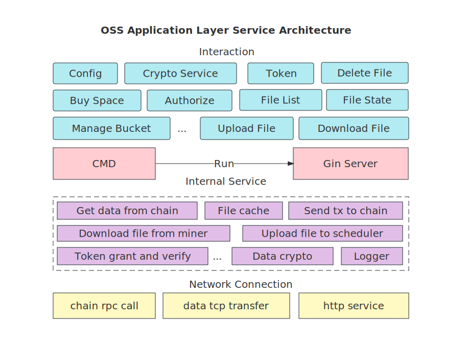

# DApp: DeOSS Architecture

## Service Interface Layer

The DeOSS service interface layer implements the modular encapsulation of common code libraries, so the application layer only needs to implement a few APIs to provide the complete object storage service. The DeOSS application layer service architecture is shown in Figure 2. DeOSS provides two application modes at the moment: the command line-based Go client mode and the Gin framework-based server mode. Both modes can be configured simply and started quickly. Users can also add a self-defined functional module interface flexibly without worrying about internal code implementation details.

## Application Layer

DeOSS application service has a three-layer architecture.

- The network connection layer provides the upper layer with basic services such as user interaction, data object transmission, and on-chain function call.
- The internal service layer handles user data files from the interaction layer. It provides pre-processing utilities such as data authentication, file slicing, replication, file declaration, etc., and submits the processed content to the scheduler. On the other hand, it is also responsible for processing the data from the chain node and the storage miner node.
- The interaction layer is responsible for the interaction between users and DeOSS to form a complete service loop.

In addition, DeOSS also provides data encryption and decryption, system logging, and other additional service support.
