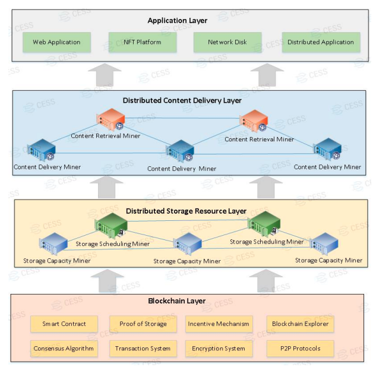
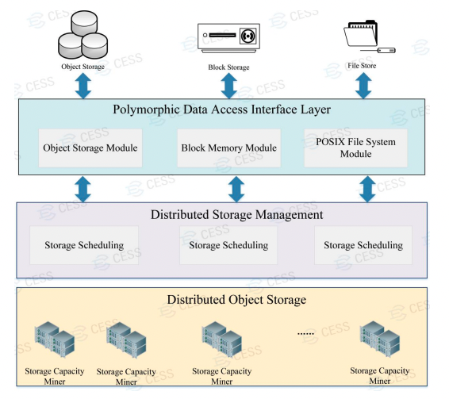
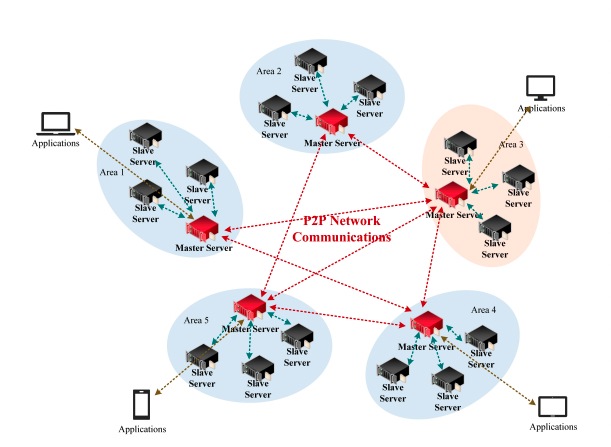
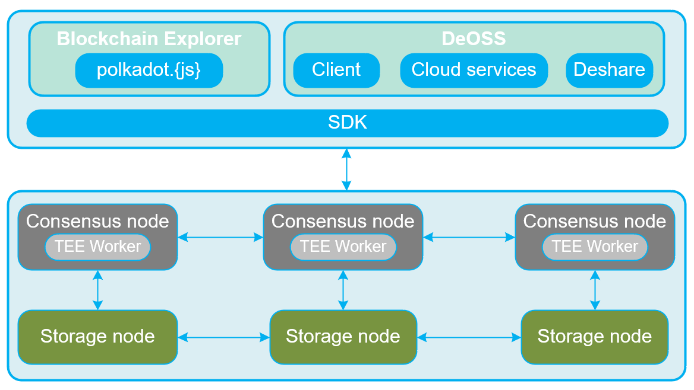

# Overall Architecture

CESS offers large-scale storage capacity, managing billions of data files with up to 100PB space, to meet enterprise level demands. At the same time, CESS provides data services including data rights confirmation and protection. Therefore, our platform not only provides expandable data storages for DAPPs, but also strongdata owner rights protection.

As shown below, CESS adopts a layered and loosely coupled system architecture, which is divided into **Blockchain Layer**, **Distributed Storage Resource Layer**, **Distributed Content Delivery Layer**, and **Application Layer**.

Among them, the blockchain layer provides blockchain service of the entire CESS network, including encouraging unused storage resources and computational resources to join the CESS network to provide data storage, data rights confirmation and other services for the application layer. The distributed storage resource layer uses virtualization technology to realize the integration and pooling of storage resources. The infrastructure here consists of storage capacity miners and storage scheduling miners. The distributed content delivery layer uses content caching technology to achieve fast delivery of stored data, which is composed of data index miners and data delivery miners. The application layer provides API/SDK tools for developer to access the underlying data storage service, blockchain service, network drive service, etc.

## Blockchain Layer

In addition to incentivize unused computing resources and storage resources to join the CESS storage network, it also provides efficient blockchain services. CESS proposes a novel Random Rotational Selection(R²S) consensus mechanism, together with asynchronous Byzantine consensus algorithm, as well as Turing's complete smart contract and cross-chain interoperability capability.

In fact this blockchain layer is further [analysed here](blockchain-layer-architecture.md).

## Distributed Storage Resource Layer

This is the most critical hardware infrastructure layer of the entire CESS network. It manages storage resources contributed by miners around the world, for example, unused or under-utilized servers/desktops/laptops, to build a massive-scale data storage network. This part is composed of storage scheduling nodes/miners and storage capacity nodes/miners. Storage scheduling nodes store meta-data and provide fast data indexing, while storage capacity nodes provide data storage space.

CESS is designed to build a blockchain-based distributed cloud storage system. The focus is on providing consistent and efficient distributed storage services to clients by effectively managing distributed resources using virtualization technology. CESS utilizes global resources and enables users to access the data network in undifferentiated manner through distributed identity information. In terms of implementation, CESS constructs two types of infrastructure nodes: distributed cloud storage nodes and distributed content delivery nodes. The distributed cloud storage network provides massive, reliable, and scalable cloud storage; while the distributed content delivery network delivers data according to user geographic locations for fast access.

### Distributed Cloud Storage Network

To meet different storage needs, we design and implement a polymorphic data storage access interface to provide storage services in the form of APIs for a variety of applications. As shown below, on top of the unified distributed object storage engine, the polymorphic data access service provides object storage, block storage and file system storage for
the upper application in a standard API way, providing a comprehensive and friendly data storage service support for the top application.

CESS provides an improved and reliable object storage service. Applications built on top call the object storage service interface. The object storage module automatically completes the mapping of the user object storage space to the lower unified distributed object storage space. User data is stored in the distributed object storage engine as object data. CESS will provide the block device storage service. The users’ data on the block device is stored in the distributed object storage engine as object data, supporting snapshot, cloning, and other functions.

### Distributed Content Delivery Network

In order to achieve efficient file access, the system effectively combines the advantages of both CDN and P2P technologies. By forming a content delivery network layer, it effectively reduces the number of proxy servers required by the system, increases the capacity of the system, reduces the overall cost, and uses CDN technology to transfer media content to the client's autonomous domain. The presence of a high-performance cache proxy server also avoids the "seed" problem in pure P2P networks.

At the same time, on the application side, the stored content in the application will be published on the publishing source node first, and the download service will be continuously provided if the source node is not offline. However, as the number of user downloads from the same source node increases, the bandwidth of that node will be exhausted and the download speed per user will be reduced. With the design of a content delivery network, a large number of tenant
nodes in the network begin to save and provide downloads of the same content. As a result, users can download content from multiple nodes, which greatly improves the user experience.

The overall design of the CDN Layer is perfectly combined with blockchain technology. Storage nodes form CDNs with proxy nodes in each region. Proxy nodes form a relatively independent P2P network with the following storage nodes without public network IP. Node contribution awards are issued through smart contracts, forming an autonomous
network for development, as shown in the following diagram.

## Application Layer

Currently we have the following dApp supported by our team:

- **DeOSS**: its technical architecture is further explored in [this article](dapp-deoss-architecture.md).

We welcome other teams to leverage on the advantage of CESS solution and integrate CESS into their products.

# Logical Architecture

On the other hand, CESS can be viewed to have the following logical structure.

As shown in the following diagram, the logical architecture consists of two main components: one is the core functional system of the CESS network, composed mainly of consensus nodes and storage nodes; the other are the applications built in the CESS ecosystem, including the CESS blockchain explorer and decentralized object storage service, which includes  applications such as client, cloud service, gateway, Deshare, and possibly many more.

- *Consensus Node*: Primarily responsible for consensus mechanism, transaction execution, block generation and validation in the CESS network.
- *TEE Worker*: Primarily responsible for data labeling, generating verifiable and unique idle data for space verification.
- *Storage Node*: Primarily responsible for providing space, storing data, and computing proofs.
- *SDK*: Development tools provided to developers for interacting with the CESS network.
- *CESS Explorer*: A visualization interface that displays block information, transaction details, computing power information, account information, etc.
- *Applications*: Currently this includes Decentralized Object Storage Service (DeOSS), object storage service offered on CESS network.

