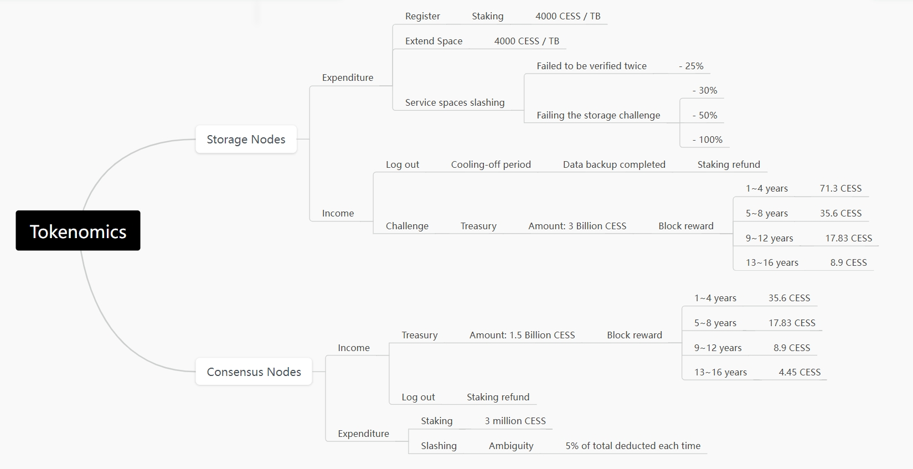

Referring back to CESS overall tokenomics as below:

# Reward

In the first year, a total of **238,500,000 tokens** are issued, and they are distributed evenly throughout the year in each era. The total rewards decrease in a stepwise manner each year, with an annual decay rate of 0.841 (0.5^(1/4)), resulting in a halving of rewards every four years.

For each era (which lasts 24 hours in CESS), miners receive rewards in proportion to the era points they have collected. Era points are obtained through the following:

- Authoring non-uncle blocks.
- Authoring references to previously unreferenced uncle blocks.
- Authoring referenced uncle blocks.


Uncle blocks are relay chain blocks that are valid in all aspects but fail to become the main blocks. This occurs when two or more validators become block producers in the same slot, and one validator's block arrives at the next block producer before the other blocks. We refer to these lagging blocks as uncle blocks.


Rewards are distributed at the end of each era. Regardless of the amount staked by miners, block production rewards are generally distributed evenly among all miners. However, the rewards for specific miners may differ based on era points, as mentioned above. While earning era points has a probabilistic component and may be slightly influenced by factors such as network connectivity, well-performing miners should typically have a similar total sum of era points over a large number of eras.

Miners can also receive "tips" from transaction senders as an incentive for including their transactions in the blocks they produce. Miners receive 100% of these tips directly.

# Slashing

## No Response

If a validator fails to produce any blocks and does not send a heartbeat signal during an era, it will be reported as "no response". Depending on the number of repeated violations and the no response or offline status of other validators during that era, reduction penalties may be imposed.

Validators should have a robust network infrastructure to ensure node operation and reduce the risk of reduction or cooldown. It is advisable to have high availability setups and backup nodes that are only activated after the original node is verified as offline (to avoid double signing and potential ambiguity that could lead to reduction penalties, see below).

The formula for calculating the penalty due to no response is as follows:

**Let x = number of offenders, n = total no. of validators in the active set**

$$\boxed{min (\cfrac{3 * (x - (\frac{n}{10} + 1))}{n}, 1) * 0.07}$$

## Ambiguity

Both GRANDPA and BABE ambiguities use the same formula to calculate the penalties:

- **GRANDPA Ambiguity**: Validators signing two or more votes for different chains in the same round.
- **BABE Ambiguity**: Validators producing two or more blocks in the same slot.

**Let x = number of offenders, n = total no. of validators in the active set**

$$\boxed{min((\cfrac{3 * x}{n})^2, 1)}$$

Miners can run nodes on multiple computers to ensure that they can continue their validation work even if one of the nodes fails. However, mining operators should exercise caution when setting up these nodes. If they do not coordinate well in managing the signing machines, ambiguities may occur, and the penalty rate for ambiguous violations is higher than that for similar offline violations.

If a validator is reported for any violation, it will be removed (cooled down) from the validator set and will not receive rewards during its absence. It will be immediately considered inactive and will need to re-state its validation intent.
