## System Requirement

If you're planning to run a consensus miner, it's important to make sure your system meets the recommended requirements to ensure that your miner performs at its best.

| Resource                      | Specification               |
| ----------------------------- | --------------------------- |
| Recommended OS                | Ubuntu\_x64 20.04 or higher |
| # of CPU Cores                | ≥ 4                         |
| Intel SGX Enabled             | required                    |
| Memory (SGX encrypted memory) | ≥ 64 GB                     |
| Bandwidth                     | ≥ 5 Mbps                    |
| Public Network IP             | required                    |
| Linux Kernel Version          | 5.11 or higher              |



### Enabled Intel SGX

For a system to support **Intel Software Guard Extensions** ([Intel SGX](https://www.intel.com/content/www/us/en/architecture-and-technology/software-guard-extensions.html)) and **Flexible Launch Control** (FLC), it needs a CPU that supports these features. The CPU should be either Intel ME, Intel SPS, or both Intel SPS and Intel ME. Additionally, the BIOS must support Intel SGX and the SGX option must be enabled. To enable SGX functionality, please refer to the server manufacturer's BIOS guide. You can also check out the [list of CPU models that support SGX](https://ark.intel.com/content/www/us/en/ark/search/featurefilter.html?productType=873&2_SoftwareGuardExtensions=Yes) to ensure your system supports Intel SGX.

- CPU Recommended Models: Intel E, E3, Celeron (some models), Core series CPUs, with Intel Core i5-10500 being the optimal choice.
- Recommended Motherboard BIOS: Preferred options include mainstream manufacturers such as Supermicro.

### Static Public IP

The server requires a static public IP. Please ensure that the IP address is accessible and not behind a NAT. Run the following command to confirm your public IP.

```bash
curl -4 ifconfig.co
```



## Prepare CESS Wallet Accounts

Before setting up your CESS wallet accounts, you must select the type of consensus miner you would like to run.

Starting from version **CESS v0.7.6**, users can select the consensus miner's operational capacity. Depending on the type of operational capacity the work load of TEE differs.

- **Full**: A full node is a type of node that has all the necessary functions to operate as a fully-capable consensus miner. This includes generating random challenges, verifying data, computing tags, and generating and replacing space holder data, etc. Moreover, these nodes participate in the network consensus. To register as a full node, **binding to consensus nodes** is required.

- **Verifier**: Verifier nodes also participate in netowrk consensus and handles random challenges for idle and service data. These nodes are also required to **bound to consensus nodes** for registration.

- **Marker**: These nodes are called Markers, and their role is to compute tags for the user's data, also known as service data. They are also responsible for creating, verifying, and replacing idle data segments. These nodes can be registered independently and serve a designated storage node cluster. **It's important to note that operating the consensus node in this capacity does not increase reputation points**.

To run the consensus miner in both `Full` and `Verifier` operational capacities, you need two separate accounts.

- **Stash Account**: This is the account where you keep all the funds you want to stake. This account requires at least 3,000,000 TCESS for staking it can be either from the node owner itself or delegated by other users.

- **Controller Account**: This account is required to pay gas fees for staking-related transactions and registration.

The **Stash Account** is used to **bond/unbond** your funds and to choose which address will be the **Controller Account**. The Controller Account is used to take actions on behalf of the bonded funds. However, the Controller Account can't move the bonded funds out of the Stash Account.


Running consensus miner as a `Marker` requires only one account and does not require to perform the **Binding Founds** operation described below.

Also if you already have a stash account or would like to use someone else's stash account you do not need to perform the **Binding Funds** operation.


You can also refer to the artcle [Creating CESS Accounts](../community/cess-account.md) for creating a CESS account.

You can either use [CESS testnet faucet](https://cess.cloud/faucet.html) to get TCESS, or [contact us](../introduction/contact.md) to receive TCESS tokens for staking.

After the wallet account is created, navigate to [CESS Explorer](https://testnet.cess.cloud/).

## Binding Funds


_As of CESS v0.7.6, the controller account has been removed from the binding fund operation._


Open [CESS Explorer](https://testnet.cess.cloud/) and Select **Network** > **Staking** > **Accounts** > **Stash**

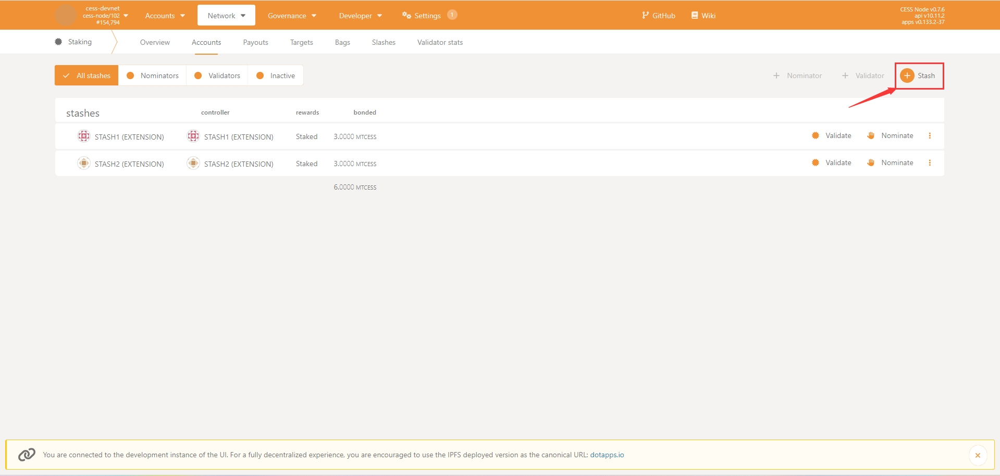

Select the appropriate _stash account_ from the drop down menu and enter at least **3,000,000** TCESS in _value bounded_ field. In _payment destination_, select  **Stash Account as the reward receiving account (do not increase the amount at stake)**, which means that mining income will not be automatically added to the stake.

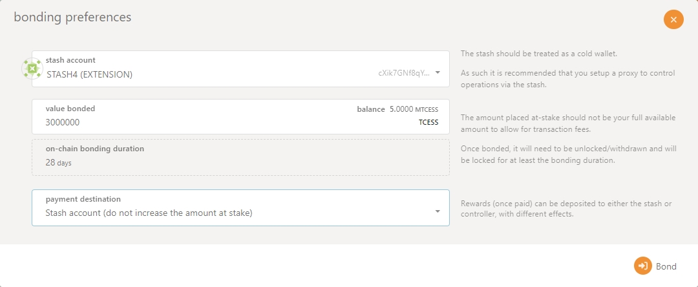

Click **Bond** -> **Sign and Submit** to link the Stash Account.

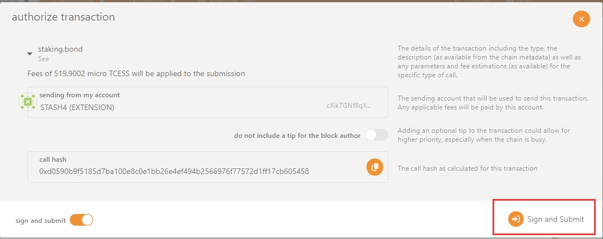

Fund is bonded successfully!

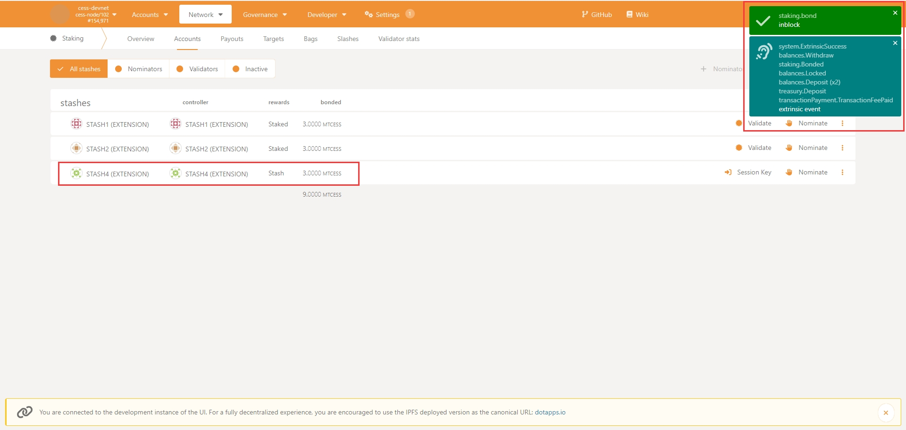

## Install CESS Client

The `cess-nodeadm` is a CESS node deployment and management tool. It helps deploying and managing storage nodes, consensus nodes, and full nodes, simplifying the devOps for all CESS miners.

```bash
wget https://github.com/CESSProject/cess-nodeadm/archive/refs/tags/v0.5.5.tar.gz
tar -xvf v0.5.5.tar.gz
cd cess-nodeadm-0.5.5
sudo ./install.sh
```


You can verify that you are running the latest version of [cess-nodeadm here](https://github.com/CESSProject/cess-nodeadm/releases).


On successful installation of cess-nodeadm you will see `Install cess nodeadm success` message.

If the installation fails, please check the [troubleshooting procedures](../storage-miner/troubleshooting.md).

## Configure CESS Client

Execute:

```bash
sudo cess config set
```

The following is an operational example of running the miner in the `Full` capacity mode:

*Tips: You can press Enter to skip when the default value of 'current' is suitable*

```bash
Enter cess node mode from 'authority/storage/rpcnode' (current: authority, press enter to skip): authority
```

If you select the "authority" option, the Intel SGX driver on your device will be initiated in software mode. You might encounter a notification that reads "Software enable has been set. Please reboot your system to finish enabling Intel SGX." Therefore, it is recommended that you restart your device after completing the configuration and before moving on to the next steps.

You will see the follwing message printed on the screen.

``` bash
Begin install sgx_enable ...
Reading package lists... Done
Building dependency tree... Done
Reading state information... Done
0 upgraded, 0 newly installed, 0 to remove and 23 not upgraded.
sgx_enable install successful
Intel SGX is already enabled on this system
```

Give your node a `name` then you can either enter `CESS chain ws url` or leave it as default.

```bash
Enter cess node name (current: cess, press enter to skip): cess
Enter cess chain ws url (default: ws://cess-chain:9944):
```

The next prompt you will asked to set the TEE worker port. You can either set a custom port or leave it as default. Once the port is set the public IP of the system is automaticallt detected. In case you find that the public ip is incorrect you can enter it manually. Instead or IP you can also use your domain name here.

```bash
Enter the public port for TEE worker (current: 19999, press enter to skip):
Start configuring the endpoint to access TEE worker from the Internet
  Try to get your external IP ...
Enter the TEE worker endpoint (current: http://xx.xxx.xx.xx:19999, press enter to skip)
```

Next, you will need to enter the CESS validator stash account address. When `current` is set to `null`, this means that it is empty. You can simply press enter to skip if you would like to run your consensus miner in **`Marker`** mode. We will enter a stash address as we will run our node in **`Full`** mode.

```bash
Enter cess validator stash account (current: null, press enter to skip): cXic3WhctsJ9cExmjE9vog49xaLuVbDLcFi2odeEnvV5Sbq4f
```

Enter Full to run the node in **`Full`** mode. Then enter your CESS Controller account mnemonic phrase.

```bash
Enter what kind of tee worker would you want to be [Full/Verifier]: Full
Enter cess validator controller phrase: xxxxxxxxxxxxxx
```

Lastly, you will see the following messages printed on the screen which downloads all the required docker images.

```bash
Set configurations successfully
Start generate configurations and docker compose file
Unable to find image 'cesslab/config-gen:testnet' locally
testnet: Pulling from cesslab/config-gen
7264a8db6415: Pull complete 
eee371b9ce3f: Pull complete 
93b3025fe103: Pull complete 
d9059661ce70: Pull complete 
45f3da3bc313: Pull complete 
d4758bd5aaf9: Pull complete 
e205f8927d12: Pull complete 
0bc1d94251ef: Pull complete 
5a1ea37daadf: Pull complete 
a8485f413033: Pull complete 
Digest: sha256:07808904b7fb5bf097b21f06739f7623d9e6be2d94c179aff05fcde9df87a012
Status: Downloaded newer image for cesslab/config-gen:testnet
debug: Loading config file: config.yaml
info: Generating configurations done
info: Generating docker compose file done
dbb2a522283b052e20cb8b59109a00f43f678158a9a43f2f663994d8230a26be
Configurations generated at: /opt/cess/nodeadm/build
```


It is very important to fill in the correct TEE Worker server address while you configure the endpoint. If you would like to know more about TEE Worker, please refer to the [node role introduction](../concepts/node-roles.md).


If the configuration process fails, please refer to the [troubleshooting guideline](../storage-miner/troubleshooting.md).

## Managing Validator

### Becoming a Validator

1. Start the consensus node

    ```bash
    cess start
    ```

2. Generate a session key

    ```bash
    cess tools rotate-keys
    ```

    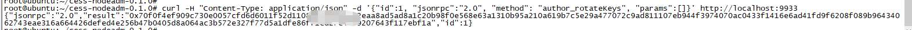

    The field in the quotation marks after "result" is the Session Key, which will be used in subsequent operations. "localhost:9933" is the default port.

3. Setup a session key

    Navigate to [CESS Explorer](https://testnet.cess.cloud), choose **Network** > **Staking** > **Accounts** > **Session Key**

    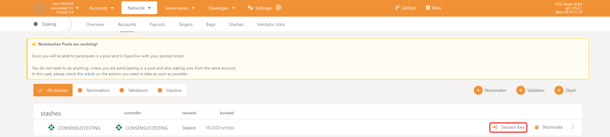

    Fill in the **Session Key** in the red box

    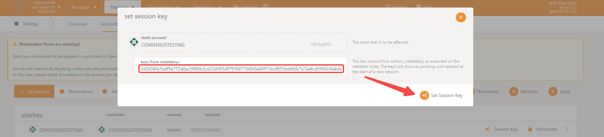

    Click **Sign and Submit**

    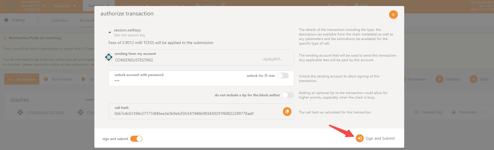

4. Becoming a validator

    Navigate to [CESS Explorer](https://testnet.cess.cloud), click **Network** > **Staking** > **Accounts** > **Validate**

    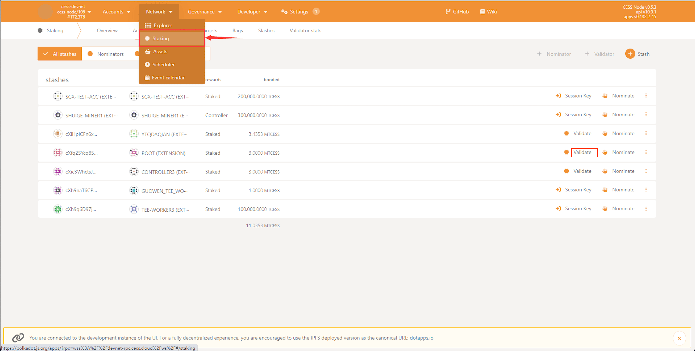

    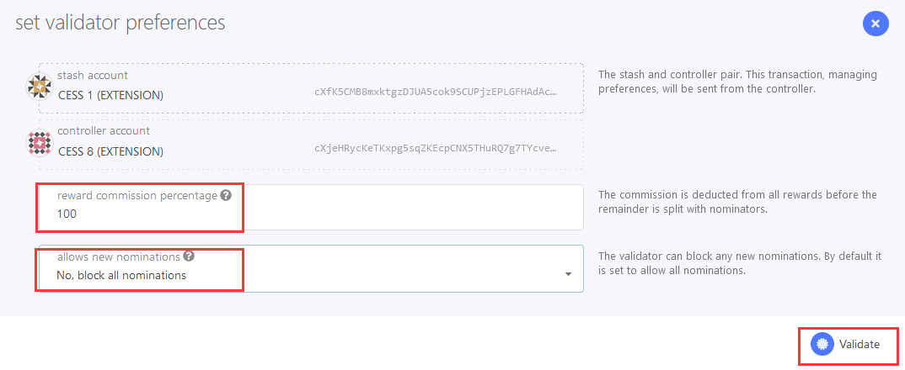

    Enter **100** in _reward commission percentage_, indicating that the reward will not be distributed to others.

    Select **No, block all nominations** in _allows new nominations_ dropdown, indicating that no nominations will be accepted.

    Again, click **Sign and Submit**.

    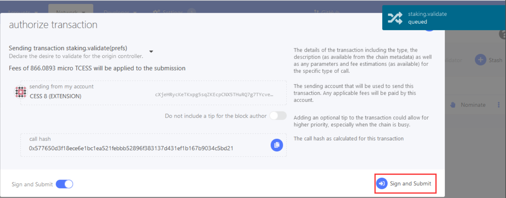

    After completing the steps above, open the [CESS Explorer](https://testnet.cess.cloud/) and click **Network** > **Staking** > **Waiting**.

    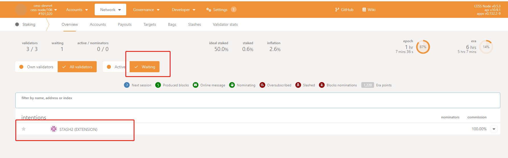

    You should see that the node has already appeared on the candidate node list.

### Redeeming Rewards

Navigate to CESS Explorer: **Network** > **Staking** > **Payouts** > **Payout**.

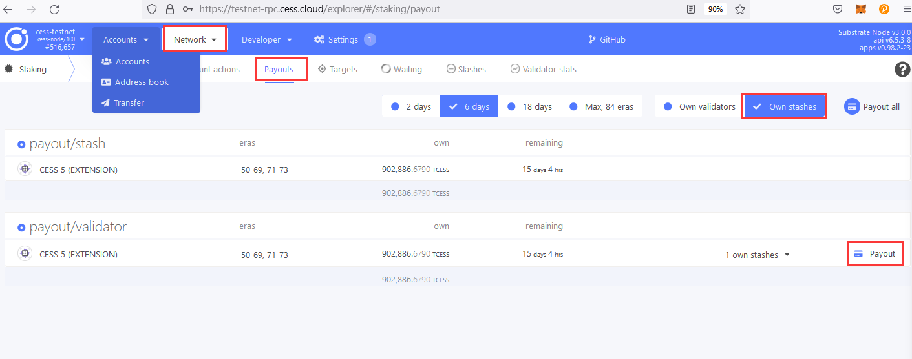

In Payouts, click **Payout** to initiate a payment. Any account can initiate a payment.

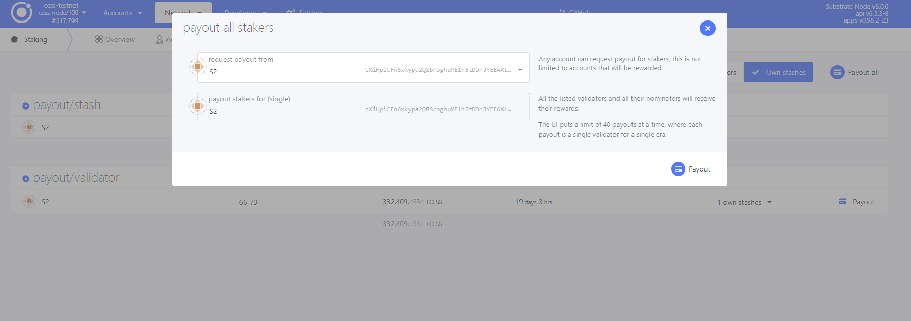


Please claim the reward within 84 era (each era of the test network is 24 hours), which is 84 days. Those who hasn't claimed the reward in this period will not be able to claim it.


### Exiting Consensus from Validation

1. Stop the Consensus

    In [CESS Explorer](https://testnet.cess.cloud), navigate to: **Network > Staking > Account Actions > Stop**.

    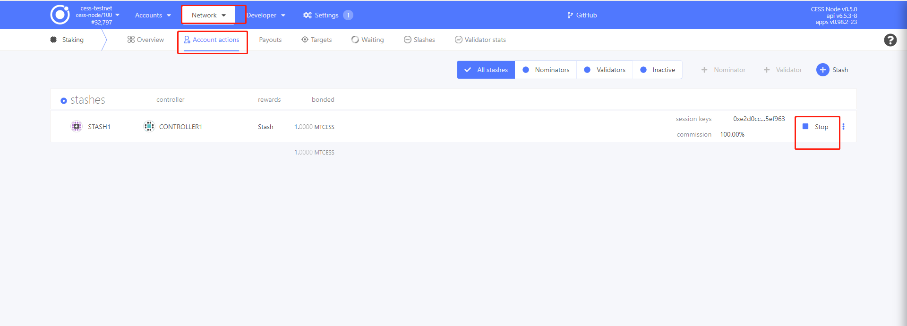

2. Clear Session Keys

    In [CESS Explorer](https://testnet.cess.cloud), navigate to: **Developer -> Submission**

    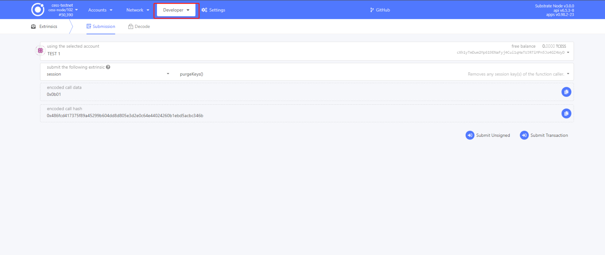

    Enter controller account in _using the selected account controller_. Then in _submit the following extrinsic_, enter **session** and choose **purgeKeys()** in the box next to it.

    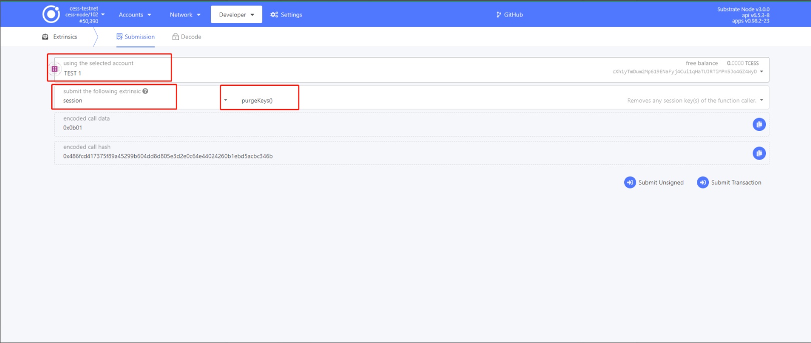

    Click **Submit Transaction** button to clear session keys

    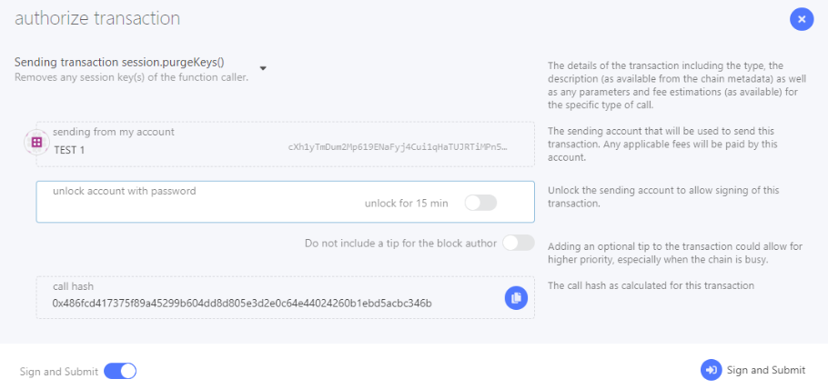

### Redeeming Stake

1. Unbond fund

    After 28 eras (each era of the test network is 24 hours), goto [CESS Explorer](https://testnet.cess.cloud/), navigate to: **Network > Staking > Account Actions > Unbond Funds**.

    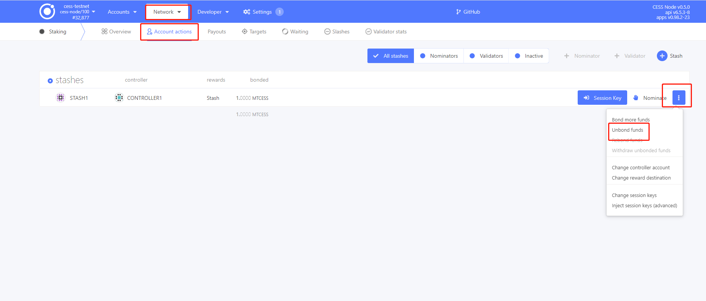

2. Stop the CESS client

    ```bash
    cess stop
    ```

## Common Operations

### Start Consensus Node

```bash
cess start
```

### Query Miner Status

```bash
$ cess status

-----------------------------------------
 NAMES           STATUS
cifrost         Up 2 minutes
ceseal          Up 2 minutes
chain           Up 2 minutes
watchtower      Up 2 minutes
-----------------------------------------
```

### Examine Config Information

```bash
cess config show
```

## Upgrade CESS Client

### Stop and Remove All Services

```bash
cess stop
cess down
```

### Remove All Chain Data


Do not perform this operation unless the CESS network has been redeployed and it is confirmed that the data can be cleared.


```bash
cess purge
```

### Update `cess-nodeadm`

```bash
wget https://github.com/CESSProject/cess-nodeadm/archive/refs/tags/<new-version>.tar.gz
tar -xvf <new-version>.tar.gz
cd cess-nodeadm-<new-version>
./install.sh --skip-dep
```

Currently [the most updated version](https://github.com/CESSProject/cess-nodeadm/tags) is **v0.5.5**.

### Pull Images

```bash
cess pullimg
```

## Questions & Answers

1. I don't want to expose my IP address on the chain. What should I do?

   During the cess config set process, you can set your endpoint with a domain name. For example, if your registered domain is tee-xxx.cess.cloud, you can enter <http://tee-xxx.cess.cloud> when setting the endpoint. The script will then ask you if you want to enable one-click domain proxy. You can enter y to enable it, as shown below:

   ```bash
   .....
   Enter the kaleido endpoint (current: http://tee-xxx.cess.cloud, press enter to skip): http://tee-xxx.cess.cloud
   Do you need to configure a domain name proxy with one click? (y/n): y
   .....
   ```

   Alternatively, you can manually configure an nginx proxy. Please avoid using the intermediate proxy provided by the domain service provider.

2. How do I know if the program is working properly?

   You can select Chain State in the block explorer. Through this method, you can check whether the registration was successful.

   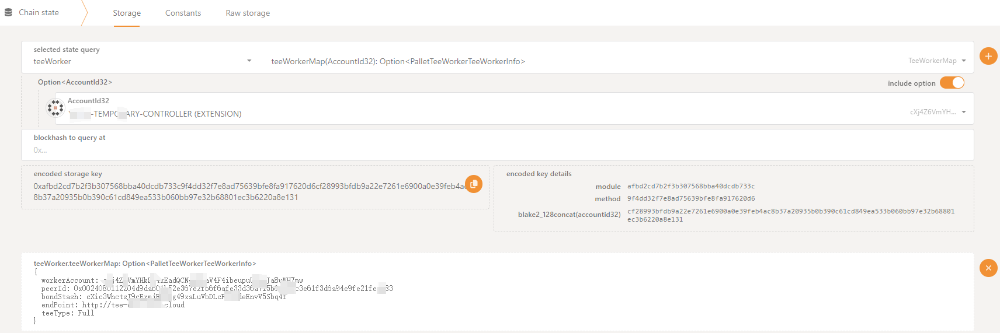

3. I don't want the program to update automatically. What should I do?

   After the program has started successfully, a watchtower service will manage local services on behalf of the user. When the CESS official updates a component, the watchtower will pull the latest program for automatic upgrading. If you don't want to use the automatic upgrade feature, you can disable it with the following command before the cess config set.

   ```bash
   ## Disable the update of the ceseal service.
   cess tools no_watchs ceseal

   ## Disable the update of the cifrost service.
   cess tools no_watchs cifrost
   ```

   Every automatic upgrade from you means a bug fix for the consensus miner program by the official, and we **strongly discourage** you from turning off the automatic upgrade feature, as this may render your service **unusable**.
