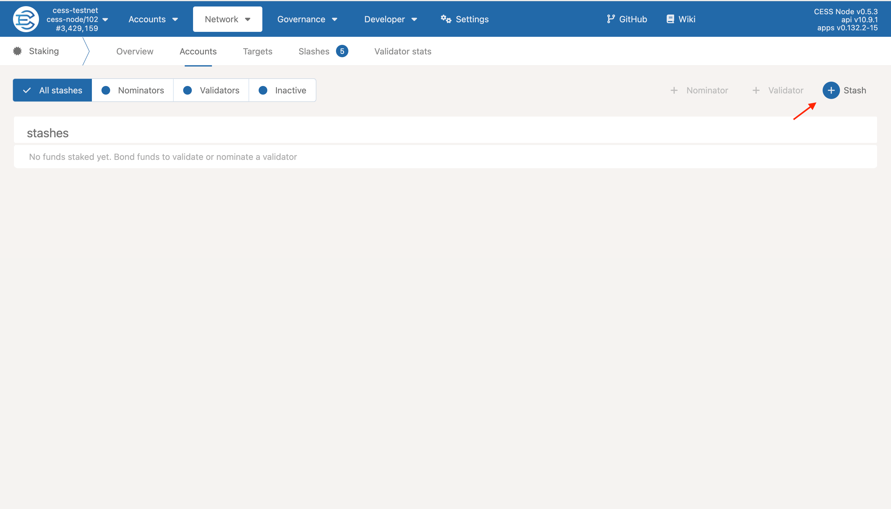
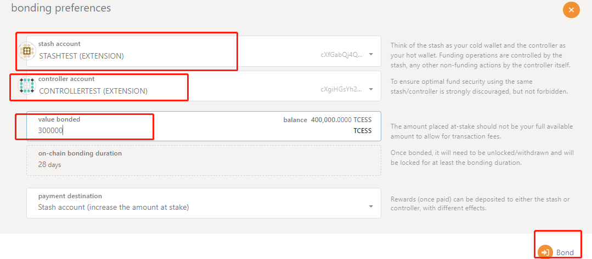
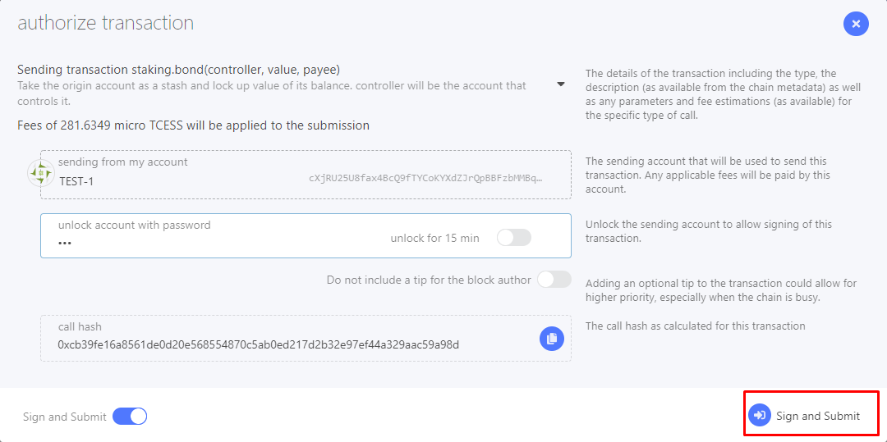
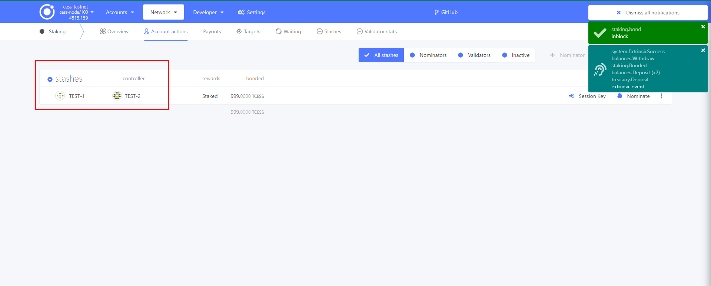

# Server Requirement

The recommended requirement of a consensus server:

| Resource                      | Specification               |
| ----------------------------- | --------------------------- |
| Recommended OS                | Ubuntu\_x64 20.04 or higher |
| # of CPU Cores                | ≥ 4                         |
| Intel SGX Enabled             | required                    |
| Memory (SGX encrypted memory) | ≥ 64 GB                     |
| Bandwidth                     | ≥ 5 Mbps                    |
| Public Network IP             | required                    |
| Linux Kernel Version          | 5.11 or higher              |


### SGX Enabled

The CPU must support [Intel Software Guard Extensions](https://www.intel.com/content/www/us/en/architecture-and-technology/software-guard-extensions.html) (Intel SGX) technology and Flexible Launch Control (FLC). The BIOS must support Intel SGX, and must enable the Intel SGX option. Please refer to the server manufacturer's BIOS guide to enable SGX functionality. Check out [CPU models that support SGX](https://ark.intel.com/content/www/us/en/ark/search/featurefilter.html?productType=873&2_SoftwareGuardExtensions=Yes). They can be either _Intel ME_, _Intel SPS_, or _both Intel SPS and Intel ME_.

### Fixed Public IP

The machine must use a fixed public network IP. The traffic exit must be in the same network segment as the IP. Execute the following command to confirm they are in the same network segment.

```bash
curl ifconfig.co
```


# Prepare CESS Account

Running storage validator needs two accounts.

- **Stash Account**: Requires at least staking 300,000 TCESS, either from the node owner or delegated by other users, to run a consensus validator.
- **Controller Account**: Requires at least 100 TCESS for paying gas fee.

Please refer to the artcle [Creating CESS Accounts](../community/cess-account.md) for creating a CESS account, goto [CESS testnet faucet](https://cess.cloud/faucet.html) to get TCESS, or [contact us](../introduction/contact.md) to receive TCESS tokens for staking.

After the wallet account is created, navigate to [CESS Explorer](https://testnet.cess.cloud/).

## Bond Fund for Stash

Choose **Network**, click **Staking** > **Accounts** > **Stash**



Select both **Stash Account** and **Controller Account**.

Value bonded: 300,000 TCESS is recommended. In _payment destination_, select the second option **Stash Account as the reward receiving account (do not increase the amount at stake)**, which means that mining income will not automatically added to staking.



Click **Bond** -> **Sign and Submit** to link Stash Account and Controller Account



Fund is bonded successfully!



# Install CESS Client

The `cess-nodeadm` is a CESS node deployment and management program. It helps deploying and managing storage nodes, consensus nodes, and full nodes, simplifying the devOps for all CESS miners.

```bash
wget https://github.com/CESSProject/cess-nodeadm/archive/v0.4.4.tar.gz
tar -xvf v0.4.4.tar.gz
cd cess-nodeadm-0.4.4
sudo ./install.sh
```


Check that you are using [the most updated version](https://github.com/CESSProject/cess-nodeadm/tags) of `cess-nodeadm`. Currently it is **v0.4.4**.


If a message `Install cess nodeadm success` shows up, the installation is successful.

If the installation fails, please check the [troubleshooting procedures](../storage-miner/troubleshooting.md).

# Config CESS Client

Run:

```bash
cess config set
```

You should see output similar to the following:

```bash
Enter cess node mode from 'authority/storage/watcher' (current: authority, press enter to skip):
Enter cess node name (current: cess, press enter to skip):
Enter external ip for the machine (current: xxx.., press enter to skip):
Enter cess chain ws url (current:ws://172.18.0.9:9944, press enter to skip):
Enter cess scheduler stash account (current: xxx.., press enter to skip):
Enter cess scheduler controller phrase (current: xxx.., press enter to skip):
Set configurations successfully

Intel SGX is already enabled on this system
Start generate configurations and docker compose file
debug: Loading config file: config.yaml
info: Generating configurations done
info: Generating docker compose file done
57ea8c914461c3184ddb......
Configurations generated at: /opt/cess/nodeadm/build
try pull images, node mode: authority
download image: cesslab/cess-chain:latest
latest: Pulling from cesslab/cess-chain
3b65ec22a9e9: Already exists
6e4a9a61f489: Pull complete
Digest: sha256:5652dce2bd28796......
Status: Downloaded newer image for cesslab/cess-chain:latest
docker.io/cesslab/cess-chain:latest
download image: cesslab/kaleido:latest
latest: Pulling from cesslab/kaleido
Digest: sha256:49899acaafd11982......
Status: Image is up to date for cesslab/kaleido:latest
docker.io/cesslab/kaleido:latest
download image: cesslab/kaleido-rotator:latest
latest: Pulling from cesslab/kaleido-rotator
Digest: sha256:42535077af6bf......
Status: Image is up to date for cesslab/kaleido-rotator:latest
docker.io/cesslab/kaleido-rotator:latest
download image: cesslab/kaleido-kafka:latest
latest: Pulling from cesslab/kaleido-kafka
Digest: sha256:29ed986ea......
Status: Image is up to date for cesslab/kaleido-kafka:latest
docker.io/cesslab/kaleido-kafka:latest
pull images finished
```

If the configuration process fails, please refer to the [troubleshooting guideline](../storage-miner/troubleshooting.md).

# Manage Validator Life Cycle

## Becoming a Validator

1. Start the consensus node<br/>

    ```bash
    cess start
    ```
2. Generate a session key<br/>

    ```bash
    cess tools rotate-keys
    ```

    

    The field in the quotation marks after "result" is the Session Key, which will be used in subsequent operations. "localhost:9933" is the default port.<br/>


3. Setup a session key<br/>

    Navigate to [CESS Explorer](https://testnet.cess.cloud), choose **Network** > **Staking** > **Accounts** > **Session Key**<br/>

    

    Fill in the **Session Key** in the red box<br/>

    

    Click **Sign and Submit**<br/>

    

4. Becoming a validator<br/>

    Navigate to [CESS Explorer](https://testnet.cess.cloud), click **Network** > **Staking** > **Accounts** > **Validate**<br/>

    

    

    Enter **100** in _reward commission percentage_, indicating that the reward will not be distributed to others.<br/>

    Select **No, block all nominations** in _allows new nominations_ dropdown, indicating that no nominations will be accepted.<br/>

    Again, click **Sign and Submit**.<br/>

    

    After completing the steps above, open the [CESS Explorer](https://testnet.cess.cloud/) and click **Network** > **Staking** > **Waiting**.<br/>

    

    You should see that the node has already appeared on the candidate node list.

## Redeeming Rewards

Navigate to CESS Explorer: **Network** > **Staking** > **Payouts** > **Payout**.


In Payouts, click **Payout** to initiate a payment. Any account can initiate a payment.



Please claim the reward within 84 era (each era of the test network is 24 hours), which is 84 days. Those who hasn't claimed the reward in this period will not be able to claim it.


## Exiting Consensus Validation

1. Stop the Consensus<br/>

    In [CESS Explorer](https://testnet.cess.cloud), navigate to: **Network > Staking > Account Actions > Stop**.<br/>

    

2. Clear Session Keys<br/>

    In [CESS Explorer](https://testnet.cess.cloud), navigate to: **Developer -> Submission**<br/>

    

    Enter controller account in _using the selected account controller_. Then in _submit the following extrinsic_, enter **session** and choose **purgeKeys()** in the box next to it.<br/>

    

    Click **Submit Transaction** button to clear session keys<br/>

    

## Redeeming the Stake

1. Unbond fund<br/>

    After 28 eras (each era of the test network is 24 hours), goto [CESS Explorer](https://testnet.cess.cloud/), navigate to: **Network > Staking > Account Actions > Unbond Funds**.<br/>

    

2. Stop the CESS client<br/>

    ```bash
    cess stop
    ```

# Common Operations

## Start Consensus Node

```bash
cess start
```

## Query Miner Status

```bash
$ cess status

-----------------------------------------
 NAMES           STATUS
kld-agent       Up 2 minutes
kld-sgx         Up 2 minutes
kaleido-kafka   Up 2 minutes
chain           Up 2 minutes
watchtower      Up 2 minutes
-----------------------------------------
```

## Examine Config Information

```bash
cess config show
```

## Stop and Remove All Services

```bash
cess down
```

# Upgrade CESS Client

## Stop and Remove All Services

```bash
cess stop
cess down
```

## Remove All Chain Data


Do not perform this operation unless the CESS network has been redeployed and it is confirmed that the data can be cleared.


```bash
cess purge
```

## Update `cess-nodeadm`

```bash
wget https://github.com/CESSProject/cess-nodeadm/archive/<new-version>.tar.gz
tar -xvf <new-version>.tar.gz
cd cess-nodeadm-<new-version>
./install.sh --skip-dep
```

Currently [the most updated version](https://github.com/CESSProject/cess-nodeadm/tags) is **v0.4.4**.

## Pull Images

```bash
cess pullimg
```
