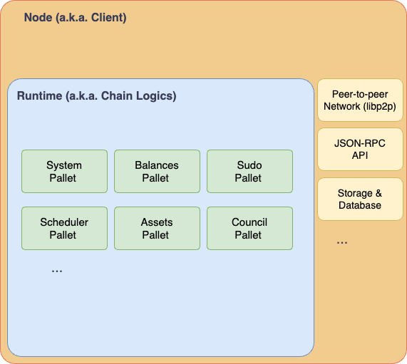

# Before We Start

In this section, we will give a mid-level description of the source code and architecture of the CESS blockchain. It mainly revolves around the repository [**CESSProject/cess**](https://github.com/CESSProject/cess). A "mid-level" description here means it has more details than just a high-level description. Some parts of the documentation should be read with the source code open next to it. You will understand how different modules are connected, but it is not so low-level that we go through the source code line by line. You don't need the knowledge on this page to use CESS products, but if you are a developer and want to gain a deeper understanding of how CESS blockchain works, this section is for you.

# Overview

CESS blockchain is built on top of Substrate framework developed by Parity. So, we adopt a similar architecture as a Substrate-based blockchain, depicted as the following.



In the outer layer, there is a Node (a.k.a the Client). It contains all the low-level building blocks of a blockchain, such as the peer-to-peer network component, JSON-RPC API component that interfaces externally, and the storage and database system component.

Then, inside the node, there is a **Runtime**, where the chain logic happens. This is where user accounts are recognized and their balances are stored. Substrate-based blockchains also have a comprehensive governance mechanism of raising proposals and passing them through a referendum or a council. These functionalities are specified in the chain runtime.

As complicated as it sounds, the features provided in the runtime are further broken down into pallets. One and sometimes a few pallets work together to implement one set of functionality. As these pallets are independent and modular, once they are implemented, it is up to the developer to decide what pallets to compose together in the runtime and, thus, what functionality the blockchain ultimately offers.

This architecture makes CESS blockchain modular, composible, and scalable.

# High-level Understanding

To understand what a CESS blockchain does, we can look at its runtime and see what pallets it is composed of. The CESS blockchain we look at here is: **[CESSProject/cess v0.7.4](https://github.com/CESSProject/cess/tree/v0.7.4)**.

Let's look at its runtime `runtime/src/libs.rs`, and particularly this section of code in [`construct_runtime!()`](https://github.com/CESSProject/cess/blob/fbb64d37fab2b1de90e96a8cac7e95d95737096d/runtime/src/lib.rs#L1506-L1570):

```rs
construct_runtime!(
  pub enum Runtime where
    Block = Block,
    NodeBlock = opaque::Block,
    UncheckedExtrinsic = UncheckedExtrinsic
  {
    // First group - foundational pallets
    System: frame_system = 0,
    RandomnessCollectiveFlip: pallet_randomness_collective_flip = 1,
    Timestamp: pallet_timestamp = 2,
    Sudo: pallet_sudo = 3,
    Scheduler: pallet_scheduler = 4,
    Preimage: pallet_preimage = 5,
    Mmr: pallet_mmr = 6,

    // Second group - Account, balances, and transaction fees
    Indices: pallet_indices = 7,
    Balances: pallet_balances = 10,
    TransactionPayment: pallet_transaction_payment = 11,
    Assets: pallet_assets = 12,
    AssetTxPayment: pallet_asset_tx_payment = 13,

    // Third group - Managing Session, Validators, Block Production, and Block Finalization
    Authorship: pallet_authorship = 20,
    Babe: pallet_rrsc = 21,  // retain Babe alias for Polka-dot official browser
    Grandpa: pallet_grandpa = 22,
    Staking: pallet_cess_staking = 23,
    Session: pallet_session = 24,
    Historical: pallet_session_historical = 25,
    Offences: pallet_offences = 26,
    ImOnline: pallet_im_online = 27,
    AuthorityDiscovery: pallet_authority_discovery = 28,
    VoterList: pallet_bags_list = 29,
    ElectionProviderMultiPhase: pallet_election_provider_multi_phase = 30,

    // Forth group - Chain Governance
    Council: pallet_collective::<Instance1> = 40,
    TechnicalCommittee: pallet_collective::<Instance2> = 41,
    TechnicalMembership: pallet_membership::<Instance1> = 42,
    Treasury: pallet_treasury = 43,
    Bounties: pallet_bounties = 44,
    ChildBounties: pallet_child_bounties = 45,

    // Fifth group - Smart contracts capability
    Contracts: pallet_contracts = 50,
    Ethereum: pallet_ethereum = 51,
    EVM: pallet_evm = 52,
    DynamicFee: pallet_dynamic_fee = 53,
    BaseFee: pallet_base_fee = 54,

    // Sixth group - CESS specific pallets
    FileBank: pallet_file_bank = 60,
    TeeWorker: pallet_tee_worker = 61,
    Audit: pallet_audit = 62,
    Sminer: pallet_sminer = 63,
    StorageHandler: pallet_storage_handler = 64,
    SchedulerCredit: pallet_scheduler_credit = 65,
    Oss: pallet_oss = 66,
    Cacher: pallet_cacher = 67,
    CessTreasury: pallet_cess_treasury = 68,
  }
);
```

As seen above, over 40 pallets are being integrated into the runtime. They can be broadly split into six groups.

1. **Foundational Pallets**: These pallets provide low-level access to core types and cross-cutting utilities. They act as the base layer for other pallets interacting with the Substrate framework components. This includes keeping track of the chain block number, getting the parent hash of the current block, etc. These pallets have System, RandomnessCollectiveFlip, Timestamp, Sudo, Scheduler, Preimage, and MMR pallets.

2. **Account, Balance, and Fee Pallets**: These pallets keep track of the existing user accounts and their respective balances in the blockchain. User balances are further divided into [free and locked balances](https://support.polkadot.network/support/solutions/articles/65000182717-account-balances-and-locks). It also keeps track of users' other tokens and NFTs, which are counted as assets in CESS. There are also pallets for handling transaction fees. These pallets include Indices, Balances, TransactionPayment, Assets, and AssetTxPayment pallets.

3. **Consensus Pallets**: These pallets work together to keep track of sessions in the blockchain and the corresponding validators and block producers within each session. It also keeps track of the votes by these validators to finalize blocks. These pallets work together to ensure the block data is valid and include Authorship, Babe, Grandpa, Staking, Session, Historical, Offences, ImOnline, AuthorityDiscovery, VoterList, and ElectionProviderMultiPhase pallets.

4. **Governance Pallets**: These pallets provide functions that work with the treasury and keep track of proposals raised to be voted by council and the public, which in turn decides how the treasury fund will be allocated. Some treasury allocations could be one-off, such as bounty and sub-boundy asking for solutions to be submitted. These pallets include Council, TechnicalCommittee, TechnicalMembership, Treasury, Bounties, and ChildBounties pallets.

5. **Smart Contract Pallets**: These pallets grant the chain functionality of running smart contracts. CESS chain supports two types of smart contracts - ink! contracts, empowered by Contracts pallets; and EVM-compatible contracts, empowered by Ethereum, EVM, and DynamicFee pallets. EVM precompiles are also implemented to allow Substrate chains to recognize some EVM built-in functions.

6. **CESS-specific Pallets**: These are pallets built by the CESS core development team to implement CESS functionality. Most pallets on the first five categories are already provided in the Substrate framework. We have made further customization on Substrate to make them suitable for the CESS blockchain. These pallets are what make CESS blockchain unique and implement the core decentralized storage and caching functionalities.

Let's go deeper into these CESS-specific pallets.

# CESS Pallets

## FileBank Pallet

This pallet consists of logics on managing storage space. It allows callers (users) to purchase storage space, expand the purchased space, renew the storage leases. This pallet also implement functions to CRUD (**c**reate, **r**ead, **u**pdate, **d**elete) user buckets, a concept similar to user directory. The actual files are segmented and stored in the underlying storage network, but its metadata are stored on-chain.

Implementation: [`c-pallets/file-bank/src/lib.rs`](https://github.com/CESSProject/cess/blob/v0.7.4/c-pallets/file-bank/src/lib.rs)

Available transactions:

- `upload_declaration()`: For users to declare, claiming the ownership, of a file before it is being uploaded. This will check if the file is on-chain and mark the corresponding metadata.
- `deal_reassign_miner()`: Reassign the storage task (storage deal) to another storage miner.
- `ownership_transfer()`: Transfer the ownership of a document from one user to another. A few states need to be updated in addition to the files, including releasing the previous owner's used storage and deducting the new owner's available space.
- `transfer_report()`: Upload the meta-data of a stored file on-chain. If the meta-data of the file existed before, it will be updated.
- `calculate_end()`: End the storage task of the given hash. The used storage is released, and the deal information is cleaned up.
- `replace_idle_space()`: A particular idle space in a storage miner is replaced by user content.
- `delete_file()`: Delete the file owned by the owner. The caller can be the owner himself or be granted the right to manage files for the owner.
- `cert_idle_space()`: Upload up to ten idle files to certify the storage miner space.
- `create_bucket()`: Create a storage bucket.
- `delete_bucket()`: Delete a storage bucket.
- `generate_restoral_order()`: Generate an order to restore certain content. It is stored in a queue to be picked up by storage miners.
- `claim_restoral_order()`: A storage miner comes to pick up a restore order.
- `claim_restoral_noexist_order()`: A storage miner comes to generate a new restore order and pick it up. It is a combination of the above two functions.
- `restoral_order_complete()`: A storage miner claims a restore order has been completed.
- `root_clear_failed_count()`: Clear the failed count of all storage miners. Only be called by `root` user.
- `miner_clear_failed_count()`: Clear the failed count of the caller.

## TeeWorker Pallet

This pallet provides functionality mostly related to consensus miners, including registering nodes to be consensus miners, updating the internal record, and exiting to be consensus miners.

Implementation: [`c-pallets/tee-worker/src/lib.rs`](https://github.com/CESSProject/cess/blob/v0.7.4/c-pallets/tee-worker/src/lib.rs)

Available transactions:

- `register()`: The caller registers to be a consensus miner. It can optionally provide a stash account for managing its stake, a Peer ID, a PoDR2 public key, and an SGX attestation report to prove the node is SGX-capable.
- `update_whitelist()`: Updating the whitelist storage of the miner enclaves. Only be called by `root` user.
- `exit()`: The caller exits from being a consensus miner.

## Audit Pallet

This pallet manages the Proof of Data Reduplication and Recovery (PoDR²). It includes the logic to generate and validate proofs for the miner's service file and idled file. It also generates random challenges for the storage miners. It works with other pallets to handle storage challenges and slash miners.

Implementation: [`c-pallets/audit/src/lib.rs`](https://github.com/CESSProject/cess/blob/v0.7.4/c-pallets/audit/src/lib.rs)

Available transactions:

- `submit_idle_proof()`: The storage miner submits an idle space proof on-chain based on a challenge request previously generated.
- `submit_service_proof()`: The storage miner submits a service space proof on-chain based on a challenge request previously generated.
- `submit_verify_idle_result()`: Given a challenge request and an idle space proof, a verifier checks if the idle proof is valid and satisfies the challenge request.
- `submit_verify_service_result()`: Given a challenge request and a service space proof, a verifier checks if the service proof is valid and satisfies the challenge request.

## Sminer Pallet

This pallet contains operations related to storage miners, allowing them to claim how much space it provides for how long, staking its tokens for its claimed services, and withdrawing the service provision altogether.

Implementation: [`c-pallets/sminer/src/lib.rs`](https://github.com/cessProject/cess/blob/v0.7.4/c-pallets/sminer/src/lib.rs)

Available transactions:

- `regnstk()`: Responsible for registering a new storage miner and adding stakes to its service.
- `increase_collateral()`: Increasing the storage miner stake (a.k.a collateral).
- `update_beneficiary()`: Update the beneficiary account of the storage miner.
- `update_peer_id()`: Update the storage miner peer ID.
- `receive_reward()`: The storage miner requests for its reward.
- `miner_exit_prep()`: The storage miner requests to exit in the future for its service.
- `miner_exit()`: The storage miner exits its service.
- `mine_withdraw()`: The storage miner requests to withdraw. Restore orders are issued so the storage content of the miner is migrated to other miners.
- `faucet_top_up()`: The caller returns some of his holding tokens to the faucet.
- `faucet()`: The caller asks for some tokens from the faucet. There is a limit to calling this function only once per day.

## StorageHandler Pallet

This pallet manages and performs the bookkeeping of the total storage space provided by the underlying storage miners. It allows users to rent, expand the space, and update the pricing.

Implementation: [`c-pallets/storage-handler/src/lib.rs`](https://github.com/cessProject/cess/blob/v0.7.4/c-pallets/storage-handler/src/lib.rs)

Available transactions:

- `buy_space()`: The caller requests to purchase space.
- `expansion_space()`: The caller requests to purchase additional space. He has to have called `buy_space()` previously. The requested space must be larger than his existing purchased space.
- `renewal_space()`: Extend the lease of the current storage space by the given days.
- `update_price()`: Update the base price of the storage space by the given price. Only be called by `root` user.
- `update_user_life()`: Update the user storage lifespan by the given period. Only be called by `root` user.

## SchedulerCredit Pallet

This pallet manages the reputation of consensus miners (a.k.a. schedulers) to maintain the chain state, including records of processing files and records of penalties for failing to achieve scheduling goals. Then, it gives a score to each schedulers according to a set algorithm. This score will be used to decide validators as part of the R2S consensus.

Implementation: [`c-pallets/scheduler-credit/src/lib.rs`](https://github.com/cessProject/cess/blob/v0.7.4/c-pallets/scheduler-credit/src/lib.rs)

No callable transactions.

## Object Storage Service (OSS) Pallet

This pallet records the information about the CESS Object Storage Service. It allows registering, updating, and destroying object storage services.

Implementation: [`c-pallets/oss/src/lib.rs`](https://github.com/cessProject/cess/blob/v0.7.4/c-pallets/oss/src/lib.rs)

Available transactions:

- `authorize()`: Setting a specified operator for the caller. This can be understood as the caller delegates some of his rights to the operator.
- `cancel_authorize()`: Cancel the authorization of the operator, removing the right of the operator specified above to act on behalf of the caller.
- `register()`: Register the caller node as a new OSS service provider endpoint with a particular Peer ID.
- `update()`: Update the caller node with a new Peer ID.
- `destroy()`: Remove the caller node from providing OSS services.

## Cacher Pallet

This pallet provides functionality for cache miners. Cache miner can retrieve bills in transaction records and provides file downloading service.

Implementation: [`c-pallets/cacher/src/lib.rs`](https://github.com/cessProject/cess/blob/v0.7.4/c-pallets/cacher/src/lib.rs)

Available transactions:

- `register()`: Register the caller node as a cache provider.
- `update()`: Update the cache information about the caller. The caller must have previously registered as a cache provider.
- `logout()`: The caller is exiting being a cache provider.
- `pay()`: Making payments to all cache providers due to them.
