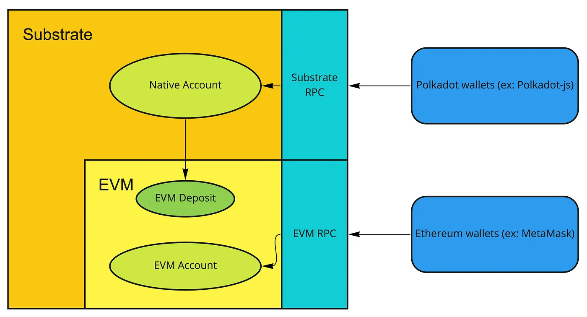
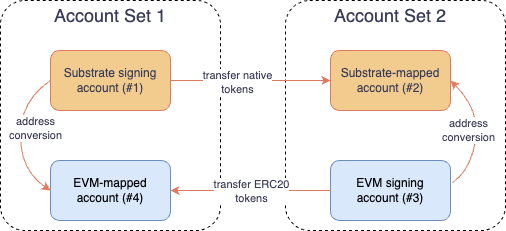
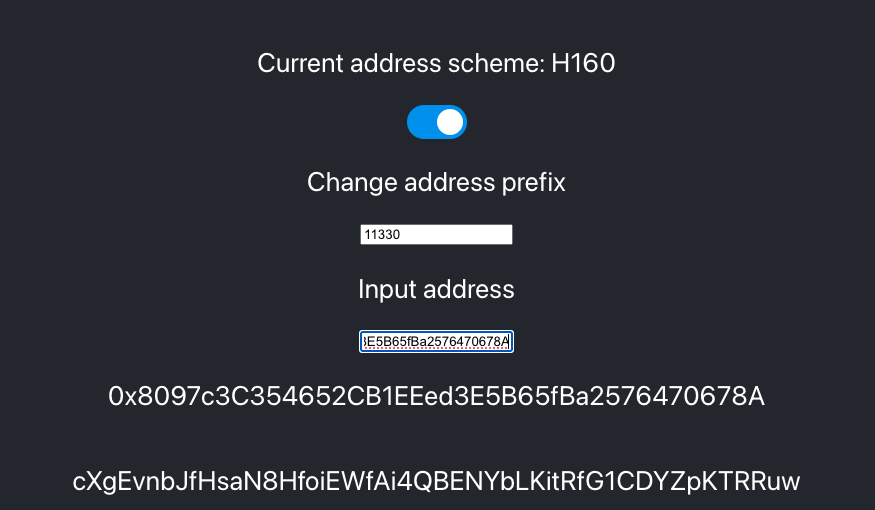
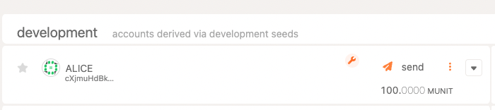
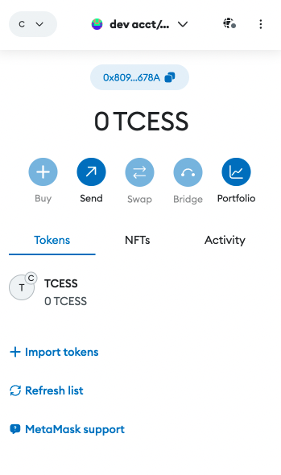
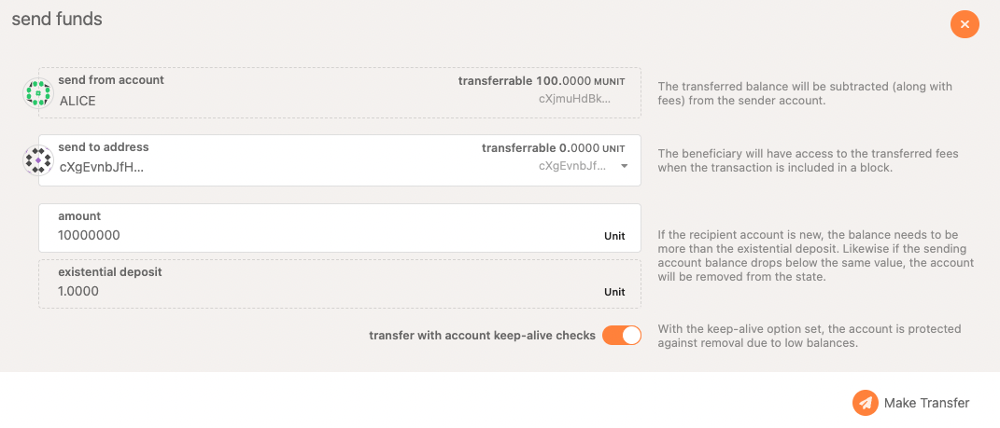
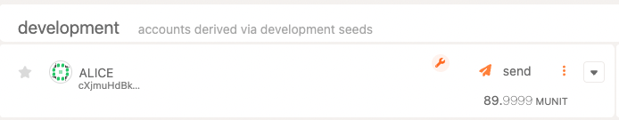
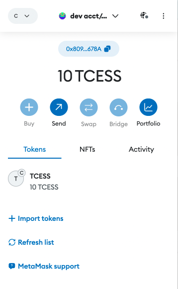
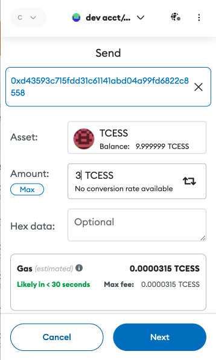
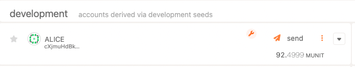

# Background

CESS network is a Substrate-based network allowing developers to deploy solidity contracts and run them on the Ethereum Virtual Machine (EVM). This capability is empowered by the **EVM Pallet** and **Ethereum Pallet** implemented in [Parity Frontier](https://github.com/paritytech/frontier).

Substrate by default is using [SS58 address type](https://wiki.polkadot.network/docs/learn-account-advanced). It is a modification of Base-58-check from Bitcoin with some minor changes. Notably, the format contains an address type prefix that identifies an address belonging to a specific network.

# EVM Integration in Substrate

Before diving into the address conversion scheme, let's look at what is causing this address conversion's needs.

Within Substrate architecture, the [**EVM Pallet**](https://docs.rs/crate/pallet-evm) is a separate Substrate pallet with its accounts and balances that only shares the block state as the host Substrate blockchain, represented as below:



There are a couple of points to note here:

- The EVM environment works on top of Substrate. It means that the block height of the EVM depends on the host Substrate network, and the host Substrate network will be able to access the EVM state, but the EVM will not be able to access or mutate the host Substrate network's state through normal means.

- The EVM environment exposes its own RPC endpoint. The endpoint can be exposed by implementing the Frontier RPC client, and the endpoint is compatible with [EIP-1474](https://github.com/ethereum/EIPs/blob/master/EIPS/eip-1474.md), which means tools and sites that work with Ethereum will be fully compatible with the EVM environment within Substrate. You can use MetaMask to connect to the network and view or send tokens like you would on other Ethereum-compatible chains.

- The EVM environment has its own balance called the EVM deposit, which Substrate native accounts can withdraw. A native Substrate SS58 address can be converted to an H160 address mapped to an EVM deposit, and an EVM H160 address can be converted to an SS58 address. This allows the accounts to transfer tokens from the native balance to an EVM balance, and vice versa. But we will need to convert between addresses here to achieve the transfer.

# Substrate and EVM Address Conversion

So Substrate address is generated as followed:


The account ID is 32 bytes long.

On the other hand, the EVM-compatible address is 20 bytes long. It is generated in the following way:


With the keccak256 digest we take the last 20 bytes as an Ethereum address (see references). Notice the last cryptographic hash function used is different. So to support EVM in a Substrate-based network, there is a mechanism for converting the address and transferring balances between them.



Referring to the above diagram, **our goal is to transfer tokens from our Substrate signing account (#1) to an EVM signing account (#3), and transfer them back**.

Start with #1, the **Substrate Signing Account**. We use this signing account to sign transactions on the CESS chain. This is also our main Substrate account holding our balances. This Substrate account has an equivalent EVM-mapping address (#4). It is done by calculating the user's public key from its SS58 address and extracting the first 20 bytes of it.

So with the well-known development account of `Alice`. It is an account generated from the well-known development mnemonic (*don't use this in production*):

```
bottom drive obey lake curtain smoke basket hold race lonely fit walk
```

It has the following attributes in the CESS testnet:

- Secret seed (aka private key): `0xe5be9a5092b81bca64be81d212e7f2f9eba183bb7a90954f7b76361f6edb5c0a`
- Account ID (aka pub key): `0xd43593c715fdd31c61141abd04a99fd6822c8558854ccde39a5684e7a56da27d`
- SS58 Address: `cXjmuHdBk4J3Zyt2oGodwGegNFaTFPcfC48PZ9NMmcUFzF6cc`

Its EVM-mapped address (#4) of the Substrate signing account will be the first 20 bytes of the Account ID: `0xd43593c715fdd31c61141abd04a99fd6822c8558`.

---
Now let's talk about the right-hand side of the address conversion diagram. We need an EVM signing account. You may ask if we can import the above EVM-mapped address (#4) into our EVM wallet app. Unfortunately, the answer is **NO**. It is because we don't know the private key that generates the EVM-mapped address (#4). The private key is not the same as the one used to generate the Substrate Account (#1). Using the `Alice` secret seed/private key above and importing it to an EVM wallet doesn't get us an equivalent EVM-mapped address but a new address. This is because different hash functions are being used for the address generation.

So, we need another new EVM account here. To simplify things, we will just import the secret seed of `Alice` development account (just bear in mind this is a separate account) as our EVM signing account.

We will get an EVM signing account of `0x8097c3C354652CB1EEed3E5B65fBa2576470678A` (#3).

To get the Substrate-mapped address, we will use the [Substrate EVM Address Converter](https://hoonsubin.github.io/evm-substrate-address-converter/) developed by [Hoon Kim](https://github.com/hoonsubin).



Heading to the app, we set the address scheme to **H160**, input the network ID as **11330** (the chain ID of CESS Testnet), and set the input address. We will get the Substrate-mapped address at the bottom. It is **cXgEvnbJfHsaN8HfoiEWfAi4QBENYbLKitRfG1CDYZpKTRRuw** (#2).

Now that we have the four accounts, we can transfer CESS tokens back and forth between Account Set 1 (the left hand side) and Account Set 2 (the right hand side).

# Transfer Balances from a Substrate Account to an EVM Account

Recall the addresses we will be using.

Account Set 1:
- Substrate signing address: **cXjmuHdBk4J3Zyt2oGodwGegNFaTFPcfC48PZ9NMmcUFzF6cc** (#1)
- EVM-mapped address: **0xd43593c715fdd31c61141abd04a99fd6822c8558** (#4)

Account Set 2:
- Substrate-mapped address: **cXgEvnbJfHsaN8HfoiEWfAi4QBENYbLKitRfG1CDYZpKTRRuw** (#2)
- EVM signing address: **0x8097c3C354652CB1EEed3E5B65fBa2576470678A** (#3)

1. Connect to your CESS local node in [Polkadot.js Apps](https://polkadot.js.org/apps/#/accounts). Development account `Alice` should have 100 MUnit of tokens.



2. Connect your EVM wallet to the CESS local node. In the following we will use [Metamask](https://metamask.io/). First, add CESS Local network in Metamask using the following info:

    - Network Name: **CESS Localhost**
    - RPC URL: **http://localhost:9944**
    - Chain ID: **11330**
    - Currency Symbol: **TCESS**
    - Block explorer URL: leave it as blank

3. After adding the network, import a new account in Metamask with the following private key:

    `0xe5be9a5092b81bca64be81d212e7f2f9eba183bb7a90954f7b76361f6edb5c0a`

    Now you should see an account with account ID `0x8097c3C354652CB1EEed3E5B65fBa2576470678A` with 0 balance. This is our EVM signing address (#3)<br/>

    

4. We will transfer 10M token unit from `Alice` (#1) to the Substrate-mapped address `cXgEvnbJfHsaN8HfoiEWfAi4QBENYbLKitRfG1CDYZpKTRRuw` (#2)



5. Once we complete the transfer and wait a few seconds, open our EVM wallet, and we should see the balance of the EVM account is updated to reflect the transfer.

    On the Substrate signing account (#1):<br/>

    

    On the EVM account (#3):<br/>

    

# Transfer Balances from an EVM Account to a Substrate Account

1. Transfer some ERC-20 TCESS tokens back and withdraw them to our Substrate signing account. In the EVM wallet app, transfer 3 TCESS back to the EVM-mapped address `0xd43593c715fdd31c61141abd04a99fd6822c8558` (#4).

    

2. Now, on the Polkadot.js Apps side, let's use Alice's account to issue extrinsic `evm.withdraw` to withdraw the ERC-20 token and convert it back to the chain native tokens. Put the following as parameters:

    - address: our EVM-mapped address: **0xd43593c715fdd31c61141abd04a99fd6822c8558**
    - value: the amount to withdraw, **2500000000000000000**.

    

3. After the extrinsic is processed, we should see Alice's account updated from 90M to 92.5M units.

    

# References

- [Using the Network Account between Substrate and EVM](https://medium.com/astar-network/using-astar-network-account-between-substrate-and-evm-656643df22a0)

- [Moonbeam Unified Accounts](https://docs.moonbeam.network/learn/features/unified-accounts/)

- [S/E: How are ethereum address generated?](https://ethereum.stackexchange.com/questions/3542/how-are-ethereum-addresses-generated)
