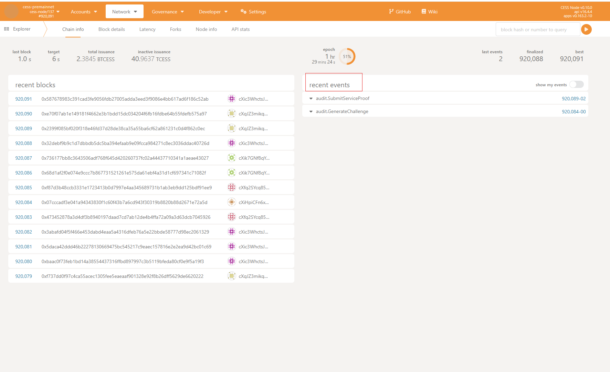

## Parsing transaction event

You can obtain transaction events by passing the pointer type of the corresponding event to each transaction sending method.The following is an example of getting a transfer event:

```golang
	cli, err := chain.NewLightCessClient(
		"white income exile ethics sick excess water deliver medal jump update fault",
		[]string{"wss://t2-rpc.cess.network"},
	)
	if err != nil {
		log.Fatal(err)
	}
    var event types.EventBalancesTransfer // import "github.com/centrifuge/go-substrate-rpc-client/v4/types"
    tx, err := cli.TransferToken("cXjTYBWUY68uGG2t3ShAhmLtNhz3WdBfXrYn4XaQYg5pKLZcF", "1000000000000000000", nil, &event)
    if err != nil {
		log.Fatal(err)
	}
    log.Println("tx hash:",tx,"event:",event)
```

How to know the type of event? You can observe it in the Substrate event stream, or retrieve it from the /chain/events.go file in the SDK.

## Registering and parsing block data

You can use the `ParseBlockDataWithBlockNumber` and `ParseBlockData` method in CESS Client to parse all registered events in a block.A block may contain many events, and registered events are events that have been registered in the SDK and are required by the caller.They are usually a subset of all events in the blockchain. You can add the event type you want to parse to the subset by calling the `chain.RegisterEventType` method.

The currently registered event table includes the following events, which cover most of the high-frequency events.
```golang
	commonEventsTypeMap = map[string]reflect.Type{

		// Treasury
		"Treasury.Burnt":           reflect.TypeOf(types.EventTreasuryBurnt{}),
		"Treasury.Awarded":         reflect.TypeOf(types.EventTreasuryAwarded{}),
		"Treasury.SpendApproved":   reflect.TypeOf(types.EventTreasurySpendApproved{}),
		"Treasury.Deposit":         reflect.TypeOf(types.EventTreasuryDeposit{}),
		"Treasury.Spending":        reflect.TypeOf(types.EventTreasurySpending{}),
		"Treasury.UpdatedInactive": reflect.TypeOf(types.EventTreasuryUpdatedInactive{}),
		"Treasury.Rollover":        reflect.TypeOf(types.EventTreasuryRollover{}),

		// System
		"System.UpgradeAuthorized": reflect.TypeOf(types.EventParachainSystemUpgradeAuthorized{}),
		"System.ExtrinsicSuccess":  reflect.TypeOf(types.EventSystemExtrinsicSuccess{}),
		"System.ExtrinsicFailed":   reflect.TypeOf(types.EventSystemExtrinsicFailed{}),

		// Balances
		"Balances.Slashed":    reflect.TypeOf(types.EventBalancesSlashed{}),
		"Balances.Deposit":    reflect.TypeOf(types.EventBalancesDeposit{}),
		"Balances.Withdraw":   reflect.TypeOf(types.EventBalancesWithdraw{}),
		"Balances.Unreserved": reflect.TypeOf(types.EventBalancesUnreserved{}),
		"Balances.BalanceSet": reflect.TypeOf(types.EventBalancesBalanceSet{}),
		"Balances.Transfer":   reflect.TypeOf(types.EventBalancesTransfer{}),
		"Balances.Reserved":   reflect.TypeOf(types.EventBalancesReserved{}),

		// TransactionPayment
		"TransactionPayment.TransactionFeePaid": reflect.TypeOf(types.EventTransactionPaymentTransactionFeePaid{}),

		// Audit
		"Audit.SubmitServiceProof":        reflect.TypeOf(EventSubmitServiceProof{}),
		"Audit.GenerateChallenge":         reflect.TypeOf(EventGenerateChallenge{}),
		"Audit.VerifyProof":               reflect.TypeOf(EventVerifyProof{}),
		"Audit.SubmitIdleVerifyResult":    reflect.TypeOf(EventSubmitIdleVerifyResult{}),
		"Audit.SubmitServiceVerifyResult": reflect.TypeOf(EventSubmitServiceVerifyResult{}),
		"Audit.SubmitIdleProof":           reflect.TypeOf(EventSubmitIdleProof{}),

		// Sminer
		"Sminer.MinerExitPrep":            reflect.TypeOf(EventMinerExitPrep{}),
		"Sminer.RegisterPoisKey":          reflect.TypeOf(EventRegisterPoisKey{}),
		"Sminer.Deposit":                  reflect.TypeOf(EventDeposit{}),
		"Sminer.LessThan24Hours":          reflect.TypeOf(EventLessThan24Hours{}),
		"Sminer.FaucetTopUpMoney":         reflect.TypeOf(EventFaucetTopUpMoney{}),
		"Sminer.IncreaseCollateral":       reflect.TypeOf(EventIncreaseCollateral{}),
		"Sminer.Receive":                  reflect.TypeOf(EventReceive{}),
		"Sminer.UpdateBeneficiary":        reflect.TypeOf(EventUpdateBeneficiary{}),
		"Sminer.AlreadyFrozen":            reflect.TypeOf(EventAlreadyFrozen{}),
		"Sminer.DrawFaucetMoney":          reflect.TypeOf(EventDrawFaucetMoney{}),
		"Sminer.Registered":               reflect.TypeOf(EventRegistered{}),
		"Sminer.IncreaseDeclarationSpace": reflect.TypeOf(EventIncreaseDeclarationSpace{}),

		// TeeWorker
		"TeeWorker.MasterKeyLaunched":             reflect.TypeOf(EventMasterKeyLaunched{}),
		"TeeWorker.WorkerAdded":                   reflect.TypeOf(EventWorkerAdded{}),
		"TeeWorker.WorkerUpdated":                 reflect.TypeOf(EventWorkerUpdated{}),
		"TeeWorker.MinimumCesealVersionChangedTo": reflect.TypeOf(EventMinimumCesealVersionChangedTo{}),

		// OSS
		"Oss.OssUpdate":       reflect.TypeOf(EventOssUpdate{}),
		"Oss.OssDestroy":      reflect.TypeOf(EventOssDestroy{}),
		"Oss.CancelAuthorize": reflect.TypeOf(EventCancelAuthorize{}),
		"Oss.OssRegister":     reflect.TypeOf(EventOssRegister{}),
		"Oss.Authorize":       reflect.TypeOf(EventAuthorize{}),

		// FileBank
		"FileBank.UploadDeclaration":     reflect.TypeOf(EventUploadDeclaration{}),
		"FileBank.DeleteFile":            reflect.TypeOf(EventDeleteFile{}),
		"FileBank.TerritoryFileDelivery": reflect.TypeOf(EventTerritorFileDelivery{}),
		"FileBank.ReplaceIdleSpace":      reflect.TypeOf(EventReplaceIdleSpace{}),
		"FileBank.ReplaceFiller":         reflect.TypeOf(EventReplaceFiller{}),
		"FileBank.ClaimRestoralOrder":    reflect.TypeOf(EventClaimRestoralOrder{}),
		"FileBank.GenerateRestoralOrder": reflect.TypeOf(EventGenerateRestoralOrder{}),
		"FileBank.CalculateReport":       reflect.TypeOf(EventCalculateReport{}),
		"FileBank.RecoveryCompleted":     reflect.TypeOf(EventRecoveryCompleted{}),
		"FileBank.StorageCompleted":      reflect.TypeOf(EventStorageCompleted{}),
		"FileBank.TransferReport":        reflect.TypeOf(EventTransferReport{}),
		"FileBank.IdleSpaceCert":         reflect.TypeOf(EventIdleSpaceCert{}),

		//StorageHandler
		"StorageHandler.ExpansionSpace":       reflect.TypeOf(EventExpansionSpace{}),
		"StorageHandler.RenewalSpace":         reflect.TypeOf(EventRenewalSpace{}),
		"StorageHandler.PaidOrder":            reflect.TypeOf(EventPaidOrder{}),
		"StorageHandler.CreatePayOrder":       reflect.TypeOf(EventCreatePayOrder{}),
		"StorageHandler.BuySpace":             reflect.TypeOf(EventBuySpace{}),
		"StorageHandler.LeaseExpired":         reflect.TypeOf(EventLeaseExpired{}),
		"StorageHandler.LeaseExpireIn24Hours": reflect.TypeOf(EventLeaseExpireIn24Hours{}),
	}
```

## Custom Events

As the business on the CESS chain is updated, many new events will appear. These events may not be widely used, so developers need to manually build the corresponding event structure. You can build a new event structure like the following structure, keeping the sandwich structure and adding custom fields of the event in the middle

```golang
    type EventVerifyProof struct {
        Phase     types.Phase
        ...
        Topics    []types.Hash
    }
```

The specific type of event can be obtained in the source code of [CESS Node](https://github.com/CESSProject/cess), or viewed in the Substrate browser after sending a transaction.

