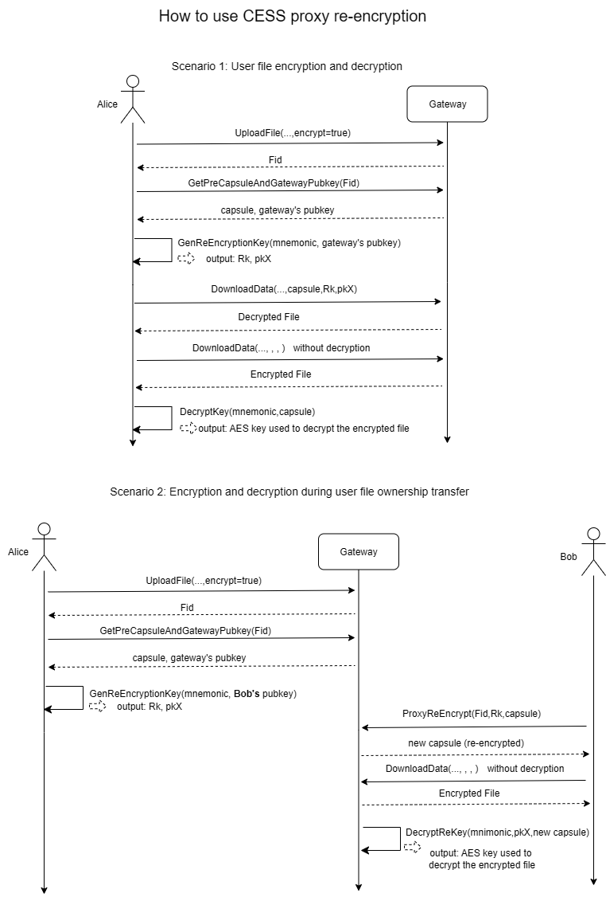

## Interacting with the CESS Gateway

The CESS network currently has two types of gateways: one is the old version gateway, namely DeOSS, which has stopped maintenance; the other is the CD²N gateway, which is the gateway that natively supports the CESS CDN network. This SDK only supports interaction with the CD²N gateway. 

### Authorize the gateway

Before uploading files using a gateway, you need to authorize it. You can use `retriever.AuthorizeGateways` in the SDK to authorize the gateway pointed to by a given URL and all its peer gateways within the same cluster. 

``` golang
	gatewayUrl := "http://gateway.cess.network"
	rpc := "wss://t2-rpc.cess.network"
	mnemonic := "outcome follow exile ethics sick excess show deliver medal jump update default"

	if err := retriever.AuthorizeGateways(gatewayUrl, rpc, mnemonic); err != nil {
		log.Fatal(err)
	}
```

### Get a token

Before requesting operations such as file upload, you need to apply for a JWT token, which is valid for any gateway node in the cluster within the specified expiration time. When the expiration time is set to zero, the default maximum expiration time is 72 hours.

```golang
	baseUrl := "http://gateway.cess.network"
	mnemonic := "outcome follow exile ethics sick excess show deliver medal jump update default"
	message := fmt.Sprint(time.Now().Unix())
	account := "cXkGyzXtxnK2Ebw8XfgArXc9VGqKqE7b517muih45ds9Eadbc"

	sign, err := retriever.SignedSR25519WithMnemonic(mnemonic, []byte(message))
	if err != nil {
		log.Fatal(err)
	}

	token, err := retriever.GenGatewayAccessToken(baseUrl, message, account, sign,time.Minute*30)
	if err != nil {
		log.Fatal(err)
	}

    log.Println(token)
```

The signed message must be the latest Unix time. To prevent attacks, signatures older than one minute will be invalid.

### Upload data

Before uploading files, you must first authorize the gateway. You can call the `Authorize` method on the CESS Client to authorize, or you can manually perform the operation in the Substrate browser. In subsequent versions, authorization will be automatically performed when obtaining a token.

Call the `retriever.UploadFile` method to upload the file to the gateway. The last parameter indicates whether encryption is required for upload. If it is configured as true, the proxy re-encryption technology is used to encrypt the data on the gateway side.

```golang
    baseUrl := "http://gateway.cess.network"
    territory := "your territory name"

    file,err:=os.Open("your file path")
    if err!=nil{
        log.Fatal(err)
    }
    defer file.Close()

    fid, err := retriever.UploadFile(baseUrl, token, territory, file.Name(), file, false)  
    if err!=nil{
        log.Fatal(err)
    }

    log.Println(fid)
```

The above request will wait for the gateway to pre-process the user data and upload the metadata to the chain before returning the FID of the file. If you want to return the result immediately, you can use the asynchronous upload method:

```golang
    info, err := retriever.AsyncUploadFile(baseUrl, token, territory, file.Name(), file,false ,false)  
    if err!=nil{
        log.Fatal(err)
    }

    log.Println(info.Fid)
```
The last parameter of the above request indicates whether to upload encrypted data. The second-to-last parameter indicates whether to allow the gateway to send the file storage order on behalf of the client. The default value is false. Otherwise, the user needs to manually create a storage order on the chain based on the returned file information.

In addition, you can also upload your data in shards, which is particularly useful when network conditions are poor. It should be noted that the gateway will automatically clear the request data on the unfinished shards within 24 hours.

```golang
    file,err:=os.Open("your file path")
    if err!=nil{
        log.Fatal(err)
    }
    defer file.Close()

	hash, err := retriever.RequestBatchUpload(baseUrl, token, territory, file.Name(), file.Size(), false, false, false)
	if err != nil {
		log.Fatal(err)
	}

	log.Println(hash)

    block:=int64(1024*1024)

    for size := int64(0); size < file.Size(); size += block {
    res, err := retriever.BatchUploadFile(baseUrl, token, hash, f, size, size+block)
    if err != nil {
        log.Fatal(err)
    }
    log.Println("upload response:",res)
	}

```

### Retrieving data

You can use the `DownloadData` function to download data from the gateway. When only Fid is passed in, it means downloading the entire file pointed to by Fid. When segmentId is passed in at the same time, it means downloading only the corresponding segment.

```golang
	baseUrl := "https://retriever.cess.network"
	fid := "704db5a38548c13ef23ff465622e474354acd2ccfd32f0313cb33e3cf3f8a652"
    filePath:="The path where the file will be saved"
    segmentId:=""

    err = retriever.DownloadData(baseUrl, fid, segmentId, filePath,nil, nil, nil)
	if err != nil {
		log.Fatal(err)
	}
	log.Println("success")
```

If the file you want to download is encrypted by the gateway (the encrypt parameter is true when uploading the file), you need to obtain the re-encryption parameters first, and re-encrypt the key before downloading it as a parameter. If the key is correct, you will get the decrypted data.

```golang
	baseUrl := "https://retriever.cess.network"
	fid := "704db5a38548c13ef23ff465622e474354acd2ccfd32f0313cb33e3cf3f8a652"
    filePath:="The path where the file will be saved"
    segmentId:=""
	mnemonic := "wram horse perfect monkey build squirrel embrace joke frist save know make"

	capsule, pubkey, err := retriever.GetPreCapsuleAndGatewayPubkey(baseUrl, fid)
	if err != nil {
		log.Fatal(err)
	}

    rk, pkX, err := retriever.GenReEncryptionKey(mnemonic, pubkey)
	if err != nil {
		log.Fatal(err)
	}

    err = retriever.DownloadData(baseUrl, fid, segmentId, filePath, capsule, rk, pkX)
	if err != nil {
		log.Fatal(err)
	}
	log.Println("success")
```

It should be noted that after encrypting and uploading the file, the `capsule` parameters must be downloaded as soon as possible and saved locally or on the chain. The gateway will delete it after 72 hours.

The following is the process of using CESS proxy re-encryption. For more code, please refer to the pre.go file in the retriever directory of the SDK.

