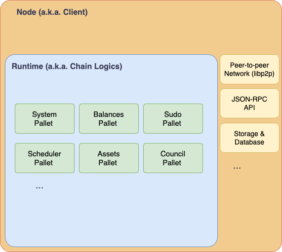

# Before We Start

In this section we will give a mid-level description of the source code and architecture of CESS blockchain. It mainly revolves around the repository [**CESSProject/cess**](https://github.com/CESSProject/cess). This is a "mid-level" description meaning it is more details than just a high level description. Some part of the documentation it should be read with the source code open next to it. You will get a general understanding on how different modules are connected together, but it is not so low-level that we go through the source code line by line. You don't need the knowledge in this page to use CESS products, but if you are a developer and want to gain a deeper understanding on how CESS blockchain works, this section is for you.

# Overview

CESS blockchain is built on top of Parity developed Substrate blockchain SDK. So we adopt a similar architecture of Substrate-based blockchain. It can be easily understood by the following diagram.



In the outer layer there is a Node (a.k.a the Client). It contains all the low-level building blocks of a blockchain, such as the peer-to-peer network, JSON-RPC API that interface externally, and the storage and database system.

Then inside the node, there is a **Runtime**, where the chain logic happens. This is where user accounts are being recognized and their balances are being stored. Substrate-based blockchain also have a strong sense of DAO and have a comprehensive way of raising a proposal and passing them through a referendum or a council. These functionality are all specified in the chain runtime.

As complicated of the features provided by the runtime. It is actually further broken down into pallets. One, or sometimes a few, of the pallets implement one set of functionality of the runtime. As these pallets are independent and modular, once they are imeplemented, it is up to the engineer of the Runtime to compose these pallets goether to provide the functionality of the blockchain.

With this architecture, CESS blockchain, and extending to most Substrate-based blockchains are modular, composible, and scalable.

# High Level Understanding

To understand what a CESS blockchain does, we can look at its Runtime and see what pallets is it composed of. The CESS blockchain version we are looking at is: **[CESSProject/cess v0.7.3](https://github.com/CESSProject/cess/tree/0.7.3)**.

Let's look at its runtime [`runtime/src/libs.rs`](https://github.com/CESSProject/cess/blob/0.7.3/runtime/src/lib.rs), and especially at the section of code in `construct_runtime!()`:

```rs
construct_runtime!(
  pub enum Runtime where
    Block = Block,
    NodeBlock = opaque::Block,
    UncheckedExtrinsic = UncheckedExtrinsic
  {
    // First section - foundational pallets
    System: frame_system = 0,
    RandomnessCollectiveFlip: pallet_randomness_collective_flip = 1,
    Timestamp: pallet_timestamp = 2,
    Sudo: pallet_sudo = 3,
    Scheduler: pallet_scheduler = 4,
    Preimage: pallet_preimage = 5,
    Mmr: pallet_mmr = 6,

    // Second section - Account, balances, and transaction fees
    Indices: pallet_indices = 7,
    Balances: pallet_balances = 10,
    TransactionPayment: pallet_transaction_payment = 11,
    Assets: pallet_assets = 12,
    AssetTxPayment: pallet_asset_tx_payment = 13,

    // Third section - Managing Session, Validators, Block Production, and Block Finalization
    Authorship: pallet_authorship = 20,
    Babe: pallet_rrsc = 21,  // retain Babe alias for Polka-dot official browser
    Grandpa: pallet_grandpa = 22,
    Staking: pallet_cess_staking = 23,
    Session: pallet_session = 24,
    Historical: pallet_session_historical = 25,
    Offences: pallet_offences = 26,
    ImOnline: pallet_im_online = 27,
    AuthorityDiscovery: pallet_authority_discovery = 28,
    VoterList: pallet_bags_list = 29,
    ElectionProviderMultiPhase: pallet_election_provider_multi_phase = 30,

    // Forth section - Chain Governance
    Council: pallet_collective::<Instance1> = 40,
    TechnicalCommittee: pallet_collective::<Instance2> = 41,
    TechnicalMembership: pallet_membership::<Instance1> = 42,
    Treasury: pallet_treasury = 43,
    Bounties: pallet_bounties = 44,
    ChildBounties: pallet_child_bounties = 45,

    // Fifth section - Smart contracts capability
    Contracts: pallet_contracts = 50,
    Ethereum: pallet_ethereum = 51,
    EVM: pallet_evm = 52,
    DynamicFee: pallet_dynamic_fee = 53,
    BaseFee: pallet_base_fee = 54,

    // Sixth section - CESS specific pallets
    FileBank: pallet_file_bank = 60,
    TeeWorker: pallet_tee_worker = 61,
    Audit: pallet_audit = 62,
    Sminer: pallet_sminer = 63,
    StorageHandler: pallet_storage_handler = 64,
    SchedulerCredit: pallet_scheduler_credit = 65,
    Oss: pallet_oss = 66,
    Cacher: pallet_cacher = 67,
  }
);
```

As seen from the above, there are over 40 pallets being integrated in the runtime. They can be broadly split into six groups.

1. Foundation Pallets - These pallets provide low-level access to core types and cross-cutting utilities. It acts as the base layer for other pallets to interact with the Substrate framework components. This includes keeping track of the chain block number, getting the parent hash of the current block, etc. These pallets include System, RandomnessCollectiveFlip, Timestamp, Sudo, Schedyler, Preimage, and MMR pallets.

2. Account, Balance and Fee Pallets - These pallets keep track of the existing accounts in the blockchain and their balances. For a user balance, there are both free and locked balances. It also keep track of other tokens and NFTs, they are accounted as assets in CESS. There are also pallet for handling transaction fee. These pallets include Indices, Balances, TransactionPayment, Assets, and AssetTxPayment pallets.

3. Consensus Pallets - These pallets work together to keep track of session in the blockchain, and within each session the corresponding validators and who author blocks. It also keep track of the votes by these validators to finalize blocks. In summary these pallets work together to ensure the block data is valid. These pallet includes Authorship, Babe, Grandpa, Staking, Session, Historical, Offences, ImOnline, AuthorityDiscovery, VoterList, and ElectionProviderMultiPhase pallets.

4. Governance Pallets - These pallets provide function to keep track of the Treasury. Some of these treasury are allocated to various proposals voted through council and committees. Some of the treasury allocation are one-off bounty (and sub-boundy) asking for solution providers for solutions and the committee member to vet the solutions. Together these pallets manage the mechanism of how the chain Treasury are spent. These pallets include Council, TechnicalCommittee, TechnicalMembership, Treasury, Bounties, and ChildBounties pallets.

5. Smart Contract Pallets - These pallets grand the chain functionality of running smart contract. CESS chain support two type of smart contracts - ink! contracts, this is granted by Contracts pallets; and EVM-compatible contracts, granted by Ethereum, EVM, DynamicFee pallets. Some EVM precompiles are also coded to allow Substrate chains recognized these built-in EVM functions.

6. CESS specific Pallets - These are pallets built by CESS core development team to implement CESS functionality. Most of the pallets on the first five categories are provided as-is in the Substrate framework. We have made further customization to make it suit CESS blockchain. But the pallets in this category is what make CESS blockchain unique and implement the core functionality of providing the decentralized storage and caching functionality.

Next, let's go deeper in these CESS specific pallets.

# CESS Pallets

## FileBank Pallet

This pallet consists of logics on managing storage space. It allows callers (users) to purchase storage space, expand the purchased space, renew the storage leases. This pallet also implement functions to CRUD (create, read, update, delete) user buckets, a concept similar to user directory. The actual files are segmented and stored in the underlying storage network, but its metadata are stored on-chain.

Implementation: [`c-pallets/file-bank/src/lib.rs`](https://github.com/cessProject/cess/blob/main/c-pallets/file-bank/src/lib.rs)

Extrinsics:

- `upload_declaration()`: For users to declare, claiming the ownership, of a file before it is being uploaded. This will check if the file is already on-chain and mark the corresponding metadata.
- `deal_reassign_miner()`: Reassign the storage task (storage deal) to another storage miner.
- `ownership_transfer()`: Transfer the ownership of a document from one user to another user. There are a few states need to be updated in addition to the files, including the releasing the used storage of the previous owner and deducting the available space of the new owner.
- `transfer_report()`: Upload the meta-data of a stored file on-chain. If the meta-data of the file existed before, it will be updated.
- `calculate_end()`: End the storage task of the given hash. The used storage is released and the deal information is cleaned up.
- `replace_idle_space()`: A particular idle space in a storage miner is replaced by user content.
- `delete_file()`: Delete the file owned by the owner. The caller can be the owner himself or has granted right to manage files for the owner.
- `cert_idle_space()`: Upload up to ten idle files to certify the storage miner space.
- `create_bucket()`: Create a storage bucket.
- `delete_bucket()`: Delete a storage bucket.
- `generate_restoral_order()`: Generate an order to restore certain content. It is stored in a queue to be pick up by storage miners.
- `claim_restoral_order()`: A storage miner come to pick up a restore order.
- `claim_restoral_noexist_order()`: A storage miner come to generate a new restore order and pick it up. It is a combination of the above two functions.
- `restoral_order_complete()`: A storage miner claims that a restore order has been completed.
- `root_clear_failed_count()`: Clear the failed count of all storage miners. Only be called by `root` user.
- `miner_clear_failed_count()`: Clear the failed count of the caller.

## TeeWorker Pallet

This pallet provides functionality mostly related to consensus miners, including registering nodes to be consensus miners, updating the internal record, and exiting to be consensus miners.

Implementation: [`c-pallets/tee-worker/src/lib.rs`](https://github.com/cessProject/cess/blob/main/c-pallets/tee-worker/src/lib.rs)

Extrinsics:

- `register()`: The caller registers to be a consensus miner. It needs to provide a stash account for managing its stake, a Peer ID, a PoDR2 public key, and an SGX attestation report to prove the node is SGX-capable.
- `update_whitelist()`: Updating the whitelist storage of the miner enclaves. Only be called by `root` user.
- `exit()`: The caller exits from being a consensus miner.

## Audit Pallet

This pallet manages the Proof of Data Reduplication and Recovery (PoDR²). It includes the logic to generate and validate proofs for miner's service file and idled file. It also generate random challenges to the storage miners. It works with other pallets to handle storage challenges and slash miners.

Implementation: [`c-pallets/audit/src/lib.rs`](https://github.com/cessProject/cess/blob/main/c-pallets/audit/src/lib.rs)

Extrinsics:

- `save_challenge_info()`: Generate a new challenge request and save it on-chain. It can be either a service space challange or an idle space challenge.
- `submit_idle_proof()`: The storage miner submits an idle space proof on-chain based on a challege request previously generated.
- `submit_service_proof()`: The storage miner submits a service space proof on-chain based on a challege request previously generated.
- `submit_verify_idle_result()`: Given a challange request and an idle space proof, a verifier checks if the idle proof is valid and satisfy the challenge request.
- `submit_verify_service_result()`: Given a challenge request and a service space proof, a verifier checks if the service proof is valid and satisfy the challenge request.

## Sminer Pallet

This pallet contains operations related to storage miners, allowing them to claim how much space it is providing for how long, staking its tokens for its claimed services, and withdrawing the service provision altogether.

Implementation: [`c-pallets/sminer/src/lib.rs`](https://github.com/cessProject/cess/blob/main/c-pallets/sminer/src/lib.rs)

Extrinsics:

- `regnstk()`: Responsible for registering of a new storage miner and adding stakes to its service.
- `increase_collateral()`: Increasing the storage miner stake (a.k.a collateral).
- `update_beneficiary()`: Update the beneficiary account of the storage miner.
- `update_peer_id()`: Update the storage miner peer ID.
- `receive_reward()`: The storage miner requests for its reward.
- `miner_exit_prep()`: The storage miner requests to exit in future for its service.
- `miner_exit()`: The storage miner exits from its service.
- `mine_withdraw()`: The stroage miner requests to withdraw. Restore order are issued so the storage content of the miner is migrated to other miners.
- `faucet_top_up()`: The caller returns some of his holding tokens back to the faucet.
- `faucet()`: The caller asks to get some tokens from the faucet. There is a limit of calling this function only once per day.

## StorageHandler Pallet

This pallet manage and perform the book-keeping of the total storage space provided by the underlying storage miners. It allows users to rent, expand the space. Update the pricing of the space. It will also emit events when the space leasing period is ending.

Implementation: [`c-pallets/storage-handler/src/lib.rs`](https://github.com/cessProject/cess/blob/main/c-pallets/storage-handler/src/lib.rs)

Extrinsics:

- `buy_space()`: Extrinsics for a user to purchase space.
- `expansion_space()`: Purchase additional space. It can only be called when `buy_space()` have been called by the user. The upgrade target also need to be larger than the existing purchased space.
- `renewal_space()`: Extend the lease of the current storage package for a specified days.
- `update_price()`: Update the base price of the storage. Can only be called by `root` user.
- `update_user_life()`: Update the user storage lifespan. Can only be called by `root` user.

## SchedulerCredit Pallet

The consensus miner credit module. The scheduler reputation module is used to record some operations performed by the scheduler in order to maintain the chain state, including records of processing files and records of penalties for failing to achieve scheduling goals. Finally, the system will give a score to the scheduler according to the set algorithm. This score will be used to decide validators as part of the R2S consensus.

Implementation: [`c-pallets/scheduler-credit/src/lib.rs`](https://github.com/cessProject/cess/blob/main/c-pallets/scheduler-credit/src/lib.rs)

Extrinsics: No callable extrinsics.

## OSS Pallet

This pallet records the information about OSS, which stands for Object Storage System <What is OSS stands for?>. It allows for registration, update, and marking removal of OSS.

Implementation: [`c-pallets/oss/src/lib.rs`](https://github.com/cessProject/cess/blob/main/c-pallets/oss/src/lib.rs)

Extrinsics:

- `authorize()`: Setting a specified operator for the caller. It can be understood similar as the caller delegating his rights to the operator.
- `cancel_authorize()`: Cancel the authorization of the operator on behalf of the caller.
- `register()`: Register the caller with a particular Peer ID.
- `update()`: Update the caller with a new Peer ID.
- `destroy()`: Remove the caller as the OSS.

## Cacher Pallet

This pallet provide functionality about cache miners. Cache miner retrieves the bills in the transaction records and provides file downloading service. It provide the function to register a new cache miner, update its information, logging out of the miner, and payment to the cache miner.

Implementation: [`c-pallets/cacher/src/lib.rs`](https://github.com/cessProject/cess/blob/main/c-pallets/cacher/src/lib.rs)

Extrinsics:

- `register()`: Register the caller as a cache provider.
- `update()`: Update the cache information about the caller. The caller must have registered as a cache provider previously.
- `logout()`: The caller is exiting as a cache provider.
- `pay()`: Paying all cache providers of payment due to them.
