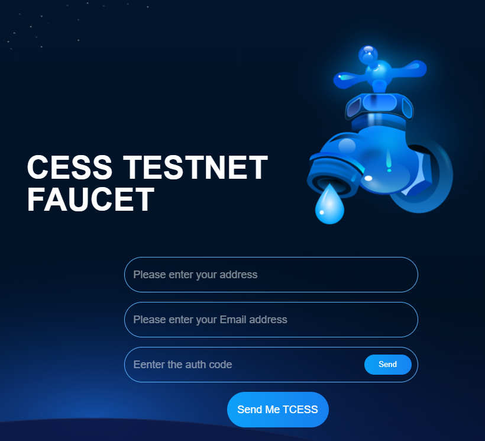

## Background

CESS Testnet has been launched. You can reach the blockchain explorer at <https://substats.cess.cloud/>.

To deploy applications on CESS Testnet, you will need some Testnet tokens. You can get them at our [**Testnet Faucet**](https://cess.cloud/faucet.html).

## Procedure

1. Goto our [**Testnet Faucet**](https://cess.cloud/faucet.html). You should see a screen similar to the following.

    

2. Enter the account address of the test token recipient in the address input. The address should start with `c...`. Click the button `Get TCESS` to confirm.

3. Once you see the `Submitted Successfully!` message on top. The faucet request has been fulfilled.

    

4. You can check in the blockchain explorer: <https://substats.cess.cloud/> that test tokens have indeed been granted to your account.

    
