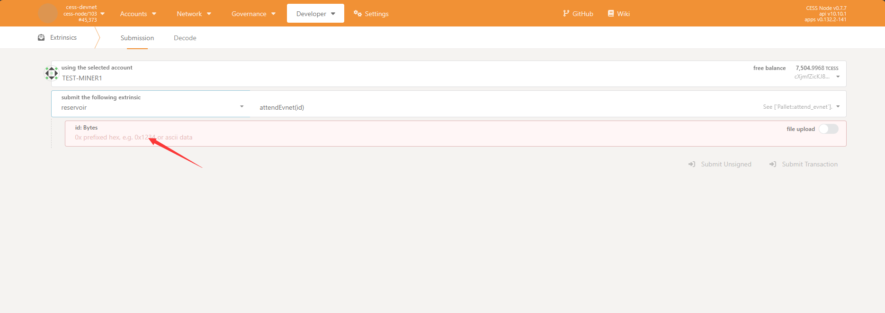
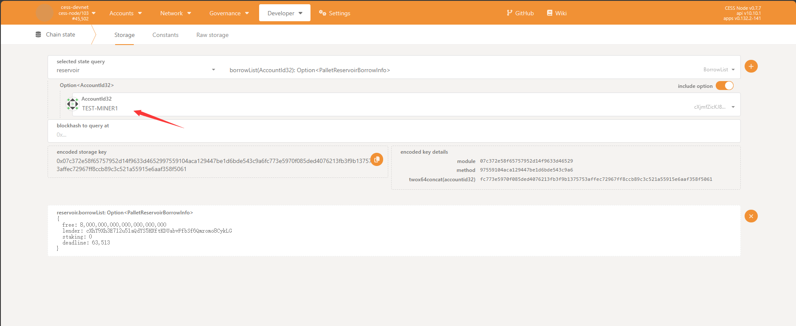
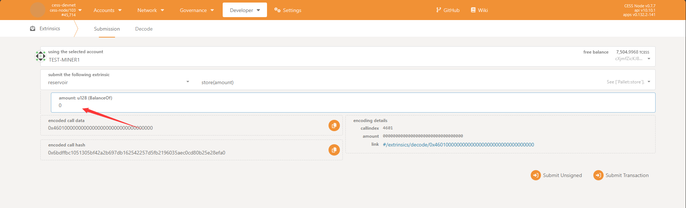
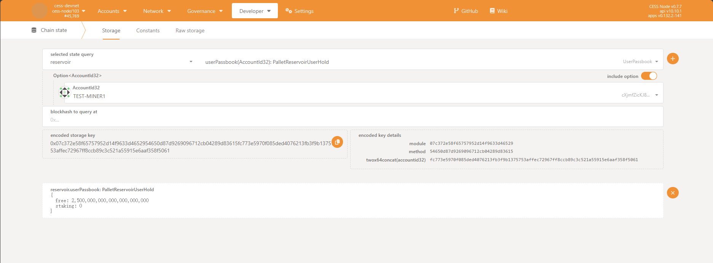
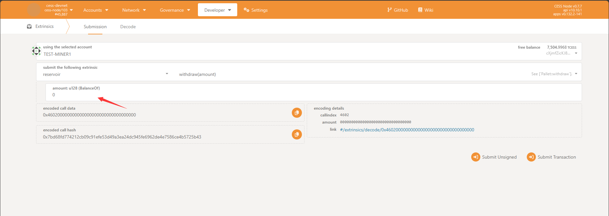

# Background

The CESS network has introduced a new reservoir module primarily designed to lend tokens to miners. Miners can utilize this loan to facilitate their mining activities.

# Guides

## Attend Events

Before performing the following operations, you must first ensure:

- Have a CESS address.
- There is enough gas in the address.

Attend the token borrowing event officially released by CESS to borrow the deposit required for mining for free.

When the event is released, CESS will announce an `event id`. You can participate by recording this ID call transaction.

1. Enter the blockchain browser and select Develop - Extrinsic - reservoir - attendEvent. Fill in the `event id` for this release and send a transaction.

    Note: Only one loan can exist within a single account.

2. After the transaction is successful, query the current borrowing bill. Navigate to Develop - Chain state - reservoir - borrowList. Input your address at the designated mark and proceed with the search.  

After confirming that you have successfully borrowed the tokens, you can fill in the reservoir address as the staking address and register the miner.
The reservoir address is:  `cXhT9Xh3E712u51aQdYS5HXftKDUabvFfbSf6Qmromo8CykLG`.

If you want to learn how to run a miner, check out this [tutorial](../../storage-miner/running.md).

## Store

In addition to borrowing tokens, you can also actively store tokens in your reservoir account. The purpose of this transaction is that, assuming your loan is only 4,000 CESS, and you need to use your reservoir account to pledge 8,000 CESS, you can make up the remaining part of this transaction.

Follow the steps below to complete token storage instantly:

1. Fill in the number of tokens to be stored, 1 CESS = 1_000_000_000_000_000_000 unit. For example, if you want to store 1 CESS, the parameters you fill in need to be 1 followed by 18 zeros.

After sending the transaction successfully, select Developer - Chain state - reservoir - userPassbook. Check your passbook and confirm the details:

## Withdraw

The tokens deposited by users into the reservoir can be retrieved at any time through the `withdraw` transaction as long as they are not in a pledged state.

Select transaction: reserve-store. Fill in the number of tokens that need to be retrieved, which is the same as the storage parameters. It also requires 18 zeros.

After the transaction is successful, the token can be withdrawn to your account balance.

