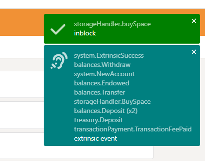
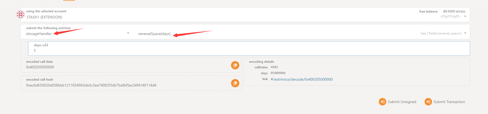

# Background

CESS testnet has been released. If users want to upload files, they need to purchase space and an authorized gateway first. This guide is for developers who want to interact directly with the chain through a blockchain browser to purchase space, expand space, and other operations.

# Guides

The guide will explain how to purchase space, expand space, renew space, and some of the details.

## Buy Space

1. After connecting to any rpc node, the browser loads the blockchain information. We select Developer - Extrinsics as shown in the image below.

2. Select the `StorageHandler` module and select the `buySpace` transaction.

3. In the `gibCount` column, fill in the amount of storage space you want to purchase, in gib. After confirming that the parameters are correct, click `Submit Transaction`

        Please make sure your account balance is sufficient for this step. The current space unit price of the CESS test network is 30 TCESS / GIB / DAY

4. Click `Sign and Submit` to confirm the signature. 

5. Then wait for the browser to call the wallet to sign. After entering your customized password, click `Sign the transaction` to sign the transaction.

6. Wait for the transaction to be packaged and then broadcast the confirmation. If you see the content shown in Figure 2 below, it means that the transaction you submitted has been successfully executed.

        It should be noted that if your account has already purchased space, calling this transaction will fail. If you want to expand or renew the lease, please call the corresponding transaction.

## Renew Space

1. Select the StorageHandler module. Then select the renewalSpace transaction. After filling in the parameters `days` correctly, send the transaction.

        days represents the number of days to renew the lease.

2. The subsequent operations are the same as purchasing space.

## Expansion Space

1. Select the `StorageHandler` module. Then select the `expansionSpace` transaction. After filling in the parameter gibCount correctly, send the transaction.

## Query Space

1. Select `Developer` - `Chain state`

2. Select the `StorageHandler` module. Continue to select the `userOwnedSpace` interface. Enter the wallet address you want to query.

3. Click "+" to query. View the returned results.

`totalSpace`: Indicates the total space currently held by the user, in bytes.

`usedSpace`: Indicates the space currently used by the user, in bytes.

`lockedSpace`: Indicates the space used by the file currently being uploaded by the user, in bytes.

`remainingSpace`: Indicates the remaining space available to the user, in bytes.  

`start`: Block height when space is first purchased.

`deadline`: Block height at expiration.

`state`: The status of the space currently held by the user.