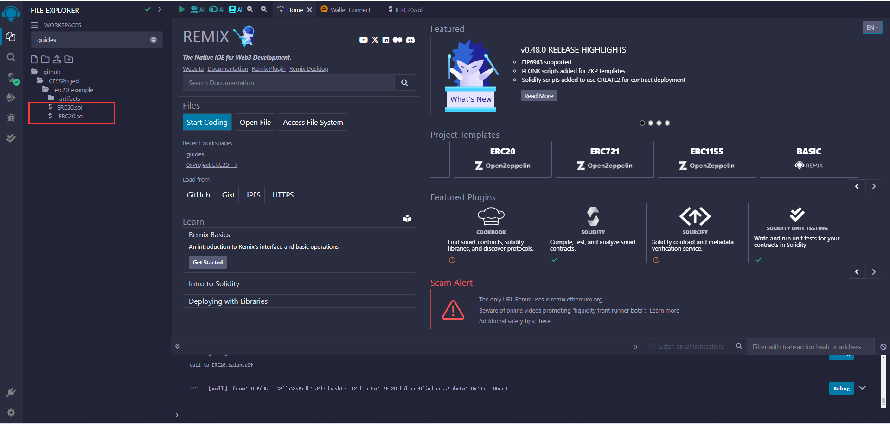
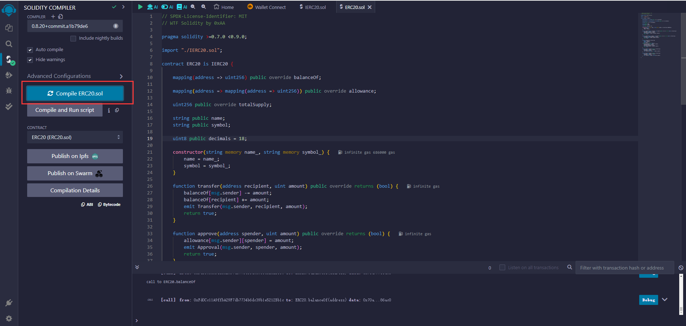
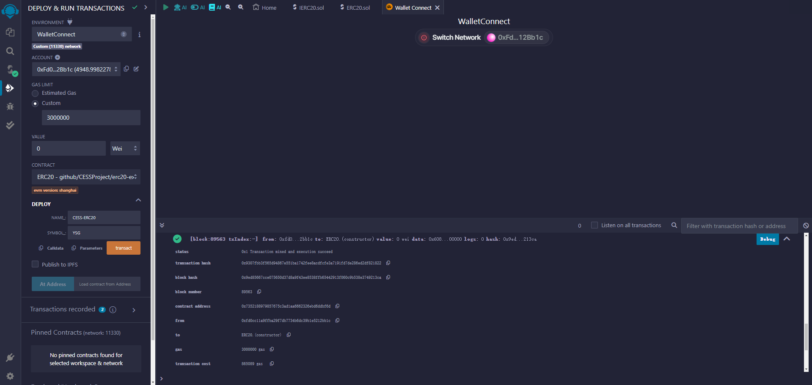
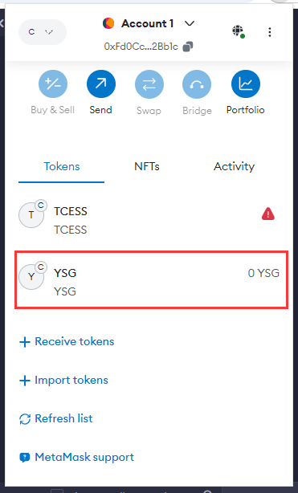

# Introduce
The cess network integrates `pallet-evm`, allowing anyone to deploy smart contracts written by solidity versions below 8.20 (tested) on the cess network.

This guide will guide you on how to issue an erc20 token on the cess network.

## Preparation
- Make sure you have MetaMask or other wallet (this tutorial will use MetaMask as an example)
- Prepare an Ethereum account with CESS. If you don't know how to use an Ethereum account to hold CESS tokens, please read the relevant [substrate-evm](./substrate-evm.md).

## Guides

- If you don't know how to deploy a solidity contract, please read this [document](../tutorials/deploy-sc-solidity.md) first.  

This guide will use this [example](https://github.com/CESSProject/erc20-example) for deployment demonstration.

Import the sample code into [Remix IDE](https://remix.ethereum.org/).

Click `Github` and fill in `https://github.com/CESSProject/erc20-example/IERC20.sol` to import the IERC20.sol file. 

Then the same operation, fill in `https://github.com/CESSProject/erc20-example/ERC20.sol` and import the ERC20.sol file.

Build ERC20.sol using solidity version `0.8.20`. Make sure you see the green checkmark next to the build icon as shown.

    In the current test version, if it is higher than version 0.8.20, it may cause deployment to fail.

Deploy ERC20.sol on the CESS network and fill in the specified parameters when building the contract. 

In the example, fill in the name parameter as CESS-ERC20, the symbol parameter as YSG, and then click `transact` to deploy. Wait for the return of success prompt.

Add the successfully deployed token contract address to MetaMask. 

In addition, if you want to call some transactions of this contract, you can call it directly through [Remix IDE](https://remix.ethereum.org/). The relevant steps will not be demonstrated in this tutorial.

