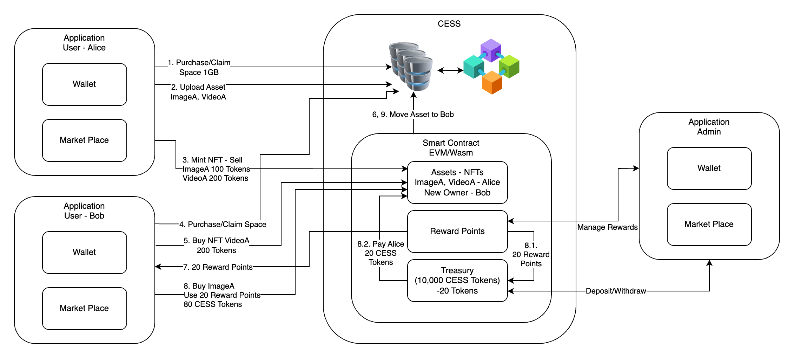
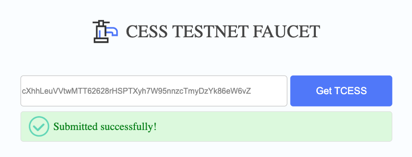
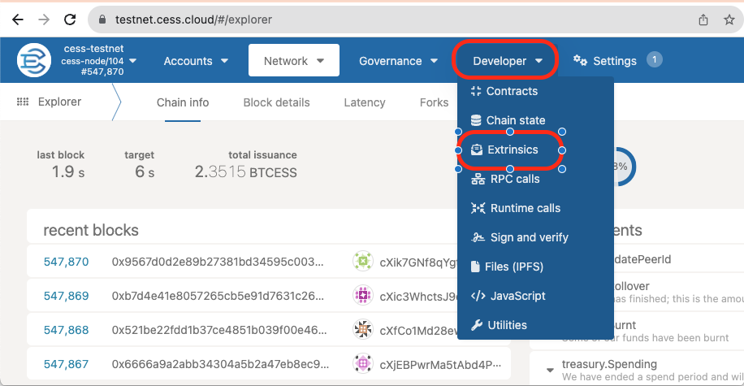
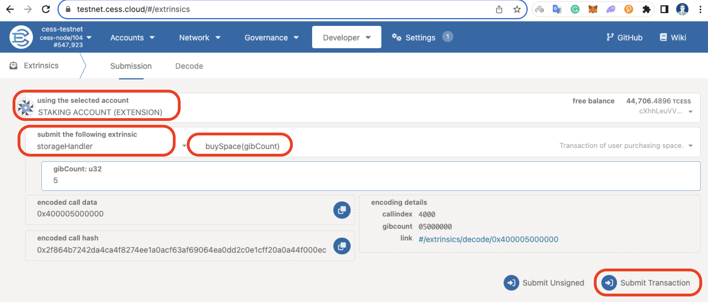

In this tutorial, you will learn the basic idea of how you can build an NTF marketplace on CESS using Ink! You will write a smart contract that will mint NFT tokens for the files that are uploaded to the CESS network. After minting the tokens users will also be able to list and delist their NFT tokens from sale. So, before we get started, let's understand NTF and CESS. If you already know about NFT and CESS, you can skip to NFT Marketplace Architecture. section.


Warning! tl;dr

NOTE: This is going to be a long tutorial. However, it's worth giving time if you really want to understand how to create your own NFT Marketplace.


# What is NFT?

Before we can understand what NFT (Non-Fungible Token) is, we need to understand fungible tokens. Fungible tokens are interchangeable, like Dollar or Bitcoin. Their value stays the same everywhere. For example, on physical currency bills, you can exchange a \$10 bill for another \$10 bill and the worth remains the same. That is, they are interchangeable because both values are the same.

On the other hand, Non-Fungible Tokens are not interchangeable. For example, land properties are non-fungible because two pieces of land are very unlikely to be of the same value. They may have different natural resources and many different factors that can make the land of different value.

In blockchain, Fungible tokens are called ERC-20 tokens, a standard format created by the Ethereum Foundation. Some examples of ERC-20 tokens are Bitcoin (BTC), Tether (USDT), etc. Where Non-Fungible tokens are created using the [ERC-721](https://docs.openzeppelin.com/contracts/4.x/erc721) token standard, which recognizes token ownership. Similar to this there is the [PSP34](https://github.com/w3f/PSPs/blob/master/PSPs/psp-34.md) standard that is written in [ink!](https://use.ink/). This standard is used to store ownership of the tokens/collectibles in the blockchain. These collectibles can be anything like a deed of ownership, land, piece of art, video, images, etc.

# What is CESS?

CESS is a fully decentralized data storage protocol that provides a full-stack solution for all your data storage needs. It is the first decentralized storage protocol that provides users with data ownership rights, that is fast, scalable, efficient in storage space utilization, and guarantees data availability.

CESS provides SDKs and RESTful APIs to upload and download files through the gateway to the CESS network without worrying about understanding the underlying mechanics of the file distribution mechanism of CESS. You can learn more about CESS [here](https://docs.cess.network/cess-wiki/introduction/overview).

# NFT Marketplace Architecture



The above image depicts the overall flow and communication of all the components involved in creating a marketplace. The user application consists of a wallet and a marketplace where users can buy and sell their assets as NFTs. You will also need a smart contract that will implement the PSP34 standard for token ownership, buying, and selling NFTs. Since this tutorial mainly focuses on the basic idea of how we can create an NFT marketplace on CESS, we will not be implementing managing reward points and the Admin application. However, to give an idea of what a complete NFT application looks like, please read the following.

The frontend application can be divided into two parts, user application and admin application. The Admin application will have the right to deposit or withdraw tokens from the smart contract that will be consumed when a user redeems his reward points. We call it a Treasury. They also have the ability to manage reward points. On the other hand, Users will start by obtaining CESS tokens from the User Application. After receiving some tokens, they can proceed with purchasing space or claiming space obtained by the referral program. Once they have some space available for their account, they can then upload assets (image, video, audio, etc.) on the CESS network. To create an NFT, users will first need to upload their NFT asset to CESS and send a transaction with the metadata of ownership of the NFT to the CESS blockchain. After the transaction is confirmed, they can now list their NFT for sale/lease or gift to any other user.

Users can access the marketplace from their application to view all the listed NFTs available for purchase or lease. To purchase an NFT they will be required to have enough tokens in their wallet account. For each purchase, depending on the application configuration, users can be rewarded with a certain amount of reward points. Which they can redeem in their next purchase. Whenever a user redeems their reward points, the sum of the remaining amount to the seller is given from the treasury. Once the ownership is transferred to another user, the associated file is also moved to the new owner's storage space.


NOTE: Since this tutorial is more focused on the basic functionality of an NFT Marketplace, to keep it simple we won't be implementing all the features that are mentioned above.


# How to Create an NFT?

Creating NFTs entails selecting the assets we want to own. For example, a piece of art as an image can be minted as NFT.

We will use CESS to store our assets. Assets can be anything like video, image, audio, etc. And generate JSON metadata of our asset that we will write on CESS Blockchain.

Note here, that we will not store our asset data itself in the blockchain, but rather only the metadata. This is because storing the files themselves on the blockchain will make the blockchain bloated, making all the nodes download our asset, which will not only cost us more but unnecessarily replicate our asset with all the nodes.

NFTs are assigned a unique ID which we will increment as we mint new NFTs. We will use the `last_token_id` to track the last minted token ID.

```rust
#[openbrush::storage_item]
pub struct NftData {
    pub last_token_id: u64,
    pub collection_id: u32,
    pub max_supply: u64,
    pub price_per_mint: Balance,
    pub fid_list: Mapping<Id, String>,
    pub sale_list: Mapping<Id, Balance>,
}
```

When we upload a file to the CESS network we receive a File ID (fid). Since this fid is unique to the CESS network, we can use it as the TokenID for our contract. However, openbrush library throws a `Decoding` error if we use the fid as the TokenID. Therefore, we use a map `fid_list` instead that maps our TokenID to the fid. Similarly, we also have a map that holds all the NFTs that are listed for sale on `sale_list`. The `collection_id` is just an ID for our NFT collection. `max_supply` is the maximum number of NFT tokens that we can mint in our smart contract. Lastly, `price_per_mint` is the price for minting each NFT token. The amount collected from `price_per_mint` is collected in the smart contract that can be withdrawn by the owner of the contract.

# Adding Wallet to your Application

Our application will require a wallet that will help us sign storage and NFT-related transactions and broadcast on the CESS network. Since CESS is built on top of the Substrate framework, CESS supports [polkadot.js](https://polkadot.js.org/) wallet. Depending on the frontend stack you choose, Polkadot provides support for multiple platforms, such as:

- For web apps, please follow [Polkadot.js Extension](https://polkadot.js.org/docs/extension/)
- For Android applications, please follow [Nova Substrate SDK for Android](https://github.com/novasamatech/substrate-sdk-android)
- For iOS applications, please follow [Nova Substrate SDK for iOS](https://github.com/novasamatech/substrate-sdk-ios)

Once the wallet is integrated with the application, make sure to configure it to the CESS test network.

# Uploading assets to CESS

CESS provides us with various SDKs and RESTful APIs to upload our files. We will be using CESS testnet to create our marketplace. The steps will be similar for the mainnet however. We will upload the CryptoPunk image as our asset to CESS. But before we can upload a file to CESS, we need to fulfill some prerequisites. Like funding an account and purchasing space.


## Funding your Account

Funding your account is fairly easy. Visit [CESS Testnet Faucet](https://testnet-faucet.cess.network/) and enter your account address then press Get TCESS. Your account will be funded with 10,000 CESS Tokens.



## Purchasing Space

There are two options for purchasing space.
  1. Using SDK, or
  2. [CESS Explorer](https://testnet.cess.network/)

### A. Purchase space using SDK

Depending on the SDK you choose for your application, the steps below will be somewhat similar. We will be using [Javascript SDK](https://github.com/CESSProject/cess-js-sdk) for this guide.

1. Install Javascript SDK

    ```bash
    # npm
    npm i cess-js-sdk --save
    # yarn
    yarn add cess-js-sdk -S
    # pnpm
    pnpm add cess-js-sdk
    ```

2. Import SDK

    ```js
    import { InitAPI, Space } from "cess-js-sdk";
    ```

3. Initialize API

    ```js
    const {api, keyring} = InitAPI();
    const space = new Space(api, keyring);
    ```

4. Rent Space

    ```js
    // Rent 1GB of storage space for 30 days.
    result = await space.buySpace(mnemonic, 1);
    ```

### B. Purchase space using CESS Explorer

To purchase space, first, navigate to [CESS Explorer](https://testnet.cess.network/) and follow the instructions.

1. Navigate to Developer > Extrinsics

    

2. Select the appropriate account. Then select `storageHandler` under "submit the following extrinsic", and `buySpace(gibCount)` function. Enter the amount of storage space you would like to purchase and click Submit Transaction.

    

## Upload file to CESS

Once we have tokens in our account and enough storage space allocated to our account, we are ready to upload our files to the CESS network. Since we will be using the CESS DeOSS gateway to upload our files, we will have to authenticate the DeOSS gateway so that the gateway can send some storage-related transactions on our behalf and generate an authorization token. For testnet DeOSS we have


DeOSS URL: <http://deoss-pub-gateway.cess.network/>

DeOSS Gateway Account Address: `cXhwBytXqrZLr1qM5NHJhCzEMckSTzNKw17ci2aHft6ETSQm9`


1. To authenticate the DeOSS from the testnet explorer extrinsic section execute `oss` > `authorize(operator)` with the gateway account address given above.

    

2. Generate authorization token: To generate an authorization token, please follow this Guide. It will take approximately 5 minutes.

Now we are ready to upload our files to CESS. We can either use REST API or SDK to upload our files.

### A. Upload using SDK

Once again, we will use the Javascript SDK to upload our files. The initialization phase will be the same as the previous section. Once initialized, we can add the following code snippet.

```js
import { InitAPI, Space, File } from "cess-js-sdk";
const MNEMONIC = "YOUR MNEMONIC SEED";
const ACCOUNT_ID = "YOUR ACCOUNT ID";
const FILE_PATH = resolvePath(joinPath(__dirname, "/home/image.png"));
let BUCKET_NAME = "bucket1";

async function main() {
  const { api, keyring } = await InitAPI(testnetConfig);
  const oss = new File(api, keyring, gatewayURL, true);
  const result = await oss.uploadFile(MNEMONIC, ACCOUNT_ID, FILE_PATH, BUCKET_NAME);
  console.log(getDataIfOk(result), "\n");
}
```

### B. Upload with REST API

Now, we can use REST API to upload our files to the CESS network.

To upload a file execute the following command

```bash
curl -X PUT http://deoss-pub-gateway.cess.network/ \
  -F 'file=@cryptopunk.png;type=image/png' \
  -H "Authorization: eyJh...IL1g" \
  -H "BucketName: my_nfts"
```

Here, `-F` is used to specify the file location and the type of file, `-H` to set your `Authorization` token and `BucketName` where this file will be stored.

Executing this function will return us with an FID that we can use to access our file.

# Marketplace Smart Contract


We will use [ink!](https://use.ink/) to write our smart contract. As I mentioned above, our smart contract will be responsible for creating NFTs based on the [PSP34](https://github.com/w3f/PSPs/blob/master/PSPs/psp-34.md) standard. Before we get started, there are some prerequisites. Please follow [Deploy an Ink! Smart Contract](https://docs.cess.network/core/developer/tutorials/deploy-sc-ink) tutorial and install Rust and `cargo-contract`.

## Development

1. Let's start by creating a new contract

    ```bash
    cargo contract new nft_market
    cd nft_market
    ```

    The last command will create an ink! contract project skeleton.

    Inside the directory, there are three files.

    ```
    nft_market/
      ∟ .gitignore    # contains files to ignore when committing to git
      ∟ Cargo.toml    # This is a Rust project, so there is a Cargo.toml file for the project specification.
      ∟ lib.rs        # The actual smart contract and unit test code.
    ```

2. Let's build and test the contract.

    ```bash
    cargo contract build # This command builds the contract project.
    cargo test           # This command runs the unit test code starting at the `mod tests` line in the code.
    ```

    Running the `cargo contract build` yields three files:

    - `contract.wasm`: the contract code
    - `contract.json`: the contract metadata
    - `contract.contract`: the contract code and metadata

    The front end (see next section) will need to read `contract.json` to know the API of the contract. We will use `contract.contract` to instantiate the contract on-chain.

3. We will use the [openbrush library](https://github.com/Brushfam/openbrush-contracts) that implements the PSP34 token standard and many other useful features that make ink! development faster, safer, and easier. To add openbrush library to your project add the below dependency in your `Cargo.toml`. Also, update your `ink` dependency from `4.2.0` to `~4.2.1`.

    ```toml
    [dependencies]
    ink = { version = "~4.2.1", default-features = false }
    #...
    openbrush = { tag = "4.0.0-beta", git = "https://github.com/Brushfam/openbrush-contracts", default-features = false, features = ["psp34", "ownable", "reentrancy_guard"] }
    #...
    ```

    Now, add `openbrush/std` to the `[features]`:

    ```toml
    [features]
    default = ["std"]
    std = [
        # ...,
        "openbrush/std",
    ]
    ```

4. Open `lib.rs` and remove everything except the top-level structure. You should have:

    ```rust
    #![cfg_attr(not(feature = "std"), no_std, no_main)]

    #[ink::contract]
    mod nft_market {
      // We will fill up the code here next
    }
    ```

5. Let's start with adding the required implementations from Openbrush. We will be using PSP34 token standard, `Ownable` for tokens that can be owned, `PSP34Mintable` to enable users to mint new tokens, `PSP34Metadata` to store our meta data on blockchain, and `PSP34Enumerable` to enumerate through our tokes. We will also need to change `ink::contract` to `openbrush::contract`.

    ```rust
    #![cfg_attr(not(feature = "std"), no_std, no_main)]

    mod impls;

    #[openbrush::implementation(PSP34, PSP34Mintable, PSP34Metadata, PSP34Enumerable, Ownable)]
    #[openbrush::contract]
    mod nft_market {
      // We will fill up the code here next
    }
    ```

6. Ink! contract requires exactly one storage `struct` to store our data on blockchain, at least one constructor, and a message function. With that in mind, let's first add our storage `struct` within our `nft_market` module.

    ```rust
    //...
    mod nft_market {
        // We will add our dependencies here
        #[ink(storage)]
        #[derive(Default, Storage)]
        pub struct NftMarket {
            #[storage_field]
            psp34: psp34::Data,
            #[storage_field]
            guard: reentrancy_guard::Data,
            #[storage_field]
            ownable: ownable::Data,
            #[storage_field]
            metadata: metadata::Data,
            #[storage_field]
            nftdata: impls::types::NftData,
            #[storage_field]
            enumerable: enumerable::Data,
        }
    }
    ```

    Each data type that we wish to store on blockchain needs to be specified with `#[storage_field]` macro.

    - `psp34`: stores PSP34 token standard related data
    - `guard`: is used to prevent reentrancy attacks
    - `ownable`: allows us to create ownable data that can also be transferred,
    - `metadata`: to store custom attribute
    - `nftdata`: we will store our NFT related data here, like the maximum supply, price per mint etc.
    - `enumerable`: to query the number of NFTs issued or to query NFT tokens.

7. Now we need to implement the NftMarket structure and add a constructor to it.

    ```rust
    //...
    mod nft_market {
        ...
        pub struct NftMarket {
           ...
        }

        impl NftMarket {
        #[ink(constructor)]
            pub fn new() -> Self {
                // We will add our code here
            }
        }
    }
    ```

8. Since we have our constructor now, we can add our dependencies in the "We will add our dependencies here" section.

    ```rust
    //...
    mod nft_market {
        use crate::impls;
        use ink::codegen::{EmitEvent, Env};
        use openbrush::{
            contracts::{
                psp34::{extensions::metadata, PSP34Impl},
                reentrancy_guard,
            },
            traits::Storage,
        };
        //...
    }
    ```

    Note here, we haven't created impls module that we have added here as a dependency. Don't worry, we will be creating it soon.

9. To keep our smart contract flexible we will take some inputs from the user while deploying our smart contract, giving them the ability to set

    1. `name`: The name of the smart contract
    2. `symbol`: Token symbol
    3. `base_uri`: Where we can access our NFT file and
    4. `price_per_mint`: Amount of CESS Tokens users will have to pay to mint a token

    With that said, let's define the constructor body that we wrote in step 7.

    ```rust
    //...
    impl NftMarket {
        #[ink(constructor)]
        pub fn new(
            name: String,
            symbol: String,
            base_uri: String,
            max_supply: u64,
            price_per_mint: Balance,
        ) -> Self {
            let mut instance = Self::default();
            let caller = instance.env().caller();
            ownable::InternalImpl::_init_with_owner(&mut instance, caller);
            let col_id = PSP34Impl::collection_id(&instance);
            metadata::InternalImpl::_set_attribute(
                &mut instance,
                col_id.clone(),
                String::from("name"),
                name,
            );
            metadata::InternalImpl::_set_attribute(
                &mut instance,
                col_id.clone(),
                String::from("symbol"),
                symbol,
            );
            metadata::InternalImpl::_set_attribute(
                &mut instance,
                col_id,
                String::from("baseUri"),
                base_uri,
            );
            instance.nftdata.max_supply = max_supply;
            instance.nftdata.price_per_mint = price_per_mint;
            instance
        }
    }
    ```

10. Events: To emit events when a certain event occurs in our smart contract, we can define it with `#[ink(event)]`. We will add `Transfer` and `Approval` events and override the `psp34::Internal` event.

    ```rust
    mod nft_market {
    //...
        /// Event emitted when a token transfer occurs.
        #[ink(event)]
        pub struct Transfer {
            #[ink(topic)]
            from: Option<AccountId>,
            #[ink(topic)]
            to: Option<AccountId>,
            #[ink(topic)]
            id: Id,
        }

        /// Event emitted when a token approve occurs.
        #[ink(event)]
        pub struct Approval {
            #[ink(topic)]
            from: AccountId,
            #[ink(topic)]
            to: AccountId,
            #[ink(topic)]
            id: Option<Id>,
            approved: bool,
        }

        // Override event emission methods
        #[overrider(psp34::Internal)]
        fn _emit_transfer_event(&self, from: Option<AccountId>, to: Option<AccountId>, id: Id) {
            self.env().emit_event(Transfer { from, to, id });
        }

        #[overrider(psp34::Internal)]
        fn _emit_approval_event(&self, from: AccountId, to: AccountId, id: Option<Id>, approved: bool) {
            self.env().emit_event(Approval {
                from,
                to,
                id,
                approved,
            });
        }
    //...
    }
    ```

11. Now let's create our custom storage item `NftData`. For that create a new directory `impls` and create `mod.rs`, `types.rs` and `market.rs`.  Your directory structure should look like:

    ```
    .
    ├── Cargo.lock
    ├── Cargo.toml
    ├── impls
    │   ├── market.rs
    │   ├── mod.rs
    │   └── types.rs
    └── lib.rs
    ```

12. Open your mod.rs file and add

    ```rust
    pub mod market;
    pub mod types;
    ```

13. Now, open `types.rs` to create our custom `NftData` structure.

    ```rust
    use openbrush::{traits::{Balance, String}, storage::Mapping, contracts::psp34::Id};

    #[derive(Default, Debug)]
    #[openbrush::storage_item]
    pub struct NftData {
        pub last_token_id: u64,
        pub collection_id: u32,
        pub max_supply: u64,
        pub price_per_mint: Balance,
        pub fid_list: Mapping<Id, String>,
        pub sale_list: Mapping<Id, Balance>,
    }
    ```

    Here,

    - `last_token_id` holds the id of the latest minted token ID. This is so that every new token generated will increment `last_token_id` to give the tokens a unique ID.
    - `collection_id` is a unique ID of our collection.
    - `max_supply` is the maximum number of NFTs that we can mint.
    - `price_per_mint` is the price that users will have to pay to mint their NFTs.
    - `fid_list` is a map of Token ID and the File ID that we mint as our NFT.
    - `sale_list` contains the list of NFTs that are listed for sale.

    Any custom data structure that we create that needs to be stored on the blockchain needs to be marked with `#[openbrush::storage_item]` macro. We will also add an `enum` that will contain our error messages.

    ```rust
    //...
    #[derive(Debug, PartialEq, Eq, scale::Encode, scale::Decode)]
    #[cfg_attr(feature = "std", derive(scale_info::TypeInfo))]
    pub enum NftError {
        BadMintValue,
        CollectionIsFull,
        WithdrawalFailed,
        NotTokenOwner,
        NotForSale,
        OwnToken,
        PriceNotMatch,
        TransferNativeTokenFailed,
    }

    impl NftError {
        pub fn as_str(&self) -> String {
            match self {
                NftError::BadMintValue => String::from("BadMintValue"),
                NftError::CollectionIsFull => String::from("CollectionIsFull"),
                NftError::WithdrawalFailed => String::from("WithdrawalFailed"),
                NftError::NotTokenOwner => String::from("NotTokenOwner"),
                NftError::NotForSale => String::from("NotForSale"),
                NftError::OwnToken => String::from("OwnToken"),
                NftError::PriceNotMatch => String::from("PriceNotMatch"),
                NftError::TransferNativeTokenFailed => String::from("TransferNativeTokenFailed"),
            }
        }
    }
    ```

14. Now comes the exciting part where we will write our actual contract functionality. You guessed it right! In our `market.rs` file. In our `market.rs` file, we will add our custom trait that inherits openbrush traits to add our methods to the contract.

    ```rust
    use ink::prelude::string::ToString;

    use openbrush::{
        contracts::{
            ownable::{self, only_owner},
            psp34::{
                self,
                extensions::metadata::{self, PSP34MetadataImpl},
                Id, PSP34Error, PSP34Impl,
            },
            reentrancy_guard,
            reentrancy_guard::non_reentrant,
        },
        modifiers,
        traits::{AccountId, Balance, Storage, String},
    };

    use super::types::{NftData, NftError};

    #[openbrush::trait_definition]
    pub trait MarketImpl:
        Storage<NftData>
        + Storage<psp34::Data>
        + Storage<reentrancy_guard::Data>
        + Storage<ownable::Data>
        + Storage<metadata::Data>
        + PSP34Impl
        + PSP34MetadataImpl
        + psp34::extensions::metadata::Internal
        + Internal
    {
        // We will write our functions here
    }
    ```

15. Let's add our first function to the `MarketImpl`. The `mint` function! That will mint our NFT.

    ```rust
    // Mint token to
    #[ink(message, payable)]
    #[modifiers(non_reentrant)]
    fn mint(&mut self, fid: String) -> Result<Id, PSP34Error> {
        self.check_fid(fid.clone())?;
        self.check_value(Self::env().transferred_value())?;

        let caller = Self::env().caller();
        let id = Id::U64(self.data::<NftData>().last_token_id + 1); // first mint id is 1
        self._mint_to(caller, id.clone())?;
        self.data::<NftData>().fid_list.insert(&id, &fid);
        self.data::<NftData>().last_token_id += 1;
        Ok(id)
    }
    ```

    Since users will have to pay tokens to mint an NFT, we will add `payable` macro to this function. Also, adding `message` macro makes the function available to the API for calling the contract. More about the `message` can be found [here](https://use.ink/macros-attributes/message).

    Don't worry about the check_fid and check_value functions here we will define them in the later section. The mint function accepts `fid` as input from the users. This `fid` is the file ID that we will obtain when we upload a file to the CESS network. In our `mint` function, we first extract the `caller` by calling `Self::env()::caller()`, then we generate a new token `id`, and mint the NFT token to the caller. We also store our file ID in the `fid_list` map which maps our token `id` to the `fid`. And lastly, we increment the `last_token_id`.

16. If you would like to enable users to mint tokens for other users you can add the following function.

    ```rust
    // Mint token to
    #[ink(message, payable)]
    #[modifiers(non_reentrant)]
    fn mint_to(&mut self, to: AccountId, fid: String) -> Result<Id, PSP34Error> {
        self.check_fid(fid.clone())?;
        self.check_value(Self::env().transferred_value())?;

        let id = Id::U64(self.data::<NftData>().last_token_id + 1); // first mint id is 1
        self._mint_to(to, id.clone())?;
        self.data::<NftData>().fid_list.insert(&id, &fid);
        self.data::<NftData>().last_token_id += 1;
        Ok(id)
    }
    ```

17. To enable contract owner to set or update `base_uri` and `max_supply` add the following function

    ```rust
    // Set new value for the baseUri
    #[ink(message)]
    #[modifiers(only_owner)]
    fn set_base_uri(&mut self, uri: String) -> Result<(), PSP34Error> {
        let id = PSP34Impl::collection_id(self);
        metadata::Internal::_set_attribute(self, id, String::from("baseUri"), uri);
        Ok(())
    }

    // Set max supply of tokens
    #[ink(message)]
    #[modifiers(only_owner)]
    fn set_max_supply(&mut self, value: u64) -> Result<(), PSP34Error> {
        self.data::<NftData>().max_supply = value;
        Ok(())
    }
    ```

    > Note: The `#[modifiers(only_owner)]` macro as the name suggests, makes a function to be called only by the owner of the contract.

18. Let's add some functions that users can call to get some information stored in our contract.

    ```rust
    // Get URI from token ID
    #[ink(message)]
    fn token_uri(&self, id: u64) -> Result<String, PSP34Error> {
        let id = Id::U64(id);
        self.token_exists(id.clone())?;
        let base_uri = PSP34MetadataImpl::get_attribute(
            self,
            PSP34Impl::collection_id(self),
            String::from("baseUri"),
        );
        let fid = self
            .data::<NftData>()
            .fid_list
            .get(&id)
            .ok_or(PSP34Error::TokenNotExists)?;

        let token_uri = base_uri.unwrap() + &fid;
        Ok(token_uri)
    }

    // Get token price
    #[ink(message)]
    fn price(&self, id: u64) -> Result<Balance, PSP34Error> {
        let id = Id::U64(id);
        let price = self
            .data::<NftData>()
            .sale_list
            .get(&id)
            .ok_or(PSP34Error::Custom(NftError::NotForSale.as_str()));
        price
    }

    // Get price per mint
    #[ink(message)]
    fn price_per_mint(&self) -> Balance {
        self.data::<NftData>().price_per_mint
    }

    // Get max supply of tokens
    #[ink(message)]
    fn max_supply(&self) -> u64 {
        self.data::<NftData>().max_supply
    }

     // Get Contract Balance
    #[ink(message)]
    fn balance(&mut self) -> Balance {
        let balance = Self::env().balance();
        let current_balance = balance
            .checked_sub(Self::env().minimum_balance())
            .unwrap_or_default();
        current_balance
    }
    ```

19. Finally lets add the functions that will allow users to list and sell our NFTs

    ```rust
    /// Lists NFT for Sale
    #[ink(message)]
    fn list(&mut self, id: u64, price: Balance) -> Result<(), PSP34Error> {
        let id = Id::U64(id);
        self.check_owner(id.clone())?;
        self.data::<NftData>()
            .sale_list
            .insert(&id, &(price * 1_000_000_000_000));
        Ok(())
    }

    /// Delist NFT from Sale
    #[ink(message)]
    fn delist(&mut self, id: u64) -> Result<(), PSP34Error> {
        let id = Id::U64(id);
        self.check_owner(id.clone())?;
        if self.data::<NftData>().sale_list.get(&id).is_none() {
            return Err(PSP34Error::Custom(NftError::NotForSale.as_str()));
        }
        self.data::<NftData>().sale_list.remove(&id);
        Ok(())
    }

    /// Purchase NFT that is listed for Sale
    #[ink(message, payable)]
    fn purchase(&mut self, id: u64) -> Result<(), PSP34Error> {
        let id = Id::U64(id);
        let owner = self._check_token_exists(&id.clone())?;
        let caller = Self::env().caller();
        if owner == caller {
            return Err(PSP34Error::Custom(NftError::OwnToken.as_str()));
        };

        let price = self
            .data::<NftData>()
            .sale_list
            .get(&id)
            .ok_or(PSP34Error::Custom(NftError::NotForSale.as_str()))?;
        let transferred = Self::env().transferred_value();

        if price != transferred {
            return Err(PSP34Error::Custom(
                NftError::PriceNotMatch.as_str()
                    + "Required:"
                    + &price.to_string()
                    + ", Supplied:"
                    + &transferred.to_string(),
            ));
        }

        // Transfer native tokes
        if Self::env().transfer(owner, price).is_err() {
            return Err(PSP34Error::Custom(
                NftError::TransferNativeTokenFailed.as_str(),
            ));
        }

        self.data::<NftData>().sale_list.remove(&id);

        // Transfer NFT Token
        self._before_token_transfer(Some(&owner), Some(&caller), &id)?;
        self._remove_operator_approvals(&owner, &caller, &Some(&id));
        self._remove_token_owner(&id);
        self._insert_token_owner(&id, &caller);
        self._after_token_transfer(Some(&owner), Some(&caller), &id)?;
        self._emit_transfer_event(Some(owner), Some(caller), id.clone());

        // TODO: Move CESS File metadata from owner to caller

        Ok(())
    }

    /// Withdraws funds to contract owner
    #[ink(message)]
    #[modifiers(only_owner)]
    fn withdraw(&mut self) -> Result<(), PSP34Error> {
        let balance = Self::env().balance();
        let current_balance = balance
            .checked_sub(Self::env().minimum_balance())
            .unwrap_or_default();
        let owner = self.data::<ownable::Data>().owner.get().unwrap().unwrap();
        Self::env()
            .transfer(owner, current_balance)
            .map_err(|_| PSP34Error::Custom(NftError::WithdrawalFailed.as_str()))?;
        Ok(())
    }
    ```

    The `list` function lists our NFT for sale, whereas `delist` removes our NFT from sale. Once a user has listed his NFT for sale, the NFT becomes available for other users to purchase. They can call the `purchase` function with the NFT id that they would like to purchase. Since purchase is a payable function, users will also have to transfer the desired amount of tokens in order for a successful transfer.

    > Note: In the `market.rs` file you will notice some TODOs. To keep the tutorial simple, we haven't implemented those functions.

    Finally, the `withdraw` function withdraws all the collected tokens while minting NFT to the contract owner's address.

20. Now, let's create a custom trait that inherits `internal` trait for our NftData. The functions defined within the Internal trait will not be exposed to the users, hence called internal. We will add some functions for verification of owner, transfered funds etc.

    ```rust
    pub trait Internal: Storage<NftData> + psp34::Internal {
        /// Check if the caller is owner of the token
        fn check_owner(&self, id: Id) -> Result<(), PSP34Error> {
            let owner = self._check_token_exists(&id.clone())?;
            let caller = Self::env().caller();
            if owner != caller {
                return Err(PSP34Error::Custom(NftError::NotTokenOwner.as_str()));
            }
            Ok(())
        }

        /// Check if the transferred mint value is as expected
        fn check_value(&self, transferred_value: u128) -> Result<(), PSP34Error> {
            if transferred_value != self.data::<NftData>().price_per_mint {
                return Err(PSP34Error::Custom(
                    NftError::BadMintValue.as_str()
                        + "Required:"
                        + &self.data::<NftData>().price_per_mint.to_string()
                        + ", Supplied:"
                        + &transferred_value.to_string(),
                ));
            }

            if self.data::<NftData>().last_token_id >= self.data::<NftData>().max_supply {
                return Err(PSP34Error::Custom(NftError::CollectionIsFull.as_str()))
            }

            Ok(())
        }

        fn check_fid(&self, _fid: String) -> Result<(), PSP34Error> {
            // TODO: Check if fid exists in CESS Chain.
            Ok(())
        }

        fn token_exists(&self, id: Id) -> Result<(), PSP34Error> {
            self._owner_of(&id).ok_or(PSP34Error::TokenNotExists)?;
            Ok(())
        }
    }
    ```

21. Lastly, let's add our trait implementation for our NftMarket. Open lib.rs and add the follwing code.

    ```rust
    impl impls::market::Internal for NftMarket {}
    impl impls::market::MarketImpl for NftMarket {}

    impl NftMarket {
      //...
    }
    ```

    With this, our smart contract is now ready to be compiled and deployed. Please follow our Deploying smart contract with Ink! To deploy the smart contract and interact with it.



A full code of this tutorial can be found at:

<https://github.com/CESSProject/cess-examples/tree/main/ink/nft_market>


# Conclusion

In this tutorial, we have learned what NFT is, and how we can use CESS to store our NFT file. We also learned how to use openbrush to implement PSP34 token standards and the way ink contracts are structured and fully implemented in an NFT marketplace with the most basic functionality that enables users to mint and sell their NFTs.

# What's Next?

In the next session, we will learn to build a front-end that will interact with our smart contract and enable users to upload, sell and purchase NFTs.

# References

- <https://use.ink/smart-contracts-polkadot/>
- <https://spin.atomicobject.com/2021/08/16/reentrancy-guard-smart-contracts/>
