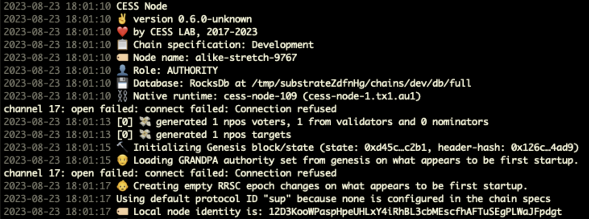
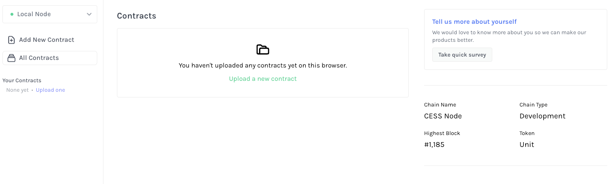
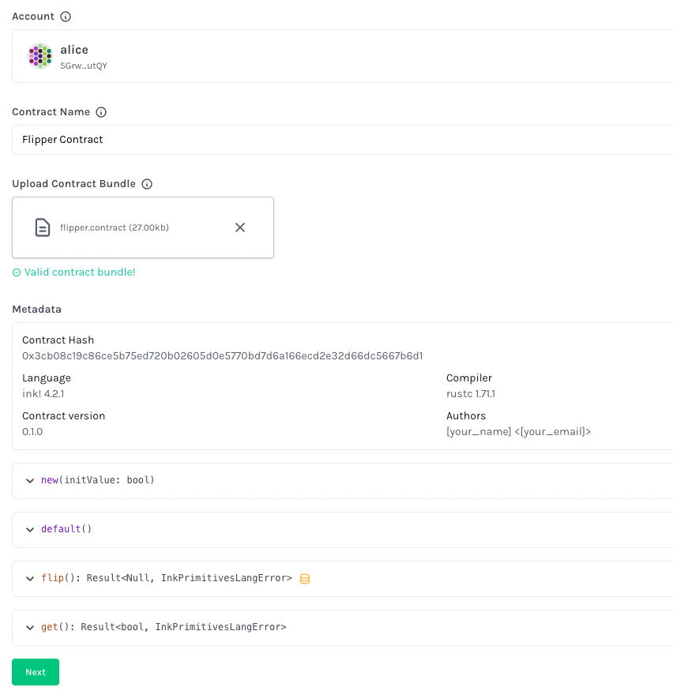
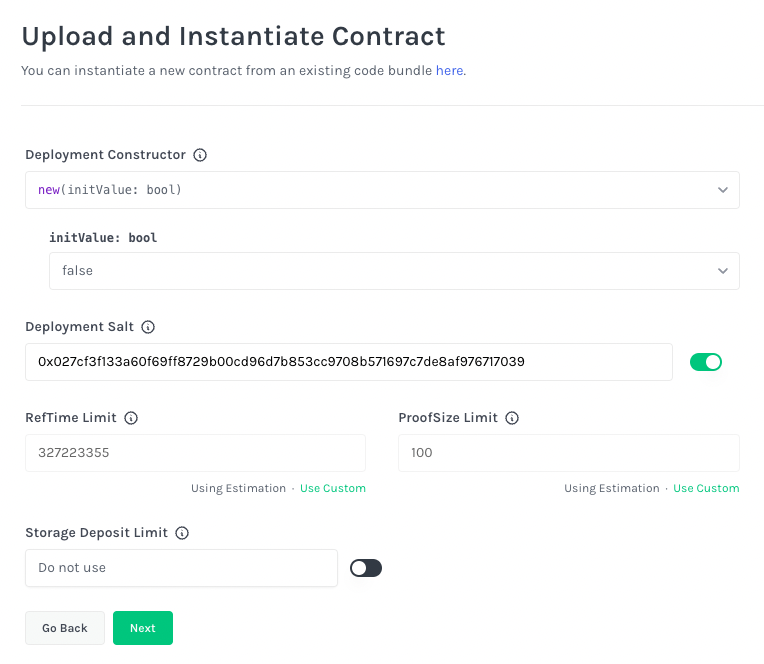
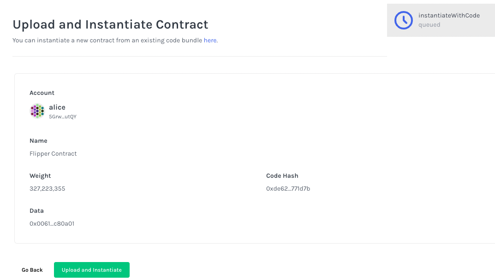
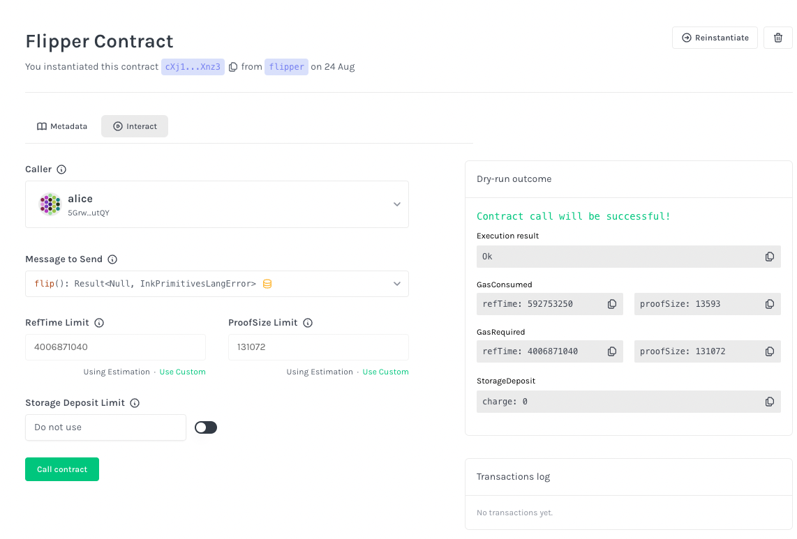

# Overview

In this tutorial, we will learn how to deploy an [**ink!** Smart Contract](https://use.ink/) on CESS blockchain. ink! is developed by Parity, the implementation team responsible for the Polkadot Network, and is compiled into Wasm code for execution. It supports running in the WebAssembly Virtual Machine (Wasm VM), and Rust developers can use their already-familiar toolchain to develop smart contracts instead of learning a new language and toolchain.

# Prerequisite

- Install the **Rust** language and **cargo**. You can also check the [official guide](https://www.rust-lang.org/tools/install).

   ```bash
   curl --proto '=https' --tlsv1.2 -sSf https://sh.rustup.rs | sh
   ```

- Next, install `cargo-contract`, a CLI tool to help setting up and managing WebAssembly smart contracts written in ink! ([GitHub repo](https://github.com/paritytech/cargo-contract).

   ```bash
   # Install an additional component `rust-src`
   rustup component add rust-src
   # Install `cargo-contract`
   cargo install cargo-contract --force --locked cargo-contract
   # Install `dylint`, a linting tool
   cargo install cargo-dylint dylink-link
   ```

- Verify the installation is successful by running the command:

   ```bash
   cargo contract --help
   ```

   This should display the command help messages similar to the following.

   ```
   Utilities to develop Wasm smart contracts

   Usage: cargo contract <COMMAND>

   Commands:
     new          Setup and create a new smart contract project
     build        Compiles the contract, generates metadata, bundles both together in a `<name>.contract` file
     ...
   ```

# Create a Smart Contract

We will create a new smart contract project using the `cargo-contract` package downloaded in the previous step. Run the following command:

```bash
cargo contract new flipper
```

This command generates the following directory with three files

```
flipper
  ∟ .gitignore
  ∟ Cargo.toml
  ∟ lib.rs
```

Take a peek into `Cargo.toml` on the contract dependencies and `lib.rs` on the contract source code.

Next, we will compile the code and run the test cases inside `lib.rs` to check everything work accordingly.

```bash
cd flipper
cargo test
```

You should see the following output. This means all test cases have passed.

```
running 2 tests
test flipper::tests::it_works ... ok
test flipper::tests::default_works ... ok

test result: ok. 2 passed; 0 failed; 0 ignored; 0 measured; 0 filtered out; finished in 0.00s

   Doc-tests flipper

running 0 tests

test result: ok. 0 passed; 0 failed; 0 ignored; 0 measured; 0 filtered out; finished in 0.00s
```

We can now build the contract code:

```bash
cargo contract build
```

After the build is complete, the output artifacts are stored in `target/ink/` directory. There are three key output files:

- `flipper.wasm` - the wasm binary.
- `flipper.json` - a metadata file containing the contract ABI.
- `flipper.contract` - the contract code that bundles the above two files.

You can also make a release build with `cargo contract build --release`. The release build has optimization settings to make the code run more efficient in the Wasm VM, but the debug build is good enough for now.


You can also use one of the [sample ink! smart contract codes here](https://github.com/CESSProject/cess-course/tree/main/examples/ink).


# Deploy a Smart Contract

- Run a local [CESS node](https://github.com/CESSProject/cess) in development mode. Perform the following commands to clone CESS node source code, compile it, and run a local node.

   ```bash
   # Select the appropriate/latest git tag from the git repository
   git clone https://github.com/CESSProject/cess.git --branch v0.7.4
   cd cess
   # The build process will take probably 10 mins depending on your machine spec
   cargo build
   target/debug/cess-node --dev
   ```

   The node will start running and the console will display something as below.

   

- We will use **Substrate Contracts UI** to deploy and interact with an ink! smart contract, a UI tool developed by Parity. Let's connect Substrate Contracts UI to our local CESS node by:

   <https://contracts-ui.substrate.io/?rpc=ws://127.0.0.1:9944>.<br/>

   

- Click **Upload a new contract**.

- In the next screen,
   - In *Account* select box, select **alice** to deploy the contract from Alice
   - Give the *Contract Name* the value **Flipper Contract**, and
   - Drag or open the file **target/ink/flipper.contract** in the *Upload Contract Bundle*.

   You should see the contract metadata after choosing the right contract file. Then click **Next**.<br/>

   

- Here, note that the contract code upload and instantiation are separated into two steps. In CESS chain you can have one copy of the smart contract code and multiple instances of that smart contract with different initialization configurations, thus saving blockchain space and encouraging code reuse. For example, multiple ERC20 tokens can reuse the same contract code with different units, logos, and symbols.

   In this screen, we are combining code upload and contract instantiation in one step.

   - *Deployment Constructor*: select **new(initValue: bool)**
   - *initValue: bool*: select **false**
   - Leave the remaining setting unchanged, and click **Next**<br/>

   

- In the next screen, confirm everything looks good and click **Upload and Instantiate**.<br/>

   

- You have successfully instantiated a sample flipper contract in this screen.

   Try interact with the flipper contract by reading the value from the smart contract and issue a transaction to it!<br/>

   

# References

- [**ink!** official documentation](https://use.ink/)
- [CESS node repo](https://github.com/CESSProject/cess)
- [ink! examples repo](https://github.com/paritytech/ink-examples)
- [Substrate Contracts UI repo](https://github.com/paritytech/contracts-ui)
