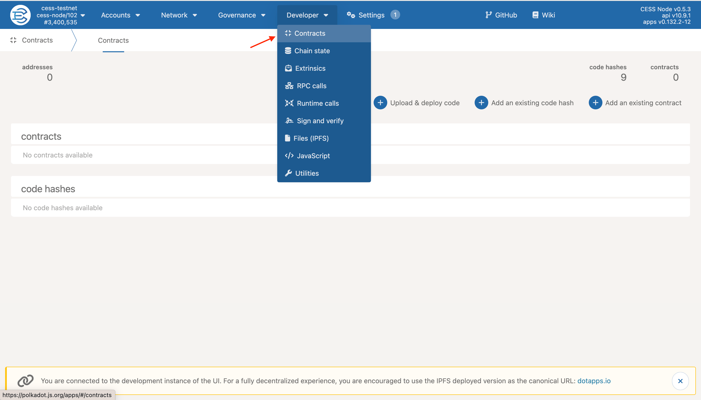
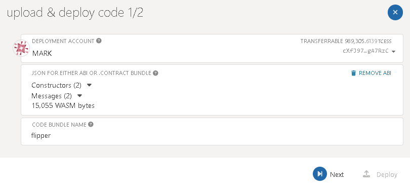
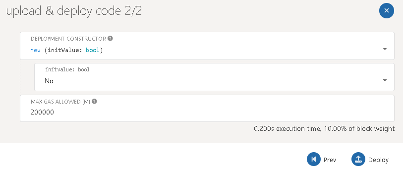
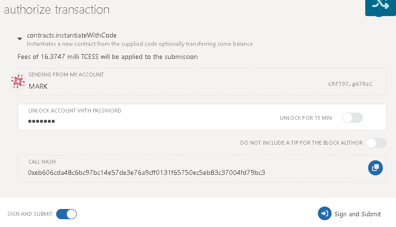
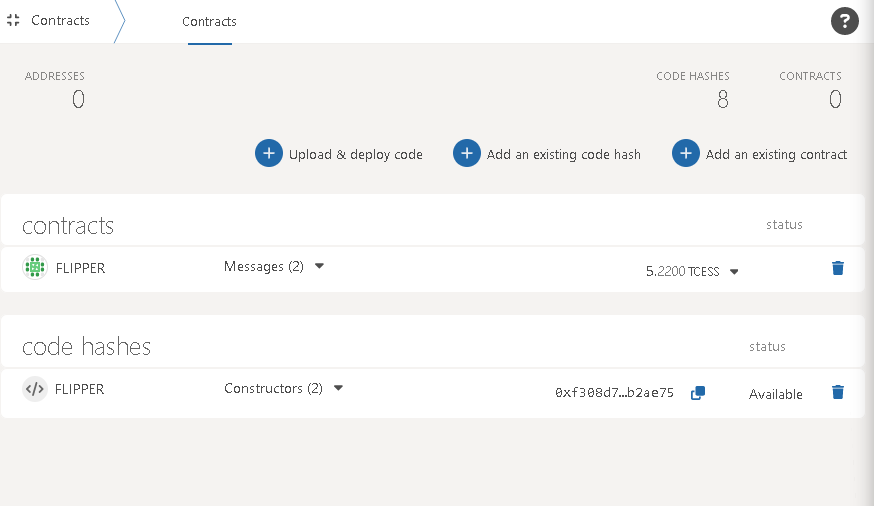
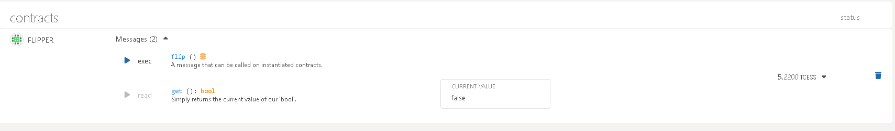

# Prerequisite

To provides a command-line interface for working with smart contracts using the [**ink!** language](https://use.ink/), install the WebAssembly optimizer `binaryen`:

```bash
sudo apt install binaryen
```

To warn you about issues that might lead to security vulnerabilities, install `cargo-dylint` to check **ink!** contracts:

```bash
cargo install cargo-dylint dylint-link
```

Install `cargo-contract`:

```bash
cargo install cargo-contract --force
```

Verify the installation and explore the commands:

```bash
cargo contract --help
```

# Create a Smart Contract

We will create new smart contract project using the `cargo-contract` package downloaded in the previous steps. Run the following command:

```bash
cargo contract new flipper
cd flipper
code .
```

Open the `Cargo.toml` file and have version 3.3 for all ink crates.

```toml
ink_primitives = { version = "3.3", default-features = false }
ink_metadata = { version = "3.3", default-features = false, features = ["derive"], optional = true }
ink_env = { version = "3.3", default-features = false }
ink_storage = { version = "3.3", default-features = false }
ink_lang = { version = "3.3", default-features = false }
```

Run the test for the flipper contract:

```bash
cargo test
```

You should see the following output:

```
running 2 tests
test flipper::tests::it_works ... ok
test flipper::tests::default_works ... ok
test result: ok. 2 passed; 0 failed; 0 ignored; 0 measured; 0 filtered out
```

To build and generate the WebAssembly binary for the contract project:

```bash
cargo +nightly contract build
```

After the build is complete, you can find the "flipper.contract" file under the `target/ink/` folder. This file will be used to deploy the contracts on the CESS network.

# Deploy a Smart Contract

Open [CESS Explorer](https://testnet.cess.cloud) and navigate to **Developers => Contracts** page.



Click on **Upload & Deploy Code** button to open `Upload & Deploy Code` dialog box.

On the dialog box, select the account which will be used as the deployment account and upload the **flipper.contract** file.



Give a discriptive name to the contract and click the next button to advance to the next dialog box.



Depending on the Deployment Constructor, review and update the values if needed or accept the default values and click **Deploy**.



Authorize and submit signed transaction and wait for the transaction to be included into the block.

Once the contract is deployed, you can view the contract in the *Contracts* page as shown in the following.



To access the contract, you can open the contracts page and in contracts list, you can find the list of all the contracts diployed.



As shown in the above, you can access smart contract functions using the [CESS Explorer](https://testnet.cess.cloud).
