# Preparation

You will need the following to deploy a Solidity smart contract to CESS.

- **MetaMask**: Required to get an Ethereum address and to connect to the CESS chain
- **Remix IDE**: IDE to develop, compile, and deploy smart contracts to the chain
- **Access to CESS Node**: Make sure the node allows access to MetaMask

For the current guide, we will be deploying the contract to the CESS test-chain. The following steps will guide you to deploy EVM-based contracts on the CESS chain.

# Add CESS Network to MetaMask

Open the MetaMask setting tab, click on the **Networks** tab, click on **Add a network** and then **Add a network manually**.

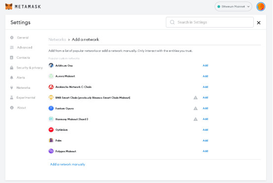

On **Add a network manually** page, enter the following details:

- Network Name: **CESS Testnet**
- New RPC URL:
   - <https://testnet-rpc0.cess.cloud/ws/>
   - <https://testnet-rpc1.cess.cloud/ws/>
   - <https://testnet-rpc2.cess.cloud/ws/>
- Chain ID: **11330**
- Currency Symbol: **MTCESS**

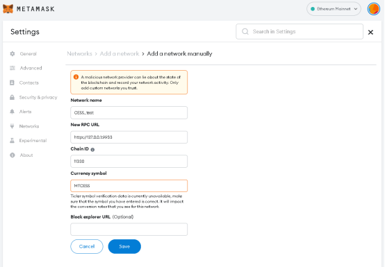


In case MetaMask is not able to connect your RPC URL, make sure the CORS is allowed for MetaMask in the CESS node.


# Convert the Account Address to a CESS-supported Address

Copy the account address from MetaMask.

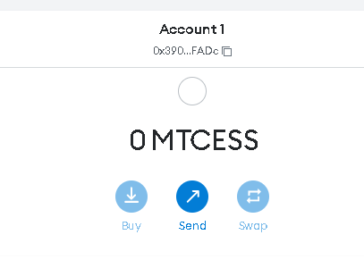

Open the following link [Substrate Address Converter](https://hoonsubin.github.io/evm-substrate-address-converter).

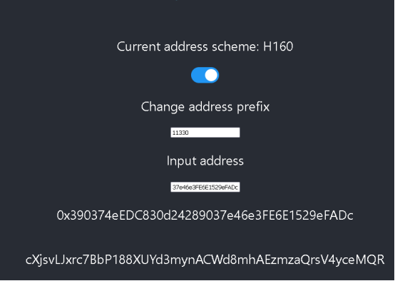

# Fund the Account

Using [CESS Explorer](https://testnet.cess.cloud/) **Accounts -> Transfer** to transfer some balance to the contract address.

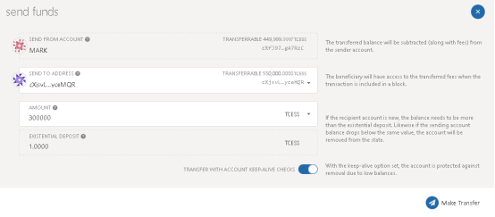

# Validate the Fund

To validate the funds are in the Ethereum account, open MetaMask and check that account has the funds transferred

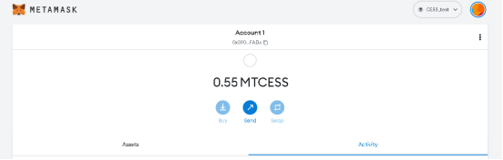

# Deploy a Contract Using Remix IDE

Open [Remix IDE](https://remix.ethereum.org/) and go to **File explorer**.

In File explorer, open the smart contract you wish to compile and then deploy.

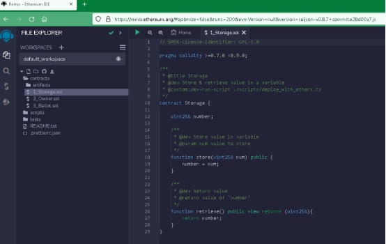

Once the file is selected, go to tab **Solidity Compiler**, you should see the selected file, press the **Compile** button to compile the contract. Once compiled, you’ll see the "green tick" mark and compiled (\*.sol) file.

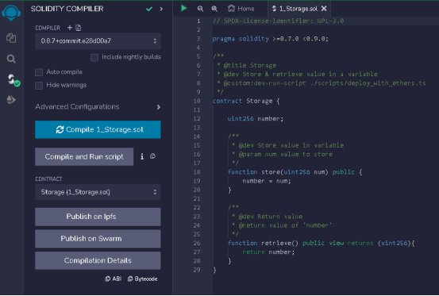

Go to **Deploy and run Transactions**, once the compilation is successful, you should see the compiled \*.sol file selected, ready to be deployed. In the **Environments** drop-down, select **Injected Provider - MetaMask** and click **deploy**.

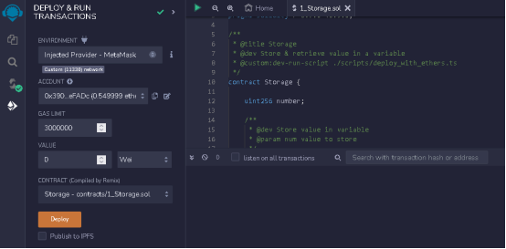


When you click **Deploy**, you may need to click confirm in MetaMask to allow Remix to access the account and submit the transaction.


Click **Confirm** to submit the transaction to deploy the smart contract.

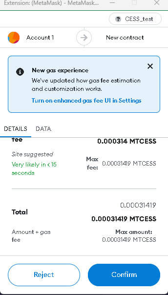

After the transaction is deployed and mined on the chain, you’ll see the following message.

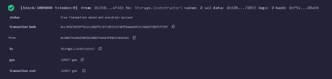

In the **Deployed Contracts** section in the Remix, you can call the function of the smart contract.

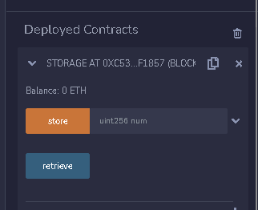

# Transfer Tokens to the CESS Account

Convert the Substrate address to Ethereum account address using the link [Substrate Address Converter](https://hoonsubin.github.io/evm-substrate-address-converter).

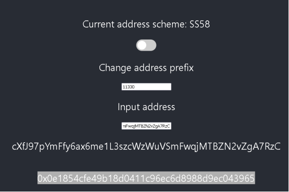

Copy the Ethereum equivalent address and use MetaMask to transfer fund.

<table>
  <tr>
    <td>
      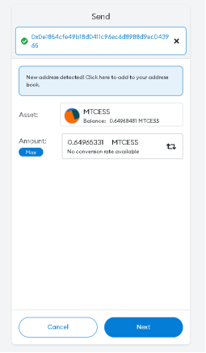
       Transfer Fund in Metamask 1
    </td>
    <td>
      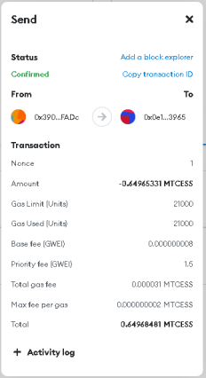
       Transfer Fund in Metamask 2
    </td>
  </tr>
</table>

Confirm the balance in the [CESS Explorer: Developer RPC calls](https://testnet.cess.cloud/#/rpc). Use the Ethereum address in previous step.

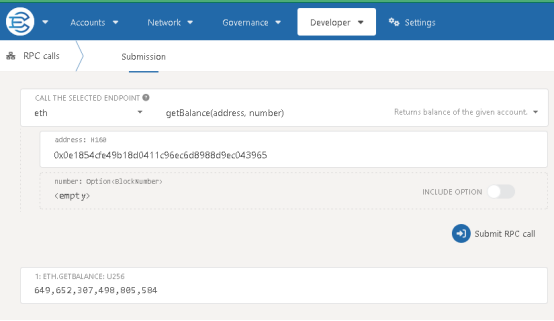

# Withdraw Balances to the CESS Account

To withdraw the balance from the Ethereum account to CESS account, follow the route **Developer => Extrinsics => evm => withdraw**.

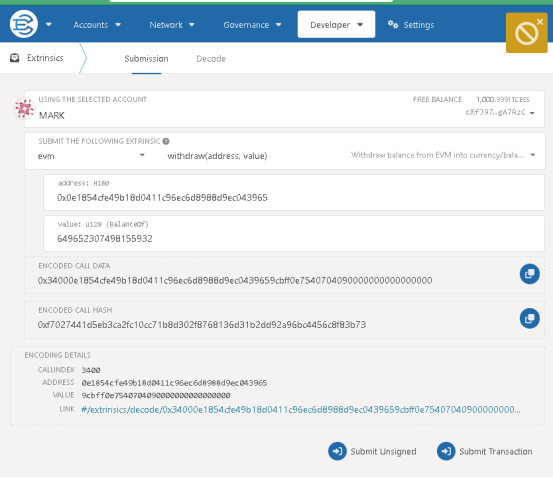

Validate the balances in **Accounts** tab of CESS Explorer.

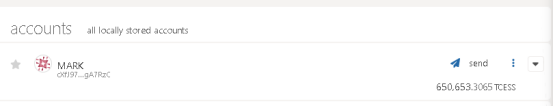
