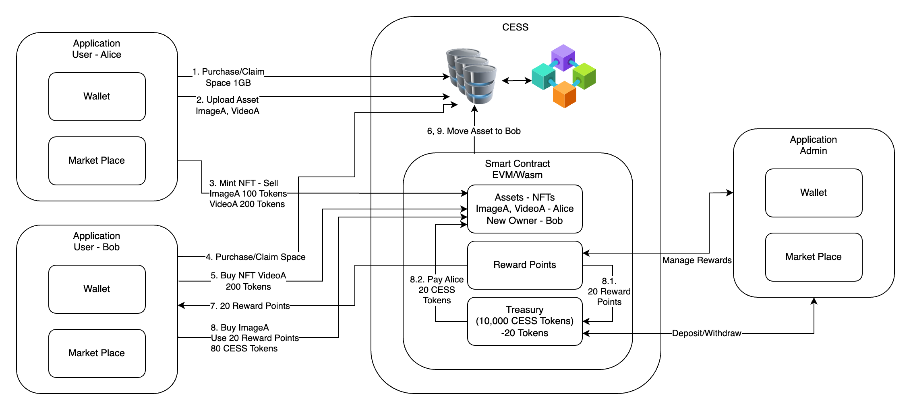
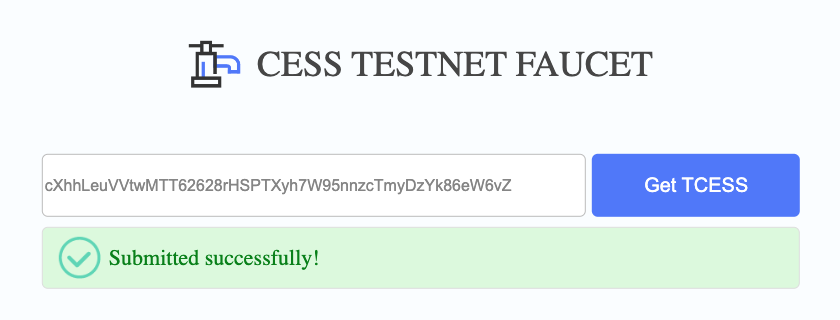
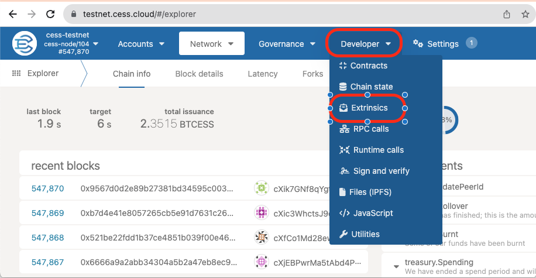
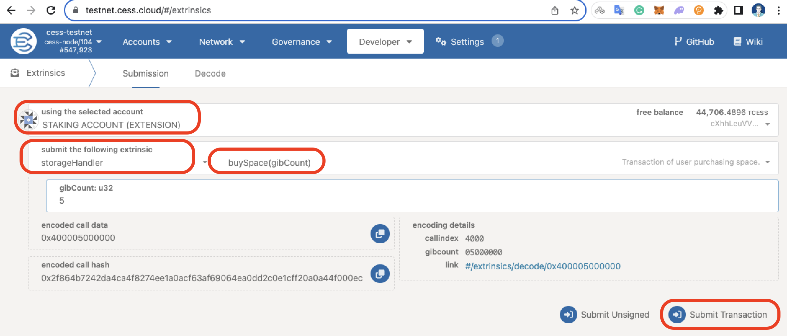

In this tutorial, you will learn the basic idea of how you can build an NTF marketplace on CESS using Ink! You will write a smart contract that will mint NFT tokens for the files that are uploaded to the CESS network. After minting the tokens users will also be able to list and delist their NFT tokens from sale. So, before we get started, let's understand NTF and CESS. If you already know about NFT and CESS, you can skip to NFT Marketplace Architecture. section.


Warning! TLTD;

NOTE: This is going to be a long tutorial. However, it's worth giving time if you really want to understand how to create your own NFT Marketplace.


# What is NFT?

Before we can understand what NFT (Non-Fungible Token) is, we need to understand fungible tokens. Fungible tokens are interchangeable, like Dollar or Bitcoin. Their value stays the same everywhere. For example, on physical currency bills, you can exchange a \$10 bill for another \$10 bill and the worth remains the same. That is, they are interchangeable because both values are the same.

On the other hand, Non-Fungible Tokens are not interchangeable. For example, land properties are non-fungible because two pieces of land are very unlikely to be of the same value. They may have different natural resources and many different factors that can make the land of different value.

In blockchain, Fungible tokens are called ERC-20 tokens, a standard format created by the Ethereum Foundation. Some examples of ERC-20 tokens are Bitcoin (BTC), Tether (USDT), etc. Where Non-Fungible tokens are created using the [ERC-721](https://docs.openzeppelin.com/contracts/4.x/erc721) token standard, which recognizes token ownership. Similar to this there is the [PSP34](https://github.com/w3f/PSPs/blob/master/PSPs/psp-34.md) standard that is written in [ink!](https://use.ink/). This standard is used to store ownership of the tokens/collectibles in the blockchain. These collectibles can be anything like a deed of ownership, land, piece of art, video, images, etc.

# What is CESS?

CESS or Cumulus Encrypted Storage is a fully decentralized data storage protocol that provides a full-stack solution for all your data storage needs. It is the first decentralized storage protocol that provides users with data ownership rights, that is fast, scalable, efficient in storage space utilization, and guarantees data availability.

CESS provides SDKs and RESTful APIs to upload and download files through the gateway to the CESS network without worrying about understanding the underlying mechanics of the file distribution mechanism of CESS. You can learn more about CESS [here](https://docs.cess.cloud/cess-wiki/introduction/overview).

# NFT Marketplace Architecture



The above image depicts the overall flow and communication of all the components involved in creating a marketplace. The user application consists of a wallet and a marketplace where users can buy and sell their assets as NFTs. You will also need a smart contract that will implement the PSP34 standard for token ownership, buying, and selling NFTs. For the simplicity of this tutorial,

Since this tutorial mainly focuses on the basic idea of how we can create an NFT marketplace on CESS, we will not be implementing managing reward points and the Admin application. However, to give an idea of what a complete NFT application looks like, please read the following.

The frontend application can be divided into two parts, user application and admin application.   The Admin application will have the right to deposit or withdraw tokens from the smart contract that will be consumed when a user redeems his reward points. We call it a Treasury. They also have the ability to manage reward points. On the other hand, Users will start by obtaining CESS tokens from the User Application. After receiving some tokens, they can proceed with purchasing space or claiming space obtained by the referral program. Once they have some space available for their account, they can then upload assets (image, video, audio, etc.) on the CESS network. To create an NFT, users will first need to upload their NFT asset to CESS and send a transaction with the metadata of ownership of the NFT to the CESS blockchain. After the transaction is confirmed, they can now list their NFT for sale/lease or gift to any other user.

Users can access the marketplace from their application to view all the listed NFTs available for purchase or lease. To purchase an NFT they will be required to have enough tokens in their wallet account. For each purchase, depending on the application configuration, users can be rewarded with a certain amount of reward points. Which they can redeem in their next purchase. Whenever a user redeems their reward points, the sum of the remaining amount to the seller is given from the treasury.
Once the ownership is transferred to another user, the associated file is also moved to the new owner's storage space.


NOTE: Since this tutorial is more focused on the basic functionality of an NFT Marketplace, to keep it simple we won't be implementing all the features that are mentioned above.


# How to Create an NFT?

Creating NFTs entails selecting the assets we want to own. For example, a piece of art as an image can be minted as NFT.

We will use CESS to store our assets. Assets can be anything like video, image, audio, etc. And generate JSON metadata of our asset that we will write on CESS Blockchain.

Note here, that we will not store our asset data itself in the blockchain, but rather only the metadata. This is because storing the files themselves on the blockchain will make the blockchain bloated, making all the nodes download our asset, which will not only cost us more but unnecessarily replicate our asset with all the nodes.

NFTs are assigned a unique ID which we will increment as we mint new NFTs. We will use the `last_token_id` to track the last minted token ID.

```rust
#[openbrush::storage_item]
pub struct NftData {
    pub last_token_id: u64,
    pub collection_id: u32,
    pub max_supply: u64,
    pub price_per_mint: Balance,
    pub fid_list: Mapping<Id, String>,
    pub sale_list: Mapping<Id, Balance>,
}
```

When we upload a file to the CESS network we receive a File ID (fid). Since this fid is unique to the CESS network, we can use it as the TokenID for our contract. However, openbrush library throws a `Decoding` error if we use the fid as the TokenID. Therefore, we use a map `fid_list` instead that maps our TokenID to the fid. Similarly, we also have a map that holds all the NFTs that are listed for sale on `sale_list`. The `collection_id` is just an ID for our NFT collection. `max_supply` is the maximum number of NFT tokens that we can mint in our smart contract. Lastly, `price_per_mint` is the price for minting each NFT token. The amount collected from `price_per_mint` is collected in the smart contract that can be withdrawn by the owner of the contract.

# Adding Wallet to your Application

Our application will require a wallet that will help us sign storage and NFT-related transactions and broadcast on the CESS network. Since CESS is built on top of the Substrate framework, CESS supports [polkadot.js](https://polkadot.js.org/) wallet. Depending on the frontend stack you choose, Polkadot provides support for multiple platforms, such as:

- For web apps, please follow [Polkadot.js Extension](https://polkadot.js.org/docs/extension/)
- For Android applications, please follow [Nova Substrate SDK for Android](https://github.com/novasamatech/substrate-sdk-android)
- For iOS applications, please follow [Nova Substrate SDK for iOS](https://github.com/novasamatech/substrate-sdk-ios)

Once the wallet is integrated with the application, make sure to configure it to the CESS test network.

# Uploading assets to CESS

CESS provides us with various SDKs and RESTful APIs to upload our files. We will be using CESS testnet to create our marketplace. The steps will be similar for the mainnet however. We will upload the CryptoPunk image as our asset to CESS. But before we can upload a file to CESS, we need to fulfill some prerequisites. Like funding an account and purchasing space.


## Funding your Account

Funding your account is fairly easy. Visit [CESS Testnet Faucet](https://testnet-faucet.cess.cloud/) and enter your account address then press Get TCESS. Your account will be funded with 10,000 CESS Tokens.



## Purchasing Space

There are two options for purchasing space.
  1. Using SDK, or
  2. [CESS Explorer](https://testnet.cess.cloud/)

### A. Purchase space using SDK

Depending on the SDK you choose for your application, the steps below will be somewhat similar. We will be using [Javascript SDK](https://github.com/CESSProject/cess-js-sdk) for this guide.

1. Install Javascript SDK

    ```bash
    # npm
    npm i cess-js-sdk --save
    # yarn
    yarn add cess-js-sdk -S
    # pnpm
    pnpm add cess-js-sdk
      ```

2. Import SDK

    ```js
    import { InitAPI, Space } from "cess-js-sdk";
    ```

3. Initialize API

    ```js
    const {api, keyring} = InitAPI();
    const space = new Space(api, keyring);
    ```

4. Rent Space

    ```js
    // Rent 1GB of storage space for 30 days.
    result = await space.buySpace(mnemonic, 1);
    ```

### B. Purchase space using CESS Explorer

To purchase space, first, navigate to [CESS Explorer](https://testnet.cess.cloud/) and follow the instructions.

1. Navigate to Developer > Extrinsics

    

2. Select the appropriate account. Then select `storageHandler` under "submit the following extrinsic", and `buySpace(gibCount)` function. Enter the amount of storage space you would like to purchase and click Submit Transaction.

    

## Upload file to CESS

Once we have tokens in our account and enough storage space allocated to our account, we are ready to upload our files to the CESS network. Since we will be using the CESS DeOSS gateway to upload our files, we will have to authenticate the DeOSS gateway so that the gateway can send some storage-related transactions on our behalf and generate an authorization token. For testnet DeOSS we have

