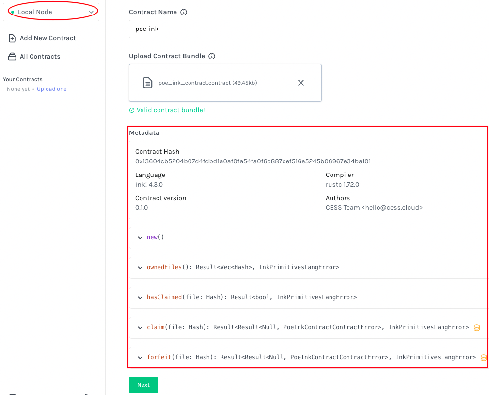
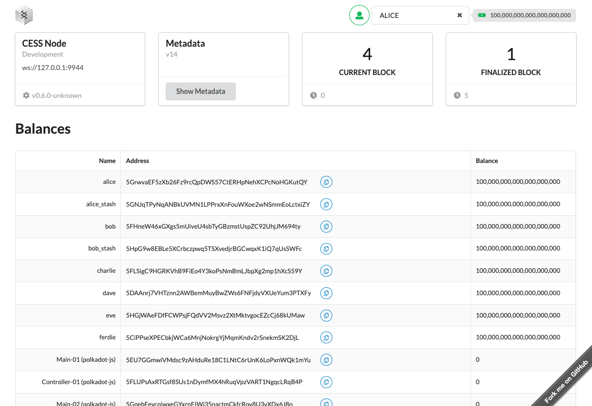
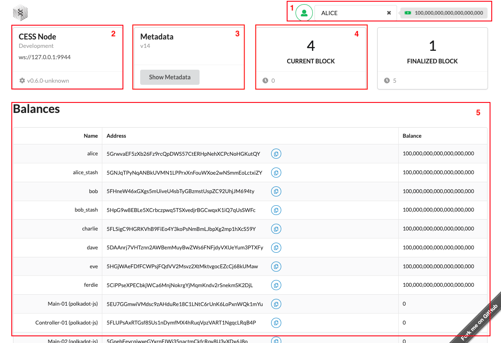
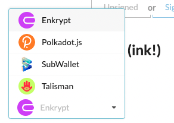
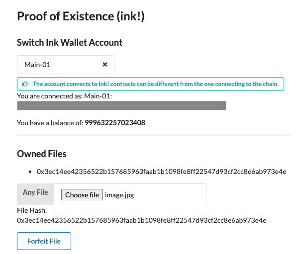

# Objective

In this tutorial, we will walk through a full dApp development experience and write out both the smart contract, based on [ink!](https://use.ink/), and the front end, based on [React](https://react.dev/). We will also deploy the smart contract on a CESS development node and have the front end interact with it.

The application that we will develop is a Proof of Existence (PoE) dApp. It is used to prove that 1) one is the owner of a particular file, and 2) the file has the same content as it was when published on-chain in the past; think about a user who has to prove the content of a contract file has not been tampered with.

Instead of posting the whole file content on-chain, we will extract the first 64kB of the content, pass it to a hash function, and claim ownership of the file. Users can also send transactions on-chain to retrieve a list of their owned files and check if a file has been claimed.



The complete source code of this tutorial can be seen at<br/><https://github.com/hkwtf/cess-course/tree/main/examples/poe-ink>

It contains the smart contract (inside `/contract` directory) and front end (inside `/frontend` directory) code.




We will first code the smart contract (ink!) side and then the front-end side. Let's jump right in.

# Smart Contract (Ink!)

## Prerequisites

This section has the same prerequisites as the tutorial [Deploy an Ink! Smart Contract](./deploy-sc-ink.md#prerequisite). Please follow that section and install all required components: Rust and `cargo-contract`.

## Development

1. Let's start by building the directory structure

    ```bash
    mkdir poe-ink
    cd poe-ink
    cargo contract new contract
    ```

    The last command will create an ink! contract project skeleton.

    Inside the directory, there are three files.

    ```
    poe-ink/contract/
      ∟ .gitignore    # contains files to ignore when committing to git
      ∟ Cargo.toml    # This is a Rust project, so there is a `Cargo.toml` file for the project specification.
      ∟ lib.rs        # The actual smart contract and unit test code.
    ```

    The most interesting file is `lib.rs`. It is a simple contract that reads and flips a boolean value. Please skim through it to get an idea of how ink! contract code is structured.

2. Let's build and test the contract project.

    ```bash
    cd contract          # In case you haven't gotten inside the contract dir.
    cargo contract build # This command builds the contract project.
    cargo test           # This command runs the unit test code starting at the `mod tests` line in the code.
    ```

    Running the `cargo contract build` yields three files:

    - `contract.wasm`: the contract code
    - `contract.json`: the contract metadata
    - `contract.contract`: the contract code and metadata

    The front end (see next section) will need to read `contract.json` to know the API of the contract. We will use `contract.contract` to instantiate the contract on-chain.

3. Open `lib.rs`. Let's remove everything and only keep the top-level structure. So we have:

    ```rs
    #![cfg_attr(not(feature = "std"), no_std, no_main)]

    #[ink::contract]
    mod contract {
      // We will fill up the code here next
    }
    ```

4. In smart contract development, two of the keys are deciding how the storage data structure looks and what events it emits. Let's think about the PoE functionality. We will need a storage map from user addresses to an array of files, indicating the hash digests of the files they owned, and a reverse map from the hash digest to its owner. Let's also specify that at most one user can own a file. The following storage structure supports it:

    ```rs
    mod contract {
      // The following two lines are added to import the support of vector `Vec` and `Mapping` data structure.
      use ink::prelude::{vec, vec::Vec};
      use ink::storage::Mapping;

      #[ink(storage)]
      pub struct Contract {
        /// Mapping from AccountId to hash digest of files the user owns
        users: Mapping<AccountId, Vec<Hash>>,
        /// Mapping from the file hash to its owner
        files: Mapping<Hash, AccountId>,
      }
    }
    ```

    We use `#[ink(storage)]` attribute macro to tell the Rust compiler this is the smart contract storage, and the compiler will further process the storage specification here. [Check here](https://github.com/paritytech/ink#ink-macros--attributes-overview) to learn more about the macros ink! used.

5. Now, we want our smart contract to emit events when a user successfully claims the file ownership. Let's also allow the user to forfeit the claim in the future. So the two events are:

    ```rs
    mod contract {
      // ... below the storage data structure code

      #[ink(event)]
      pub struct Claimed {
        #[ink(topic)]
        owner: AccountId,
        #[ink(topic)]
        file: Hash,
      }

      #[ink(event)]
      pub struct Forfeited {
        #[ink(topic)]
        owner: AccountId,
        #[ink(topic)]
        file: Hash,
      }
    }
    ```

    We specify two events:
    - **Claimed**: when the event is emitted, the associated user and the file digest are also emitted.
    - **Forfeit**: same as above, the associated user and the file digest are also emitted.

6. Let's work on the core logic of the smart contract

    ```rs
    mod contract {
      // ... below the event code

      impl Contract {
        /// Constructor to initialize the contract
        #[ink(constructor)]
        pub fn new() -> Self {
          let users = Mapping::default();
          let files = Mapping::default();
          Self { users, files }
        }

        #[ink(message)]
        pub fn owned_files(&self) -> Vec<Hash> {
          let from = self.env().caller();
          self.users.get(from).unwrap_or(Vec::<Hash>::new())
        }

        #[ink(message)]
        pub fn has_claimed(&self, file: Hash) -> bool {
          match self.files.get(file) {
            Some(_) => true,
            None => false,
          }
        }
      }
    }
    ```

    Here, we have defined three methods:

    - `fn new()`: the smart contract constructor. This function will be called when the smart contract is instantiated. It is marked with `#[ink(constructor)]` attribute macro right above the function.

    - `fn owned_files(&self)`: This function returns a vector, the Rust way of saying an array, of hash digests. It first retrieves the caller of the smart contract, uses it as the key to retrieve its value inside the **`users`** storage map, and returns the value. If no value is found, an empty vector is returned.

        Notice this function doesn't take an `AccountId` parameter in, so callers can only check their own file ownerships.

    - `fn has_claimed(&self, file: Hash)`: The function returns a boolean, indicating if the file, specified by the hash, has been claimed by some user. We read from the smart contract storage **`files`**, using the file hash as the key, and see if an owner can be retrieved. If yes, the file is claimed, and the function returns true. Otherwise, it returns false.

        Notice we still need to specify what hash function to use and how a file is converted to its hash digest. It is a job performed by the front end, so we will take care of this in the next section.

7. Now let's work on the core logic of `fn claim()`. It allows a user claims the ownership of a particular file. The overall logic is that:

    - we first check the file has yet to be claimed.
    - we update the storage `files` and `users` to indicate the caller claim the file ownership
    - emit an event that the file has been claimed so blockchain listeners know about this.

    The following code entails the above logic:

    ```rs
    mod contract {
      // ...previous code
      impl Contract {
        // ...previous code

        /// A message to claim the ownership of the file hash
        #[ink(message)]
        pub fn claim(&mut self, file: Hash) -> Result<()> {
          // Get the caller
          let from = self.env().caller();

          // Check the hash has yet to be claimed
          if self.files.contains(file) {
            return Err(Error::AlreadyClaimed);
          }

          // Claim the file hash ownership with two write ops
          // Update the `users` storage. If a vector is retrieved, we push the hash digest into
          //   the vector. Otherwise, we create a new vector with the hash digest element inside.
          match self.users.get(from) {
            Some(mut files) => {
              // A user entry has already been built
              files.push(file);
              self.users.insert(from, &files);
            }
            None => {
              // A user entry hasn't been built, so building one here
              self.users.insert(from, &vec![file]);
            }
          }

          // Update the `files` storage
          self.files.insert(file, &from);

          // Emit an event
          Self::env().emit_event(Claimed { owner: from, file });

          Ok(())
        }
      }
    }
    ```

8. You may have noticed the return value type of `fn claim()` looks different from the two previous functions `fn owned_files()` and `fn has_claimed()`. `fn owned_files()` and `fn has_claimed()` are view functions. They only read the contract storage but don't alter it. `fn claim()`, on the other hand, is a state-modifying function. It returns a [`Result` enum type in Rust](https://doc.rust-lang.org/std/result/enum.Result.html) to indicate whether the function successfully changes the state by returning `Ok(())`, or an error occurs and the state change is reverted by returning `Err(error value here)`.

    Now, let's define the longer form of Result and the error values. Two error values will be emitted in the contract: when users try to claim a file that has already been claimed, `AlreadyClaimed`, and when users try to forfeit the file ownership they don't own, `NotOwner`.

    ```rs
    mod contract {
      // ... prev code

      // Beware that this part of the code is OUTSIDE of `impl Contract {}`, unlike the claim() function above.

      // Result type used in `fn claim()` is a short form.
      pub type Result<T> = core::result::Result<T, Error>;

      // These are two error values returned in our contract
      #[derive(Debug, PartialEq, Eq, scale::Encode, scale::Decode)]
      #[cfg_attr(feature = "std", derive(scale_info::TypeInfo))]
      pub enum Error {
        /// File with the specified hash has been claimed by another user
        AlreadyClaimed,
        /// Caller doesn't own the file with the specified hash
        NotOwner,
      }

      impl Contract {
        // ... prev code
      }
    }
    ```

9. The `fn forfeit()` function basically reverses the operation of `fn claim()` function above.

    - we first check the caller owns the file. If not, we return an error
    - we update the **`users`** and **`files`** storage to remove the file hash digest
    - emit an event about this new state.

    ```rs
    mod contract {
      // ...previous code
      impl Contract {
        // ...previous code
        #[ink(message)]
        pub fn forfeit(&mut self, file: Hash) -> Result<()> {
          let from = self.env().caller();

          // Check if the caller owns the file. If not, return `Error::NotOwner`.
          match self.files.get(file) {
            Some(owner) => {
              if owner != from {
                return Err(Error::NotOwner);
              }
            }
            None => {
              return Err(Error::NotOwner);
            }
          }

          // Confirmed the caller is the file owner. Update the two storage `users` and `files`.
          let mut files = self.users.get(from).unwrap_or(vec![]);
          for idx in 0..files.len() {
            if files[idx] == file {
              files.swap_remove(idx);
              self.users.insert(from, &files);
            }
          }

          self.files.remove(file);

          // Emit an event
          Self::env().emit_event(Forfeited { owner: from, file });

          Ok(())
        }
      }
    }
    ```

10. By this point, you have completed all the core logic of the smart contract. Compile the contract with `cargo contract build` to ensure it builds. If there is any doubt about the final source code, you can always refer to the [**complete source code**](https://github.com/hkwtf/cess-course/blob/main/examples/poe-ink/contract/lib.rs).

11. After the compilation, [deploy the contract on your local cess dev chain](./deploy-sc-ink.md) and interact with the contract to test it. You can access [Contracts UI](https://contracts-ui.substrate.io/), connect it to your local node, and deploy the contract. Refer to the screenshot below.

    

    Ensure that:

    - Contracts UI is connecting to the local CESS node.
    - You see the expected metadata when uploading the `contract.contract` file.

**Congratulation**! You have completed the smart contract development section. Before heading to the front-end development, the complete source code also contains the unit test code, the code block inside `mod tests { ... }`. We won't go over them here, and they are self-explanatory. Please take a look. You can run them by `cargo test` command. [Check here](https://use.ink/basics/contract-testing) to learn more about contract testing.

# Front End

## Prerequisites

- Install [Git](https://git-scm.com/book/en/v2/Getting-Started-Installing-Git)
- Install [Node v18](https://nodejs.org/en/download)
- Install [pnpm](https://pnpm.io/installation)
- Run a local development chain of the CESS node because the front end will connect to the local CESS chain. Refer here on [how to run a local CESS chain](./deploy-sc-ink.md#deploy-a-smart-contract).

We will start from a modified version of [Substrate Front End Template](https://github.com/hkwtf/substrate-frontend-template). This is the Parity maintained [Substrate Front End Template](https://github.com/substrate-developer-hub/substrate-front-end-template) using the latest React, Polkadot.js API (as of 2023 Sep) library and a much faster package manager [**pnpm**](https://pnpm.io/).

```bash
cd poe-ink    # This is the root directory created during the smart contract development above.
git clone https://github.com/hkwtf/substrate-frontend-template.git frontend
cd frontend
pnpm install  # pull all the project dependencies down

# Before starting the front end below, open another terminal window and start your local CESS node.
# Refer to ./deploy-sc-ink.md#deploy-a-smart-contract

pnpm start    # start the project
```

If you see a screen similar to the following, you are good to go.



## Before We Start

First of all, in case there is any doubt, you can always refer back to [**the entire front end source code**](https://github.com/hkwtf/cess-course/tree/main/examples/poe-ink/frontend).on the

To get a high-level understand of the front end template, let's refer to the second self section of `src/App.js`:

```jsx
function Main() {
  // ...code snapped
  return (
    <div ref={contextRef}>
      <Sticky context={contextRef}>
        <AccountSelector />
      </Sticky>
      <Container>
        <Grid stackable columns="equal">
          <Grid.Row stretched>
            <NodeInfo />
            <Metadata />
            <BlockNumber />
            <BlockNumber finalized />
          </Grid.Row>
          <Grid.Row stretched>
            <Balances />
          </Grid.Row>
          <Grid.Row>
            <Transfer />
            <Upgrade />
          </Grid.Row>
          <Grid.Row>
            <Interactor />
            <Events />
          </Grid.Row>
          <Grid.Row>
            <TemplateModule />
          </Grid.Row>
        </Grid>
      </Container>
      <DeveloperConsole />
    </div>
  );
}
```
Let's see how different components are laid out on the screen.



1. The `<AccountSelector/>` component, refering to `src/AccountSelector.js` file.
2. The `<NodeInfo />` component, referring to `src/NodeInfo.js` file.
3. The `<Metadata />` component, referring to `src/Metadata.js` file.
4. The `<Balances />` component, referring to `src/Balances.js` file.

We will add a new component and showcase how to use [**useink**](https://www.npmjs.com/package/useink) library connecting the front end to the smart contract.

## Development

1. Add the **useink** dependencies by:

    ```bash
    pnpm install useink
    ```

2. In `src/App.js`, let's replace the `<TemplateModule />` component with `<PoEWithInkProvider />`. Remove the `TemplateModule` import line and add back `PoEWithInkProvider`. We also create a basic React skeleton of `src/ProofOfExistenceInk.js`.

    So, `src/App.js` becomes:

    ```jsx
    // Remove/comment out this line
    // import TemplateModule from "./TemplateModule";
    // Add the following line
    import PoEWithInkProvider from "./ProofOfExistenceInk";

    //... code snapped
    return (
      <div ref={contextRef}>
        { /* code snapped */ }
        <Container>
          <Grid stackable columns="equal">
            {/* code snapped */}
            <Grid.Row>
              <PoEWithInkProvider />
            </Grid.Row>
          </Grid>
        </Container>
        {/* code snapped */}
      </div>
    )
    ```

    The file `src/ProofOfExistenceInk.js` looks like the following:

    ```jsx
    import { React, useState } from "react";

    export default function PoEWithInkProvider(props) {
      return (<>Proof of Existence Ink! dApp</>);
    }
    ```

    At this point, the front end should work with the line "Proof of Existence Ink! dApp" shown.

3. From now on, we will mainly focus on the file `src/ProofOfExistenceInk.js`. We will not be adding code line by line here, but we will cover the APIs provided by **useink** library that facilitate ink! smart contract interaction.

    Refer to the code [`src/ProofOfExistenceInk.js`](https://github.com/hkwtf/cess-course/blob/main/examples/poe-ink/frontend/src/ProofOfExistenceInk.js).

4. Starting from [the bottom](https://github.com/hkwtf/cess-course/blob/main/examples/poe-ink/frontend/src/ProofOfExistenceInk.js#L186-L195), we have:

    ```jsx
    <UseInkProvider
      config={{
        dappName: "Proof of Existence (Ink)",
        chains: [{ id: "custom", name: "CESS localhost", rpcs: [config.PROVIDER_SOCKET] }],
      }}
    >
      <ProofOfExistenceInk />
    </UseInkProvider>
    ```

    `UseInkProvider` context hook provides ink! contract connection information to its children components. A config object is passed in with the name, and:

    - `chains.id`: there are public chains with well-known IDs. As we connect to a local development chain, we set it to `custom`.
    - `chain.name`: the name of the chain. It will be displayed when prompting for wallet connections.
    - `chain.rpcs`: we get this value from the app config, which points to a local chain RPC endpoint, `wss://localhost:9944`.

    We can call ink! API call inside `<ProofOfExistenceInk />` component.

5. Looking at the code inside [`function ProofOfExistenceInk(props) {...}`](https://github.com/hkwtf/cess-course/blob/main/examples/poe-ink/frontend/src/ProofOfExistenceInk.js#L31-L100)

    ```jsx
    function ProofOfExistenceInk(props) {
      const { account } = useWallet();

      const balance = useBalance(account);

      // Getting the contract API
      const poeContract = useContract(CONTRACT_ADDR, metadata, "custom");
      const ownedFiles = useCallSubscription(poeContract, "ownedFiles");
      const ownedFilesRes = pickDecoded(ownedFiles.result);

      //... code snapped
    }
    ```

    - Use `useWallet()` to get the current smart-contract connecting account.
    - Use `useBalance(account)` to get the account's current balance.
    - Use `useContract(CONTRACT_ADDR, metadata, "custom")` to get the contract ABI.
        - The contract address `CONTRACT_ADDR` is specified above. So, every time a new PoE contract is deployed, we need to update the address value assigned.
        - `metadata` is specified above as well. It comes from the metadata json file when we `cargo contract build` our smart contract.
        - `custom` is the chain ID where the contract is deployed.

        At this point, we have a contract instance `poeContract` that we can interact with.
    - We then use `useCallSubscription()` to subscribe to the value returning from `ownedFiles()` function from the smart contract. Recall from the previous section that this function returns all the file hash digests the user account owned.
    - Then we use `pickDecoded()` method to decode the result, converting from the chain data types to javascript data types.

    All the functions mentioned here are provided by **useink**.

6. Here, we specify how the file hash digest is computed.

    ```jsx
    const computeFileHash = (file) => {
      const fileReader = new FileReader();
      fileReader.onloadend = (e) => {
        // We extract only the first 64kB  of the file content
        const typedArr = new Uint8Array(fileReader.result.slice(0, 65536));
        setFileHash(blake2AsHex(typedArr));
      };
      fileReader.readAsArrayBuffer(file);
    };
    ```

    We use [`FileReader`](https://developer.mozilla.org/en-US/docs/Web/API/FileReader) provided by modern-day browser JS API to read the uploaded file, extract the first 64 kB, and use `blake2AsHex()` [Blake2 cryptographic hash function](https://en.wikipedia.org/wiki/BLAKE_(hash_function)#BLAKE2) to calculate its hash digest, provided by [**@polkadot/util-crypto**](https://polkadot.js.org/docs/util-crypto/examples/hash-data) library.

7. We then also implement a few helper components **TxButton**, **ConnectWallet**, and **WalletSwitcher** to display the UI.

    - **TxButton** component sends either `claim()` or `forfeit()` transaction to the chain depending on whether the user owned the file. It uses `useTx()` to construct the transaction and use `signAndSend()` method to send the transaction.

    - **ConnectWallet** component allows users to switch from different wallet providers, including Enkrypt, Polkadot.js extension, SubWallet, and Talisman. A typical choice would be to use [Polkadot.js extension](https://polkadot.js.org/extension/).

        

        It uses `useWallet()` to get the wallet connection function and `useAllWallets()` to get the information of all supported wallets.

    - **WalletSwitcher** component retrieves all available accounts provided by the wallet chosen in **ConnectWallet**, using the `accounts` object. It also uses `setAccount()` to set a particular account and `disconnect()` to disconnect from the chosen wallet.

8. Finally, we have a front end similar to the following:

    

# Tutorial Completion

**Congratulation**! Let's recap what we have done in this tutorial:

- You have successfully implemented a PoE logic in ink! smart contract and deploy it on a local CESS node.
- You have successfully implemented the front end that interacts with the smart contract, starting with the Substrate Front End Template and **useink** React library.

Now, you can build your dApps and deploy them on the CESS testnet to test it out. For the next step, you can also learn how to [develop a dApp with Solidity smart contract](./poe-solidity.md) as well.

## References

- [Ink! 4.0](https://use.ink/)
- [CESS Node](https://github.com/CESSProject/cess)
- [Substrate Front End Template](https://github.com/hkwtf/substrate-frontend-template)
- [Substrate Contracts UI](https://contracts-ui.substrate.io/)
