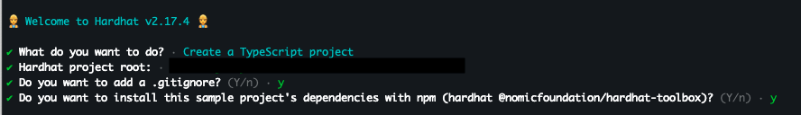
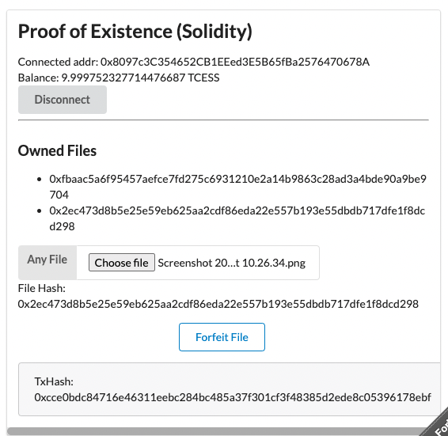

# Objective

In this tutorial, we will walk through the whole process of building a full dApp, writing both the smart contract in Solidity and the front end in React. Again, we will be making the Proof of Existence App. For those unfamiliar with what Proof of Existence on blockchain is or have yet to go through the previous tutorial. Please take a look at the Proof of Existence [background introduction](./poe-ink.md#objective).



The complete source code of this tutorial can be seen at our [`cess-course` repository](https://github.com/CESSProject/cess-course/tree/main/examples).

- [Smart Contract](https://github.com/CESSProject/cess-course/blob/main/examples/hardhat/contracts/ProofOfExistence.sol)
- [Front end](https://github.com/CESSProject/cess-course/blob/main/examples/frontend/src/ProofOfExistenceSolidity.js)



Let's first look at the smart contract (Solidity) side and then the front-end side.

# Smart Contract (Solidity)

## Prerequisites

We will use [**Hardhat**](https://hardhat.org/) as the smart contract development toolchain. So, let's install and initialize `hardhat` library.

```bash
mkdir hardhat
cd hardhat
pnpm dlx hardhat init
```

You will be asked a series of questions on configuring the project.

```
✔ What do you want to do? · Create a TypeScript project
✔ Hardhat project root: · (your chosen dir)
✔ Do you want to add a .gitignore? (Y/n) · y
✔ Do you want to install this sample project's dependencies with npm (hardhat @nomicfoundation/hardhat-toolbox)? (Y/n) · y
```



Hardhat default to be using `npm` package manager, but feel free to use your preferred package manager.

Let's also add [**`hardhat-deploy`**](https://github.com/wighawag/hardhat-deploy) library to help deploy and manage the deployed smart contracts.

```bash
pnpm install -D hardhat-deploy
```

By default, Hardhat places a **Lock.sol** smart contract inside `hardhat/contracts` directory. Check that everything works by running `pnpm hardhat test` and see all test cases pass.

If you have any issues, refer back to the [`hardhat` directory](https://github.com/CESSProject/cess-course/tree/main/examples/hardhat), its [`package.json`](https://github.com/CESSProject/cess-course/blob/main/examples/hardhat/package.json), and [`hardhat.config.ts`](https://github.com/CESSProject/cess-course/blob/main/examples/hardhat/hardhat.config.ts).

## Development

1. Let's configure `hardhat.config.ts` so it can deploy smart contracts to a hardhat network, a locally running hardhat node, and a locally running cess node.

    Please use the following hardhat config in `hardhat.config.ts`

    ```ts
    const config: HardhatUserConfig = {
      solidity: "0.8.19",
      defaultNetwork: "hardhat",
      namedAccounts: {
        deployer: {
          default: 0,
        },
        beneficiary: {
          default: 1,
        },
      },
      networks: {
        hardhat: {
          // issue: https://github.com/sc-forks/solidity-coverage/issues/652,
          // refer to : https://github.com/sc-forks/solidity-coverage/issues/652#issuecomment-896330136
          initialBaseFeePerGas: 0
        },
        localhost: {
          url: "http://localhost:8545",
          accounts: ["0xac0974bec39a17e36ba4a6b4d238ff944bacb478cbed5efcae784d7bf4f2ff80"],
        },
        "cess-local": {
          url: "http://localhost:9944", // RPC endpoint of CESS testnet
          chainId: 11330,
          // private key of `//Alice` from Substrate
          accounts: ["0xe5be9a5092b81bca64be81d212e7f2f9eba183bb7a90954f7b76361f6edb5c0a"],
        }
      }
    };
    ```

    A local hardhat node listen to <http://localhost:8545>, while a local CESS node listens to <http://localhost:9944> port. With this config and `hardhat-deploy` component, we can deploy smart contract to our locally running CESS node by `pnpm hardhat deploy --network cess-local`.

2. Now, for the smart contract, we want to have the following methods:

    - `claim(bytes32 hash)`: a method for the caller to claim ownership of a file with the specified hash.
    - `forfeit(bytes32 hash)`: a method for the caller to forfeit ownership of a file with the specified hash.
    - `ownedFiles()`:  retrieving all the file hashes owned by the user.
    - `hasClaimed(hash)`: check whether a file hash has been claimed yet.

    ```sol
    // SPDX-License-Identifier: UNLICENSED
    pragma solidity ^0.8.19;

    contract ProofOfExistence {
      mapping(bytes32 => address) public files;
      mapping(address => bytes32[]) public users;

      event Claimed(address indexed owner, bytes32 indexed file);
      event Forfeited(address indexed owner, bytes32 indexed file);

      error NotFileOwner();
      error FileAlreadyClaimed();

      modifier isOwner(bytes32 hash) {
        address from = msg.sender;
        if (files[hash] != from) revert NotFileOwner();
        _;
      }

      modifier notClaimed(bytes32 hash) {
        address from = msg.sender;
        if (files[hash] != address(0)) revert FileAlreadyClaimed();
        _;
      }

      function hasClaimed(bytes32 hash) public view returns (bool) {
        address owner = files[hash];
        return (owner != address(0));
      }

      function ownedFiles() public view returns (bytes32[] memory) {
        address from = msg.sender;
        return users[from];
      }

      function claim(bytes32 hash) public notClaimed(hash) returns (bool) {
        address from = msg.sender;

        // update storage files
        files[hash] = from;

        // update storage users
        bytes32[] storage userFiles = users[from];
        userFiles.push(hash);

        emit Claimed(from, hash);
        return true;
      }

      function forfeit(bytes32 hash) public isOwner(hash) returns (bool) {
        address from = msg.sender;

        // update storage files
        delete files[hash];

        // locate the index of the file going to be deleted.
        bytes32[] storage userFiles = users[from];
        uint32 delIdx = 0;
        for (uint32 i = 0; i < userFiles.length; i++) {
          if (userFiles[i] == hash) {
            delIdx = i;
            break;
          }
        }
        // update storage users by swap-delete
        if (delIdx != userFiles.length - 1) {
          userFiles[delIdx] = userFiles[userFiles.length - 1];
        }
        // delete
        userFiles.pop();

        emit Forfeited(from, hash);
        return true;
      }
    }
    ```

3. We can now deploy the smart contract in our local CESS node, following the tutorial of [Deploying a Smart Contract in CESS](./deploy-sc-solidity.md).

    - Run a CESS node locally.
    - Having the four accounts and their addresses ready. For details, refer to [Substrate EVM Address Conversion](../guides/substrate-evm.md).
        1. A CESS signing account, we will be using `/Alice`: `cXjmuHdBk4J3Zyt2oGodwGegNFaTFPcfC48PZ9NMmcUFzF6cc`. This account also has some TCESS tokens initialized in a local CESS node.
        2. The EVM-mapped account of the above CESS signing account, which is `0xd43593c715fdd31c61141abd04a99fd6822c8558`
        3. An EVM signing account, we will import the Alice private key `0xe5be9a5092b81bca64be81d212e7f2f9eba183bb7a90954f7b76361f6edb5c0a` into Metamask, and this yields an address of `0x8097c3C354652CB1EEed3E5B65fBa2576470678A`.
        4. The Substrate-mapped address of the above EVM signing account (#3), which is `cXgEvnbJfHsaN8HfoiEWfAi4QBENYbLKitRfG1CDYZpKTRRuw`.
    - We first transfer some test tokens (say 1M tokens) from account #1 (Substrate account) to account #3 (EVM account) in [Polkadot.js Apps](https://polkadot.js.org/apps/#/accounts).
    - With tokens in #3 wallet, we can deploy the Solidity smart contract on the local CESS node. We run the following hardhat command. Here, please modify the `hardhat.config.ts` accordingly about the account that you use for deployment.

        ```bash
        pnpm hardhat deploy --reset --network cess-local
        ```

        Take note of the deployed address for ProofOfExistence smart contract.

4. Next, we can connect to the smart contract using [Remix](https://remix.ethereum.org/) and interact with the smart contract.

# Front End

## Prerequisites

- Install [Git](https://git-scm.com/book/en/v2/Getting-Started-Installing-Git)
- Install [Node v18](https://nodejs.org/en/download)
- Install [pnpm](https://pnpm.io/installation)
- Run a local development chain of the CESS node because the front end will connect to the local CESS chain. Refer here on [how to run a local CESS chain](./deploy-sc-ink.md#deploy-a-smart-contract).

The complete front-end source code can be seen [here](https://github.com/CESSProject/cess-course/tree/main/examples/frontend).

If you run it, you will see the **Proof of Existence (Solidity)** widget in the bottom right corner:



## Development

The major development of the frontend is at `frontend/src/ProofOfExistenceSolidity.js`, as shown [here](https://github.com/CESSProject/cess-course/blob/main/examples/frontend/src/ProofOfExistenceSolidity.js).

We won't go over the front-end code line by line, but there are a few features I will point out here.

- We are using [**wagmi**](https://wagmi.sh/) library for the React Hooks to work with Ethereum smart contracts.

- To use wagmi, we define our CESS local chain [at here](https://github.com/CESSProject/cess-course/blob/308ec7fe053e92c08e4c2d634579f84b359072ac/examples/frontend/src/ProofOfExistenceSolidity.js#L22-L38):

    ```js
    const RPC_ENDPOINT = "http://localhost:9944";

    const cessLocal = {
      id: 11330,
      name: "CESS Local",
      network: "cess-local",
      nativeCurrency: {
        decimal: 18,
        name: "CESS Testnet Token",
        symbol: "TCESS",
      },
      rpcUrls: {
        public: { http: [RPC_ENDPOINT] },
        default: { http: [RPC_ENDPOINT] },
      },
    };
    ```

- Then, we build up the chain's public clients and pass the clients in `createConfig()`. Finally, the `config` object is passed into the **WagmiConfig** React component.

    ```jsx
    const { publicClient, webSocketPublicClient } = configureChains(
      [cessLocal],
      [
        jsonRpcProvider({
          rpc: (chain) => ({
            http: RPC_ENDPOINT,
          }),
        }),
      ],
    );

    const config = createConfig({
      publicClient,
      webSocketPublicClient,
    });

    //...
    export default function PoESolidityWithWagmiProvider(props) {
      return (
        <WagmiConfig config={config}>
          <PoESolidity />
        </WagmiConfig>
      );
    }
    ```

- To connect to our Ethereum wallet, we use [`useConnect()`](https://wagmi.sh/react/hooks/useConnect) hook, which is being called in the [**ConnectWallet** component](https://github.com/CESSProject/cess-course/blob/308ec7fe053e92c08e4c2d634579f84b359072ac/examples/frontend/src/ProofOfExistenceSolidity.js#L180).

- We get the information of the currently selected account and its balance by [`useAccount()`](https://wagmi.sh/react/hooks/useAccount) and [`useBalance()`](https://wagmi.sh/react/hooks/useBalance) hooks. These hooks are being used in the [**PoESolidity** component](https://github.com/CESSProject/cess-course/blob/308ec7fe053e92c08e4c2d634579f84b359072ac/examples/frontend/src/ProofOfExistenceSolidity.js#L65).

- We read the contract data using [`useContractRead()`](https://wagmi.sh/react/hooks/useContractRead). One point to note here is we need to specify the `account` argument so the `msg.sender` value is set on the smart contract side.

- For writing to the contract, we follow the practice [outlined in wagmi docs](https://wagmi.sh/examples/contract-write-dynamic). We:

    - use `useDebounce()` to ensure the smart contract is not being called too often.
    - use `usePrepareContractWrite()` to prepare for the contract write action.
    - use `useContractWrite()` to get the `write()` function to be passed in our **TxButton** component click handler.
    - use `useWaitForTransaction()` to get the transaction information and its status.

# Tutorial Completion

**Congratulation**! Let's recap what we have done in this tutorial:

- We have successfully implemented a PoE logic in the Solidity smart contract and deployed it on a local CESS node.
- We have successfully implemented the front end that interacts with the smart contract, starting with the Substrate Front End Template and adding **wagmi** React hook library.

Now, you can build your dApps and deploy them on the CESS testnet to test it out. If you haven't done so, try also to [develop a dApp with Ink! smart contract](./poe-ink.md) as well.

## References

- [Hardhat](https://hardhat.org/)
- [hardhat-deploy](https://github.com/wighawag/hardhat-deploy)
- [CESS Node](https://github.com/CESSProject/cess)
- [Substrate Front End Template](https://github.com/CESSProject/substrate-frontend-template)
- [wagmi](https://wagmi.sh/)
