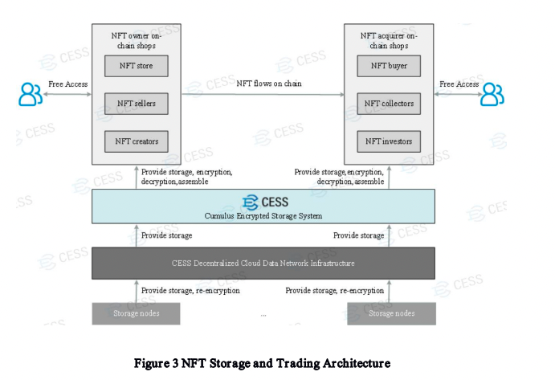
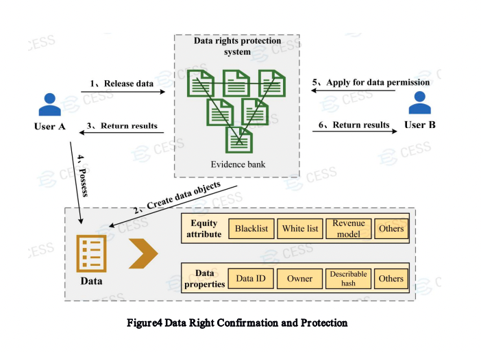
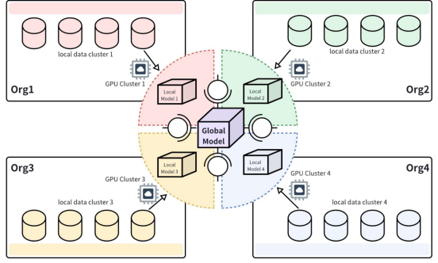

## 1. NFT Issuance and Storage

NFT often involve large, high-resolution images or even 3D models that traditionally required expensive centralized storage. This creates a single point of failure and goes against the principles of decentralization. Here, CESS provides an ideal solution for securely storing NFT assets.

NFT developers now only need to upload NFT files to CESS and the platform will verify and confirm owners’ data rights using the Multi-format Data Rights Confirmation Mechanism (MDRC), and then distribute the data files to multiple storage nodes. Data is then properly indexed and distributed to facilitate both the public visits and private safe retrievals of the NFT.

For example, if an American artist creates an NFT artwork and sells it to a UK buyer online through CESS, the copyright is transferred at the timestamp of the transaction. This is executed transparently and remain permanently trackable, as guaranteed by blockchain technology. The new NFT owner (i.e., the UK buyer) will be automatically and uniquely issued an encrypted code (i.e., private key) upon the completion of the online transaction. Meanwhile, the old private key held by the American artist will automatically become obsolete.

## 2. Personal Network Drive

CESS offers distributed network drive to end users, so individuals can securely store personal data such as photos and documents in it. Compared to traditional network drives, CESS has significant advantages on security, ownership protection, cost, and capacity. CESS disks do not require cloud servers, effectively avoiding dependency on centralized servers. Instead, user data are stored in multiple peer-to-peer (p2p) storage nodes.

By adopting blockchain-based cryptographic algorithms to encrypt stored data, CESS ensures the data privacy without the risk of data loss or central server outages.

## 3. Decentralized Streaming and Social Media

There is a genuine concern about articles and videos being subjected to censorship by large corporations and governments. By utilizing CESS and incorporating metadata written on blockchains, storing such content on CESS ensures its resistance to censorship, safeguarding both data integrity and freedom of speech.

## 4. Distributed Enterprise Storage Service

As a decentralized cloud storage system with a tremendous amount of storage resource pool, CESS meets the demand of enterprise data storage service perfectly. CESS storage network is built on blockchain technology with multiple storage proof mechanisms. This make the system provide a fast and secure storage solution at lower cost compared to centralized storage providers. Enterprises can also utilize CESS for their data archival and backup.

## 5. Decentralized Data Marketplace

When users upload data files to CESS, they get to choose its values. CESS generates data file attributes based on these user inputs. The data attributes include pricing model type, access control list, etc. Data attributes are published together with user data. Whenever a data file is retrieved, CESS checks if the accessor has permission to retrieve the file. If yes, the system will issue charge to the buyer based on the data file pricing model, and then start the data download.

On CESS, all data file retrieval records are recorded on blockchain and hence are backward traceable. The CESS data rights protection mechanism maintains a recording module to allow users to view their data file retrieval records, providing strong evidence for user data rights protection.

## 6. Enabling Secure and Compliant Global AI Development

Various organizations with private data face challenges in utilizing it for AI development due to sensitivity and legal constraints. The CESS network provides a solution by enabling the secure exchange of encrypted parameters and models through Cumulus Gap. This allows organizations to collaborate on building a global AI model while ensuring data privacy and compliance with regulations. The use of the CESS network facilitates the creation of industry-wide or global AI frameworks, leveraging diverse data sources without compromising privacy or regulatory requirements.

