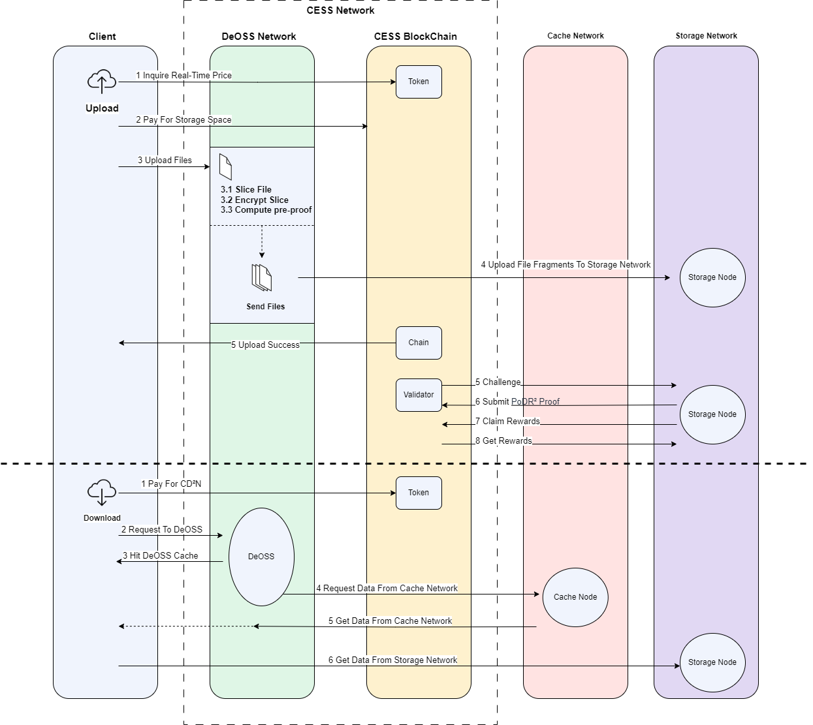
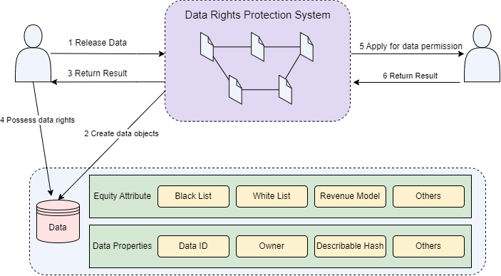

## DA Service
The DA (Data Availability) Service is a crucial use case of the CESS network, offering a robust solution for ensuring continuous and reliable access to data. Below are some key details of the DA Layer:
- Ensuring Data Availability: The DA Service ensures that data is always accessible, even in the event of network disruptions or node failures. By replicating data across multiple nodes, it provides redundancy and fault tolerance, ensuring that data remains available despite potential issues with individual nodes.
- Layer 2 Storage for Blockchain Networks: The DA Service can perform as a Layer 2 storage solution for major blockchain networks like Bitcoin (BTC), Ethereum (ETH), etc. This use case allows these blockchain networks to offload large datasets to the CESS network, reducing on-chain storage costs and improving transaction speeds while maintaining decentralized and secure storage.
- Applications in Various Sectors: The robust and scalable nature of the DA Service makes it suitable for a wide range of applications, including decentralized finance (DeFi), enterprise storage solutions, and large-scale data management systems. These applications benefit from the DA Service's ability to provide reliable and secure data storage without relying on centralized services.

## VR Streaming Media

The CESS network is ideal for VR streaming media, offering high-speed data transfer and low latency. CESS combines CDN and P2P technologies to deliver smooth VR content streaming, offering users an engaging and immersive experience. The decentralized nature of the network eliminates bottlenecks and single points of failure, enhancing the reliability and quality of VR streaming.

## Data Lake

CESS supports the creation of data lakes, enabling organizations to store and analyze large volumes of unstructured data. The system's polymorphic data storage access interface provides a unified API for accessing object, block, and file storage, making it easy to integrate various data sources. With CESS, organizations can build scalable, cost-effective data lakes that support advanced analytics and machine learning applications.

## Distributed AI Training

Various organizations with private data face challenges in utilizing it for AI development due to sensitivity and legal constraints. The CESS network provides a solution by enabling the secure exchange of encrypted parameters and models through CESS AI-LINK. This allows organizations to collaborate on building a global AI model while ensuring data privacy and compliance with regulations. The use of the CESS network facilitates the creation of industry-wide or global AI frameworks, leveraging diverse data sources without compromising privacy or regulatory requirements.

CESS facilitates distributed AI training by providing secure and scalable storage for training data. The network's high bandwidth and low latency ensure efficient data transfer between nodes, allowing faster training times. Leveraging the CESS network enables AI developers to collaborate on training models while maintaining data privacy and security. This is achieved through the implementation of federated learning and encryption technologies.

## AIGC Innovation

CESS supports AI-generated content (AIGC) innovation by providing a secure and scalable platform for storing and processing large datasets. The network's distributed architecture allows efficient data sharing and cooperation among AI researchers and developers. With CESS, AIGC applications can leverage the power of decentralized storage to enhance creativity and innovation while maintaining data integrity and security.

## Web3 Games

he CESS network enhances Web3 gaming by providing secure and scalable storage for game assets and player data. CESS utilizes blockchain technology to guarantee the authenticity and ownership of in-game assets, allowing for secure and transparent transactions. The network's decentralized design also boosts online gaming's performance and reliability, offering players a smooth and uninterrupted experience.

## RWA

CESS enables the tokenization and secure storage of real-world assets (RWA) on the blockchain. Users can trade and manage these assets securely and transparently by digitizing physical assets, such as real estate or art, and storing their provenance and ownership data on the CESS network. This approach ensures the integrity and authenticity of asset data, providing a reliable foundation for RWA transactions.

## Distributed Network Disk
CESS provides a unique Distributed Network Disk service for end users that offers several key benefits over traditional providers of Network Disk services. These advantages include enhanced security, protection of ownership rights, cost-effectiveness, and increased storage capacity. Unlike conventional cloud server-based storage solutions, CESS stores data across multiple independent nodes, eliminating reliance on centralized services. This decentralized approach establishes faster download and upload speeds without restrictions. CESS guarantees data privacy and security without central servers or potential risks of data loss using blockchain technology and cutting-edge cryptographic technology.  Additionally, CESS storage nodes can dynamically join the network and contribute their unused space, allowing limitless expansion of the network's storage capabilities.

## Decentralized Digital Assets Marketplace

The secure storage, decentralization of digital assets, and trading data are imperative for building trust in the digital assets marketplace. To validate NFTs, developers and owners upload their files to be verified by CESS using the Multi-format Data Rights Confirmation Mechanism (MDRC). The data files are distributed to storage nodes following this verification process.

CESS automatically captures important structural, subject, and semantic characteristics in its vector space for accurate indexing, mapping, improving public discovery, and secure private retrieval of digital assets within the system.

A typical CESS client and platform interaction involves several steps:
-	**Querying Storage Price**: The data storage client queries the CESS chain to obtain the current storage price.
-	**Placing an Order**: The client submits an order for data files via an on-chain smart contract.
-	**Uploading Data**: Once the payment is made and the order is approved, the client uploads the data file using the API. The file is not directly uploaded to storage nodes but to a CESS storage scheduling node.
-	**Data Processing**: The scheduling node, with a secure hardware environment (Trusted Execution Environment or TEE) processes, encrypts, and shards the data file.
-	**Data Distribution**: The scheduling node distributes data segments to storage nodes.

## Data Rights Protection

From the clients' perspective, CESS delivers as a decentralized and user-managed data content-sharing platform. The platform's mission is to return data ownership to users, encouraging them to explore the value of their digital assets while safeguarding their rights. CESS has implemented an on-chain smart contract-based data-sharing platform that is self-executing, fair, and transparent. This encompasses the entire data rights confirmation, tracking, and protection lifecycle.

CESS offers two types of smart contracts with different client-profit models. When users upload data files, they can choose their preferred model values. Data file attributes are generated based on user inputs, including client-profit model type, whitelist, blacklist, and other preferences. These attributes are published alongside the user data.

The underlying smart contract runs based on the instructions set by the file's owner when clients of a data provider access a data file. The system checks the file attributes to see if the data buyers are authorized. If authorization is confirmed, the system charges the buyers following the client-profit model and initiates the data download.

Data users on CESS can customize their data file attributes. All data file retrieval records are recorded on the blockchain, providing a traceable history. A recording module that lets users see their data file retrieval records is part of the CESS data rights protection mechanism, providing compelling proof that user data rights are protected.

