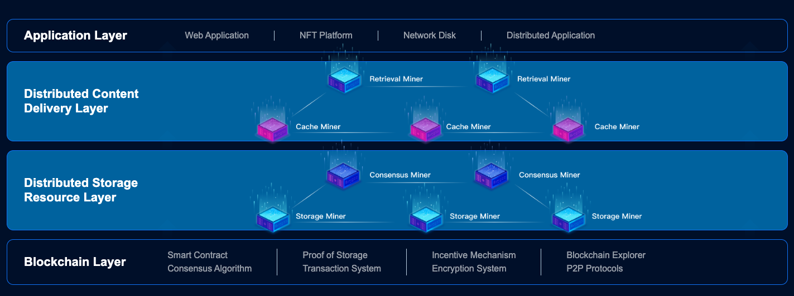

Cumulus Encrypted Storage System (**CESS**) is a blockchain-powered decentralized storage and CDN infrastructure for web3, designed to support large-scale commercial enterprises. Offering the most optimal Web3 solution for storing and retrieving high-frequency dynamic data, CESS reshapes the value distribution and circulation of data assets whilst ensuring data sovereignty and complete user privacy.

Our vision is to create a secure, transparent, and high-throughput decentralized value network.

In this article, we will delve into the what, why, and how of CESS, exploring its features and benefits.

## WHY CESS?

CESS is the first large-scale, enterprise-level decentralized storage, enabling users to securely store their data in an encrypted format. It utilizes advanced encryption techniques to ensure that only the authorized users can access the data and provide end-to-end privacy and security. CESS is also an open-source and public blockchain intended to be the underlying infrastructure for decentralized storage needs. By leveraging blockchain and peer-to-peer technology, CESS eliminates the need for a centralized authority, making it resistant to censorship and tampering.

CESS is also compatible with both EVM and WebAssembly (Wasm). The underlying blockchain framework [Substrate](https://substrate.io/) allows cross-ecosystem, cross-chain applications to use CESS. Its technology stack supports most Web3 applications.

## HOW does CESS work?

CESS consists of four layers, from bottom to top: the **Blockchain Layer**, **Distributed Storage Resource Layer**, **Distributed Content Delivery Layer**, and **Application Layer**. CESS consensus mechanism coordinates the network resources and network load. It guarantees data security and integrity through proprietary technologies with data ownership protection, Proof of Data Reduplication and Recovery (PoDR²), Multi-format Data Rights Confirmation (MDRC), and Proxy Re-encryption Technology (PReT).

<figure><figcaption>
A high level overview of CESS architecture
</figcaption></figure>

CESS leverages blockchain technology to ensure the integrity and security of the data stored within the system. When a user stores data on CESS, it is broken down into smaller encrypted fragments and then distributed across multiple nodes within the network. To access the data, the user needs to authenticate themselves and retrieve the encrypted fragments from the network. The fragments are combined and decrypted locally on the user's device, ensuring that the data is never exposed in its entirety during the retrieval process. This distributed and encrypted storage mechanism provides a high level of security and privacy, safeguarding user's data from unauthorized access.

## Project Vision and Roadmap

CESS aims to realize a transparent, effective, and fair new decentralized storage system, enabling data collaboration in cross-platform, cross-format interoperability while tracing the data flow with an appropriate revenue-sharing scheme with users. The following are the three phases to achieve this vision ultimately.

**Phase I: Decentralised Cloud Storage** - Build a blockchain-based decentralized cloud storage system, overcoming the centralization issues of traditional cloud storages. This is completed.

**Phase II: Decentralized Content Distribution Layer** - As the p2p storage network expands, a content distribution layer will soon be established. Data shards are aggregated and cached from users' closest edge nodes to further reduces transaction fees and improves speed. We will launch an application marketplace ecosystem so developers can build different plugins and dApps catering to different use cases, and also push for enterprise adoption.

**Phase III: Decentralized Data Marketplace** - With data ownership authentication feature launched, developers, data contributors, and data integrators will be able to mix and match data, perform more in-depth analytics, generate new insights, and monetize through CESS decentralized data marketplace.

## Conclusion

With the increasing concern around data privacy and security, CESS addresses a critical need in today's digital landscape. Traditional storage solutions expose users' data to vulnerabilities and the risk of unauthorized access. By using CESS, users can regain control over their data, knowing that it is encrypted and stored securely. Additionally, CESS promotes decentralization and empowers individuals by removing the reliance on centralized storage providers. The high performance and reliability can also satisfy the enterprise need on storage requirement.

In conclusion, CESS provides a secure and private storage solution for individuals and organizations, enabling them to regain control over their data. By leveraging blockchain technology and advanced encryption, CESS ensures that data remains inaccessible to unauthorized parties. With its decentralized and trustless nature, CESS aligns with the core principles of blockchain and empowers users to protect their data in an increasingly digital world.
