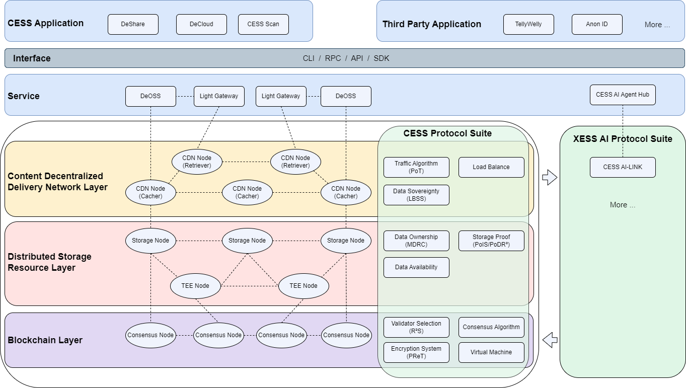

In this article, we will delve into the what, why, and how of CESS, exploring its features and benefits.

# What is CESS?

CESS is **the first decentralized data infrastructure with L1 chain, infinite storage capacity and ethical AI.**

CESS is a blockchain-powered decentralized cloud storage network with native CD²N, where users and creators share data on-chain, and builders can create and deploy DApps. Offering the most optimal Web3 solution for storing and retrieving high-frequency dynamic data, CESS reshapes the value distribution and circulation of data assets whilst ensuring data sovereignty and complete user privacy. The vision of CESS is to create a secure, transparent, and high-throughput decentralized data value network. 

CESS is a public blockchain network based on a distributed storage system with milliseconds high-speed Content Decentralized Delivery Network (CD²N) and empowers AI innovations by web3 protocols.

CESS is a secure, efficient, and scalable decentralized cloud storage network that provides data storage services and data sharing platform.

CESS is an innovative solution for entropy reduction in our ever-chaotic digital landscape.


**CESS: The first decentralized data infrastructure with L1 chain, infinite storage capacity and ethical AI.**


# Why CESS?

CESS is the first large-scale, enterprise-level decentralized storage, enabling users to securely store their data in an encrypted format. It utilizes advanced encryption techniques to ensure that only the authorized users can access the data and provide end-to-end privacy and security. CESS is also an open-source and public blockchain intended to be the underlying infrastructure for decentralized storage needs. By leveraging blockchain and peer-to-peer technology, CESS eliminates the need for a centralized authority, making it resistant to censorship and tampering.

Offering the most optimal Web3 solution for storing and retrieving high-frequency dynamic data, CESS reshapes the value distribution and circulation of data assets whilst ensuring data sovereignty and user privacy.

By utilizing a decentralized physical infrastructure network (DePIN) model, CESS drives mass deployment of network nodes globally through incentives.

CESS is also compatible with both EVM and WebAssembly (Wasm). The underlying blockchain framework allows cross-ecosystem, cross-chain applications to use CESS. Its technology stack supports most Web3 applications.

So, why you choose CESS? 

Here's the answer:

**Location-based Storage Selection**

Ensure data privacy with compliance routing, keeping data within borders and easing national security concerns.

**User Privacy Authorization**

CESS Proxy Re-Encryption Technology enables secure data sharing among authorized parties without revealing the data content.

**Empower Responsible AI with Privacy**

Empower Responsible AI with user consent, smart contracts, and privacy algorithms, safeguarding sensitive data.

**Blockchain-based Disaster Recovery**

CESS Proof of Data Reduplication and Recovery (PoDR²) mechanism prevents any data loss and guarantees data integrity under any circumstance while continuously challenging storage nodes to prove data validity and availability, all executed within TEE.

**Millisecond Data Retrieval**

Achieve millisecond-level hot data access in a decentralized storage system with CESS's CD²N.

**The 1st Decentralized Storage Standard Protocol**

Leading the industry with the first IEEE blockchain-based decentralized storage protocol, P3220.02, for technological breakthroughs.

# Where can CESS be used?
You can find some use cases [here](use-cases.md).

# How does CESS work?

CESS adopts layered and loosely coupled system architecture, which is divided into **CESS Protocol Suite** and **XESS AI Protocol Suite**. 

CESS Protocol Suite includes a **blockchain service layer**, **distributed storage resource layer**, and **distributed content delivery layer**.

The **XESS AI Protocol Suite** leverages advanced AI technologies to enable secure, privacy-preserving collaborative model training across the CESS network. 

The **Interface** provides CLI/RPC/API/SDK interfaces to support data storage service, blockchain service, high-speed content delivery service and AI tools, etc.

<figure><figcaption>
CESS Architecture
</figcaption></figure>

CESS guarantees data security and integrity through proprietary technologies with data ownership protection, Proof of Data Reduplication and Recovery (**PoDR²**), Multi-format Data Rights Confirmation (**MDRC**), and Proxy Re-encryption Technology (**PReT**).

CESS leverages blockchain technology to ensure the integrity and security of the data stored within the system. When a user stores data on CESS, it is broken down into smaller encrypted fragments and then distributed across multiple nodes within the network. To access the data, the user needs to authenticate themselves and retrieve the encrypted fragments from the network. The fragments are combined and decrypted locally on the user's device, ensuring that the data is never exposed in its entirety during the retrieval process. This distributed and encrypted storage mechanism provides a high level of security and privacy, safeguarding user's data from unauthorized access.

# Conclusion

With the increasing concern around data privacy and security, CESS addresses a critical need in today's digital landscape. Traditional storage solutions expose users' data to vulnerabilities and the risk of unauthorized access. By using CESS, users can regain control over their data, knowing that it is encrypted and stored securely. Additionally, CESS promotes decentralization and empowers individuals by removing the reliance on centralized storage providers. The high performance and reliability can also satisfy the enterprise need on storage requirement.

In conclusion, CESS provides a secure and private storage solution for individuals and organizations, enabling them to regain control over their data. By leveraging blockchain technology and advanced encryption, CESS ensures that data remains inaccessible to unauthorized parties. CESS aligns with the core principles of blockchain and empowers users to protect their data in an increasingly digital world.
