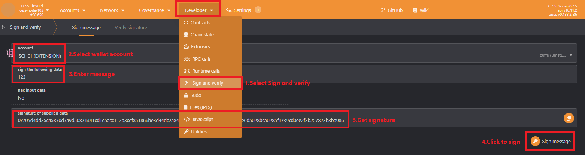

Calling some APIs requires authentication of your identity. In web3, your wallet is your identity. Generate your signature data in [the block browser](https://polkadot.js.org/apps/), and then add your signature information in the API request header to authenticate your identity. As shown in the figure below:

The authentication information you need to add in the header:
| Name | Description | Example |
| ---- | ----------- | ------- |
| Account | wallet account | cX... |
| Message | signed message | 123 |
| Signature | signature | 0x... |