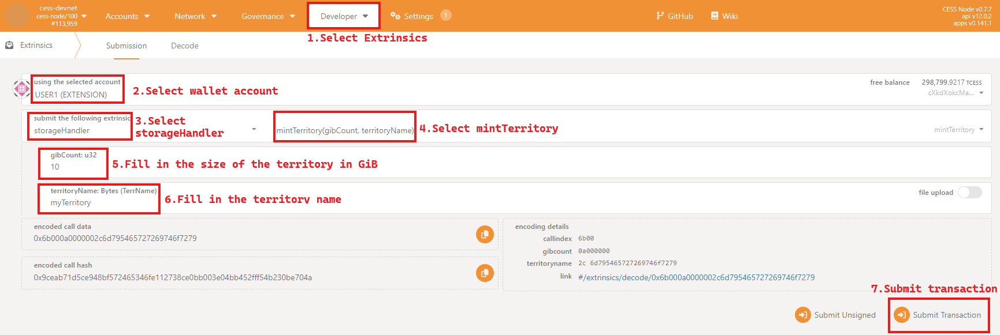
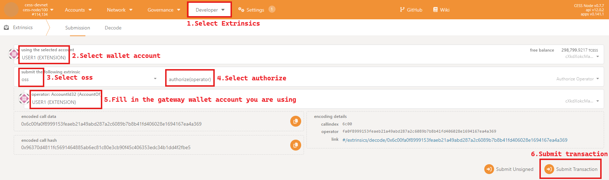

When you need to upload files or objects through the gateway, the following conditions must be met:
1. Purchase a territory
This operation needs to be completed in [the blockbrowser](https://polkadot.js.org/apps/), as shown in the following figure:

2. Authorize your territory to the gateway you use
This operation needs to be completed in [the blockbrowser](https://polkadot.js.org/apps/), as shown in the following figure:

When you only need to create a bucket or Delete operation, you only need to meet the second condition above.