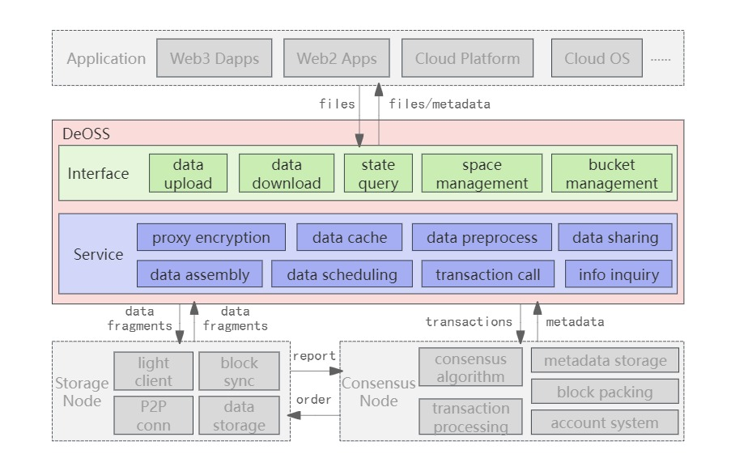

Unlike mainstream distributed system architectures, DeOSS achieves a high level of integration with the CESS blockchain at its core, forming a unique open and decentralized distributed object storage system. As shown in Figure 1, the system architecture is divided into two layers: the interface layer and the service layer. The interface layer provides users with rich and user-friendly interaction interfaces, while the service layer offers highly scalable and customizable object storage services. DeOSS serves as the gateway to the CESS network, offering data access interaction interfaces for various applications at the top, and tightly connecting with the underlying storage node network and the CESS chain at the bottom, thus becoming the bridge for data flow between applications and the CESS network.

The interface layer is composed of Restful HTTP APIs. To facilitate usage by developers, CESS has also implemented SDKs in three languages: Golang, JavaScript, and Rust. The interface layer allows users or applications to perform a series of operations such as uploading, downloading, and deleting files, querying file status, managing storage space (expansion, renewal), and managing buckets (creation, deletion, metadata querying). These operations require only a small number of simple parameters to provide a decentralized object storage service compatible with S3.

The service layer includes a series of functional modules such as the data processing module, data scheduling module, P2P communication module, and CESS chain client. When a file is transmitted from the application layer to DeOSS, it first undergoes preprocessing operations such as data encryption, data segmentation, sharding, and redundancy. Subsequently, the data fragments are randomly distributed to nearby storage nodes for storage by the data scheduling module. Finally, the data storage orders and file metadata are uploaded to the CESS chain for preservation through the client. When downloading data, the file metadata is first queried from the chain, then sufficient file fragments(1/3) are collected from the corresponding storage nodes, assembled, decrypted, and the complete file is returned to the application layer.

DeOSS also plays a crucial role in the CESS content distribution network and edge network by handling important tasks such as data caching and distribution. When a user or application initiates a download operation, DeOSS first checks if the local cache is hit. If not, it then requests shared data from nearby peer nodes. If these attempts do not retrieve the data, DeOSS downloads the data from the storage nodes. Any data uploaded or downloaded is added to the DeOSS cache to quickly respond to download requests from users or peer nodes. When many DeOSS instances work together to form a cache network, the data island effect will be eliminated, allowing data to be easily shared to any corner of the world.

Moreover, as one of the many critical open-source projects within CESS, DeOSS is highly extensible and customizable. Developers can enable or disable caching, set access whitelists and blacklists, and configure it to serve specific storage node clusters through simple configurations. Additionally, further data processing and scheduling can be achieved through secondary development, enabling the creation of unique, higher-security custom services to meet the needs of various scenarios. The CESS team also provides a set of modular developer tools, making it easier for developers to build their desired business logic.