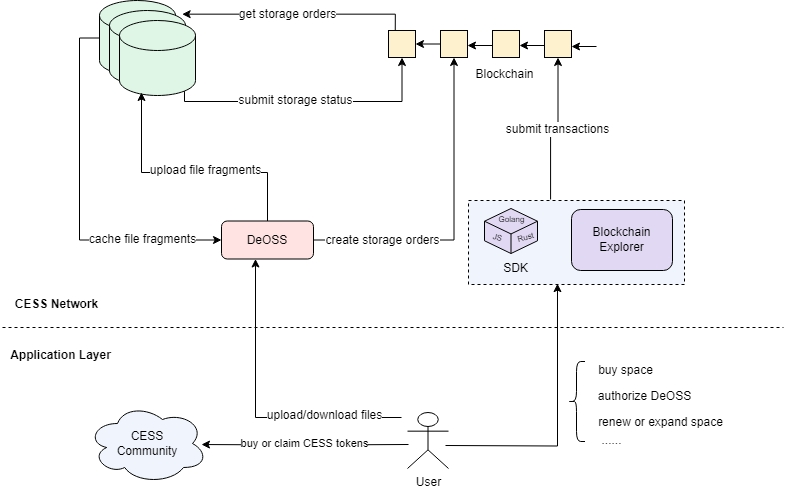
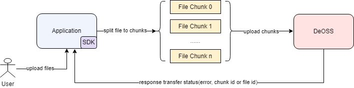
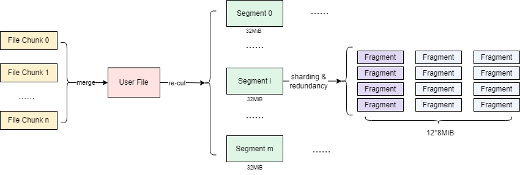
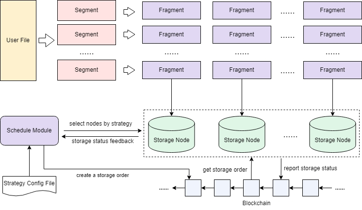
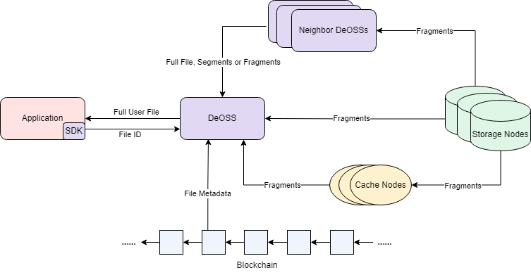
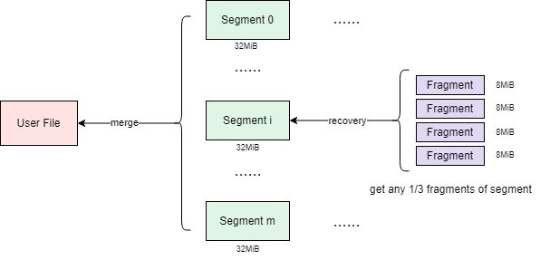
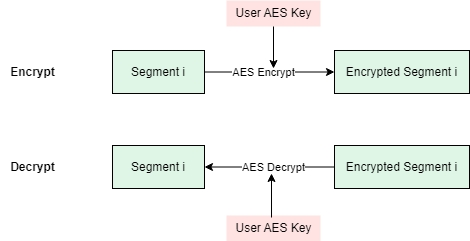

## Data Access Process
Data DistributionBefore users access files on the CESS network using DeOSS, they need to first purchase sufficient storage space and authorize DeOSS to use that storage space. Overall, CESS is simply divided into an application layer and a network layer, where users can view the network layer as a black box. Users only need to complete a few steps to finish file uploads and downloads. The file upload/download process is illustrated in the following figure.

## File Upload
When users upload files, they first need to transfer the files to DeOSS, and then DeOSS will act as a proxy to process and distribute the files. Given that the data files may be quite large and the network transmission stability may not be very good, CESS supports a file resume/restart function to ensure the stability of the transmission. The working principle is as shown in the following figure.

1. Using the SDK, the data is divided into specific-sized chunks based on the network conditions. When the network is good, the data is split into larger chunks, and when the network is poor, it is split into smaller chunks.
2. These chunks are then uploaded to DeOSS (supporting out-of-order and concurrent uploads). When DeOSS successfully receives a chunk, it returns the index of that data chunk. If the upload fails or the connection times out, an error message is returned, and the application can retry the failed chunk.
3. Once all chunks have been uploaded, DeOSS will return a unique index hash to the user, indicating that the file upload has succeeded.
4. The user's file will then be stored in the DeOSS cache queue, waiting to be preprocessed and distributed to a group of storage nodes for persistent storage.

## Data Preprocessing
DeOSS first merges the file chunks into a complete file, and then divides the file into segments according to a predefined specification, with each segment being 32MiB in size. Next, it slices and adds redundancy to each segment separately, generating 12 file fragments of 8MiB each. Subsequently, these fragments are rearranged, and a File ID (FID) is calculated based on this. Finally, the data's metadata (such as size, name, number of segments and fragments, etc.) is uploaded to the CESS chain, forming a storage order, as shown in the following figure.

After pre-processing, the user's data is expanded to three times its original size. Even if 2/3 of the data is lost, the file can still be downloaded normally. During this process, users can also choose to encrypt the data to protect its privacy.

## Data Distribution
As shown in the following figure, DeOSS uses a scheduling module to randomly distribute the data fragments to storage nodes for persistent storage. Developers can customize different scheduling strategies through configuration files based on their needs (such as prioritizing data transmission to specific storage nodes or avoiding storage on certain nodes), but they must require the fragments to be stored in a distributed manner to avoid security risks from centralized storage. The scheduling module will preferentially select nodes with good communication status and service quality with DeOSS, in order to ensure reliable and efficient data access as much as possible.

After receiving the file fragments, the storage nodes need to report to the CESS chain, so that DeOSS can promptly receive the storage feedback. If a storage node fails to report for a long time after receiving the file, DeOSS will find new nodes to upload the fragments, and mark the uncooperative nodes. Once a node exceeds a certain number of failures, it will be put into a cooldown pool and no longer receive data transmissions for a certain period.

If storage nodes are not proactive in receiving user files, they will lose the trust of various DeOSS instances. As a result, they will have difficulty obtaining user data from DeOSS to grow their service space share, leading to a decline in their earnings.

## File Download
### Download Process
When downloading a file, DeOSS first checks the local cache to see if the file is available. If not, it queries the on-chain file metadata to obtain the storage location information, and then downloads the data fragments from the corresponding storage nodes. Only 1/3 of the fragments need to be downloaded to restore the complete file.

In addition, DeOSS can also share data through the P2P network with nearby cache nodes or peer DeOSS instances, to facilitate high-speed downloads for users. Applications can download data from any DeOSS, without having to use the same DeOSS as the one they uploaded to - this enables "upload once, download anywhere" functionality.

### File Merging
When DeOSS retrieves data fragments from storage nodes, cache nodes, or peer DeOSS instances, it first uses the Reed-Solomon algorithm to restore the complete data segments based on the guidance from the file metadata. Then, it merges these data segments in order to reconstruct the complete file. The file merging process is the inverse of the file pre-processing, as shown in the following figure.

## Encryption and Decryption
DeOSS supports encryption and decryption of user files. Currently, it has implemented AES symmetric encryption, and will support various other encryption methods in the future, such as proxy re-encryption. The encryption and decryption process for user files in DeOSS is shown in the following figure.

The encryption process occurs during the file pre-processing stage. DeOSS first segments the file, and then performs symmetric encryption on each segment individually. The decryption process occurs during the file merging stage. DeOSS first restores the fragments back into segments, then decrypts each segment, and finally merges the decrypted segments into the original user file.
