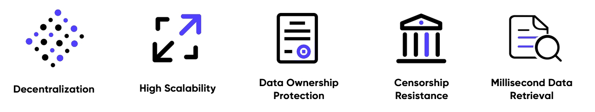

## Decentralized Object Storage Service
Decentralized Object Storage Service (DeOSS) is a decentralized object-based mass storage service that provides low-cost, secure, and scalable distributed data storage services for web3. 
Both enterprises and individuals can use DeOSS to store, manage and protect data, such as NFT images and videos, DAPP (Decentralized Application) user data,  DeFi (Decentralized Finance) programs, etc. Based on blockchain technology, DeOSS effectively utilizes online idle storage resources to build a vast distributed storage network. 
The mission of DeOSS is to give the data ownership and benefits right back to the data producers, rather than centralized platforms. 
DeOSS follows the Apache 2.0 open-source protocol and allows one to deploy it at any time, any place, and to use it to freely access files stored distributedly around the world.

## Who can use DeOSS
DApp, NFT, and Web3 developers, SocialFi developers, and users with large-scale data storage requirements.

## What can DeOSS store
DeOSS can store high-definition pictures, audio, video, and backup files in websites and applications, as well as files of various DApp applications and network disk applications.

## How do you use DeOSS
If you are not a developer, you can use [DeShare Web App](https://cess.network/deshare.html) and [DeOSS Web App](https://cess.network/deoss.html). If you are a developer, you can refer to the [API](api-description/api_description.md) to use it.

## Technology Highlights

DeOSS not only has the advantages of existing market products on object storage (such as high reliability, easy extensibility, low cost, high security, etc.), but also possesses the features such as anti-censorship, data ownership belonging to its user, and so on. Currently, the object storage services of web2, such as the OSS (Operation Support Systems) of AWS and Alibaba Cloud, are centralized storage. That means their service sacrifice user’s data to be in the custody of a third party, and there is a risk of data being regulated and monopolized. By contrast, based on CESS blockchain technology, the data uploaded through DeOSS enjoys decentralized storage, and the data ownership is secured to the user. Through DeOSS, users can authorize certain applications to use the data, while keeping these applications from controlling the data.