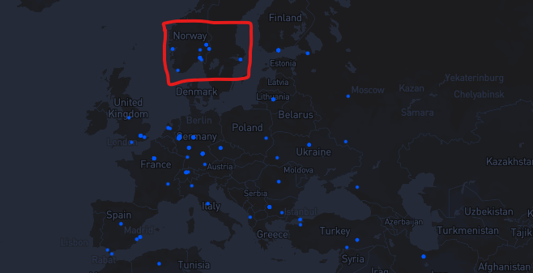

# Technology Highlights

DeOSS not only has the advantages of existing market products on object storage (such as high reliability, easy extensibility, low cost, high security, etc.), but also possesses the features such as anti-censorship, data ownership belonging to its user, and so on. Currently, the object storage services of web2, such as the OSS (Operation Support Systems) of AWS and Alibaba Cloud, are centralized storage. That means their service sacrifice user’s data to be in the custody of a third party, and there is a risk of data being regulated and monopolized. By contrast, based on CESS blockchain technology, the data uploaded through DeOSS enjoys decentralized storage, and the data ownership is secured to the user. Through DeOSS, users can authorize certain applications to use the data, while keeping these applications from controlling the data.

<figure><figcaption>
DeOSS Technology Highlights
</figcaption></figure>

## Location-based Storage Selection (LBSS)
DeOSS supports flexible selection of the geographical location and storage scope of data storage according to the needs of different countries or customers, and effectively ensures the compliance and security of data. Even in the scenario of cross-border data storage, LBSS can ensure that data will not be leaked to unallowed territory or areas.

<figure><figcaption>
Location-based Storage Selection
</figcaption></figure>

As shown in the figure above, by selecting a range, region or storage nodes on the map, the data will be stored on the specified nodes in the red area.
## Data Ownership Protection
Users have absolute ownership and control over their own data. Users can manage and access data through DeOSS at any time. DeOSS ensures that non-sovereign users cannot steal or destroy data.
## Censorship Resistance
DeOSS ensures that data is not easily censored, blocked, or deleted during transmission and storage through various technical means, and ensures that users can access and share data in a restricted or interfered environment.
## Hybrid Encryption
DeOSS uses Symmetric Encryption, Asymmetric Encryption, Proxy Re-Encryption, and Attribute-Based Encryption (ABE). In particular, DeOSS also has the capability of Fully Homomorphic Encryption, FHE. DeOSS protects the security and privacy of data through various encryption algorithms, and supports hybrid encryption technology that combines multiple encryption methods to achieve a balance between privacy protection and efficiency, to meet the needs of diversified data encryption.
## Millisecond Data Retrieval
DeOSS has enterprise-level high-performance data access capabilities, supporting users to access the desired data at millisecond-level speeds anywhere in the world, allowing users and DAPPs to enjoy decentralized data storage services with efficiency comparable to traditional centralized storage.
## Diversified Interface
DeOSS supports a variety of practical functions such as Chunked Upload/Download, Resumeable Upload/Download , Batch Upload/Download, Data Compression Storage, and fully provides service interfaces . DeOSS will continue to integrate developer-friendly functional modules and strive to become a fertile land for various application development .
## High Scalability
DeOSS is implemented by a combination of multiple pluggable modules, which can be customized to add or remove modules according to requirements. It supports clustered deployment, elastic scaling, and intelligent load balancing. It is highly scalable in multiple dimensions, such as functions and performance.
## Open Source
DeOSS is completely open source and is not restricted by any interested party. Under the premise of complying with the license, anyone can download the DeOSS source code, compile and run it, and build their own storage universe to provide services to the outside world.
DeOSS is completely open source and not subject to any restrictions from interested parties . Under the premise of the license, anyone can download the DeOSS source code, compile and run it. You can build your own storage kingdom and provide services to the web3 world.
