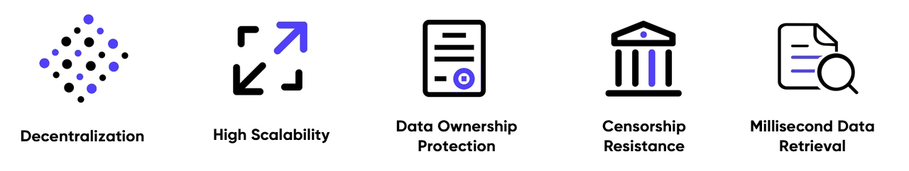

## Technology Highlights
<figure><figcaption>
DeOSS Technology Highlights
</figcaption></figure>

DeOSS not only has the advantages of existing market products on object storage (such as high reliability, easy extensibility, low cost, high security, etc.), but also possesses the features such as anti-censorship, data ownership belonging to its user, and so on. Currently, the object storage services of web2, such as the OSS (Operation Support Systems) of AWS and Alibaba Cloud, are centralized storage. That means their service sacrifice user’s data to be in the custody of a third party, and there is a risk of data being regulated and monopolized. By contrast, based on CESS blockchain technology, the data uploaded through DeOSS enjoys decentralized storage, and the data ownership is secured to the user. Through DeOSS, users can authorize certain applications to use the data, while keeping these applications from controlling the data.
