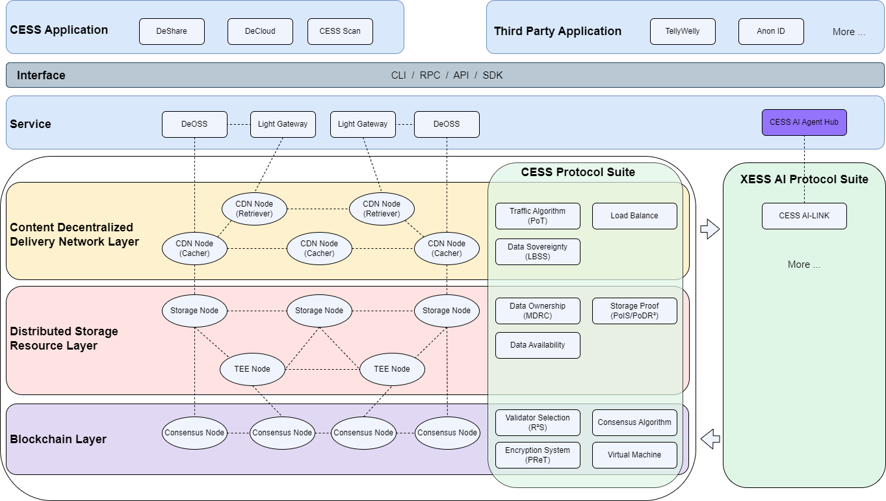

*2025-01-13 by **CESS Research Institute*** 

The rise of AI has unlocked unprecedented possibilities across a range of industries, from healthcare to autonomous driving, and from finance to education. However, despite the vast potential, one of the primary challenges in AI today is the **interoperability** and **scalability** of AI agents across different sectors. In this context, the **CESS AI Agent Hub** (part of the **CESS Network**) emerges as a groundbreaking solution—redefining how AI agents are aggregated, connected, and deployed. 

One of the biggest bottlenecks in the AI industry today is the lack of seamless interoperability between agents across different domains. Each sector—whether it’s **medical**, **finance**, **education**, or **autonomous driving**—has its own set of specialized agents, models, and data systems. These systems often operate in silos, making it challenging to integrate them or have them work together effectively.

Just like in the **web era**, **Yahoo** became the portal for various sites, the CESS AI Agent Hub aims to act as a decentralized entry point, bringing together thousands of specialized AI agents across industries like **medical**, **financial**, **autonomous driving**, and **education**. Whether you're looking to integrate an AI medical diagnostic agent, an autonomous driving controller, or an AI tutor, **CESS AI Agent Hub** provides a single service call to match all the agents you need.

### **Technical Features of CESS AI Agent Hub**

At the core of the **CESS AI Agent Hub** is **CESS Network’s decentralized infrastructure** and **XESS AI Protocol Suite**, which leverages distributed storage, computing, and blockchain-based security to aggregate and serve AI agents. What truly sets **CESS AI Agent Hub** apart is its **decentralized architecture**. Powered by **Blockchain** and **distributed computing**, the platform allows for the **decentralized deployment** and **orchestration** of AI agents. 

<figure><figcaption>
CESS AI Agent Hub
</figcaption></figure>

This ensures several advantages:

1. **Scalability**: The **CESS AI Agent Hub** is designed to handle massive scalability. As demand grows across sectors like healthcare, finance, and autonomous driving, the decentralized nature of the system ensures that it can scale without compromising performance or security.
   
2. **Fault Tolerance**: Decentralized systems are naturally more resilient to failures. If one node in the system goes down, the network can seamlessly reroute requests to other available nodes, ensuring uninterrupted service.
   
3. **Enhanced Security**: By leveraging blockchain technology, CESS ensures that all AI interactions are **secure**, **tamper-proof**, and **auditable**. This is crucial, particularly in industries like finance and healthcare, where data privacy and integrity are paramount.

4. **The Simplicity of Service Interfaces**: One of the standout features of **CESS AI Agent Hub** is its **ease of use**. Instead of managing complex configurations and integrating separate systems, users can access multiple AI agents through a **single API call**.

### **Seamless AI-Agent Matching Across Industries**

Whether you are a **medical professional** looking for diagnostic agents, a **financial institution** in need of fraud detection algorithms, or a **vehicle manufacturer** seeking navigation and control systems, the **CESS AI Agent Hub** provides an **intelligent matching service** to link you with the most suitable agents for your needs.

By providing an ecosystem where **AI agents from different sectors are interconnected**, CESS AI Agent Hub facilitates cross-industry collaboration. For instance, in the future, healthcare AI agents might seamlessly share data with financial agents for better personalized health insurance plans, or autonomous driving systems might share traffic insights with smart cities.

By using a vast and diverse dataset, the platform ensures that these agents are not only highly specialized but also equipped with rich, real-time information for improved decision-making.

### **Seamless AI-Agent Matching Across Industries**

Whether you're a medical professional seeking diagnostic agents, a financial institution needing fraud detection algorithms, or a vehicle manufacturer looking for navigation and control systems, the **CESS AI Agent Hub** offers an intelligent, streamlined matching service to connect you with the most suitable AI agents for your needs.

By creating an interconnected ecosystem, the **CESS AI Agent Hub** facilitates cross-industry collaboration. For example, in the future, healthcare AI agents might share critical data with financial agents to help design more personalized health insurance plans, or autonomous driving systems could communicate traffic insights with smart cities to optimize urban mobility.

Leveraging a vast and diverse dataset, the platform ensures that the AI agents are not only highly specialized but also equipped with real-time, actionable data that enhances decision-making. 

Imagine you’ve been in a car accident. In the traditional world, you’d need to take multiple steps, contact various professionals, and manage several services. But with the **CESS AI Agent Hub**, the process becomes seamless and automated. All you need to do is tell the **CESS AI Agent Hub**:

*“What should I do?”*

Here’s how the system responds:

- **Medical Agents**: The AI Agent Hub immediately contacts **Medical Agents** to assess your health and provide guidance for your injuries. They will give you real-time advice, suggesting steps to take until emergency services arrive or helping you with initial treatment.

- **Autonomous Driving Agents**: The **Autonomous Driving Agents** assess the condition of your vehicle and provide instructions for either calling for repairs or safely handling the aftermath of the accident. They can also assist with the car's data to help claim repairs through insurance.

- **Financial Agents**: **Financial Agents** are automatically engaged to help you initiate your **insurance claim**, assessing damage, calculating coverage, and processing the necessary steps for a quick resolution. They will guide you through the paperwork, and connect you with the right channels to expedite the claims process.

- **Family Agents**: Finally, **Family Agents** are prompted to inform your loved ones—like your wife—about the situation. The system sends a message, letting her know that you’ve been in an accident and that you will be home late.

In this scenario, you don’t need to juggle multiple services. The **CESS AI Agent Hub** effortlessly coordinates all these tasks for you, streamlining your experience while ensuring you get the best service possible in every aspect of the situation—whether it’s health, car repairs, insurance, or communicating with your family.

This ability to connect and coordinate a wide array of agents from various sectors—**medical**, **financial**, **autonomous driving**, and more—demonstrates the immense potential of the **CESS AI Agent Hub** in simplifying complex tasks and offering real-time, personalized assistance.

### **The Future**

As we step into the **AI-driven future**, the **CESS AI Agent Hub** offers a unified entry point to access, connect, and deploy AI agents across industries. By leveraging the **data advantages** of **CESS Network** and the **XESS AI Protocol Suite**, the **CESS AI Agent Hub**  simplifies the complexities of AI integration while offering a **decentralized, scalable, and secure infrastructure**. Whether you're working in **medicine**, **finance**, **autonomous driving**, or **education**, CESS AI Agent Hub streamlines the process of finding and integrating the AI agents you need, bringing us closer to a fully interconnected and efficient AI ecosystem.

**Welcome to the AI era, powered by CESS**.
