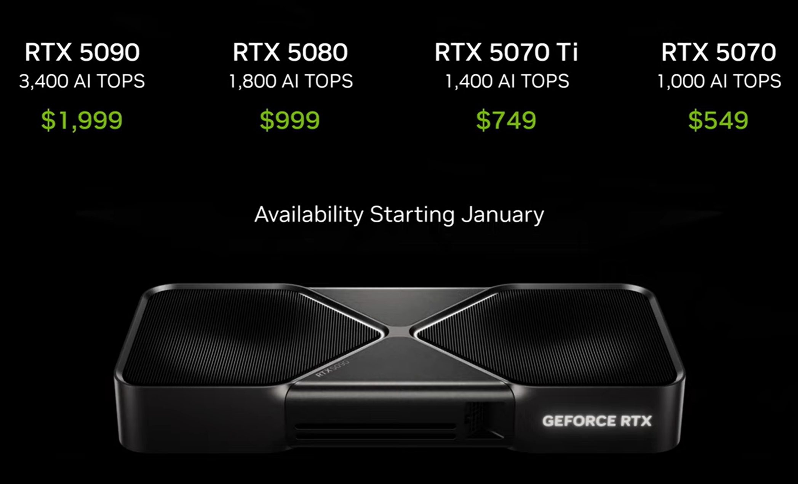

*2025-01-06 by **CESS Research Institute*** 

On January 6th, 2025, **NVIDIA** founder and CEO **Jensen Huang** kicked off **CES 2025** with a 90-minute keynote that included new products to advance gaming, autonomous vehicles, robotics, and agentic AI.

Huang’s keynote showcased how NVIDIA’s latest innovations are enabling this new era of AI, with several groundbreaking announcements, including:
- The just-announced NVIDIA **Cosmos platform** advances physical AI with new models and video data processing pipelines for robots, autonomous vehicles and vision AI.
- New NVIDIA Blackwell-based **GeForce RTX 50 Series GPUs** offer stunning visual realism and unprecedented performance boosts.
- AI foundation models introduced at CES for RTX PCs feature **NVIDIA NIM microservices** and AI Blueprints for crafting digital humans, podcasts, images and videos.
- The new NVIDIA Project **DIGITS** brings the power of **NVIDIA Grace Blackwell** to developer desktops in a compact package that can practically fit in a pocket.
- NVIDIA is partnering with Toyota for safe next-gen vehicle development using the **NVIDIA DRIVE AGX** in-vehicle computer running **NVIDIA DriveOS**.

<figure><figcaption>
GeForce RTX 50 Series GPUs
</figcaption></figure>

Of course, game players are certainly surprised by the release of GeForce RTX 50 Series GPUs, but many developers had their eyes more on the NVIDIA Cosmos platform.

**Introduction to the Cosmos AI Platform**

The **Cosmos AI platform** is designed to transform how AI systems are built and deployed, particularly in areas that require heavy video processing and simulation, such as **3D content creation**, **autonomous driving**, and **digital human applications**. This platform leverages **optical transmission**, **physical simulations**, and **intelligent algorithms** to enhance the AI's ability to understand and interact with the world in a more human-like manner.

<figure><figcaption>
Advancing Physical AI With Cosmos
</figcaption></figure>

Some of the core features of the **Cosmos AI platform** include:
- **Advanced Video Processing**: Capabilities to process vast amounts of video data in real-time, crucial for applications like **autonomous vehicles** or **interactive virtual environments**.
- **3D Content Creation**: Integration with **Omniverse**, NVIDIA’s 3D content creation platform, to allow AI models to design and interact with highly realistic virtual worlds.
- **Digital Human Applications**: AI-driven avatars or digital humans capable of performing tasks in virtual environments, interacting seamlessly with humans through **natural language processing** and **visual understanding**.

By enabling better data processing and deeper interaction with virtual environments, Cosmos AI is set to play a pivotal role in creating the next generation of AI applications across industries like entertainment, healthcare, automotive, and more.

### **The Controversial Data Collection Practices of Cosmos AI**

Despite its ambitious potential, the **Cosmos AI platform** has come under fire due to its data collection practices. NVIDIA’s use of open-source tools, like **yt-dlp**, for scraping video content from platforms such as **YouTube** has led to significant controversy. This method allowed NVIDIA’s technical team to gather large volumes of video content for training its AI models—without directly obtaining consent from content creators or copyright holders.

To circumvent platform protections, such as anti-crawler measures, NVIDIA employed tactics like **rotating IP addresses across multiple virtual machines**, which was interpreted as an attempt to bypass restrictions designed to protect intellectual property. This method has raised questions about the **ethical use of data** in AI training and the **intellectual property rights** of creators.

The controversy surrounding **illegal data collection** has intensified discussions about the ethical considerations of AI development. As AI systems become more powerful, ensuring that they are trained on **legally sourced** and **ethically obtained data** will become crucial. Public backlash and potential lawsuits highlight the need for more **transparent** and **responsible data collection** practices.

### **CESS Network’s Advantages in the AI Era: Distributed Access and Privacy Protection**

While **Cosmos AI** seeks to revolutionize data processing and AI capabilities, it also underscores the challenges related to **data scaling**, **privacy**, and **sovereignty**. In this context, **CESS Network** emerges as a powerful solution.

<figure><figcaption>
CESS in CES
</figcaption></figure>

<blockquote class="twitter-tweet">
CESS in CES...<a href="https://t.co/e4u5aYTkRX">https://t.co/e4u5aYTkRX</a>
&mdash; CESS Labs (@CESS_Tech) <a href="https://twitter.com/CESS_Tech/status/1876651373556908136?ref_src=twsrc%5Etfw">January 7, 2025</a></blockquote> 

It addresses the technical and ethical challenges AI platforms like Cosmos AI face in the following ways:

#### **A. Distributed and Fast Access to Large Amounts of Data**

One of the key hurdles facing AI in the era of massive data requirements is how to store and retrieve vast amounts of information efficiently. As **Huang’s scaling laws** suggest, AI systems require ever-larger datasets at every stage of development—from pre-training, through post-training, to test-time reasoning.

**CESS Network** offers several key advantages in this regard:
- **Decentralized Storage**: CESS distributes data across multiple nodes in a decentralized network. This ensures that large-scale datasets required by AI models are not dependent on a single centralized server, reducing bottlenecks and improving system reliability.
- **Scalable Infrastructure**: CESS’s network can scale as the demand for data grows. This elasticity is critical for AI applications that require increasing volumes of data for model training and real-time access.
- **Edge Computing**: By enabling data processing at the edge of the network (closer to where data is generated), CESS ensures that AI systems can access data rapidly with minimal latency. This is particularly important for applications like autonomous driving, where real-time data processing is essential.

#### **B. Privacy Protection and Data Sovereignty**

As AI models become more complex, **privacy** and **data sovereignty** concerns grow. The ethical implications of how data is collected, stored, and used are under increasing scrutiny, especially when AI models rely on large-scale, potentially sensitive datasets. CESS Network’s decentralized approach to data management offers strong privacy protections and ensures data sovereignty, which are crucial in addressing these concerns.

- **End-to-End Encryption**: All data on the CESS network is encrypted, ensuring that sensitive information remains private. This is particularly important when dealing with personal or proprietary data.
- **User-Controlled Data Access**: CESS puts the control of data in the hands of the users, enabling them to decide how and when their data is accessed. This contrasts with centralized systems, where data ownership and control can be opaque.
- **Transparency**: CESS logs every interaction with the data, providing a transparent, immutable record of who accessed what data and when. This enhances accountability and builds trust in the system, ensuring that data is used ethically and in accordance with the user's preferences.
- **Compliance with Regulations**: CESS’s infrastructure is designed to meet regulatory requirements such as **GDPR** or other **data sovereignty laws**, ensuring that users can store and access data in compliance with local laws and jurisdictions.

### **CESS Network's Leading Position in the AI Era**

As AI continues to advance, the need for scalable, efficient, and ethical data infrastructure will only increase. CESS Network offers a solution to the challenges posed by **scaling laws** and data sovereignty concerns. By providing **distributed storage**, **millisecond access** to data, and robust **privacy protection**, CESS positions itself as a leading platform in the AI era.

While **Cosmos** pushes the envelope in AI-driven video processing and content creation, its controversies highlight the growing importance of **ethical data collection** and **responsible AI development**. CESS’s decentralized, user-controlled approach provides a model for how AI systems can scale while respecting user rights and ensuring privacy. In an era where data is the most valuable asset, CESS’s infrastructure is perfectly positioned to lead in the development of AI technologies that are **scalable**, **secure**, and **ethically responsible**.

### **References**
[1]  [NVIDIA CEO Jensen Huang Keynote at CES 2025](https://www.youtube.com/live/k82RwXqZHY8?si=tZFQ_vPXn_JaXxh0) 
