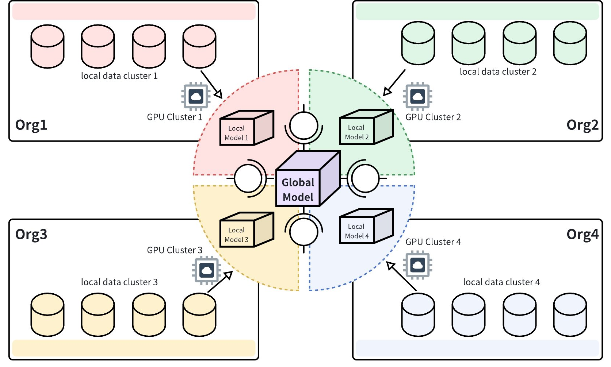
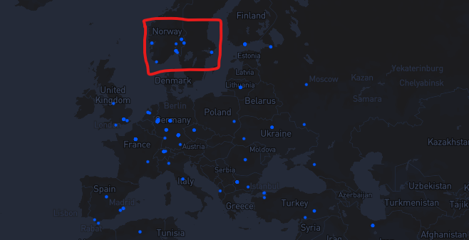

### CESS Network: The Future of Decentralized Data Infrastructure for the AI-Driven World

#### Overview

As AI continues to drive innovation across industries, the demand for efficient, scalable, and secure data infrastructure has reached unprecedented levels. Data is the lifeblood of AI — it fuels machine learning models, drives predictive analytics, and powers intelligent decision-making systems. However, traditional centralized cloud systems and legacy consensus protocols are becoming increasingly inadequate to support the growing data needs of AI applications. These centralized systems suffer from slow data retrieval speeds, high costs, data privacy concerns, and lack of scalability.

**CESS Network** offers a revolutionary solution to these challenges by providing a decentralized, programmable data infrastructure that bridges the gap between AI and secure, high-performance data storage, retrieval, and sharing. CESS is designed to meet the needs of industries heavily reliant on data, including AI, gaming, healthcare, and enterprise. By leveraging advanced blockchain technologies, decentralized storage, decentralized content delivery networks (D-CDN), and AI frameworks, CESS offers the next-generation solution for managing AI’s ever-expanding data requirements.

---

### Empowering the AI Era: CESS as the Next-Gen Data Backbone

As AI continues to evolve, data plays an increasingly central role. In the AI-driven future, data is not just raw material — it’s the engine that powers machine learning models, drives predictive analytics, and enables innovations like personalized medicine, smart cities, and decentralized social media. However, the challenge remains: how do we transmit, store, and manage this massive amount of data securely, efficiently, and ethically?

CESS Network addresses these challenges with its decentralized, high-frequency data retrieval system, ensuring low-latency access to large datasets critical for AI processing. Unlike traditional cloud systems, CESS is designed to handle not only static data but also dynamic, frequently updated data, making it an ideal solution for AI model training, real-time data analytics, and continuous learning applications.

**Key Advantages of CESS:**

- **Low-Latency Access**: CESS ensures that AI models can access and retrieve critical data in real time, eliminating bottlenecks and reducing latency. This is crucial for applications requiring immediate data processing and decision-making, such as autonomous vehicles, AI-powered medical diagnosis, and dynamic content recommendation systems.
  
- **Scalability**: As the data needs of AI applications grow, CESS’s decentralized storage network scales effortlessly. Businesses can add more nodes to expand their storage capacity without worrying about central bottlenecks or downtime.

- **Real-Time Data Support**: CESS is designed to support both static and dynamic data, enabling AI applications to continuously update models with new data in real time. This is essential for applications such as real-time analytics, IoT systems, and autonomous AI.

---

### Key Features That Make CESS the Future of Data Infrastructure

#### 1. **AI-Optimized Data Infrastructure**

CESS is specifically optimized for AI use cases, enabling decentralized AI model training and privacy-preserving data sharing. This AI-optimized architecture allows CESS to support high-performance computing tasks while ensuring data privacy and security. 

**Key Benefits:**

- **Data Sovereignty**: With CESS, users retain full control over their data, ensuring that sensitive information is never centralized or exposed. This is particularly important for industries like healthcare, finance, and legal services, where data privacy is critical.

- **Privacy-Preserving Computations**: CESS leverages technologies like **Secure Multi-Party Computation (SMPC)** and **Homomorphic Encryption** to run AI models on encrypted data. This allows for training and inference without exposing raw, sensitive data to any party.

**Example Application**: In healthcare, CESS enables hospitals to train AI models on encrypted patient data, allowing researchers and practitioners to derive insights without ever accessing personally identifiable information (PII).

#### 2. **Decentralized, Programmable Data Infrastructure**

CESS offers **unlimited storage capacity** through its decentralized storage network. This network is inherently scalable and can support businesses as their data storage and computational needs grow. CESS integrates **smart contracts** to automate data access, retrieval, and storage processes, ensuring that data is always available and properly managed.

**Benefits:**

- **Effortless Scalability**: CESS allows businesses to scale their storage needs without limitations. As data grows, CESS’s decentralized architecture ensures that additional storage capacity is seamlessly integrated into the system.

- **High-Performance Computing**: CESS supports high-frequency data retrieval and low-latency access, enabling AI models to process and use data efficiently. The system supports both large datasets and real-time updates, providing the speed and reliability required for cutting-edge AI applications.

---

#### 3. **AI-LINK: Privacy and Data Sovereignty for AI**

The **AI-LINK** protocol enables CESS to securely connect decentralized GPU networks, facilitating **confidential AI inference** and **model sharing**. This groundbreaking feature allows businesses to run AI models without sacrificing privacy, ensuring that data is never exposed or controlled by a single entity.

<figure><figcaption>
AI-LINK
</figcaption></figure>

**Key Benefits**:

- **Decentralized AI Inference**: AI models can infer from distributed datasets without centralizing sensitive information. This ensures compliance with data sovereignty laws and guarantees privacy for AI applications in highly regulated sectors like healthcare, finance, and government.
  
- **Secure Model Sharing**: CESS enables industries to share AI models across decentralized networks while maintaining complete control over their proprietary data and algorithms. This encourages collaboration without compromising security or data integrity.

---

#### 4. **Proof of Reduplication and Recovery (PoDR²)**

CESS introduces the world’s first blockchain-based disaster recovery system that can withstand the loss of up to 60% of its nodes. Known as **Proof of Reduplication and Recovery (PoDR²)**, this mechanism ensures that data is always recoverable, even in the event of node failure or disaster. 

**Key Benefits**:

- **High Availability**: CESS ensures data is highly available and resilient. Even under extreme conditions, the system guarantees data recovery, which is especially crucial for AI applications that rely on large, critical datasets.

- **Blockchain-Backed Integrity**: The PoDR² system guarantees the integrity of stored data by using blockchain to track redundancy and recovery processes. This ensures that AI models can always access the most up-to-date and accurate data, even during system failures.

---

#### 5. **Location-Based Storage Selection (LBSS)**

As AI-driven applications become increasingly global, compliance with regional and international data protection laws such as **GDPR**, **HIPAA**, and **CCPA** is more critical than ever. CESS’s **Location-Based Storage Selection (LBSS)** feature allows users to store data in specific geographic regions, ensuring compliance with legal frameworks that govern data privacy and sovereignty.

<figure><figcaption>
LBSS
</figcaption></figure>

**Key Benefits**:

- **Regulatory Compliance**: CESS’s LBSS ensures that AI applications can store data in specific countries or jurisdictions to meet local compliance requirements. This feature is crucial for industries like healthcare, finance, and e-commerce, where data compliance is a top priority.

- **Ethical Data Management**: By enabling precise location-based data storage, CESS allows companies to manage and store sensitive data in accordance with legal standards, ensuring that user data is handled ethically and legally.

---

### CESS vs. Competitors: Why CESS Stands Out

As the AI era unfolds, businesses need more than just a storage solution; they need an advanced, high-performance infrastructure that can handle real-time data, support AI applications, and ensure data sovereignty and security. Here’s how CESS differentiates itself from competitors like Filecoin, Arweave, and Storj:

#### 1. **Dynamic Data Support**

Unlike Filecoin, which mainly handles static data and lacks full CRUD (Create, Read, Update, Delete) capabilities, CESS supports **dynamic data**. This enables AI models to access and update data in real time, making CESS ideal for use cases in autonomous systems, real-time analytics, and continuous AI learning.

#### 2. **Regulatory Compliance and Data Sovereignty**

With features like **Location-Based Storage Selection (LBSS)**, CESS allows companies to store data in compliance with strict regulatory frameworks, such as GDPR and HIPAA. This is something competitors like Arweave or Storj are lacking.

#### 3. **Advanced Features**

While Filecoin uses Proof of Replication and Proof of Spacetime, CESS incorporates advanced blockchain mechanisms like **Proof of Reduplication and Recovery (PoDR²)** and **Proof of Idle Space (PoIS)**. These protocols offer superior disaster recovery and faster data retrieval speeds, making CESS the ideal platform for high-frequency AI applications.

#### 4. **AI Integration**

Unlike Filecoin, which focuses on storage, CESS provides full **AI integration** via **AI-LINK**, a protocol designed to connect decentralized GPU networks. This allows businesses to run confidential AI inference and training on distributed data, ensuring that no single entity controls or exploits the data.

---

### Conclusion: CESS Network—The Decentralized Data Infrastructure for the AI Future

As AI continues to reshape industries, the infrastructure that supports it must evolve to meet the increasing demands of scalability, security, and data sovereignty. CESS Network provides a **next-generation decentralized data infrastructure** that not only supports the AI revolution but accelerates it. By offering programmable, scalable, and secure solutions, CESS is poised to be at the forefront of the AI and Web3 eras, presenting a compelling investment opportunity for those looking to capitalize on the future of data and AI.
