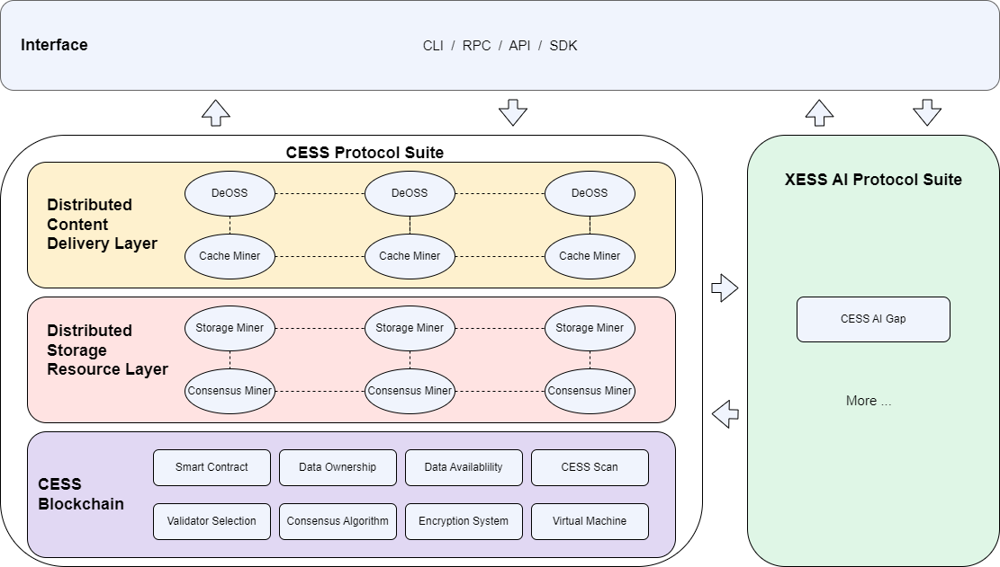

# Overall Architecture

CESS offers large-scale storage capacity, managing data files with up to space in the PB level to meet enterprise-level demands. At the same time, CESS provides data services, including data rights confirmation and protection. Therefore, our platform needs to offer expandable data storage for dApps and strong data owner rights protection.

CESS adopts layered and loosely coupled system architecture, which is divided into **CESS Protocol Suite** and **XESS AI Protocol Suite**.

**CESS Protocol Suite** includes a blockchain service layer, distributed storage resource layer, and distributed content delivery layer.

- The **CESS Blockchain** provides blockchain service for the entire CESS network, including encouraging unused storage resources and computational resources to join the CESS network to provide data storage, data rights confirmation, and other services for the application layer. 

- The **Distributed Storage Resource Layer** uses virtualization technology to realize the integration and pooling of storage resources. The infrastructure consists of storage capacity miners and storage scheduling miners. 

- The **Distributed Content Delivery Layer** utilizes content caching technology to ensure rapid distribution of stored data, involving both data index miners and data delivery miners in the process.

The **XESS AI Protocol Suite** leverages advanced AI technologies to enable secure, privacy-preserving collaborative model training across the CESS network. 

- The core component of the XCESS AI Protocol Suite is the **CESS AI Gap**, which integrates federated learning mechanisms, allowing participants to train shared models without sharing their original data. Utilizing smart contracts, it delegates computational tasks to various nodes, ensuring efficient use of resources while maintaining data sovereignty. This suite enhances the network's AI capabilities, supporting complex AI applications and facilitating industry-wide collaboration without compromising data privacy.

The **Interface** provides CLI/RPC/API/SDK interfaces to support data storage service, blockchain service, high-speed content delivery service and AI tools, etc.

## Blockchain Layer

The Blockchain Layer and its token mechanism incentivize unused computing and storage resources to join the CESS storage network, providing efficient ledger services. CESS proposes a novel Random Rotational Selection(R²S) consensus mechanism (an asynchronous Byzantine consensus algorithm), a Turing-complete smart contract runtime, and cross-chain interoperability capability.

This blockchain layer is further [studied here](blockchain-arch.md).

## Distributed Storage Resource Layer

CESS is designed to build a blockchain-based distributed cloud storage system. The focus is on providing users with consistent and efficient distributed storage services by effectively managing distributed resources using virtualization technology. This layer is composed of consensus miners and storage miners. Consensus nodes store meta-data and provide fast data indexing, while storage nodes provide data storage space.

To meet different storage needs, we design and implement a polymorphic data storage access interface to provide storage services via APIs for various applications. The polymorphic data access service provides object storage, block storage, and file system storage for upper applications in a standard API way, providing comprehensive and friendly data storage service support for the applications above. The object storage module automatically completes mapping the user object storage space to the lower unified distributed object storage space. User data is stored in the storage as object data. CESS will provide the block device storage service, supporting snapshot, clone, and other functions.

## Distributed Content Delivery Layer

This layer combines the advantages of CDN and P2P technologies for efficient file access, effectively reducing the number of proxy servers required, thus increasing the system's capacity and reducing the overall cost. The presence of a high-performance cache proxy server also avoids the "seed" problem in pure P2P networks.

On the application side, the stored content will be published on the seed node first, and the download service will be continuously provided if the seed node is not offline. However, as the number of user downloads from the same seed node increases, the bandwidth of that node will be exhausted, and the download speed per user will be reduced. With the design of a content delivery network, numerous tenant nodes then begin to serve the content. As a result, users can download content from multiple nodes, significantly improving the user experience.

The design of the CDN Layer is perfectly combined with blockchain technology. Storage miners form CDNs with cache miners in each region. Cache and retrieval miners create a relatively independent P2P network without public network IP. Node contribution rewards are issued through smart contracts, forming an autonomous network for development, as shown in the above diagram.

## Application Layer

For developed applications on CESS, please refer to the page [Role: dApp Users](../user).

We welcome other teams and builders to leverage the advantage of the CESS solution and integrate CESS into their products.

# Logical Architecture

On the other hand, CESS can also be viewed to have the following logical architecture, consisting of two main components:

- The core functional system of the CESS network, composed mainly of consensus nodes and storage nodes

- Applications built in the CESS ecosystem, including the CESS blockchain explorer; low-level services such as decentralized object storage service; and high-level services such as clients, cloud services, gateways, DeShare, and possibly many more.

- **Storage Node**: Primarily responsible for providing space, storing data, and computing proofs.

- **Consensus Node**: Primarily responsible for consensus mechanism, transaction execution, block generation, and validation in the CESS network.

- **TEE Worker**: Primarily responsible for data tagging, generating verifiable and unique idle data for space verification.

- **SDK**: Development tools and APIs for interacting with the CESS network.

- **Blockchain Explorer**: An interface that displays block information, transaction details, computing power information, account information, etc.

- **Applications**: This includes Decentralized Object Storage Service (DeOSS), object storage service developed by the CESS core team, and applications built by other ecosystem teams.
