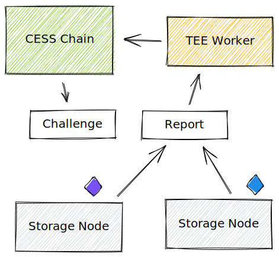
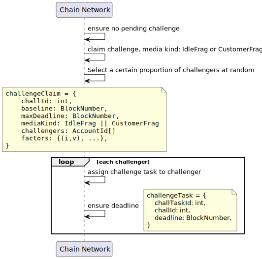
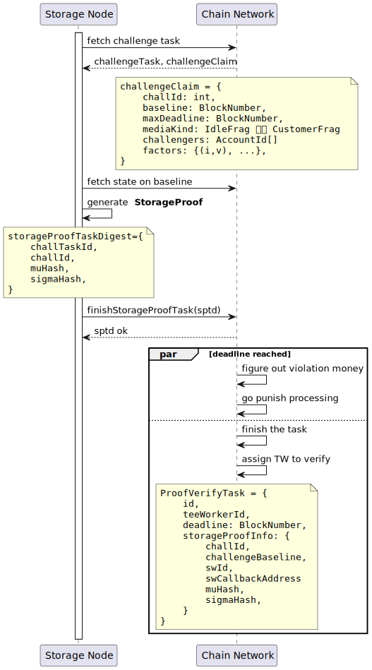
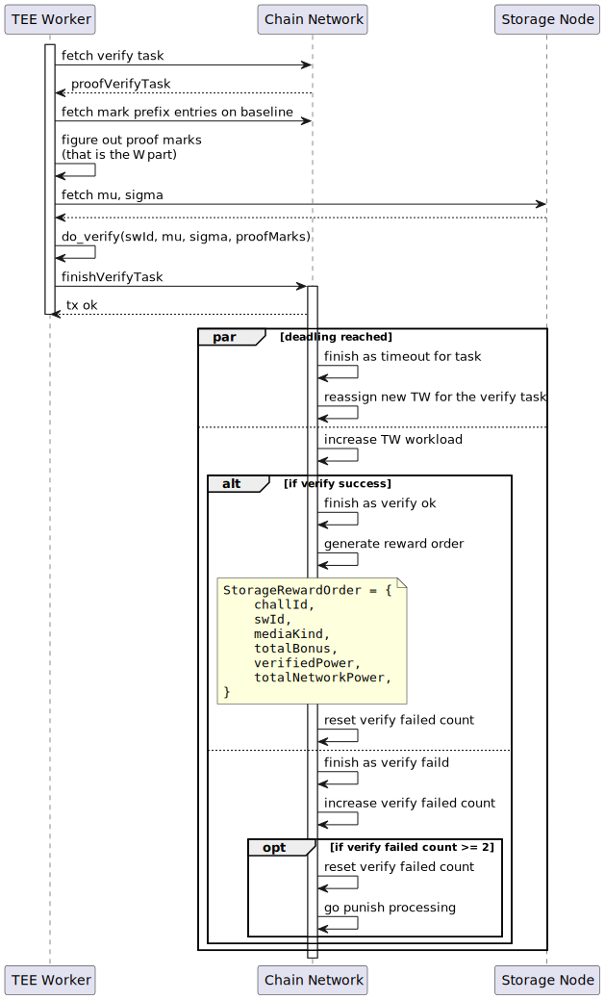

# Process Flow

CESS relies on a specially developed audit algorithm and reward mechanism to ensure storage nodes store data honestly. The audit algorithm includes storage challenge claim, storage proof generation, and storage proof verification.

# Storage Challenge Claim

The CESS network periodically (with random intervals) picks some proportion of storage nodes to claim a storage challenge task. The challenge is divided into "idle data" and "active data" according to the storage node content type. The parameters and inputs of the challenge may vary depending on the data type and size. The storage challenge has a "timeout" attribute, estimated based on the data size of each storage node being challenged. The baseline in the challenged claim is the block number at the time of the challenge, indicating that the storage node needs storage proof under this state.

# Storage Proof Generation

After receiving the storage challenge, the storage node must submit proof within the specified time. Otherwise, it will be punished. The storage node must provide proof for two types of data: proof of idle data, which is used to prove the storage space it offers as declared, and proof of active data, which is used to prove that it has correctly stored user data.

# Storage Proof Verification

Upon receiving the storage proof submitted from a storage node, the CESS network will allocate TEE miners to verify the publicly verifiable proof. It means any external computing resource can verify a storage proof. CESS has made a design trade-off between safety and efficiency: using TEE for validation. TEE miners currently play a vital role in verifying proofs. The two output parameters in the storage proof algorithm, `mu` and `sigma`, are designed not to be stored on-chain but locally on the storage node, so retrieving them from the storage node during the verification phase is necessary. This design considers the size of these two parameters to avoid a large amount of on-chain data. The results of storage proof verification will serve as the basis for rewards/slashing.

