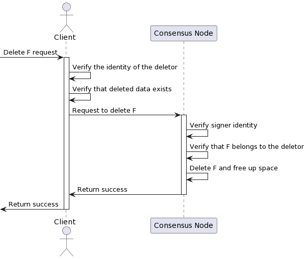
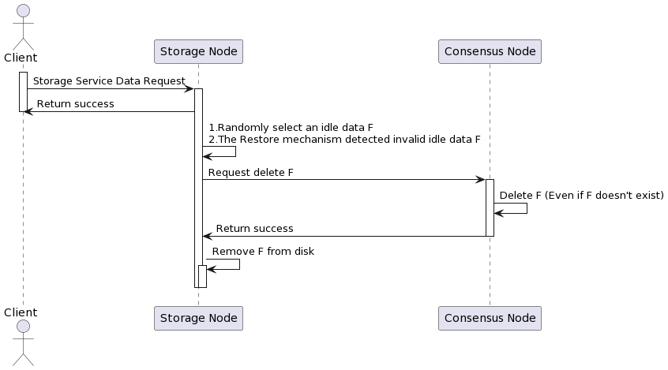

This section introduces the data deletion process in the CESS network.

# Delete Active Data

Active data refers to the data uploaded by users to the CESS network. Users have all control over the data they upload; thus, only they can delete those data.

When a user deletes their data, the data content will not be deleted from the CESS network if there are multiple owners. If data is no longer owned (has no owner), the CESS node will delete the data from the hard disk.

The overall flow is depicted as follows:

# Delete Idle Data

The idle file is generated by consensus nodes in the TEE environment and stored in storage nodes. Each idle file is unique across the entire network. There are generally two cases where idle data needs to be deleted:

The storage node has stored new active data and needs to delete the corresponding amount of idle data.
The `Restore` mechanism of the storage node detects invalid idle data and requires reporting data loss and deleting the data.

The overall flow is depicted as follows:

